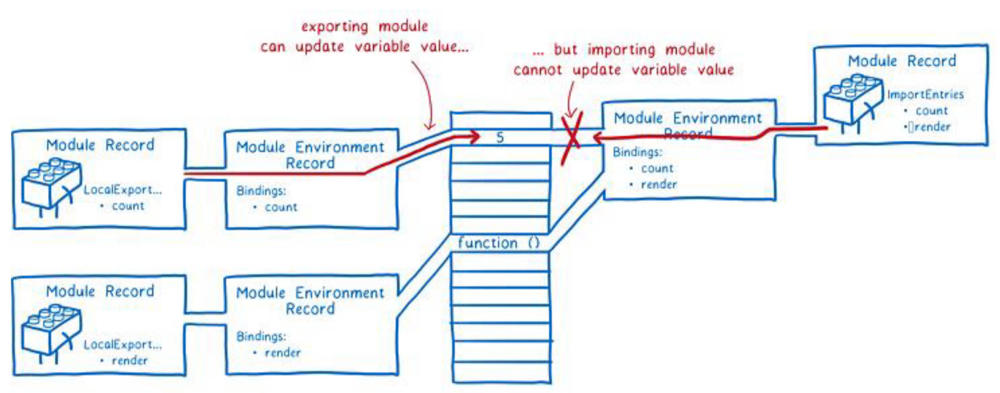

# ES Module 模块化

使用 ESMoudle 开发 2 种情况

- 在支持的浏览器上可直接开发，
- 在不支持的浏览器上，需要通过 webpack 打包成一个普通 JS 文件，甚至可以与 CommonJS 混用。

---

ES Module 是 ECMA 自己推出的模块化解决方案。它与 CommonJS 的不同之处。

1. 使用了 import 和 export 关键字；
2. 采用编译器的静态分析，并且也加入了动态引用的方式；

---

使用 ES Module 将自动开启严格模式：use strict

---

浏览器环境中，ES Module 的基本使用。注意事项。

index.html

```html
<!-- 如果通过本地加载 Html 文件 (比如一个 file:// 路径的文件), 将会遇到 CORS 错误，因为 Javascript 模块安全性需要；
需要通过一个服务器来测试；如 Live server -->
<script src="./index.js" type="module"></script>
```

index.js

```javascript
import { name } from './main.js'
```

main.js

```javascript
export const name = 'zzt'
```

---

ES Module 导入导出的 3 种方式。

导出：export 关键字

1. 在语句声明的前面直接加上 export 关键字

	 ```js
	 export function foo() {}
	```

2. 将所有需要导出的标识符，放到 export 后面的 {} 中。

	- 注意：这里的 {} 里面不是 ES6 的对象字面量的增强写法，{} 也不是表示一个对象的；
	- 所以： export {name: name}，是错误的写法；

		```js
		const name = 'zzt'
		const age = 18
		export { name, age }
		```

3. 导出时给标识符起一个别名

	- 通过 as 关键字起别名。

		```js
		const name = 'zzt'
		export {
			name as foo
		}
		```

导入：import 关键字

1. import {标识符列表} from '模块'；

	 - 注意：这里的 {} 也不是一个对象，里面只是存放导入的标识符列表内容；

	 ```js
	 import { foo } from './index.js'
	 ```

2. 导入时给标识符起别名

    - 通过 as 关键字起别名。

	```js
	import { name as ztname } from './index.js'
	```

3. 通过 \* 将模块功能放到一个模块功能对象（a module object）上

	 ```js
	 import * as info from './info.js'
	 info.name
	 info.age
	 info.default // info 模块中，默认导出的值
	```

---

ES Module 中 export 和 import 结合使用，

util/index.js

```js
import { formatCount, formatDate } from './format.js'
import { parseLyric } from './parse.js'
export { formatCount, formatDate, parseLric }
```

2 种优化方式。

```js
// 优化一，阅读性更好:
export { formatCount, formatDate } from './format.js'
export { parseLyric } from './parse.js'
// 优化二:
export * from './format.js'
export * from './parse.js'
```

---

ES Module 中 default 的用法。

- `default` 关键字在导出时使用，意为默认导出。
- 默认导出 export 时可以不需要指定名字；
- 在导入时不需要使用 {}，并且可以自己来指定名字；
- 它也方便我们和现有的 CommonJS 等规范相互操作；

```js
export default function () {
	return ['新歌词']
}
```

```js
import parseLyric from './parse_lyric.js'
```

在一个模块中，只能有一个默认导出（default export）；

---

ES Module 中 import 不能在逻辑代码中使用，为什么？

- 这是因为 ES Module 在被 JS 引擎解析时，就必须知道它的依赖关系；
- 由于这个时候 js 代码没有运行，所以无法在进行类似于 if 判断中获取代码的执行情况；
- 拼接路径的写法也是错误的：因为这样必须到运行时能确定 path 的值；
	```js
	import { foo } from './util' + '/index.js' // 错误写法。
	```

此时应该使用 import 函数来导入。

```js
let flag = true
if (flag) {
  // 返回一个 promise
	import('./foo.js').then(res => {
		console.log(res.name, res.age)
	})
}
```

---

什么是 import.meta

- 是一个给 JavaScript 模块暴露特定上下文的元数据属性的对象。
- 它包含了这个模块的信息，比如说这个模块的 URL；
- 在 ES11（ES2020）中新增的特性；

---

ES Module 的解析流程有那几步，理解图解。

1. 构建（Construction），根据地址查找 js 文件，并且下载，将其解析成模块记录（Module Record）；
2. 实例化（Instantiation），对模块记录进行实例化，并且分配内存空间（环境记录），解析模块的导入和导出语句，把模块指向对应的内存地址。
3. 运行（Evaluation），运行代码，计算值，并且将值填充到内存地址中；


阶段一：构建。


阶段二和三：实例化阶段 – 求值阶段



---

# 包管理工具

前端代码共享的 2 种方案。

- 上传到 GitHub 上、或搭建自己的官网，其他程序员通过 GitHub 或官网，下载到代码，并手动的引用；
	- 缺点是必须知道项目 GitHub 的地址，并且从 GitHub 上手动下载；
	- 需要在自己的项目中手动的引用，并且管理相关的依赖；
	- 不需要使用的时候，则要手动来删除相关的依赖；
	- 当遇到版本升级或者切换时，需要重复上面的操作；

显然，上面的方式是有效的，但是这种传统的方式非常麻烦，并且容易出错；

- 使用一个专业的工具来管理我们的代码
	- 我们通过工具将代码发布到特定的位置；
	- 其他程序员直接通过工具来安装、升级、删除我们的工具代码；

显然，通过第二种方式我们可以更好的管理自己的工具包，其他人也可以更好的使用我们的工具包。

---

什么是 npm？

- Node Package Manager，也就是 Node 包管理器；
- 但是目前已经不仅仅是 Node 包管理器了，在前端项目中我们也在使用它来管理依赖的包；
- 比如 vue、vue-router、vuex、express、koa、react、react-dom、axios、babel、webpack 等等；

怎么查看需要的包，是否支持 npm 引入？

1. 在相关项目的 github 或 官网上查看。
2. 在 npm 包的官网上查看：https://www.npmjs.org/

npm 管理的包放在那里？

- 我们发布自己的包其实是发布到 registry 上面的；
- 当我们安装一个包时其实是从 registry 上面下载的包；
