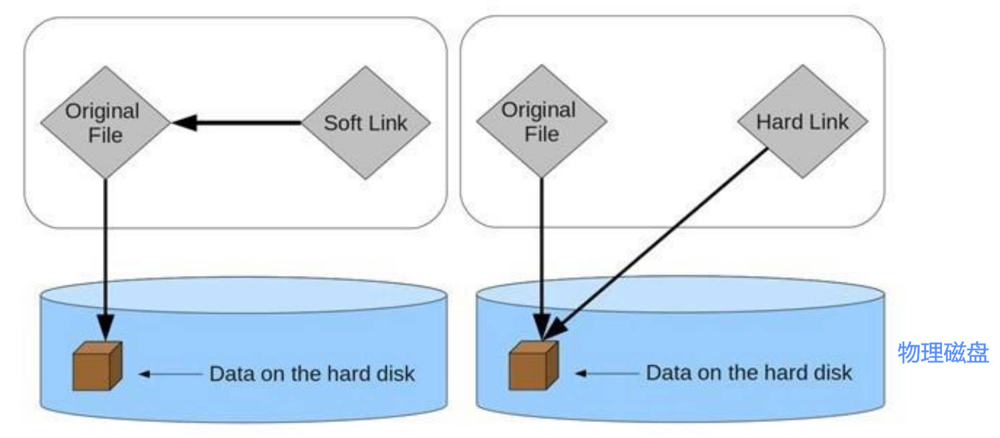
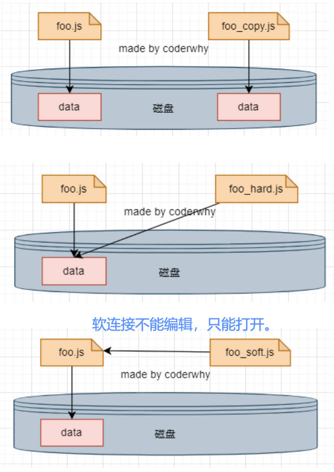

# npx 使用

什么是 npx？

- npx 是 npm5.2 之后自带的一个命令。

它有什么用？

- 作用非常多，但是比较常见的是使用它来调用项目中的某个模块的指令。

-----

局部命令执行的3种方式。

- 方式一：在终端中使用如下命令（在项目根目录下） 

  ```shell
	./node_modules/.bin/webpack --version
  ```

- 方式二：修改 package.json 中的 scripts

  ```json
  "scripts": { 
  	"webpack": "webpack --version"
  } 
  ```

  - 运行时，使用 `npm run webpack`，会优先在 node_module 文件夹下找对应命令。

- 方式三：使用 npx

  ```shell
  npx webpack --version
  ```

  > webpack 比较特殊，命令行直接输入 `webpack --version`，也会去 mode_module 下查找 webpack 命令。

-----

# npm 发布包

npm 发布自己的包的步骤。

- 注册 npm 账号： 
	- https://www.npmjs.com/ 
	- 选择 sign up
	
- 在命令行登录：

  ```shell
   npm login
  ```

- 修改 package.json，如版本号，项目描述等字段。

- 发布到 npm registry 上

  ```shell
  npm publish
  ```

- 更新仓库： 
  1. 修改版本号（最好符合 semver 规范）

  2. 重新发布。

- 删除发布的包： 让发布的包过期：

  ```shell
  npm unpublish
  npm deprecate
  ```

-----

# pnpm 原理

什么是 pnpm？

- performant npm 缩写

主要解决了什么痛点？

- 本地多个项目，如果引用了相同的包，会重复下载，每个项目中 node_module 里的包占用的磁盘空间过大。

pnpm 4大优势理解：

1. 快速：pnpm 比其它包管理器快2倍。
   - 在特定目录（如 /.pnpm-store）中对下载下来的包建立硬连接。
   - 如有其它项目引用这个包，会在项目中直接使用硬连接引用（node_modules/pnpm/）。
2. 高效：node_modules 中的文件链接内存寻址存储库。
   - 项目直接引用（node_modules 下）的包，使用软连接寻址。
   - 项目 pnpm 目录下的包，使用硬连接寻址。
3. 严格：pnpm 默认创建了一个非平铺的 node_modules，因此代码无法访问任意包（间接引用的包无法直接访问）
4. 支持 monorepos：pnpm 内置支持单仓多包。


-----

什么是文件拷贝？

- 在硬盘中复制出来一份新的文件数据。

什么是硬连接？

- 硬连接（英语：hard link）是电脑文件系统中的多个文件平等地共享同一个文件存储单元； 
- 删除一个文件名字后，还可以用其它名字继续访问该文件；

硬连接的弊端：

- 硬链接只能操作文件，不能操作目录，因此，使用 pnpm 下载 axios 时，会将 axios 中的所有文件保存一份在 pnpm 指定的区域内。
- 硬连接不能跨磁盘，所以项目文件与 pnpm 保存包的特定位置需要在同一磁盘。

什么是软连接（也称符号链接 soft link、Symbolic link），

- 是一类特殊的文件； 其包含有一条以绝对路径或者相对路径的形式指向其它文件或者目录的引用；
- 操作系统中的快捷方式文件，就是软连接的体现。
- 软连接不能编辑，只能打开。

理解它们在操作系统中的抽象图。



-----

拷贝文件、软连接和硬连接的操作练习。

- 文件的拷贝：文件的拷贝每个人都非常熟悉，会在硬盘中复制出来一份新的文件数据； 

  ```shell
  copy foo.js foo_copy.js # window
  cp foo.js foo_copy.js # macos
  ```

- 文件的硬连接

  ```shell
  mklink /H aaa_hard.js aaa.js # window
  ln foo.js foo_hard.js # macos
  ```

- 文件的软连接：

  ```shell
  mklink aaa_soft.js aaa.js # window
  ln -s foo.js foo_soft.js # macos
  ```



-----

pnpm 到底做了哪些操作？（pnpm 最大优势体现）

- 当使用 npm 或 yarn 时，如果你有100个项目，并且所有项目都有一个相同的依赖包，那么，你在硬盘上就需要保存100份该相同依赖包的副本。 
- 如果使用 pnpm，依赖包将被存放在一个统一的位置，因此： 
	- 如果你对同一依赖包使用相同的版本，那么磁盘上只有这个依赖包的一份文件； 
	- 如果你对同一依赖包需要使用不同的版本，则仅有版本之间不同的文件会被存储起来； 
	- 所有文件都保存在硬盘上的统一的位置： 
		- 当安装软件包时，其包含的所有文件都会硬连接到此位置，而不会占用额外的硬盘空间；
		- 这让你可以在项目之间方便地共享相同版本的依赖包；


-----

如何理解  pnpm 其它优势：创建非扁平的 node_modules 目录

- 当使用 npm 或 Yarn Classic 安装依赖包时，所有软件包都将被提升到 node_modules 的根目录下。 
	- 其结果是，源码可以访问本不属于当前项目所设定的依赖包
- pnpm 使用的是非平铺的 node_modules 目录结构，也就意味着间接引用的依赖包会嵌套。


-----

pnpm 的安装

- 有很多种安装方式，https://www.pnpm.cn/installation
- 可以使用 npm 来安装：`npm install pnpm -g`

pnpm 的使用。


-----

获取 pnpm 的存储位置的方式。

```shell
pnpm store path # 获取当前活跃的 store 目录
```

如何清理没有被项目引用的包？

```shell
pnpm store prune # 从 store 中删除当前未被引用的包来释放 store 的空间
```

