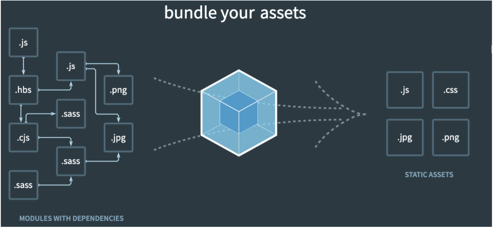

# Node 的内置模块 path

Node 中的内置模块 path 有什么用？

- path 模块用于对路径和文件进行处理，提供了很多好用的方法。

使用场景：

1. 我们知道在 Mac OS、Linux 和 window 上的路径是不一样的。
2. window 上会使用 `\` 或者 `\\` 来作为文件路径的分隔符，当然目前也支持 `/`；
3. 在 Mac OS、Linux 和 Unix 操作系统上使用 `/` 来作为文件路径的分隔符；
4. 那么如果我们在 window 上使用 `\` 来作为分隔符开发了一个应用程序，要部署到 Linux 上面应该怎么办呢？
5. 显示路径会出现一些问题；
6. 所以为了屏蔽他们之间的差异，在开发中对于路径的操作我们可以使用 path 模块；

常见 API：
- 从路径中获取信息
	- `path.dirname()`：获取文件的目录；
	- `path.basename()`：获取文件名；
	- `path.extname()`：获取文件扩展名；
	
	```js
	const path = require("path")
	const filepath = "C://abc/cba/nba.txt"
	// 1.可以从一个路径中获取一些信息
	path.dirname(filepath) // C://abc/cba
	path.basename(filepath) // nba.txt
	path.extname(filepath) // .txt
	```
	
- 路径的拼接：`path.join()`
	- 如果我们希望将多个路径进行拼接，但是不同的操作系统可能使用的是不同的分隔符；
	- 这个时候我们可以使用 path.join 函数；
	
	```js
	const path = require('path')
	const path1 = "/abc/cba"
	const path2 = "../zzt/kobe/james.txt"
	// 2.将多个路径拼接在一起: path.join
	path.join(path1, path2) // 在 Windows 上：\abc\zzt\kobe\james.txt
	```
	
- 拼接绝对路径：`path.resolve()` **常用**
  - path.resolve() 方法会把一个路径或路径片段的序列解析为一个**绝对路径**；
  - 给定的路径的序列参数是**从右往左**被处理的，后面每个 path 被依次解析，直到构造完成一个绝对路径；
  - 如果在处理完所有给定 path 路径序列之后，还没有生成绝对路径，则使用当前工作目录；
    - 绝对路径是用 `/` 开头来表示的路径，而非 `./` 或 `../`
  -  生成的路径被规范化并删除尾部斜杠，零长度 path 段被忽略；
  - 如果没有 path 传递段，path.resolve() 将返回当前工作目录的绝对路径；

  ```js
  const path = require('path')
  path.resolve("./abc/cba", "../zzt/kobe", "./abc.txt") // D:\Workshop\Mobile_HDD\coderwhy-fromt-end-system\FRONT-END-ENGINEERING\demo-project\src\abc\zzt\kobe\abc.txt
  ```

-----

# webpack 打包基础

webpack 可应用于哪些场景？

- 事实上随着前端的快速发展，目前前端的开发已经变的越来越复杂了： 
	- 比如开发过程中我们需要通过模块化（CommonJS，ES Module）的方式来开发； 
	- 比如会使用一些高级的特性来加快我们的开发效率或者安全性，像通过 ES6+、TypeScript 开发脚本逻辑，通过 sass、 less 等方式来编写 css 样式代码；
	- 比如开发过程中，我们还希望实时的监听文件的变化，并且反映到浏览器上，提高开发的效率； 
	- 比如开发完成后我们还需要将代码进行压缩、合并，以及其他相关的优化； 
	- 等等….
- 但是对于很多的前端开发者来说，并不需要思考这些问题，日常的开发中根本就没有面临这些问题： 
	- 这是因为目前前端开发我们通常都会直接使用三大框架来开发：Vue、React、Angular； 
	- 事实上，这三大框架的创建过程都是借助于脚手架（CLI）的； 
		- Vue-CLI、create-react-app、Angular-CLI 都是基于 webpack 来帮助我们支持模块化、其中就包括 less、TypeScript、打包优化等等；

-----

一句话说明 webpack 是什么

- webpack 是一个为现代 JavaScript 应用程序而生的静态模块化打包工具。
	- 现代的（modern）：现代前端开发面临各种各样的问题，催生了 webpack 的出现发展
	- 静态的（static）：最终可以将代码打包成静态资源（部署到静态服务器）
	- 模块化（module）：默认支持各种模块化开发，ESMoudule、CommonJS、AMD、CMD
	- 打包（bundler）：webpack 可帮助我们进行打包，所以它是一个打包工具。

---

## webpack 的工作原理

理解 webpack 的工作图解。



1. webpack 在处理应用程序时，会根据命令或者配置文件找到**入口文件**。
2. 从入口开始，会生成一个依赖关系图，其中包含应用程序所需所有模块（如 js 文件，css 文件，图片，字体等）
3. 然后遍历图结构，打包一个个模块（根据文件不同使用不同 loader 解析）

-----

比如一个 vue 项目，webpack 会帮助我们处理哪些文件？
- JavaScript 的打包： 
	- 将 ES6 转换成 ES5 的语法； 
	- TypeScript 的处理，将其转换成 JavaScript；
- css 的处理： 
	- CSS 文件模块的加载、提取； 
	- Less、Sass 等预处理器的处理；
- 资源文件 img、font： 
	- 图片 img 文件的加载； 
	- 字体 font 文件的加载；
- HTML 资源的处理： 
	- 打包 HTML 资源文件；
- 处理 vue 项目的 SFC 文件即 .vue 文件；

-----

webpack 的使用前提，依赖 Node 环境，

- webpack 的中文官方文档是 https://webpack.docschina.org/

webpack 的安装分两部分 webpack，webpack-cli（如果要在命令行执行命令，那么必须安装）

```shell
npm install webpack webpack-cli -D 
```

两者的关系：

1. 执行 webpack 命令，会执行 `node_module/.bin` 目录下的 webpack。
2. webpack 在执行时依赖 webpack-cli 对命令进行解析，如果没有安装就会报错。
3. 而 webpack-cli 中代码执行时，才是真正利用 webpack 进行编译和打包的过程。
4. 第三方脚手架事实上没有使用 webpack-cli。而是类似于自己的 `vue-cli-service` 的东西。


-----

## webpack 打包步骤：

webpack 默认打包步骤：

1. 在项目目录下执行 `webpack` 的命令，webpack 会查找当前项目下 `./src/index.js` 作为入口。如果没有则会报错。

2. 在项目目录下默认生成 `./dist/main.js` 文件

   - 这个文件中代码被压缩和丑化了。

   - 打包的代码依然存在 ES6 语法，因为默认情况下，webpack 不清楚打包的代码是否需要转成 ES5 语法。

3. 也可以通过配置来决定入口和出口：

	 ```shell
	 npx webpack --entry ./src/main.js --output-filename bundle.js --output-path ./build
	```

-----

使用局部 webpack 的步骤：

1. 创建 `package.josn` 文件，用于管理项目依赖信息。

	 ```shell
	 npm init -y
	```

2. 安装局部的 webpack

	 ```shell
	 npm install webpack webpack-cli -D
	```

3. 使用局部的 webpack，在 `package.json` 中创建 scipts 脚本，执行脚本打包

	 ```json
	 "scripts": {
		 "build": "webpack --entry ./src/main.js --output-path ./build"
	 }
	```

	 ```shell
	 npm run build
	 ```

-----

## webpack 配置文件

webpack 配置文件一般名为 `webpack.config.js`，使用 CommonJS 规范。

在该文件中，入口/出口两个属性的使用

```javascript
const path = require('path')
// 导出配置信息
module.exports = {
	entry: './src/main.js',
	output: {
		filename: 'bundle.js',
		path: path.resolve(__dirname, './dist') // path 必须是绝对路径，所以使用 resolve。
	}
}
```

-----

指定 webpack 配置文件名，如果将项目目录下的 webpack.config.js 修改为了 zzt.config.js：

1. 执行 webpack 命令时：

	 ```shell
	npx webpack --config zzt.config.js
	```

2. 在 `package.json` 文件中脚本做配置

	 ```json
	 "script": {
		 "build": "webpack --config zzt.config.js"
	 }
	```
