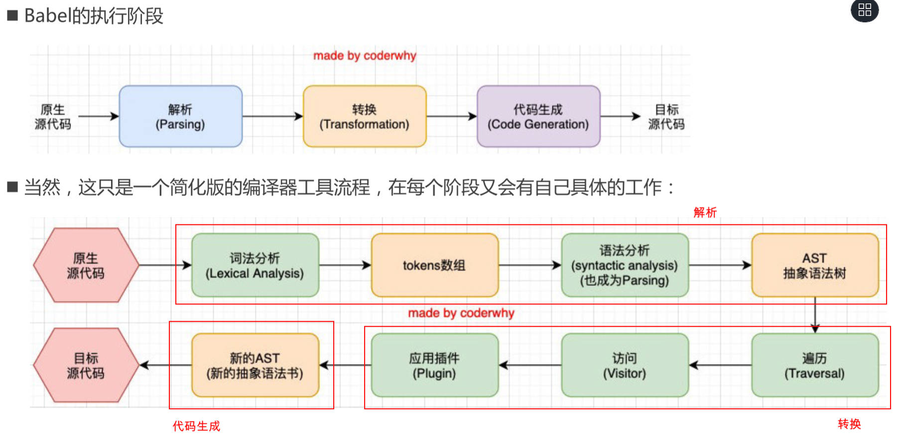

# 各种资源打包

## 使用 Babel 对 JS 文件打包

Babel 是什么？有什么用？

- Babel 是一个工具链，最早用于在旧浏览器或环境中将 ES6+ 代码转成向后兼容的版本。
- 现在主要用于语法转换，源代码转换等，比如 TypeScript，JSX 等文件的源码转换。

Babel本质上是什么？

- Babel本质上是一个编译器。

------

 Babel 与 PostCS 一样都支持单独（脱离 webpack）运行，如何单独使用？

1. 安装两个库：

   - @babel/core，babel核心代码，必须安装。
   - @babek/cli：可以让我们在命令行使用babel。

   ```shell
   npm install @babel/core @babel/cli -D
   ```

2. 使用 babel 来处理我们的源代码

   ```shell
   npx babel demo.js --out-dir dist --out-file main.js
   ```

安装插件：

1. 安装箭头函数转换相关插件，并在命令中使用

   ```shell
   npm install @babel/plugin-transform-arrow-function -D
   ```

   ```shell
   npx babel demo.js --out-dir dist --plugins=@babel/plugin-transform-arrow-function
   ```

2. 安装快级作用域语法转换插件，并在命令中使用：

   - 将 const 关键字转成 var

   ```shell
   npm install @babel/plugin-transform-block-scoping -D
   ```

   ```shell
   npx babel demo.js --out-dir dist --plugins=@babel/plugin-transform-block-scoping,babel/plugin-transform-arrow-function
   ```

插件过多，一个个设置比较麻烦，可以使用预设：

1. 安装预设，并在命令中使用

   ```shell
   npm install @babel/preset-env -D
   ```

   ```shell
   npx babel demo.js --out-dir dist --presets=@babel/preset-env
   ```

------

安装库的方式如 `@babel/core`，表示代码仓库通过 monoRepo 的方式来管理。

------

Babel 编译器的工作流程，3点：对应的步骤，理解原理图。

1. 解析阶段（Parsing）
   - 原生代码 -> 词法分析 -> token数组 -> 语法分析（也称为Parsing）-> AST
2. 转换阶段（Transformation）
   - AST -> 遍历 -> 访问 -> 应用插件
3. 生成阶段（Code Generation）
   - 应用插件 -> 新的AST -> 目标代码



------

在 webpack 中使用 babel：

1. 安装 @babel/core，babel-loader

   ```shell
   npm install @babel/core babel-loader -D
   ```

2. 安装对应的插件/预设

   ```shell
   npm install @babel/plugin-transform-arrow-function @babel/plugin-transform-block-scoping -D
   ```
   
   ```shell
   npm install @babel/preset-env -D
   ```
   
3. 在`webpoack.config.js`文件中做配置：

   ```javascript
   module.exports = {
     module: {
       rules: [
         {
           test: /\.m?js$/,
           use: {
             loader: 'babel-loader',
             options: {
               // 配置插件
               /* plugins: [
                 "@babel/plugin-transform-arrow-function",
                 "@babel/plugin-transform-block-scoping"
               ] */
               // 配置预设, 常见的有 env，react，TypeScript
               presets: [
                 ['@babel/preset-env']
                 // 另一种写法，用于配置预设
                 // ['@babel/preset-env', {xxx: xxx}]
               ]
             }
           }
         }
       ]
     }
   }
   ```

------

Babel 配置文件的2种命名方式：

- babel.config.js（或者.json, .cjs, .mjs）
  - 可以直接用于 MonoRepo 的子包，更加方便。
- .babelrc.js（或者.babelrc, .js, .cjs, .mjs）
  - 早期使用较多的命名方式，对于配置 MonoRepos 项目比较麻烦。

------

使用单独配置文件配置babel

./babel.config.js

```javascript
module.exports = {
  presets: [
    ['@babel/preset-env']
  ]
}
```

------

## 对 vue 的文件的打包

Vue 框架源码打包后的两大版本及特点，

- runtime-compiler：包含了对 template 模板的编译代码，更加完整，包更大。
- runtime-only：没有包含对 template 模板的编译代码，包更小。

打包后的不同版本：( `.runtime` 意味着不包含 template 的 compiler，包更小，`.prod` 意味做过压缩和丑化)

- vue(.runtime).global(.prod).js：通过浏览器中的`<script>`标签引用，暴露一个全局的 Vue。
- vue(.runtime).esm-broswer(.prod).js：通过原生 ES 模块导入，如在浏览器中使用 `<script type="module">` 引入。
- vue(.runtime).esm-bundle.js：webpack / rollup 等构建工具中默认使用该版本，如需解析 template，手动指定**非 ` runtime`** 版本。
- vue.cjs(.prod).js：服务器端渲染使用，通过 require() 在 Node.js 中使用。

------

vue 中编写 DOM 元素有3种方式：

- 在 HTML 文件中编写 template 模板并引用 vue 框架的方式。
  - 需要通过源码中的一部分代码来进行编译。
- 通过 `.vue` 文件中的 template 来编写。
  - 通过在 vue-loader 中对其进行编译和处理
- render 函数的方式，使用 h 函数来编写渲染的内容。
  - h 函数可以直接返回一个虚拟节点，也就是 VNode 节点。

------

### 对引用 vue 框架的文件打包

webpack 对 vue 代码打包的步骤：

1. 安装 vue 依赖（vue3 已经是默认版本）

   ```shell
   npm install vue
   ```

2. 在 js 文件中引入 vue 并编写 vue 代码：

   ./index.html

   ```html
   <!DOCTYPE html>
   <html lang="en">
   <head>
     <meta charset="UTF-8">
     <meta http-equiv="X-UA-Compatible" content="IE=edge">
     <meta name="viewport" content="width=device-width, initial-scale=1.0">
     <title>Document</title>
   </head>
   <body>
     <div id="app"></div>
     <template id="my-app">
       <div>
         <h2>{{title}}</h2>
         <p>{{content}}</p>
       </div>
     </template>
     <script src="./dist/main.js"></script>
   </body>
   </html>
   ```

   ./src/index.js

   ```javascript
   import { createApp } from 'vue.esm.bundle.js' /* 手动指定非 runtime 版本 */
   createApp({
     template: '#my-app',
     data() {
       return {
         title: 'I an title',
         content: 'Hello Frog'
       }
     }
   }).mount('#app')
   ```

3. 在 `webpack.config.js` 中配置 Vue3 的两个全局属性（通过 webpack 插件的形式注入）

   ```javascript
   const { DefinePlugin } = require('webpack')
   module.exports = {
     plugins: [
       new DefinePlugin({
         __VUE_OPTIONS_API__: true,
         __VUE_PROD_DEVTOOLS__: false
       }),
     ]
   }
   ```

   - 从 Vue3 开始，使用 esm-bundler 版本，强烈建议配置两个全局标识（GlobalFeatureFlags）：
   	- `__VUE_OPTIONS_API__ `：是否需要支持 Options API，默认 true，配置 false 可做 tree-shaking 优化代码。
   	- `__VUE_PROD_DEVTOOLS__`：是否在生产环境使用 devtool 调试工具，默认为 false。
   - 在 webpack 中使用 DefinePlugin 插件注入。

4. 执行 webpack 打包命令。

   ```shell
   npx webpack
   ```

------

### 对 vue 的 SFC 文件打包

webpack 对 vue 的 SFC 文件打包的步骤：

1. 编写一个 `app.vue` 文件，并在入口 js 文件中引入

   ./src/index.js

   ```javascript
   import App from './vue/App.vue'
   import { createApp } from 'vue.esm.bundle.js' /* 后续安装 @vue/compiler-sfc，配置 vue-loader-plugin 后，可改为默认引入方式，即 vue */
   createApp(App).mount('#app')
   ```

2. 安装 vue-loader

   ```shell
   npm install vue-loader -D
   ```

3. 在 `webpack.config.js` 文件中做配置：

   ```javascript
   module.exports = {
     module: {
       rules: [
         {
           test: /\.vue$/
           loadeer: 'vue-loader',
         }
       ]
     }
   }
   ```

4. 安装 @vue/compiler-sfc 来对 template 进行解析。

   ```shell
   npm install @vue/compiler-sfc -D
   ```

5. 在 `webpack.config.js` 中配置对应的vue插件：

   ```javascript
   const { VueLoaderPlugin } = require('vue-loader/dist/index')
   const { DefinePlugin } = require('webpack')
   module.exports = {
     plugins: [
       new VueLoaderPlugin,
       new DefinePlugin({
         __VUE_OPTIONS_API__: true,
         __VUE_PROD_DEVTOOLS__: false
       }),
     ]
   }
   ```

6. 执行 webpack 打包命令：

   ```shell
   npx webpack
   ```

------

将 template 放入 SFC 文件后，可改变引入的 Vue 依赖路径为 `vue`，这是因为 @vue/compiler-sfc 已经对 template 做了解析。。

./src/index.js

```js
import { createApp } from 'vue' // 这样写，表示引入的 runtime 版本，即 vue.runtime.esm-bundle.js。
```

------

# resolve 路径解析配置

resolve 有什么用：

- 在开发中我们会有各种各样的模块依赖，这些模块可能来自于自己编写的代码，也可能来自第三方库；

- 用于设置模块如何被解析，帮助 webpack 从每个 require / import 语句中，找到需要引入的模块，

- webpack 使用 `enhanced-resolve`  这个库来解析文件路径。

resolve 中的 extensions 和 alias

- extensions 是解析到文件时自动添加扩展名： 
	- 默认值是 ['.wasm', '.mjs', '.js', '.json']； 
	- 所以如果我们代码中想要添加加载 .vue 或者 .jsx 或者 .ts 等文件时，我们必须自己写上扩展名；
- 另一个非常好用的功能是配置别名 alias： 
	- 特别是当我们项目的目录结构比较深的时候，或者一个文件的路径可能需要 ../../../这种路径片段；
	- 我们可以给某些常见的路径起一个别名；

resolve 怎么配置：

./webpack.config.js

```javascript
const path = require('path')
module.exports = {
  resolve: {
    // 解析的文件自动添加扩展名
    extensions: ['.wasm', '.mjs', '.js', '.json', '.vue', '.jxs', 'ts'], // 前4个是默认值。
    // 常用的路径起别名
    alias: {
      "@": path.resolve(__dirname, "./src"),
      pages: path.resolve(__dirname, "./src/pages")
    }
  }
}
```

------

webpack 能解析的3种路径

- 绝对路径：
	- 由于已经获得文件的绝对路径，所以不需要要进一步解析。
- 相对路径：
	- 在这种情况下，使用 import 或 require 的资源文件所处的目录，被认为是上下文目录； 
	- 在 import / require 中给定的相对路径，会拼接此上下文路径，来生成模块的绝对路径；
- 模块路径：
	- 使用 `resolve.modules` 中指定的所有目录检模块索，默认是['node_modules']
	- 我们可以通过设置别名 alias 的方式来替换初始模块路径；

------

webpack 解析时如何确认是文件还是目录？

1. 当作是一个文件
   1. 有扩展名，直接打包文件。

   2. 无扩展名，使用 `resolve.extensions` 选项作为文件扩展名解析。

2. 当作是目录
   1. 根据 `resolve.mainFiles` 配置选项中指定的文件顺序查找，默认值是['index']

   2. 根据 `resolve.extensions` 来解析扩展名。

------

# 插件的使用

plugin 有什么用，它与 loader 的区别。

- Loader 是用于特定的模块类型进行转换。
- Plugin 可以用于执行更加广泛的任务，比如打包优化，资源管理，环境变量注入等。它的作用可覆盖 webpack 的整个生命周期。

理解作用图：通过插件将 css 打包成独立文件，作为外部样式引入。


------

## ClearWebpackPlugin 

ClearWebpackPlugin 的作用。

- 每次重新打包后，自动删除原有的 dist 文件夹。

- 现在已经可以在 output 中通过配置达到该效果。

  ```js
  module.exports = {
    output: {
      clear: true
    }
}
  ```
  

使用步骤，2步：

1. 安装插件

   ```shell
   npm install clean-webpack-plugin -D
   ```

2. 在插件中配置：

   ```javascript
   const { cleanWebpackPlugin } = require('clean-webpack-plugin')
   module.exports = {
     plugins: [
       new CleanWebpackPlugin
     ]
   }
   ```

------

## HtmlWebpackPlugin

HtmlWebpackPlugin 的作用，

- 对 html 模板文件进行打包处理，并添加到打包目录下，引用打包后的 js 文件。

使用步骤，2步：

1. 安装插件

   ```shell
   npm install html-webpack-plugin -D
   ```

2. 在插件中配置，默认会根据插件中的一个ejs 模板来生成。其中使用`<%= 变量 %>`来做数据填充。

   ```javascript
   const HtmlWebpackPlugin = require('html-webpack-plugin')
   module.exports = {
     plugin: [
       new HtmlWebpackPlugin({
         title: 'Hello Frog', // head -> title 元素值
         template: './public/index.html' // 指定模板文件路径。
       })
     ]
   }
   ```

------

## DefinePlugin 

DefinePlugin 的作用，它是 webpack 默认提供的插件。

- 允许在编译时创建配置的全局变量。
- 默认会注入 `process.env.NODE_ENV` 这个变量。

使用场景：在 HTML 模板文件中引用了一个变量 BASE_URL

./public/index.html

```html
<link rel="icon" href="<%= BASE_URL %>favicon.ico">
```

使用步骤：

```javascript
const { DefinePlugin } = require('webpack')
module.exports = {
  plugins: [
    new DefinePlugin({
      BASE_URL: '"./"' // 给全局变量 BASE_URL 赋值。（value 是变量名，如果要直接赋值，需要再加一层引号）
    })
  ]
}
```

------

## CopyWebpackPlugin 

CopyWebpackPlugin 插件的作用：

- 将指定的文件，复制到 dist 文件夹中。

使用步骤，2步：

1. 安装 CopyWebpackPlugin 插件：

   ```shell
   npm install copy-webpack-plugin -D
   ```

2. 在插件中配置：

   ```javascript
   const CopyWebpackPlugin = require('copy-webpack-plugin')
   module.exports = {
     plugins: [
       new CopyWebpackPlugin({
         patterns: [
           {
             from: 'public',
             to: './', // 可省略，代表打包文件夹（dist）下
             globOptions: {
               ignore: [
                 '**/index.html' // 忽略 public 目录下所有的 index.html 文件。
               ]
             }
           }
         ]
       })
     ]
   }
   ```

------

在 `webpack-config.js` 文件中配置 node 和 devtool。

```javascript
module.exports = {
  mode: 'development',
  devtool: 'source-map'
}
```

mode：可告知 webpack 使用响应模式的内置优化：

- production：默认值，准备打包上线的时候，设置.打包的文件会被压缩和丑化。
- development：devlopment 开发阶段，会设置 devlopment
- none：不使用任何默认优化选项。


devtool：选择一种源映射方式，

- 在开发时，一般选择 source-map，建立 js 映射文件，方便调试代码和错误

-----

# 搭建本地服务

为什么要搭建本地服务？

- 目前我们开发的代码，为了运行需要有两个操作： 
- 操作一：npm run build，编译相关的代码； 
- 操作二：通过 live server 或者直接通过浏览器，打开 index.html 代码，查看效果；
- 这个过程经常操作会影响我们的开发效率，我们希望可以做到，当文件发生变化时，可以自动的完成编译和展示（刷新页面）；

webpack 中3种自动编译的方式。

- webpack watch mode
- webpack-dev-server（常用）
- webpack-dev-middleware（中间件）（不常用）

------

webpack 提供了 watch 模式，有什么作用。

- 在该模式下，webpack 依赖图中的所有文件，只要有一个发生了更新，那么代码将被重新编译。

如何开启 watch 模式：

- 在 `webpack.config.json` 中添加 watch: true

  ```javascript
  module.exports = {
    watch: true
  }
  ```

- 在 `package.json` 中的 script 中配置：

  ```json
  "script": {
    "watch": "webpack --watch"
  }
  ```

watch 模式有什么缺点：

- 没有具备 live loading（热加载）的功能，自动重新编译后需要刷新页面才有效果。

------

webpack-dev-server 有什么用：

- 实现项目文件更新后的自动编译和热加载（live loading）。

如何使用 webpack-dev-server：

1. 安装 webpack-dev-server

   ```shell
   npm install webpack-dev-server -D
   ```

2. 配置 `package.json` 文件：

   ```json
   "script": {
     "serve": "webpack serve"
   }
   ```

使用 webpack-dev-server 的注意事项：

- webpack3 以前，需要从 webpack-dev-server 启动服务，现在有了 webpack-cli，当发现命令中有 `serve`，会自动帮助我们启动。
- webpack-dev-server 会帮助我们基于 express 框架搭建一个本地服务。
- webpack-dev-server 在编译之后不会输出任何文件，而是将打包后的文件保留在内存中。
  - 事实上 webpack-dev-server 使用了一个库叫 memfs（memory-fs webpack 自己写的）

------

## 开发阶段静态资源打包配置

devServer 中的 `contentBase` 已弃用，代替它的是 `static` 属性，有什么用：

- 指定一个目录进行访问。（在 CopyWebpackPlugin 中复制的文件，可放在 static 指定的目录下，在开发阶段使用，而不轻易的对所有资源打包，提高效率）

配置 devServer 中的 static：

```javascript
const path = require('path')
module.exports = {
  devServer: {
    // contentBase: "./public"
    static: path.resolve(__dirname, './public')
  }
}
```

------

## HMR 配置

什么是 HMR，2点理解

- HMR 全称是 Hot Module Replacement，译为模块热替换。
- 指在应用程序运行中，替换，添加，删除模块，而无需刷新整个页面。（模块通常指文件）

HMR 的好处，2点：

- 不重新加载页面，保留应用程序某些状态不丢失。
- 只更新变化的内容，节省开发的时间。
- 修改了 css、js 源代码，会立即在浏览器更新，相当于直接在浏览器的 devtools 中直接修改样式；

如何使用 HMR，需要基于 webpack-dev-server 中使用。

1. 配置 `webpack.config.json` 文件：

   ```javascript
   module.exports = {
     target: "web", // 最好配置，意思是为 web 环境打包。
     devServer: {
       hot: true
     }
   }
   ```

2. 在编写的代码中，指定哪个模块发生变更时，进行 HMR：

   ```javascript
   import './js/util.js' // 需要先引入模块。
   if (module.hot) {
     module.hot.accept("./js/util.js", () => {
       console.log("util更新了")
     })
   }
   ```

------

在实际开发项目时，是否需要经常手动写 module.hot.accept 代码呢？2个例子：

- vue 开发中，vue-loader 支持 vue 组件的 HMR，提供开箱即用的体验。
- react 开发中，react-refresh（React Hot Loader 已弃用）实时调整 react 组件。

------

HMR原理的理解，2方面，。

webpack-dev-server会创建两个服务：

- express server 负责直接提供静态资源服务（打包后的资源被浏览器请求和解析）
- Socket Server
  1. webpack compiler 监听到对应模块发生变化时，生成两个文件 .json（manifest文件）和 .js 文件（update chunk）。
  2. 将这两个文件主动发送给客户端（浏览器）
  3. 浏览器通过 HMR runtime 机制，加载这两个文件，针对修改的模块做更新。

理解原理图


------

理解 Socket 连接和 Http 连接的连接过程。

Socket 连接：长连接，用于及时通讯（微信，聊天，直播送礼物，进场）

- 经过3次或5次握手，通过心跳包建立连接通道，客户端和服务器可随时互相发送消息。

Http 连接，短链接：

- 客户端发送请求 -> 与服务器建立连接 -> 服务器做出响应 -> 断开连接。