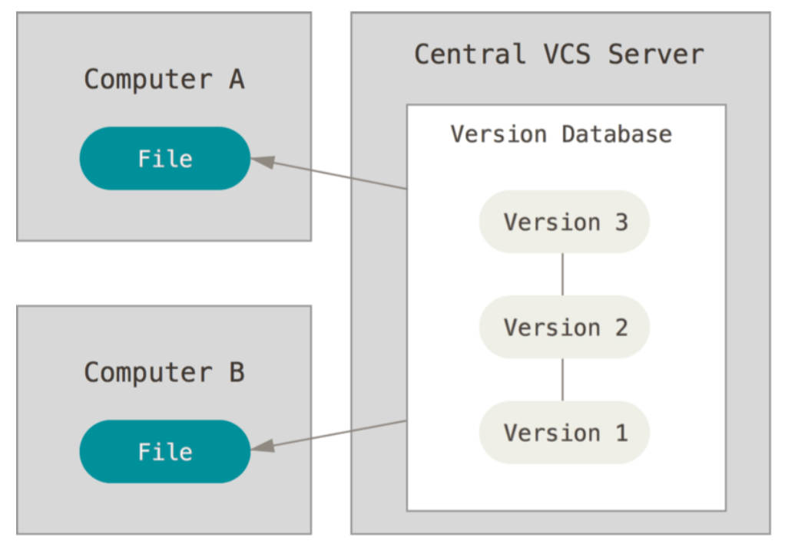
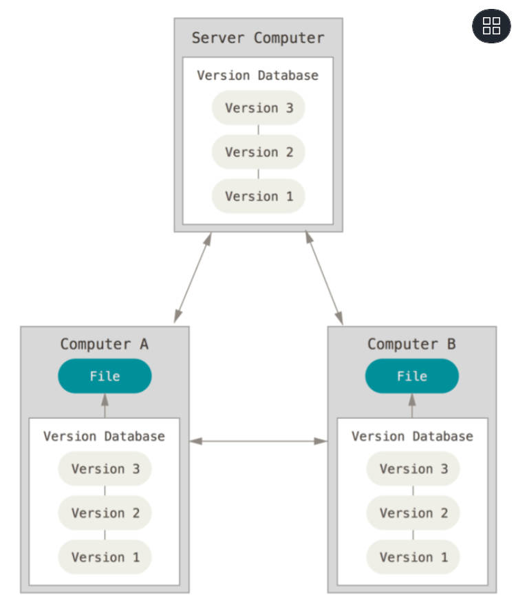

# 01-Git版本控制-安装-配置

## 版本控制的概念

### 什么是版本控制？

- 版本控制的英文是 Version control；
- 是维护工程蓝图的标准做法，能追踪工程蓝图从诞生一直到定案的过程；
- 版本控制也是一种软件工程技巧，借此能在软件开发的过程中，确保由不同人所编辑的同一程序文件都得到同步；

它有什么用？

- 不同版本的存储管理（git log 可查看）：
  - 一个项目会不断进行版本的迭代，来修复之前的一些问题、增加新的功能、需求，甚至包括项目的重构；
  - 如果我们通过手动来维护一系列的项目备份，简直是一场噩梦；
- 重大版本的备份维护：
  - 对于很多重大的版本，我们会进行备份管理；
- 恢复之前的项目版本（每次提交都会保存版本快照）：
  - 当我们开发过程中发生一些严重的问题时，想要恢复之前的操作或者回到之前某个版本；
- 记录项目的点点滴滴（git log 展示提交记录）：
  - 如果我们每一个功能的修改、bug 的修复、新的需求更改都需要记录下来，版本控制可以很好的解决；
- 多人开发的代码合并：
  - 项目中通常都是多人开发，将多人代码进行合并，并且在出现冲突时更好的进行处理；

### 版本控制工具的历史是怎样的？

- 版本控制的史前时代（没有版本控制）：
  - 人们通常通过文件备份的方式来进行管理，再通过 diff 命令来对比两个文件的差异；
- CVS（Concurrent Versions System）
  - 第一个被大规模使用的版本控制工具，诞生于 1985 年；
  - 由荷兰阿姆斯特丹 VU 大学的 Dick Grune 教授实现的，也算是 SVN 的前身（SVN 的出现就是为了取代 CVS 的）。
- SVN（Subversion）
  - 因其命令行工具名为 svn 因此通常被简称为 SVN；
  - SVN 由 CollabNet 公司于 2000 年资助并发起开发，目的是取代 CVS，对 CVS 进行了很多的优化；
  - SVN 和 CVS 一样，也属于集中式版本控制工具；
  - SVN 在早期公司开发中使用率非常高，但是目前已经被 Git 取代；
- Git（Linus 的作品）
  - 早期的时候，Linux 社区使用的是 BitKeeper 来进行版本控制；
  - 但是因为一些原因，BitKeeper 想要收回对 Linux 社区的免费授权；
  - 于是 Linus 用了大概一周的时间，开发了 Git 用来取代 BitKeeper；
  - Linus 完成了 Git 的核心设计，在之后 Linus 功成身退，将 Git 交由另外一个 Git 的主要贡献者 Junio C Hamano 来维护；

### 什么是集中式版本控制？

- CVS 和 SVN 都是属于集中式版本控制系统（Centralized Version Control Systems，简称 CVCS）
- 它们的主要特点是单一的集中管理的服务器，保存所有文件的修订版本；
- 开发人员通过客户端连接到这台服务器，取出最新的文件或者提交更新；

#### 有什么优点?

- 这种做法带来了许多好处，特别是相较于老式的本地管理来说，每个人都可以在一定程度上看到项目中的其他人正在做些什么。

#### 有什么缺点?

- 集中式版本控制有一个核心的问题：中央服务器不能出现故障：
- 如果宕机一小时，那么在这一小时内，谁都无法提交更新，也就无法协同工作；
- 如果中心数据库所在的磁盘发生损坏，又没有做恰当备份，毫无疑问你将丢失所有数据；

理解图解



### 什么是分布式版本控制？

- Git 是属于分布式版本控制系统（Distributed Version Control System，简称 DVCS ）
- 客户端并不只提取最新版本的文件快照，而是把完整的代码仓库镜像下载下来，包括完整的历史记录；

#### 有什么优点？

- 这么一来，任何一处协同工作用的服务器发生故障，事后都可以用任何 一个镜像出来的本地仓库恢复；
- 因为每一次的克隆操作，实际上都是一次对代码仓库的完整备份；

理解图解



## Git 安装

git 的安装流程。

- [Git 的官网](https://git-scm.com/downloads)
- 根据自己的操作系统下载 Git 即可；
- 在 window 操作系统按照默认配置全局安装即可；

---

什么是 git 安装的 Bash；CMD；GUI

- Bash（**推荐**），Unix shell 的一种，Linux 与 Mac OS X 都将它作为默认 shell。
  - Git Bash 就是一个 shell，是 Windows 下的命令行工具，可以执行 Linux 命令；
  - Git Bash 是基于 CMD 的，在 CMD 的基础上增添一些新的命令与功能（如 ssh，clear）；
  - 所以建议在使用的时候，用 Bash 更加方便；
- Git CMD
  - 命令行提示符（CMD）是 Windows 操作系统上的命令行解释程序；
  - 当你在 Windows 上安装 git 并且习惯使用命令行时，可以使用 cmd 来运行 git 命令；
- Git GUI
  - 基本上针对那些不喜欢黑屏（即命令行）编码的人；
  - 它提供了一个图形用户界面来运行 git 命令（本质）；

## Git 配置

git 的配置分类，

- 既然已经在系统上安装了 Git，那么需要做几件事来定制 Git 环境：
  - 每台计算机上只需要配置一次，程序升级时会保留配置信息；
  - 可以在任何时候再次通过运行命令来修改它们；
- Git 自带一个 `git config` 的工具来帮助设置控制 Git 外观和行为的配置变量：
  - `Git/etc/gitconfig` 文件：包含系统上每一个用户及他们仓库的通用配置
    - 如果在执行 git config 时带上 `--system` 选项，那么它就会读写该文件中的配置变量；
    - 由于它是系统配置文件，因此你需要管理员或超级用户权限来修改它。（开发中通常不修改）
  - `~/.gitconfig` （MAC） 或 `C/User/ZeTian/.gitconfig` （Windows） 文件：只针对当前用户（**常用**）。
    - 你可以传递 `--global` 选项让 Git 读写此文件，这会对你系统上所有的仓库生效；
  - 当前使用仓库的 Git 目录中的 config 文件（即 `/.git/config`）：针对该仓库
    - 你可以传递 `--local` 选项让 Git 强制读写此文件，虽然默认情况下用的就是它；

配置选项用户名和邮箱，

- 每一个 Git 提交都会使用这些信息，它们会写入到你的每一次提交中，不可更改；
- 如果使用了 `--global` 选项，那么该命令只需要运行一次，因为之后无论你在该系统上做任何事情，Git 都会使用这些信息；

```shell
git config --global user.name "[username]" #名称
git config --global user.email "[emailaddress]" #邮箱

git config --global core.autocrlf true ## windows 环境下推荐配置，git 提交时，换行符转为 lf
```

查找不同级别的配置文件，确认已配置的信息。

```shell
git config --system --list ## 查看系统 config（配置文件目录：\Git\etc\gitconfig）
git config --global --list ## 查看当前用户 (global) 配置（配置文件目录：C:\User\Administrator\gitconfig）
```

为 git 命令取别名。

- Git 并不会在你输入部分命令时自动推断出你想要的命令：
- 如果不想每次都输入完整的 Git 命令，可以通过 git config 命令来轻松地为每一个命令设置一个别名。

```shell
git config --global alias.co checkout
git config --global alias.br branch
git config --global alias.ci commit
git config --global alias.st status
```

比如，在 Windows 电脑上，推荐如下设置。

表示推送到 git 服务器上的代码自动将换行符 CRLF 转为 LF，拉取下来的代码自动将换行符 LF 转为 CRLF。

```shell
git config --global core.autocrlf true
```

## 初始化 Git 仓库

我们需要 Git 来管理源代码，那么我们本地也需要有一个 Git 仓库。git 获取仓库的 2 种方式。

- 初始化一个 Git 仓库，并且可以将当前项目的文件都添加到 Git 仓库中（目前很多的脚手架在创建项目时都会默认创建一个 Git 仓库）；

  ```shell
  git init
  ```

  - 该命令将创建一个名为 .git 的子目录，这个子目录含有你初始化的 Git 仓库中所有的必须文件，这些文件是 Git 仓库的核心；
  - 但是，在这个时候，我们仅仅是做了一个初始化的操作，你的项目里的文件还没有被跟踪；

- 从其它服务器克隆（clone）一个已存在的 Git 仓库（第一天到公司通常我们需要做这个操作）；

  ```shell
  git clone https://gitee.com/Zt2tzzt/front-end--engineering.git
  ```
