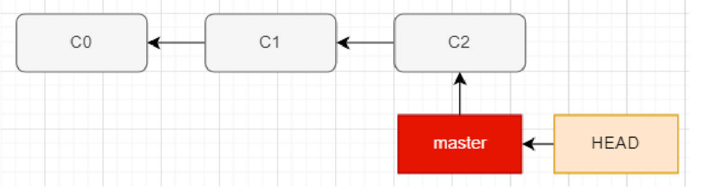
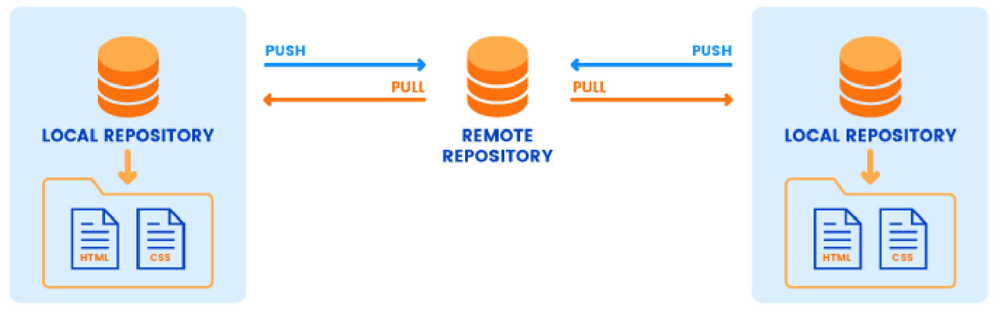

# Git 文件的状态

Git 如何进行文件的状态划分？理解图解。

- 实际开发中，我们需要对文件来划分不同的状态，以确定这个文件是否已经归于 Git 仓库的管理：
	- 未跟踪（untracked）：默认情况下，Git 仓库下的文件也没有添加到 Git 仓库管理中，我们需要通过 `add` 命令来添加；
	- 已跟踪：添加到 Git 仓库管理的文件处于已跟踪状态，Git 可以对其进行各种跟踪管理；可以进行状态细分：
	  - staged：暂缓区中的文件状态；
	  - Unmodified：到达该状态，需要使用 commit 命令，将 staged 中文件提交到 Git 本地仓库
	  - Modified：修改了某个文件后，会处于 Modified 状态；
- 在工作时，可以选择性地将这些修改过的文件放入暂存区，但一般通过 `git add .` 添加所有文件；
- 然后 commit 所有已暂存的修改，如此反复；


-----

理解 Git 的操作流程图。


-----

Git 检查文件状态。

```shell
git status
```

- Untracked files：未跟踪的文件
	- 未跟踪的文件意味着 Git 在之前的提交中没有这些文件；
	- Git 不会自动将之纳入跟踪范围，除非明确地告诉它“我需要跟踪该文件”；

- 我们也可以查看更加简洁的状态信息：

	```shell
	 git status –s
	 git status --short
	```

	- 左栏指明了暂存区的状态，右栏指明了工作区的状态；

-----

Git 将文件添加到暂存区（暂缓区）。
- 跟踪新文件命令：

  ```shell
  git add aaa.js # 使用命令 git add 开始跟踪一个文件
  ```

- 跟踪修改的文件命令： 如果我们已经跟踪了某一个文件，这个时候修改了该文件，也需要重新添加到暂存区中；

- 将所有的文件添加到暂存区中：

  ```shell
  git add .
  ```

-----

Git 文件更新提交到 git 仓库。

- 当暂存区已经准备就绪，可以提交时。
	- 每次准备提交前，先用 `git status`看下，所需要的文件是不是都已暂存起来了；
	- 再运行提交命令，在 commit 命令后添加 -m 选项，将提交信息与命令放在同一行;
	
```shell
	git commit –m "[提交信息]"
	```
	
- 我们修改文件的 add 操作，加上 commit 的操作有点繁琐，那么可以将两个命令结合来使用：

  ```shell
  git commit -a -m "[提交信息]" # 该操作只针对 modified 状态的文件
  ```

-----

# Git 忽略文件

如何设置 Git 的忽略文件。

- 一般我们总会有些文件无需纳入 Git 的管理，也不希望它们总出现在未跟踪文件列表。
	- 通常都是些自动生成的文件，比如日志文件，或者编译过程中创建的临时文件等；
	- 我们可以创建一个名为 `.gitignore` 的文件，列出要忽略的文件的模式；
- 在实际开发中，这个文件通常不需要手动创建，在必须的时候添加自己的忽略内容即可；
- 比如脚手架创建的 Vue 项目自带 .gitignore 文件：
	- 包括一些不需要提交的文件、文件夹；
	- 包括本地环境变量文件；
	- 包括一些日志文件；
	- 包括一些编辑器自动生成的文件；
- github 上有一个库，维护了各语言开发的项目中需要的 .gitignore 文件
  - https://github.com/github/gitignore.git

-----

# Git 校验和

什么是 Git 的校验和？

- Git 中所有的数据在存储前都会计算校验和，然后以校验和来引用（git log 会展示每次 commit 的校验和，也就是每次 commit 的 id）。
- Git 用以计算校验和的机制叫做 SHA-1 散列（hash，哈希）；
- 这是一个由 40 个十六进制字符（0-9 和 a-f）组成的字符串，基于 Git 中文件的内容或目录结构计算出来；


-----

# Git 提交历史管理

查看 Git 提交历史。

- 在提交了若干更新，又或者克隆了某个项目之后，有时候我们想要查看一下所有的历史提交记录。

- 这个时候我们可以使用命令：

	```shell
	git log
	```

	- 不传入任何参数的默认情况下，git log 会按时间先后顺序列出所有的提交，最近的更新排在最上面，按 Space 键翻页。
	- 这个命令会列出每个提交的 SHA-1 校验和、作者的名字和电子邮件地址、提交时间以及提交说明；

	```shell
	git log --pretty=oneline # 简化展示形式。
	git log --pretty=oneline --graph # 更有利于查看分支的提交记录
	```

-----

什么是 Git 的版本回退。
- 如果想要进行版本回退，我们需要先知道目前处于哪一个版本：Git 通过 HEAD 指针记录当前版本。
- HEAD 是当前分支引用的指针，它总是指向该分支上的最后一次提交；

如何理解 HEAD

- 理解 HEAD 的最简方式，就是将它看做该分支上的最后一次提交的快照；
- git 的版本回退，包括分支的切换，本质上都是在改 HEAD。



我们可以通过 HEAD 来改变 Git 目前的版本指向：

- 上一个版本就是 `HEAD^`，上上一个版本就是 `HEAD^^`；

  ```shell
  git reset --hard HEAD^
  ```

- 如果是上1000个版本，我们可以使用 `HEAD~1000`；

  ```shell
  git reset --hard HEAD~1000
  ```

- 我们可以指定某一个 commit id 进行回退；

  ```shell
  git reset --hard 2d44982 # id 前7位即可，保证不重复
  ```

git reflog 的作用。

```shell
git reflog
```

- 查看更加详细的日志信息，其中包括了 HEAD 的切换记录。

-----

# Git 远程仓库管理

什么是 Git 的远程仓库（Remote Repository）？

- 目前我们的代码是保存在一个本地仓库中，也就意味着我们只是在进行本地操作；
- 在真实开发中，我们通常是多人开发的，所以我们会将管理的代码共享到远程仓库中；

如何创建一个远程仓库呢？

- 远程仓库通常是搭建在某一个服务器上的（当然本地也可以，但是本地很难共享）；
- 所以我们需要在 Git 服务器上搭建一个远程仓库；

目前我们有如下方式可以使用 Git 服务器：

- 使用第三方的 Git 服务器：比如 GitHub、Gitee、Gitlab 等等；
- 在自己服务器搭建一个 Git 服务；



-----

## 身份验证

远程私有仓库的身份认证方式。

- 基于 HTTP 的凭证存储（Credential Storage）；
- 基于 SSH 的密钥；

-----

什么是远程仓库验证中的凭证？

1. http 本身是一种无状态的连接。意味着连接的时候，并不知道上一次是否有携带这个凭证。
2. 也就意味着，每一个连接都需要用户名和密码。

幸运的是，Git 拥有一个凭证系统（ Git Crediential ）来处理这个事情；了解它有哪些选项

- 选项一：默认所有都不缓存。 每一次连接都会询问你的用户名和密码；
- 选项二：“cache” 模式会将凭证存放在内存中一段时间。 密码永远不会被存储在磁盘中，并且在15分钟后从内存中清除；
- 选项三：“store” 模式会将凭证用明文的形式存放在磁盘中，并且永不过期；
- 选项四：如果你使用的是 Mac，Git 还有一种“osxkeychain” 模式，它会将凭证缓存到你系统用户的钥匙串中（加密的）；
- 选项五：如果你使用的是 Windows，你可以安装一个叫做 “Git Credential Manager for Windows” 的辅助工具（下载 Git 时，可选择携带下载）；
	- 可以在 https://github.com/Microsoft/Git-Credential-Manager-for-Windows 下载。

Windows 中如何查看凭证？

- 控制面板 -> 用户账号 -> 凭证管理器 -> Windows 凭证

-----

远程仓库 SSH 密钥验证

- Secure Shell（安全外壳协议，简称SSH）是一种加密的网络传输协议，可在不安全的网络中为网络服务提供安全的传输环境。 

- SSH 以非对称加密（公钥私钥的形式）实现身份验证。 
	- 例如其中一种方法是使用自动生成的公钥-私钥对，来简单地加密网络连接，随后使用密码认证进行登录； 
	- 另一种方法是人工生成一对公钥和私钥，通过生成的密钥进行认证，这样就可以在不输入密码的情况下登录； 
	- 公钥需要放在待访问的计算机之中，而对应的私钥需要由用户自行保管；
	
- 如果我们以 SSH 的方式访问 Git 仓库，那么就需要生产对应的公钥和私钥：

  ```shell
  ssh-keygen -t ed25519 -C “[your email]" # 现在常用
  ssh-keygen -t rsa -b 2048 -C “[your email]"
  ```

-----

## 关联远程仓库

git pull 遇到的问题，如何解决

- 从远程仓库上 clone 下来的代码，会带有自己的远程仓库，查看远程仓库地址：

  ```shell
  git remote
  git remote –v # -v是 —verbose 的缩写（意为冗长的）
  ```

- 添加远程地址：我们也可以继续添加远程服务器（让本地的仓库和远程服务器仓库建立连接）：

  - `git remote add <shortname> <url>`

  ```shell
  git remote add origin https://gitee.com/Zt2tzzt/front-end--engineering.git
  git remote add gitlab http://152.136.185.210:7888/coderwhy/gitremotedemo.git
  ```

- 重命名远程地址：

  ```shell
  git remote rename gitlab glab
  ```

- 移除远程地址：

  ```shell
  git remote remove gitlab
  ```

------

## 与远程仓库合并遇到的问题

1. 修改本地仓库后，使用 `git remote add xxx` 关联远程仓库，再使用  `git pull / git fetch`  拉取远程仓库到本地时。

   - **错误**：当前没有 track 分支的错误。“There is  no traking information for the current branch”

   - **原因**：当前分支没有和远程分支如 origin/master 分支进行关联跟踪。在没有跟踪的情况下，我们直接执行 pull 操作的时候必须指定从哪一个远程仓库中的哪一个分支中获取内容；比如：

     ```shell
     git pull origin master
     git fetch origin master
     ```

   - **解决办法**：如果我们想要直接执行 git fetch （git pull 的第一步）是有一个前提的：必须给当前本地分支设置一个上游分支（跟踪分支）：

     ```shell
     git pull # 先要 pull 或者 fetch 远程仓库分支，本地才能有该分支，如 origin/main
     git branch --set-upstream-to=origin/main # 将当前分支，与远程拉取到本地的 origin/main 分支进行关联跟踪。
     git pull # 将上游分支的代码，拉取到当前分支
     ```

   > 使用 git clone 下载远程仓库后，master 分支会自动关联跟踪远程 origin/master 分支

2. 使用 `git merge / git pull` 对拉取到本地仓库的代码，进行工作区合并。

   - **错误**：拒绝合并不相关的历史。“refusing to merge unrelated histories”

   - **原因**：我们将两个不相干的分支进行了合并。

     > 过去 git merge 允许将两个没有共同基础（base，可理解为共同的祖先）的分支进行合并。这导致了一个后果：新创建的项目可能被一个毫不留意的维护者合并了很多没有必要的历史，到一个已经存在的项目中，目前这个命令已经被纠正，但是我们依然可以通过 --allow-unrelated-histories 选项来逃逸这个限制，以此合并两个独立的项目；

     ```shell
     git merge --allow-unrelated-histories
     ```

     