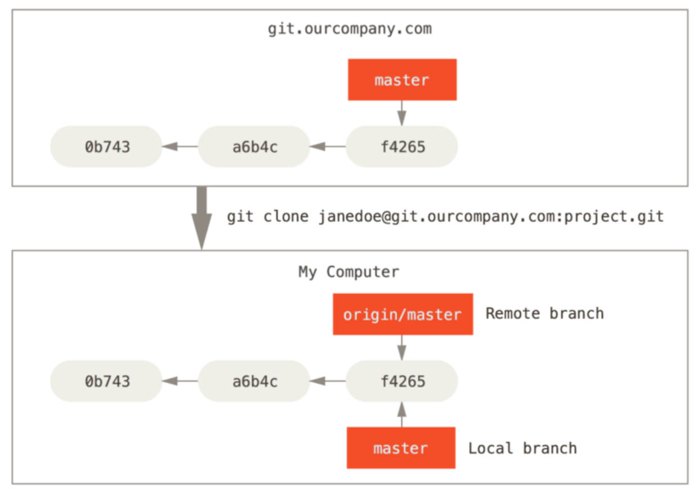

# Git 远程仓库管理

远程仓库的交互，

## 克隆远程仓库代码

从远程仓库 clone 代码：将存储库克隆到新创建的目录中；

```shell
git clone [url]
```

## 推送代码到远程仓库

- 将代码 push 到远程仓库：将本地仓库的代码推送到远程仓库中；

- 默认情况下是将当前分支（如 master）push 到 origin 远程仓库的；

```shell
git push
git push origin master
```

## 拉取远程仓库代码

从远程仓库 fetch 代码：从远程仓库获取最新的代码

默认情况下是从 origin 中获取代码；

```shell
git fetch
git fetch origin
```

获取到代码后默认并没有合并到本地仓库，我们需要通过 merge 来合并； -

```shell
git merge
```

上面的两次操作有点繁琐，我们可以通过一个命令来操作，从远程仓库 pull 代码：

```shell
git pull # 相当于 git fetch + git merge(rebase)
```

如果想让远程分支覆盖本地工作区中的内容，使用 `git reset --hard <remote>/<branch>`

```shell
get reset --hard origin/master
git pull
```

## 推送代码到远程仓库遇到的问题

当本地分支名与远程分支名不相同时，push 遇到的问题：

- 找不到远程仓库对应的分支，

3个解决方法。

- 方法一：为本地分支指明要推送的远程分支：

  ```shell
  git push origin master:main # 表示把本地 master 分支推送到远程 main 分支。
  git push origin head:main # head 代表当前所在分支，如 master
  ```

- 方法二：为 push 设置 default 行为（push.default），

  - 默认值是 `simple`，表示 push 远程同名的分支，

  - 将其改为 `upstream`，表示 push 本地分支关联跟踪的远程上游分支。

    ```shell
    # 此时本地当前分支为 master
    git fetch # （git pull），因为本地还没有 main 分支，先要将远程 main 分支获取到本地形成 origin/main 分支。
    git branch --set-upstream-to=origin/main # 将当前分支，与远程的 origin main 分支进行关联跟踪。
    git config push.default upstream # 只在当前仓库配置。
    git push
    ```

  - 将其改为 `current`，表示 push 到远程同名的分支，没有则在远程创建与本地同名的分支，并推送。

    ```shell
    # 此时本地当前分支为 master
    git config push default.current
    git push # 在远程仓库创建了 master 分支，并将本地仓库的 master 分支提交到了该分支
    ```
    

- 方法三： 在本地切换一个新分支，并跟踪远程的同名分支。

  ```shell
  git checkout --track origin/main # 在本地切换一个新分支 main，并跟踪远程的同名分支
  git checkout main # 以上的简写形式
  ```

## 实际工作中初始化 git 仓库的 2 种情况

- 情况一：项目已有远程仓库。

  1. 克隆仓库

     ```shell
     git clone
     ```

  2. 进行开发

     ```shell
     git add .
     git commit -m "[info]"
     git pull # git fetch & git merge
     git push
     ```

- 情况二：项目没有 git 仓库，且需要自己搭建，2 种方案：

  - 方案一：创建一个远程仓库（**推荐**）。

    1. 在 Git 服务器创建一个仓库。
    2. 重复上文【项目已有远程仓库的操作】

  - 方案二：创建一个本地仓库，并推送到远程仓库。

    - 写法一

      ```shell
      git init
      git remote add origin [url] # 关联一个远程仓库
      git fetch
      git branch --set-upstream-to=origin/main # 为本地仓库当前分支建立上游分支，关联远程仓库的 main 分支
      git fetch
      git merge --allow-unrelated-histories
      git config push.default upstream
      git push
      # git push -u origin main 将本地当前分支推送到远程 main 分支，并设置上游分支
      ```
      
    - 写法二
    
      ```shell
      git checkout main # 原理参考上文【推送代码到远程仓库遇到的2个问题】
      git push
      # 如果本地当前分支（如 master）不再使用，可删除该分支
      ```

# 开源协议

常见的开源协议划分，理解图解。


# Git 标签 tag

## 认识 tag

对于大的版本我们常常会打上一个标签，以表示它的重要性：

- Git 可以给仓库历史中的某一个提交打上标签（可理解为在提交对象上的一个指针）；
- 比较有代表性的是人们会使用这个功能来标记发布节点（ 如 v1.0.0、 v2.0.0 等等）；

## 查看当前仓库已有标签

```shell
git tag
```

## 创建 tag：

Git 支持两种标签：轻量标签（lightweight）与附注标签（annotated）；

附注标签：通过 -a 选项，并且通过 -m 添加额外信息；

```shell
git tag v1.0.0
git tag -a v1.1.0 -m "[标签的描述]"
```

## 推送 tag

默认情况下，git push 命令并不会传送标签到远程仓库服务器上。

在创建完标签后你必须显式地推送标签到共享服务器上，当其他人从仓库中克隆或拉取，他们也能得到你的那些标签；

```shell
git push origin v1.0.0
git push origin --tags # 推送所有标签到远程
```

## 删除 tag：

删除本地 tag：

```shell
git tag -d v1.0.0
```

删除远程 tag：

- 要删除远程的 tag 我们可以通过：`git push <remote> -–delete <tagname>`

```shell
git push origin --delete v1.1.0
```

## 检出 tag：

如果你想查看某个标签所指向的文件版本，可以使用 git checkout 命令；

```shell
git checkout v1.0.0
```

通常我们在检出 tag 的时候还会创建一个对应的分支，因为不能在原 tag 上修改（分支后续了解）；

```shell
git branch newbranch v1.0.0
git checkout newbranch
```

# Git 的提交对象

## 相关操作

执行 `git add .` 后：

1. 在 ./.git/object/ 中创建了进制数开头的目录如“00...”，里面保存的是二进制文件。如 “d2...”
2. 使用 `git cat-file -t 00d2`，来查看文件类型，显示 blob，表示文件是二进制文件。
3. 使用 `git cat-file -p 00d2`，来查看文件保存的内容，发现是添加到暂存区的内容。

执行 `git commit -m 'starting the project'` 后：

1. 在 ./git/object/ 中又创建了进制数开头的目录如“46...”和“eb...”，里面保存的是二进制文件如“58...”和“5c...”
2. 使用 `git cat-file -p 4658`，可查看到另一个二进制文件，其中有索引信息以及对应的工作区文件名称，这个文件被称为**树（tree）文件**。
3. 使用 `git cat-file -p` 树文件的索引，可查看到 `git add .` 操作第一步中的文件，也就是使用 `git add .` 添加到暂存区的内容。
4. 使用 `git cat-file -p eb5c`，可查看到另一个二进制文件，其中有**提交作者信息**，**树文件的索引**和**提交信息**，这个文件就是提交文件。每次提交的校验和，就是该文件的索引。

## Git 的提交对象以及原理。

- 在进行提交操作时，Git 会保存一个提交对象（commit object）：
- 该提交对象会包含一个指向暂存内容快照的指针：tree 文件；
- 该提交对象还包含了作者的姓名和邮箱、提交时输入的信息以及指向它的父对象的指针；
  - 首次提交产生的提交对象没有父对象，普通提交操作产生的提交对象有一个父对象；
  - 而由多个分支合并产生的提交对象有多个父对象；

一个提交对象


多个提交对象


# Git 的本地分支

## master 分支

Git 的本地默认分支 maser 分支理解。

Git 的分支，其实本质上仅仅是指向提交对象的可变指针。
- Git 的默认分支名字是 master，在多次提交操作之后，你其实已经有一个指向最后那个提交对象的 master 分支；
- master 分支的指针会在每次提交时自动移动；

Git 的 master 分支并不是一个特殊分支。
- 它与其它分支完全没有区别；
- 之所以几乎每一个仓库都有 master 分支，是因为 git init 命令默认创建它，并且大多数人都懒得去改动它；


## 创建新分支

Git 本地是怎么创建新分支的；

很简单，它只是为你创建了一个可以移动的新的指针，

比如，创建一个 testing 分支，你需要使用 git branch 命令：

```shell
git branch testing
```


## 切换分支

那么，Git 又是怎么知道当前在哪一个分支上呢？

也很简单，它也是通过一个名为 HEAD 的特殊指针来判断；

```shell
git checkout testing
```


## 进行提交后分支的变化

如果在 testing 分支上做了提交，也可以切换回 master 分支继续开发并提交


## 创建本地分支同时切换。

```shell
git checkout -b dev # 创建一个 dev 分支，并切换到 dev 分支
```

## 本地分支的使用场景以及流程；

1. 项目在 master 分支上开发，某一阶段开发完成。发布项目，打上 tag v1.0.0，继续后续开发。

   

2. 在开发时突然发现发布的版本有 bug。

3. 切换到 tag v1.0.0，并且创建一个分支 hotfix，

   ```shell
   git checkout v1.0.0
   git checkout -b hotfix
   # 或者
   git checkout -b hotfix v1.0.0
   ```

   

4. 在 hotfix 分支上，对 bug 进行修复，完成修复后进行提交，并新打上一个 tag v1.0.1；

   

5. 切换回 master 分支，但是这个时候 master 分支也需要修复刚刚的 bug，所以我们需要将 master 分支和 hotfix 分支进行合并；

   ```shell
   git checkout master
   git merge hotfix
   ```

   

## 查看和删除分支

查看当前分支

```shell
git branch # 查看当前所有的分支
git branch –v # 同时查看最后一次提交
git branch --merged # 查看所有合并到当前分支的分支
git branch --no-merged # 查看所有没有合并到当前分支的分支
```

如果某些已经合并的分支我们不再需要了，那么可以将其移除掉：

```shell
git branch –d hotfix # 删除当前分支，删除的是分支指针，提交对象不会删除。
git branch –D hotfix # 强制删除某一个分支
```

# Git 分支合并冲突解决

- 对 2 个分支进行合并（不论远程还是本地），某些情况下会出现冲突，比如两分支在同一文件中都做了修改。
- 这时，合并的文件会出现“<<<<<<”，“\=\=\=\=\=”这样的符号。
- 可手动删除这些符号，进行合并。
- 也可使用现有编辑工具（如 VSCode）中给出的选项，进行合并。


# Git 工作流

什么是 Git 的工作流？

- 由于 Git 上分支的使用的便捷性，产生了很多 Git 的工作流：
  - 也就是说，在整个项目开发周期的不同阶段，你可以同时拥有多个开放的分支；
  - 你可以定期地把某些主题分支合并入其他分支中；
- 比如以下的工作流：

  - master 作为主分支；
  - develop 作为开发分支，并且有稳定版本时，合并到 master 分支中；
  - topic（feature） 作为某一个主题或者功能或者特性的分支进行开发，开发完成后合并到 develop 分支中；

  

大厂流行的 Git flow。


# Git 的远程分支

## 认识远程分支。

远程分支也是一种分支结构：

以 `<remote>/<branch>` 的形式命名；

如果我们刚刚 clone 下来代码，分支的结构如下：



如果其他人修改了代码并做了提交和推送，那么远程分支和本地分支结构如下：


你需要通过 fetch 来获取最新的远程分支提交信息；


## 远程分支的管理。

### 推送分支到远程;

- 当你想要公开分享一个分支时，需要将其推送到有写入权限的远程仓库上；
- `git push <remote> <branch>`

### 跟踪远程分支

- 当克隆一个仓库时，它通常会自动地创建一个跟踪 origin/master 的 master 分支（只会 clone 并跟踪主分支）；
- 如果你愿意的话可以设置其他的跟踪分支，可以通过运行 `git checkout --track <remote>/<branch>`
- 如果你尝试检出的分支不存在且刚好只有一个名字与之匹配的远程分支，那么 Git 就会为你创建一个跟踪分支；

```shell
git checkout --track origin/dev
git checkout dev # 简写，做了4步操作。
# 1.创建一个本地的 dev 分支
# 2.切换到 dev 分支
# 3.检查远程服务器是否有 dev 这个分支
# 4.让本地的 dev 分支自动跟踪 origin/dev
```

### 删除远程分支

如果某一个远程分支不再使用，我们想要删除掉，可以运行带有 --delete 选项的 git push 命令来删除一个远程分支。

```shell
git push origin --delete dev
```

# Git rebase

## 认识 Git rebase？

在 Git 中整合来自不同分支的修改主要有两种方法：merge 以及 rebase。 


```shell
git checkout experiment # 切换到 experiment 分支上
git rebase master
```

什么是 rebase 呢？ 

- 在上面的图例中，你可以提取在 C4 中引入的补丁和修改，然后在 C3 的基础上应用一次； 
- 在 Git 中，这种操作就叫做变基（rebase）； 

## Git rebase 原理

你可以使用 rebase 命令将提交到某一分支上的**所有修改**都移至另一分支上，就好像“重新播放”一样； 

rebase 这个单词如何理解呢？ 
- 我们可以将其理解成改变当前分支的 base；
- 比如在分支 experiment 上执行 rebase master，那么可以改变 experiment 的 base 为 master

rebase 是如何工作的呢？ 
- 它的原理是首先找到这两个分支（即当前分支 experiment、变基操作的目标基底分支 master）的最近共同祖先 C2； 
- 然后对比当前分支相对于该祖先的历次提交，提取相应的修改并存为临时文件； 
- 然后将当前分支指向目标基底 C3； 
- 最后以此将之前另存为临时文件的修改依序应用；

别忘了，最后一步，再次执行 master上的合并操作，将 master 分支指针指向 experiment

```shell
git checkout master
git merge experiment
```


## rebase 和 merge 在开发中的选择。
事实上，rebase 和 merge 是对 Git 历史的不同处理方法： 
- merge 用于记录 git 的所有历史，那么分支的历史错综复杂，也全部记录下来； 
- rebase 用于简化历史记录，将两个分支的历史简化，整个历史更加简洁；

了解了 rebase 的底层原理，就可以根据自己的特定场景选择 merge 或者 rebase。

注意：rebase 有一条黄金法则：**永远不要在主分支上使用 rebase**（不要将主分支变基到其它分支，而是将其它分支变基到主分支）：

- 如果在 main 上面使用 rebase，会造成大量的提交历史在 main 分支中不同；
- 而多人开发时，其他人依然在原来的 main 中，对于提交历史来说会有很大的变化；


# Git 命令速查表图解

