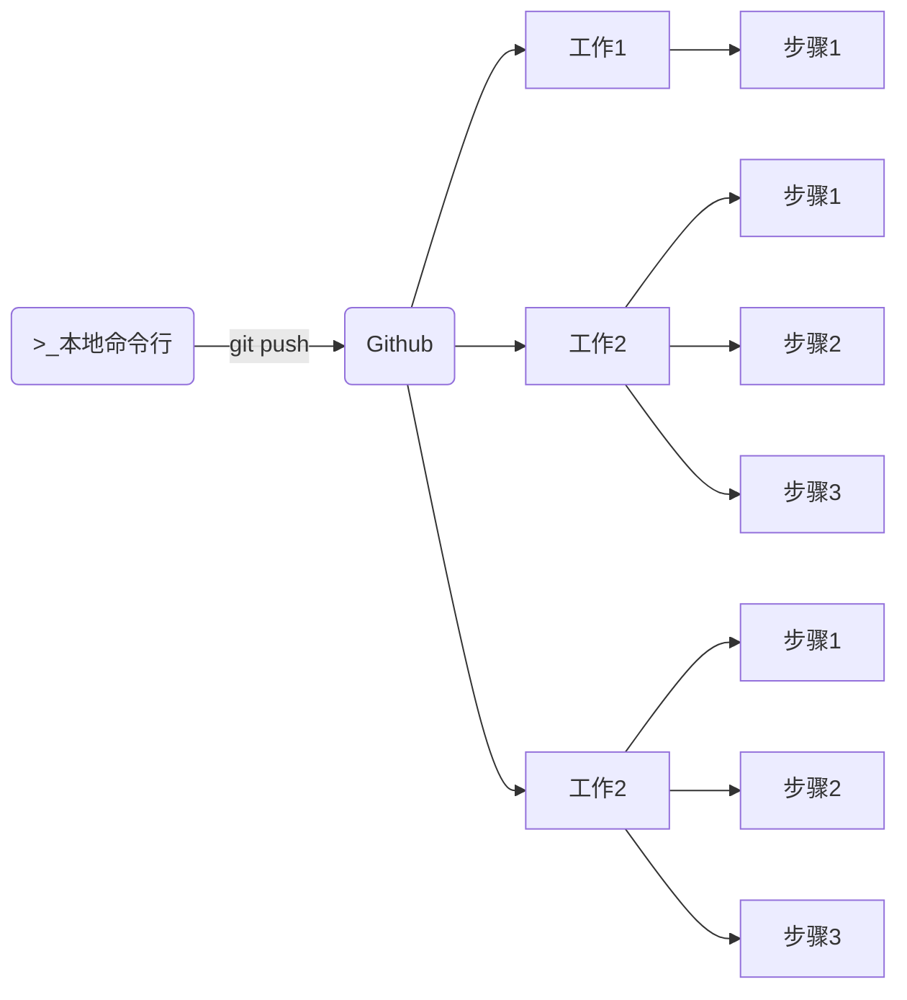

# Github 的使用

## 一、issue

用户提交 issue 后，会有一个编号，通常在标题处表示为 `#xxx`，表示是第 xxx 个 issue。

仓库拥有者，可以在 issue 右侧，使用 Assignees，为解决 issue 的人员。

解决人员修改代码后，提交信息应使用：`fix: #xxx`，这样，在提交记录里，可以直接链接到 issue 的页面。

## 二、Pull Request

创建新分支，或 fork 仓库，才能出发 Pull Request。

当新的分支，同步到远程仓库时，就会看到”compare and pull request“的提示。点击，就会进入“open a pull request”页面。

在该页面中，编辑 title，description 后，点击“create pull request”，就能创建一个 pull request 了。

与 issue 一样，创建的 pull request，会有一个编号 `#xxx`，这个编号的计数顺序，是与 issue 共用的。

仓库拥有者，或有相关权限的人员，确认 pull request 没有问题，就可以在 pull request 页面点击“Merge pull request”，将 pull request 合并到主分支 main 上。此时 Github 会自动关闭这条 pull request。然后可以选择顺势点击“Delete branch”删除远程仓库上的被合并的分支。

此时，在本地仓库上，仍然时两个没有合并的分支，切换到 main 分支，执行命令

```shell
git pull
```

将远程的 main 分支，拉取到本地的并合并。然后执行命令：

```shell
git branch -d new-branch
```

删除掉本地创建的新分支即可。

用 fork 触发 pull request，道理与创建新分支触发 pull request 相同。

## 三、release

Github 上的 release 是 tag 标签的。

点击代码仓库右侧的 releases，进入 releases 页面，再点击“Create a new release“，创建一个发行软件包。

这时，需要指定一个标签，来发行版本。再填写相应的描述，和添加软件发行包的二进制文件（通常是压缩归档文件）即可。

## 四、Search

按 s 键，自动聚焦搜索框。

- 使用高级搜索功能，比如输入搜索条件：`springboot vue stars:>1000 pushed:>2023-04-06 language:java`。

按 t 键，对仓库内的文件名进行搜索。

进入文件后，

- 按 l 键，输入行号，快速跳转到某一行；
- 点击行号，可复制这行代码、生成永久链接等等。
- 按 b 键，快速查看该文件的改动记录。

## 五、快速操作面板

按 Ctrl + K，打开快速操作面板。

## 六、网页编辑器

在仓库详情页，按 。键，在网页编辑器中，打开代码仓库。

在项目地之前，加上 `gitpod.io/#/` 前缀。不仅能在网页编辑器中打开项目，而且会自动识别项目类型并安装依赖包。这个远程服务器中，预装了大部分环境（如 Java、python、Go、...）可以输入命令来运行项目。

## 五、Actions

### 1.基本概念

Github 是一个远程代码仓库，Github Action 用于自定义化工作流。

当从本地推送代码到 Github 仓库，或在仓库里进行其它动作时，这些都是事件发生的时刻。

当事件发生时，需要指定工作流，来完成一些事情：

- 工作流里，可以有多份工作。
- 这些工作里，需要执行指定的步骤。

这些工作，本可以在本地运行，但既然通过 Github 触发，那么表示这些工作会在服务器上运行。

- 服务器可以选择 Github 提供的服务器，或者自己的服务器。

这些工作之间，默认是同时进行的。工作里的步骤，默认则是按顺序执行的。



### 2.案例实践

Github Action 的配置文件是 .github/workflows/xxx.yml。

将本地仓库，推送到 Github 远程仓库时，Github 会识别上方的 action 配置文件，并启用 Actions 功能。

这个 yaml 配置文件，是 DevOps 模式的灵魂文件。

以下是一个 action 配置文件示例：

.github/workflows/zetian.yml

```yaml
on: push

jobs:
  job1:
    runs-on: ubuntu-latest
    steps:
      - run: pwd
      - run: ls
  job2:
    runs-on: windows-latest
    steps:
      - run: node --version
```

推送上方文件到 Github 仓库，在 Github 仓库页面，查看 Action 选项卡下新增的工作流。

在其中可以看到工作流执行的每一步详情（包括使用操作系统镜像中配置好的软件，命令执行的结果等等）

### 3.react 项目自动部署

配置一个 react 项目的 github action：

```yaml
name: 打包React项目

on: push

permissions:
  contents: write

jobs:
  npm-build:
    name: npm-build工作
    runs-on: ubuntu-latest

    steps:
      - name: 查看环境信息
        run: |
          pwd
          npm -v
          npm install -g pnpm
          pnpm -v


      - name: 读取仓库内容
        uses: actions/checkout@v4 # 一个现成的 action，使用它，在 github 服务器上访问仓库内容

      - name: 安装依赖&项目打包
        run: |
          pnpm install
          pnpm build

      - name: 项目部署
        uses: JamesIves/github-pages-deploy-action@v4 # 部署在 github pages 上
        with:
          branch: gh-pages # 会创建 gh-pages 分支，并把上产环境文件放到该分支里。
          folder: build # react 打包后的生产环境文件，在 build 文件夹里。

```

- [actions/checkout](https://github.com/actions/checkout) 是一个现成的 action，使用它，在 github 服务器上访问仓库内容，
- 使用 `name` 来为每一项工作，添加名称，增加可读性。

推送代码到远程仓库。

进入 Github 仓库页面 -> Settings -> 右侧 Pages 菜单 -> 指明从 gh-pages 分支开始构建，并保存

然后再进入 Github 仓库页面 -> Action 选项卡 -> 点击最新的工作流（通常是“pages build and deployment ”）

> react 项目打包前，要在 package.json 中，加入如下配置：以便打包服务器能够后找到入口文件提供服务
>
> ```json
> {
>   "homepage": "./",
> }
> ```

### 4.react 项目自动推送 docker 镜像

再项目根目录下，创建一个 `Dockerfile`

```dockerfile
FROM node:18-alpine

WORKDIR /react-aribnb

COPY public /react-aribnb/public
COPY src /react-aribnb/src
COPY package.json /react-aribnb/package.json

RUN npm install

CMD ["npm", "start"]
```

在 DcokerHub 新建一个仓库 react-aribnb

在 DockerHub 页面点击头像 -> My Account -> 右侧 Security -> New Access Token -> Generate；将生成号的 token 记录下来

在 Github 仓库页面 -> 进入 Settings 选项卡 -> 左侧 Secrets and Variables -> Actions -> New repository secrets；

新增两个 repository secret “DOCKERHUB_USERNAME”、“DOCKERHUB_TOKEN”，将 docker 的账号名，和 docker 中生成的 token，分别保存在其中。

配置一个 github action 配置文件：

```yaml
name: 构建镜像并推送到DcokerHub

on: push

jobs:
  npm-build:
    name: npm-build工作
    runs-on: ubuntu-latest

    steps:
      - name: 读取仓库内容
        uses: actions/checkout@v4

      - name: 登录DcokerHub
        uses: docker/login-action@v3 # 利用现成的 action
        with:
          username: ${{ secrets.DOCKERHUB_USERNAME }}
          password: ${{ secrets.DOCKERHUB_TOKEN }}

      - name: 构建并推送到DcokerHub
        uses: docker/build-push-action@v5
        with:
          push: true
          tags: zt2tzzt/react-aribnb:latest # 和 dockerhub 仓库对应

```

提交并推送代码到 Github 仓库。等待 Github Action 执行完成。

然后会发现，Github Action 将构建好的镜像，推送到了 DockerHub 中。

在本地拉取 Dockerhub 中的镜像，并创建和运行容器，看看效果：

```shell
docker run -d \
  --name react-aribnb \
  -p 3333:3000 \
  zt2tzzt/react-aribnb
```
