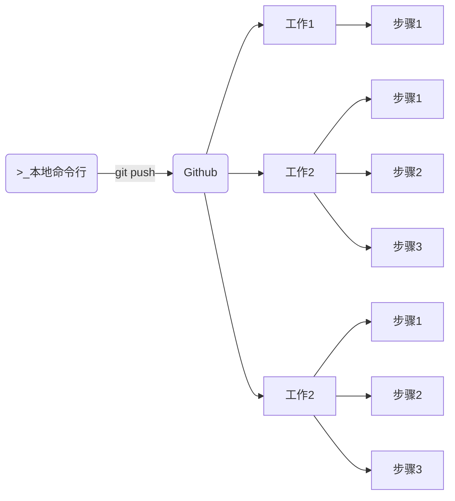

# Github 的使用

## 一、issue

用户提交 issue 后，会有一个编号，通常在标题处表示为 `#xxx`，表示是第 xxx 个 issue。

仓库拥有者，可以在 issue 右侧，使用 Assignees，为解决 issue 的人员。

解决人员修改代码后，提交信息应使用：`fix: #xxx`，这样，在提交记录里，可以直接链接到 issue 的页面。

## 二、Pull Request

创建新分支，或 fork 仓库，才能出发 Pull Request。

当新的分支，同步到远程仓库时，就会看到”compare and pull request“的提示。点击，就会进入“open a pull request”页面。

在该页面中，编辑 title，description 后，点击“create pull request”，就能创建一个 pull request 了。

与 issue 一样，创建的 pull request，会有一个编号 `#xxx`，这个编号的计数顺序，是与 issue 共用的。

仓库拥有者，或有相关权限的人员，确认 pull request 没有问题，就可以在 pull request 页面点击“Merge pull request”，将 pull request 合并到主分支 main 上。此时 Github 会自动关闭这条 pull request。然后可以选择顺势点击“Delete branch”删除远程仓库上的被合并的分支。

此时，在本地仓库上，仍然时两个没有合并的分支，切换到 main 分支，执行命令

```shell
git pull
```

将远程的 main 分支，拉取到本地的并合并。然后执行命令：

```shell
git branch -d new-branch
```

删除掉本地创建的新分支即可。

用 fork 触发 pull request，道理与创建新分支触发 pull request 相同。

## 三、release

Github 上的 release 是 tag 标签的。

点击代码仓库右侧的 releases，进入 releases 页面，再点击“Create a new release“，创建一个发行软件包。

这时，需要指定一个标签，来发行版本。再填写相应的描述，和添加软件发行包的二进制文件（通常是压缩归档文件）即可。

## 四、Search

按 s 键，自动聚焦搜索框。

- 使用高级搜索功能，比如输入搜索条件：`springboot vue stars:>1000 pushed:>2023-04-06 language:java`。

按 t 键，对仓库内的文件名进行搜索。

进入文件后，

- 按 l 键，输入行号，快速跳转到某一行；
- 点击行号，可复制这行代码、生成永久链接等等。
- 按 b 键，快速查看该文件的改动记录。

按 Ctrl + K，打开快速操作面板。

在仓库详情页，按 。键，在网页编辑器中，打开代码仓库。

在项目地之前，加上 `gitpod.io/#/` 前缀。不仅能在网页编辑器中打开项目，而且会自动识别项目类型并安装依赖包。这个远程服务器中，预装了大部分环境（如 Java、python、Go、...）可以输入命令来运行项目。

## 五、Actions

Github 是一个远程代码仓库，Github Action 用于自定义化工作流。

当从本地推送代码到 Github 仓库，或在仓库里进行其它动作时，这些都是事件发生的时刻。

当事件发生时，需要指定工作流，来完成一些事情：

- 工作流里，可以有多份工作。
- 这些工作里，需要执行指定的步骤。

这些工作，本可以在本地运行，但既然通过 Github 触发，那么表示这些工作会在服务器上运行。

服务器可以选择 Github 提供的服务器，或者自己的服务器。

这些工作之间，默认是同时进行的。工作里的步骤，默认则是按照顺序执行的。



Github Action 的配置文件是 .github/workflows/xxx.yml。

将本地仓库，推送到 Github 远程仓库时，Github 会识别上方的 action 配置文件，并启用 Actions 功能。
