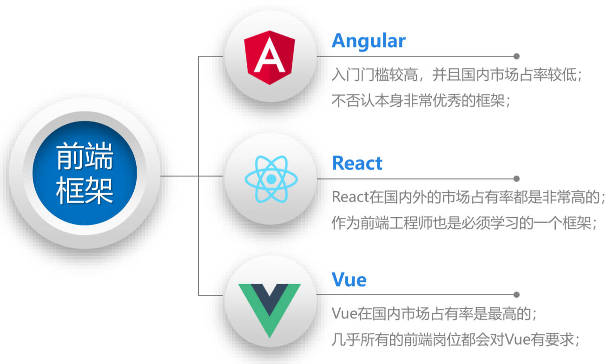
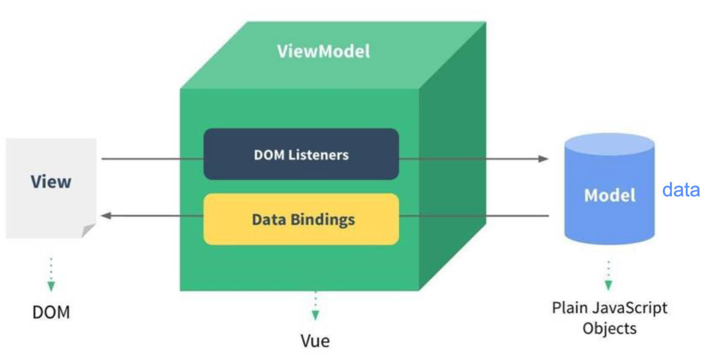

# 认识Vue-OptionsAPI基本使用-模板语法-指令（一）

## 一、认识 Vue

Vue 全称是 Vue.js 或者 Vuejs，是一套用于构建用户界面的渐进式  JavaScript 框架。

> 渐进式，表示我们可以在项目中引用 Vue，而不一定要使用 Vue 来开发整个项目。

Vue 基于标准 HTML、CSS、JavaScript 构建，并提供了一套声明式的、组件化的编程模型；帮助开发者高效地开发用户界面，无论任务是简单还是复杂；

Vue 在前端处于什么地位？



## 二、Vue3 与 vue2 的区别

### 1.源码方面

Vue3 通过 monorepo 的形式来管理源代码。

Vue3 源码使用 TypeScript 进行重写（Vue2 中使用 Flow 来进行类型检测）。

### 2.性能方面

响应式数据劫持的区别：

- Vue3 使用 Proxy 进行数据劫持。
- Vue2 中使用 `Object.defineProperly` 中的 getter 和 setter 方法进行数据劫持，
  - 这种方法无法劫持对象添加或删除属性，所以不得不提供一些像 `$set` 或 `$delete` 这样特殊的 API。

API 和特性的区别：

- Vue3 删除了一些不必要的 API。如：移除了实例上的 `$on`，`$off` 和 `$once`；删除了一些特性，如 `filter`，内联模板等。

编译层面的区别：

- Vue3 做了编译方面的优化。如：生成 Block Tree；Slot 的编译优化；diff 算法优化。

### 3.API 架构方面

API 架构的区别：

- Vue2 通过 Options API 来描述组件对象；
  - 其中包括 data, props, methods, computed, watch, 生命周期等等这些选项。
  - 造成编写代码时，一个逻辑可能写在不同的地方，代码内聚性非常差。

- Vue3 由 Options API 转到 Composition API，同时兼容 Options API。
  - Composition API 可以将相关联的代码放到同一处进行处理，而不需要在多个 Options 之间寻找

逻辑复用的区别：

- Vue3 可使用 Hook 函数，将一部分独立的逻辑抽取出去，增加代码的复用性，并且还可以做到响应式
  - vue2 通常使用 `mixin` 在多个组件之间共享逻辑。
  - 而 `mixin` 也是由一大堆 Options 组成，并且多个 `mixin` 会存在名命冲突的问题。

## 二、如何使用 Vue

### 1.在项目中引入 Vue

如何在项目中引入 Vue？四种方式：

- 方式一：通过 CDN 的方式引入（CDN 是分发网络，英文是 Content Deliver NetWork 或 Content Distribution NetWork）。
- 方式二：下载 Vue 的 JavaScript 文件，并且自己手动引入。
- 方式三：通过 npm 安装并使用它。
- 方式四：直接通过 Vue CLI 创建项目并使用它。

### 2.Vue 的基本使用（3个案例）

使用 CDN 的方式体验 Vue 的基本使用。

```html
<body>
  <h2>哈哈哈</h2>
  <p>我是内容, 呵呵呵呵</p>
  <div id="app"></div>

  <!-- CDN 地址 -->
  <script src="https://unpkg.com/vue@next"></script>
  <script>
    // 使用 Vue
    const app = Vue.createApp({
      template: `<h2>Hello World</h2><span>呵呵呵</span>`
    })
    // 挂载
    app.mount('#app')
  </script>
</body>
```

Vue 的初体验，3 个案例的实现。

案例一，动态展示数据；

```html
<body>
  <div id="app"></div>

  <script src="./lib/vue.js"></script>
  <!-- 使用下载到本地的 vue -->
  <script>
    const app = Vue.createApp({
      template: `<h2>{{ message }}</h2>`,
      data: function () {
        return {
          message: '你好啊, Vue3'
        }
      }
    })
    app.mount('#app')
  </script>
</body>
```

案例二，展示列表数据；

```html
<body>
  <div id="app"></div>

  <script src="./lib/vue.js"></script>
  <script>
    const app = Vue.createApp({
      template: `
        <h2>电影列表</h2>
        <ul>
          <li v-for="item in movies">{{ item }}</li>
        </ul>
      `,
      data: function () {
        return {
          movies: ['大话西游', '星际穿越', '盗梦空间', '少年派', '飞驰人生']
        }
      }
    })
    app.mount('#app')
  </script>
</body>
```

案例三，计数器；

```html
<body>
  <div id="app"></div>

  <script src="./lib/vue.js"></script>
  <script>
    const app = Vue.createApp({
      template: `
        <h2>当前计数: {{ counter }}</h2>
        <button @click="increment">+1</button>
        <button @click="decrement">-1</button>
      `,
      data: function () {
        return {
          counter: 0
        }
      },
      methods: {
        increment: function () {
          this.counter++
        },
        decrement: function () {
          this.counter--
        }
      }
    })
    app.mount('#app')
  </script>
</body>
```

### 3.template 的使用

对计数器案例做重构，使用 template

> 如果 `createApp` 中，传入的对象，
>
> - 有 `template` 属性，那么 `template` 中的内容会替换掉 `<div id="app”></div>` 中的内容
> - 没有 `template` 属性，那么 Vue 底层会将 `<div id="app"></div>` 中的内容当作 template 进行渲染。

```html
<body>
  <div id="app">
    <h2>当前计数: {{counter}}</h2>
    <button @click="increment">+1</button>
    <button @click="decrement">-1</button>
  </div>

  <script src="./lib/vue.js"></script>
  <script>
    const app = Vue.createApp({
      data: function () {
        return {
          counter: 0
        }
      },
      methods: {
        increment: function () {
          this.counter++
        },
        decrement: function () {
          this.counter--
        }
      }
    })
    app.mount('#app')
  </script>
</body>
```

`template` 会替换掉要挂载的元素；

Vue 使用 `template` 的 2 种方式。

方式一：使用 `<script>` 标签，并且标记它的类型 `type="x-template"`，并设置 `Id`。

```html
<div id="app"></div>

<script type="x-template" id="my-app">
  <div>
    <h2>{{ counter }}</h2>
    <button @click="increment">+</button>
    <button @click="decrement">-</button>
  </div>
</script>
<script>
  Vue.createApp({
    template: '#my-app'
    // ...
  }).mount('#app')
</script>
```

方式二：使用任意标签（通常是 `<template>`，因为加载时不会呈现，运行时可使用 JavaScript 实例化），设置 `Id`。

```html
<div id="app"></div>

<template id="my-app">
  <div>
    <h2>{{ counter }}</h2>
    <button @click="increment">+</button>
    <button @click="decrement">-</button>
  </div>
</template>
<script>
  Vue.createApp({
    template: '#my-app'
    // ...
  }).mount('#app')
</script>
```

### 4.与原生代码对比

使用原生方式，实现计数器，对比命令式和声明式编程的区别。

```html
<body>
  <h2>当前计数: <span class="counter"></span></h2>
  <button class="add">+1</button>
  <button class="sub">-1</button>

  <script>
    // 1.获取dom
    const counterEl = document.querySelector('.counter')
    const addBtnEl = document.querySelector('.add')
    const subBtnEl = document.querySelector('.sub')
    // 2.定义一个变量记录数据
    let counter = 100
    counterEl.textContent = counter
    // 2.监听按钮的点击
    addBtnEl.onclick = function () {
      counterEl.textContent = ++counter
    }
    subBtnEl.onclick = function () {
      counterEl.textContent = --counter
    }
  </script>
</body>
```

原生开发和 Vue 开发，分别对应**命令式编程**和**声明式编程**；

命令式编程关注的是 “how to do” 自己完成整个 "how" 的过程；

声明式编程关注的是 “what to do”，由框架(机器)完成 “how” 的过程；

> 目前 Vue、React、Angular、小程序的编程模式，我们称之为声明式编程；

## 三、MVVM 开发模式

什么是 MVVM 的开发模式，它与 MVC 的模式有什么不同？

- MVC 是 Model–View–Controller 的简称，是在前期比较流行的架构模式，比如 iOS、前端；
- MVVM 是 Model-View-ViewModel 的简称，是目前非常流行的架构模式；



## 四、Options API 的基本使用

### 1.data

在 Vue2.x，`data` 属性，可以传入一个对象（官方仍然推荐传入一个函数）；

在 Vue3.x，`data` 必须传入一个函数，否则就会直接在浏览器中报错；

```js
data: function() {
  return {
    message: "Hello Data"
  }
},
```

理解 data 的响应式原理。

- `data` 中返回的对象，会被 Vue 的响应式系统劫持，之后对该对象的修改，或者访问，都会在劫持中被处理：
- 在 `<template>` 或者 `div#app` 中，通过 `{{ counter }}` 访问 `counter`，可以从对象中获取到数据；
- 修改 `counter` 的值时，app 中的 `{{ counter }}` 也会发生改变；

### 2.methods

`methods` 属性是一个对象，通常我们会在这个对象中，定义很多的方法：

这些方法，可以被绑定到模板中；

在这些方法中，可以使用 `this` 关键字，来直接访问到 `data` 中返回的对象的属性；

`methods` 中 `this` 的指向，是一个 proxy 代理后的组件实例（instance）对象，里面可以操作 `data` 中的数据。

> methods 中定义的方法，不能是箭头函数，
>
> 不然 `this` 会指向上级作用域中的 `this`，即 `window`，严格模式下为 `undefined`

### 3.其它 options

Options API 中，还有诸如 `computed`、`watch`、`props`、`emits`、`setup` ......属性；也包括很多的生命周期函数；

## 五、Vue 的模板语法

模板语法，是一种开发模式。

- React 的开发模式：
  - React 使用的 jsx，所以对应的代码，都是编写的类似于 js 的一种语法；
  - 之后通过 *Babel* 将 jsx 编译成 `React.createElement` 函数调用；
- Vue 也支持 jsx 的开发模式：但是大多数情况下，使用基于 HTML 的模板语法；
  - 在模板中，允许开发者，以声明式的方式，将 DOM 和底层组件实例的数据，绑定在一起；
  - 在底层的实现中，Vue 将模板编译成虚拟 DOM 渲染函数（`createVNode`）。

### 1.Mustache 语法

Mustache 语法（双大括号语法/插值语法）的使用。

```html
<!-- data 中的属性 -->
<h2>{{ message }}</h2>

<!-- 表达式 -->
<h2>{{ counter * 10 }}</h2>
<h2>{{ message.split(' ').reverse().join(' ') }}</h2>
<h2>{{ isShow ? '哈哈哈' : '' }}</h2>

<!-- 函数 / 计算属性 -->
<h2>{{ getReverseMessage() }}</h2>
```

不能定义语句

```html
<div>{{ const foo = 'haha' }}</div>
<!-- 错误写法 -->
```

## 五、指令

### 1.v-once

`v-once` 将所有元素/组件，以及所有子元素，视为静态内容只渲染一次，可用于性能优化。

```html
<h2 v-once>
  {{ message }}
  <span>数字: {{counter}}</span>
</h2>
```

### 2.v-text

`v-text` 用于更新元素的 `textContent`

```html
<h2 v-text="message">aaa</h2>
```

### 3.v-html

`v-html` 将文本内容解析成 html 代码。

```html
<h2 v-html="content"></h2>
```

### 4.v-pre

`v-pre` 用于跳过元素及其子元素的编译过程，显示原始的 Mustache 标签。

```html
<div v-pre>
  <h2>{{ message }}</h2>
  <p>当前计数: {{ counter }}</p>
  <p>{{}}</p>
</div>
```

### 5.v-cloak

`v-cloak` 这个指令保存在元素上，直到关联组件实例编译完成。

和 CSS 属性选择器 `[v-cloak] { display: none }` 一起用时，这个指令可以隐藏未编译的 Mustache 标签直到组件实例准备完毕。

```html
<style>
  [v-cloak] {
    display: none;
  }
</style>
<!-- ... -->
<h2 v-cloak>{{message}}</h2>
```

### 6.v-memo

`v-memo` 缓存一个模板的子树，在元素和组件上，都可以使用，传入一个数组用于缓存，如果数组里的每个值，都与最后一次的渲染相同，那么整个子树的更新，将被跳过。

```html
<div v-memo="[name, age]">
  <!-- 如果 name, age 不改变，那么整个 div 都不会更新 -->
  <h2>姓名: {{ name }}</h2>
  <h2>年龄: {{ age }}</h2>
  <h2>身高: {{ height }}</h2>
</div>
```

### 7.v-bind 指令

`v-bind` 的作用，语法糖，预期值类型，修饰符：

- 作用：用于动态的绑定元素上的 `attribute`，或组件的 `prop`。

- 语法糖：一个冒号`:`

- 预期：（变量名，表达式，函数，计算属性），对象，数组

- 修饰符：`.camel` 将连字符转为驼峰写法。

#### 1.v-bind 基本使用

```html
<body>
  <div id="app">
    <!-- 1. v-bind的基本使用 -->
    
    <!-- 2. v-bind提供一个语法糖 -->
    <a :href="link">百度一下</a>
  </div>

  <script src="https://unpkg.com/vue@next"></script>
  <script>
    Vue.createApp({
      data() {
        return {
          imgUrl: 'https://avatars.githubusercontent.com/u/53403628?s=60&v=4',
          link: 'https://www.baidu.com'
        }
      }
    }).mount('#app')
  </script>
</body>
```

#### 2.绑定 class，对象语法

```html
<body>
  <div id="app">
    <div :class="className">哈哈哈哈</div>

    <!-- 对象语法: {'className': boolean} / {className: boolean}  -->
    <div :class="{active: isActive}">哈哈哈哈</div>
    <button @click="toggle">切换</button>

    <!-- 也可以有多个键值对 -->
    <div :class="{active: isActive, title: true}">呵呵呵呵</div>

    <!-- 默认的 class 和动态的 class 结合 -->
    <div class="abc cba" :class="{active: isActive, title: true}">呵呵呵呵</div>

    <!-- 将对象放到一个单独的属性中 -->
    <div class="abc cba" :class="classObj">呵呵呵呵</div>

    <!-- 将返回的对象放到一个 method(computed) 方法中 -->
    <div class="abc cba" :class="getClassObj()">嘿嘿嘿嘿</div>
  </div>

  <script src="https://unpkg.com/vue@next"></script>
  <script>
    const app = {
      data() {
        return {
          className: 'zzt',
          isActive: true,
          classObj: {
            active: true,
            title: true
          }
        }
      },
      methods: {
        toggle() {
          this.isActive = !this.isActive
        },
        getClassObj() {
          return {
            active: true,
            title: true
          }
        }
      }
    }
    Vue.createApp(app).mount('#app')
  </script>
</body>
```

#### 3.绑定 class，数组写法

```html
<body>
  <div id="app">
    <div :class="['abc', title]">呵呵呵呵</div>

    <!-- 在数组语法中，使用三元运算符 -->
    <div :class="['abc', title, isActive ? 'active' : '']">呵呵呵呵</div>

    <!-- 在数组语法中，嵌套对象语法 -->
    <div :class="['abc', title, {active: isActive}]"></div>
  </div>

  <script src="https://unpkg.com/vue@next"></script>
  <script>
    const app = {
      data() {
        return {
          title: 'cba',
          isActive: true
        }
      }
    }
    Vue.createApp(app).mount('#app')
  </script>
</body>
```

#### 4.绑定 style，对象语法

```html
<body>
  <div id="app">
    <!-- 使用 v-bind 绑定 style 时，CSS 属性名可以写成驼峰式，或者短横线分隔（需要用引号括起来） -->
    <div :style="{color: finalColor, 'font-size': '30px'}">哈哈哈</div>
    <div :style="{color: finalColor, fontSize: '30px'}">哈哈哈</div>
    <div :style="{color: finalColor, fontSize: finalFontSize + 'px'}">哈哈哈</div>

    <!-- 绑定一个 data 中的属性值，并且是一个对象 -->
    <div :style="FinalStyleObj">呵呵呵</div>

    <!-- 调用一个方法 -->
    <div :style="getFinalStyleObj()">嘿嘿嘿</div>
  </div>

  <script src="https://unpkg.com/vue@next"></script>
  <script>
    const app = {
      template: '#my-app',
      data() {
        return {
          finalColor: 'red',
          finalFontSize: 50,
          FinalStyleObj: {
            'font-size': '50px',
            fontWeight: 700,
            backgroundColor: 'yellow'
          }
        }
      },
      methods: {
        getFinalStyleObj() {
          return {
            'font-size': '50px',
            fontWeight: 700,
            backgroundColor: 'red'
          }
        }
      }
    }
    Vue.createApp(app).mount('#app')
  </script>
</body>
```

#### 5.绑定 style，数组写法

```html
<body>
  <div id="app">
    <div :style="[style1Obj, style2Obj]">哈哈哈</div>
  </div>

  <script src="https://unpkg.com/vue@next"></script>
  <script>
    const app = {
      data() {
        return {
          style1Obj: {
            color: 'red',
            fontSize: '30px'
          },
          style2Obj: {
            textDecoration: 'underline'
          }
        }
      }
    }
    Vue.createApp(app).mount('#app')
  </script>
</body>
```

#### 6.动态绑定 attribute 名称

```html
<body>
  <div id="app">
    <div :[name]="value">哈哈哈</div>
  </div>

  <script src="https://unpkg.com/vue@next"></script>
  <script>
    const app = {
      data() {
        return {
          name: 'style',
          value: {
            backgroundColor: 'red'
          }
        }
      }
    }
    Vue.createApp(app).mount('#app')
  </script>
</body>
```

#### 7.以对象形式直接给元素绑定 attributes

经常用来给组件传递 props。

```html
<body>
  <div id="app">
    <div v-bind="info">哈哈哈</div>
    <div :="info">哈哈哈</div>
  </div>

  <script src="https://unpkg.com/vue@next"></script>
  <script>
    const app = {
      data() {
        return {
          info: {
            class: 'active',
            style: {
              fontSize: '50px',
              backgroundColor: 'red'
            }
          }
        }
      }
    }
    Vue.createApp(app).mount('#app')
  </script>
</body>
```

#### 8.同名速记

`v-bind` 同名速记是 Vue 3.4 的新特性。

比如一下这行代码：

```vue

```

现在可以将 v-bind 绑定的属性缩短：

```vue

```
