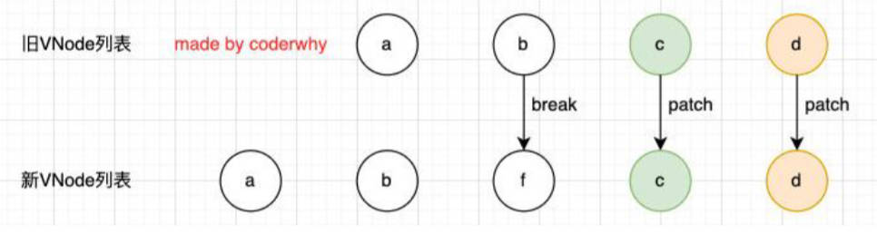

#  认识 VNode

什么是 VNode

- VNode 全称是 Virtual Node，也就是虚拟节点。
- 无论组件还是元素，在 Vue 中表现出来的都是 VNode。
- VNode 本质是一个 JavaScript 对象。
- 渲染过程：template -> VNode -> 真实DOM


# 认识虚拟 DOM

什么是虚拟 DOM

- 虚拟 DOM 就是一大堆 VNode 元素组成的 VNode Tree
- 不考虑组件的情况，虚拟 DOM 中的 VNode 和真实 DOM 中的元素一一对应。

> 虚拟 DOM 最大的好处是跨平台。在 vue 中，虚拟 DOM 可以做 Diff 算法。


-----

# 插入F案例，理解 Diff 算法

根据插入 F 的案例，理解 v-for 有无 key 的 diff 算法。

```html
<body>
  <div id="app">
    <ul>
      <li v-for="item in letters" :key="item">{{ item }}</li>
    </ul>
    <button @click="insert">插入f</button>
  </div>
  <script src="https://unpkg.com/vue@next"></script>
  <script>
    const app = {
      data() {
        return {
          letters: ['a', 'b', 'c', 'd']
        }
      },
      methods: {
        insert() {
          this.letters.splice(2, 0, 'f')
        }
      }
    }
    Vue.createApp(app).mount('#app')
  </script>
</body>
```
有无 key 分别使用的方法（源码位置：packages -> runtime-core -> src -> renderer.ts）

- 没 key，使用 `patchUnKeyedChildren` 方法。3步
	1. 取到旧 VNodes 和新 VNodes，比较两者长度，取小的那个遍历。
	2. 遍历时，依次将旧 VNode 与新 VNode 做 patch 操作，有不同的元素则更新，
	3. 遍历完后，旧 VNodes 中元素比较多，则卸载多余的元素。新 VNodes 比较多，则更新多余元素。
	
	
- 有 key，使用 `patchKeyedChildren` 方法。5步
	1. while 循环从头比较新旧 VNodes 节点元素的 type（tag）和 key，遇到相同节点就继续，遇到不同节点就跳出循环。
	
	   
	
	2. while 循环从末尾比较新旧 VNodes 节点元素的 type（tag）和 key，遇到相同节点就继续，遇到不同节点就跳出循环。
	
	   
	
	3. 如果新 VNode 更多，使用 null 与新 VNode 做 patch 操作（相当于挂载新 VNode）。
	
	   
	
	4. 如果旧 VNode 更多，则使用 unmount 方法卸载旧 VNode 。
	
	   
	
	5. 如果中间存在无序的 VNode 位置序列，会使用 key 建立索引，尽量用旧 VNode 匹配新 VNode ，没匹配到的旧 VNode 则卸载，没匹配到的新 VNode 则新增。
	
	   

# 计算属性 computed

复杂 data 的处理场景。

- 在某些情况，我们可能需要对数据进行一些转化后再显示，或者需要将多个数据结合起来进行显示； 
	- 比如我们需要对多个 data 数据进行运算；使用三元运算符来决定结果；数据进行某种转化后显示； 
	- 在模板中使用表达式，可以非常方便的实现，但是设计它们的初衷是用于简单的运算； 
	- 在模板中放入太多的逻辑会让模板过重和难以维护； 
	- 并且如果多个地方都使用到，那么会有大量重复的代码；
- 我们有没有什么方法可以将逻辑抽离出去呢？ 
	- 可以，其中一种方式就是将逻辑抽取到一个 method 中，放到 methods 的 options 中； 
	- 但是，这种做法有一个直观的弊端，就是所有的 data 使用过程都会变成一个方法的调用；
	- 另外一种方式就是使用计算属性 computed；

什么是计算属性 computed？

- 官方并没有给出直接的概念解释； 
- 而是说：对于任何**包含响应式数**据的复杂逻辑，你都应该使用计算属性； 
- 计算属性将被混入到组件实例中
	- 所有 getter 和 setter 的 this 上下文自动地绑定为组件实例；

## 计算属性的基本用法（语法糖写法）

```html
<body>
  <div id="app">
    <h2>{{ fullname }}</h2>
    <h2>{{ result }}</h2>
    <h2>{{ reverseMessage }}</h2>
  </div>
  <script src="https://unpkg.com/vue@next"></script>
  <script>
    const app = {
      data() {
        return {
          firstname: 'lionel',
          lastname: 'messi',
          score: 80,
          message: 'Hello World'
        }
      }
      computed: {
        fullname() {
          return this.firstname + ' ' + this.lastname
        },
        result() {
          return this.score >= 60 ? '及格' : '不及格'
        },
        reverseMessage() {
          return this.message.split(' ').reverse().join(' ')
        }
      }
    }
    Vue.createApp(app).mount('#app')
  </script>
</body>
```

-----

计算属性 computed 与 methods 的区别？

- 原理上：计算属性有缓存。
	1. 计算属性会基于依赖关系做缓存。
	2. 依赖的数据不发生变化时，计算属性不需要重新计算。
	3. 依赖的数据变化，计算属性会重新计算。
- 写法上：计算属性在模板语法中更优雅（不用写()）

```html
<!-- 
如果模板中，多次引用一个计算逻辑的结果，
- 计算属性对应的函数只会运行一次，
- methods 对应的函数会运行3次 
-->
<h2>{{ fullname }}</h2>
<h2>{{ fullname }}</h2>
<h2>{{ fullname }}</h2>
```

## 计算属性的完整写法，setter 和 getter。

- 计算属性在大多数情况下，只需要一个 getter 方法即可，所以我们会将计算属性直接写成一个函数。 
- 但是，如果我们确实想设置计算属性的值呢？ 这个时候我们也可以给计算属性设置一个 setter 的方法；

```html
<body>
  <div id="app">
    <button @click="changeFullname">修改fullname</button>
    <h2>{{ fullname }}</h2>
  </div>
  <script src="https://unpkg.com/vue@next"></script>
  <script>
    const app = {
      data() {
        return {
          firstname: 'Lionel',
          lastname: 'Messi'
        }
      }
      computed: {
        // fullname 的 getter 和 setter 方法
        fullname: {
          get() {
            return this.firstname + ' ' + this.lastname
          },
          set(newVal) {
            const nameArr = newVal.split(' ')
            this.firstname = nameArr[0]
            this.lastname = nameArr[1]
          }
        }
      },
      methods: {
        changeFullname() {
          this.fullname = 'Coder zzt'
        }
      }
    }
    Vue.createApp(app).mount('#app')
  </script>
</body>
```

> 源码对计算属性 computed 的处理，理解。
>
> - 会判断选项内容是否为一个函数，是则绑定一个 publicThis，不是则会取选项的 get 属性判断是否为方法。

# 侦听器 watch

什么是侦听器 watch？

- 开发中我们在 data（或 props） 返回的对象中定义了数据，这个数据通过插值语法等方式绑定到 template 中； 当数据变化时，template 会自动进行更新来显示最新的数据；
- 但是在某些情况下，我们希望在代码逻辑中监听某个数据的变化，这个时候就需要用侦听器 watch 来完成了；

## 基本使用

```html
<body>
  <div id="app">
    <h2>{{message}}</h2>
    <button @click="changeMessage">修改message</button>
  </div>
  <script src="../lib/vue.js"></script>
  <script>
    const app = Vue.createApp({
      data() {
        return {
          message: "Hello Vue",
          info: { name: "zzt", age: 18 }
        }
      },
      methods: {
        changeMessage() {
          this.message = "你好啊, 李银河!"
          this.info = { name: "kobe" }
        }
      },
      watch: {
        message(newValue, oldValue) { // 默认有两个参数: newValue, oldValue
          console.log("message数据发生了变化:", newValue, oldValue)
        },
        info(newValue, oldValue) {
          // 如果是对象类型, 那么拿到的是代理对象 proxy
          console.log(newValue.name, oldValue.name) // 默认情况下，侦听器只能侦听对象引用的变化。对象中属性发生改变，newValue 和 oldValue 相同。
        }
      }
    })
    app.mount("#app")
  </script>
</body>
```

## proxy 对象转原始对象的方法2种

```js
const app = {
	watch: {
		info(newValue, oldValue) {
			console.log({ ...newValue }) // 方法一，利用对象的展开语法，浅拷贝。
			console.log(Vue.toRaw(newValue)) // 方法二，利用 Vue 提供的方法。
		}
	}
}
```

## 配置选项

- template 中的监听是深度监听的。
- watch 中的监听默认不是深度监听。

```html
<body>
  <div id="app">
    <h2>{{ info.name }}</h2>
    <!-- <h2>{{ info.premier.name }}</h2> -->
    <button @click="changeInfo">改变Info</button>
    <button @click="changeInfoName">改变Info.name</button>
    <button @click="changeInfoPremierName">改变Info.premier.name</button>
  </div>
  <script src="https://unpkg.com/vue@next"></script>
  <script>
    const app = {
      data() {
        return {
          info: { name: 'zzt', age: '18', premier: { name: 'Ronaldo' } }
        }
      },
      watch: {
        // 配置选项：深度监听 & 立即执行（一定会执行一次）
        info: {
          handler(newVal, oldVal) {
            console.log('newVal', newVal, 'oldVal', oldVal)
          },
          deep: true,
          immediate: true
        },
        // 侦听单个嵌套
        'info.name': function (newVal, oldVal) {
          console.log('newVal.name', newVal, 'oldVal.name', oldVal)
        },
        'info.premier.name': function (newVal, oldVal) {
          console.log('newVal.premier.name', newVal, 'oldVal.premier.name', oldVal)
        },
				// watch 的3种写法，分别为 info 设值了3个监听器
        info: [
          // 1.引用 methods 中的方法作为侦听函数
          'handle1',
          // 2.基本用法
          function(newVal, oldVal) { 
            console.log('handle2 triggered');
          },
          // 3.配置选项用法
          {
            handler(newVal, oldVal) {
              console.log('handle3 triggered');
            },
            deep: true,
            immediate: true
          }
        ]
      }
      methods: {
        handle1(newVal, oldVal) {
          console.log('handle1 triggered');
        },
        changeInfo() {
          this.info = { name: 'Lingard' }
        },
        changeInfoName() {
          this.info.name = 'Lingard'
        },
        changeInfoPremierName() {
          this.info.premier.name = 'Lingard'
        }
      }
    }
    Vue.createApp(app).mount('#app')
  </script>
</body>
```

在 Vue 中使用 `$watch` 进行监听

```html
<body>
  <div id="app">
    <h2>{{message}}</h2>
    <button @click="changeMessage">修改message</button>
  </div>
  <script src="../lib/vue.js"></script>
  <script>
    const app = Vue.createApp({
      data() {
        return {
          message: "Hello Vue"
        }
      },
      methods: {
        changeMessage() {
          this.message = "你好啊, 李银河!"
        }
      },
      // 生命周期回调函数: 当前的组件被创建时自动执行，一般在该函数中, 会进行网络请求，ajax/fetch/axios
      created() {
        this.$watch("message", (newValue, oldValue) => {
          console.log("message数据变化:", newValue, oldValue)
        }, { deep: true })
      }
    })
    app.mount("#app")
  </script>
</body>
```

# 综合案例

书籍购物车综合案例理解。

1. 在界面上以表格的形式，显示一些书籍的数据； 
2. 在底部显示书籍的总价格； 
3. 点击+或者-可以增加或减少书籍数量（如果为1，那么不能继续-）；
4. 点击移除按钮，可以将书籍移除（当所有的书籍移除完毕时，显示：购物车为空~）；
5. 点击某一行书籍，改变颜色，其它行颜色不变。

```js
const books = [
  {
    id: 1,
    name: '《算法导论》',
    date: '2006-9',
    price: 85.00,
    count: 1
  },
	// ...
]
```

```html
<html lang="en">
<head>
  <meta charset="UTF-8">
  <meta http-equiv="X-UA-Compatible" content="IE=edge">
  <meta name="viewport" content="width=device-width, initial-scale=1.0">
  <title>Document</title>
  <style>
    table {
      border-collapse: collapse;
      /* text-align: center; */
    }
    thead {
      background-color: #f5f5f5;
    }
    th, td {
      border: 1px solid #aaa;
      padding: 8px 16px;
    }
    .active {
      background-color: skyblue;
    }
  </style>
</head>
<body>
  <div id="app">
    <!-- 1.搭建界面内容 -->
    <template v-if="books.length">
      <table>
        <thead>
          <tr>
            <th>序号</th>
            <th>书籍名称</th>
            <th>出版日期</th>
            <th>价格</th>
            <th>购买数量</th>
            <th>操作</th>
          </tr>
        </thead>
        <tbody>
          <tr v-for="(item, index) in books" 
              :key="item.id"
              @click="rowClick(index)"
              :class="{ active: index === currentIndex }">
            <td>{{ index + 1 }}</td>
            <td>{{ item.name }}</td>
            <td>{{ item.date }}</td>
            <td>{{ formatPrice(item.price) }}</td>
            <td>
              <button :disabled="item.count <= 1" @click="decrement(index, item)">-</button>
              {{ item.count }}
              <button @click="increment(index, item)">+</button>
            </td>
            <td>
              <button @click="removeBook(index)">移除</button>
            </td>
          </tr>
        </tbody>
      </table>
      <h2>总价: {{ formatPrice(totalPrice) }}</h2>
    </template>
    <template v-else>
      <h1>购物车为空, 请添加喜欢的书籍~</h1>
      <p>商场中有大量的IT类的书籍, 请选择添加学习, 注意保护好自己的头发!</p>
    </template>
  </div>
  <script src="../lib/vue.js"></script>
  <script src="./data/data.js"></script>
  <script>
    const app = Vue.createApp({
      data() {
        return {
          books: books,
          currentIndex: 0
        }
      },
      computed: {
        totalPrice() {
          return this.books.reduce((accumulator, currentItem) => accumulator + currentItem.price * currentItem.count, 0)
        }
      },
      methods: {
        formatPrice(price) {
          return "¥" + price
        },
        decrement(index, item) 
          // 两种方式都可以
          // this.books[index].count--
          item.count--
        },
        increment(index, item) {
          // 两种方式都可以
          // this.books[index].count++
          item.count++
        },
        removeBook(index) {
          this.books.splice(index, 1)
        },
        rowClick(index) {
          this.currentIndex = index
        }
      }
    })
    app.mount("#app")
  </script>
</body>
</html>
```