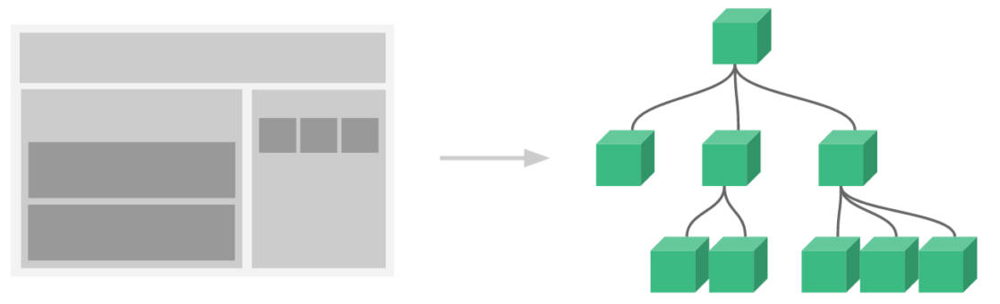

# v-model 指令

什么是 v-model 指令？有什么用？

- 表单提交是开发中非常常见的功能，也是和用户交互的重要手段：
  - 比如用户在登录、注册时需要提交账号密码；
  - 比如用户在检索、创建、更新信息时，需要提交一些数据；
- 这些都要求我们可以在代码逻辑中获取到用户提交的数据，我们通常会使用 v-model 指令来完成：
  - v-model 指令可以在表单 input、textarea 以及 select 元素上创建双向数据绑定；
  - 它会根据控件类型自动选取正确的方法来更新元素；
- 尽管有些神奇，但 v-model 本质上不过是语法糖，它负责监听用户的输入事件来更新数据，并在某种极端场景下进行一些特殊处理；

基本使用

```html
<body>
	<div id="app">
		<!-- 在 input 中实现 v-model 的原理
			1. v-bind value 的绑定
			2. 监听 input 事件, 更新 message 的值	-->
		<input
			type="text"
			:value="message"
			@input="message = $event.target.value"
		/>
		<!-- 等价于 -->
		<input type="text" v-model="message" />
	</div>
	<script src="https://unpkg.com/vue@next"></script>
	<script>
		const app = {
			data() {
				return {
					message: 'Hellow World'
				}
			}
		}
		Vue.createApp(app).mount('#app')
	</script>
</body>
```

---

v-model 在 input（checkbox（单选，多选），radio），textarea，select 中的使用。

- input 的类型为 checkout，radio 且有 v-model 指令时，name 属性（用于做提交）可以省略。

```html
<body>
	<div id="app">
		<!-- 1.绑定 textarea -->
		<label for="intro">
			自我介绍
			<textarea id="intro" name="intro" cols="30" rows="10" v-model="intro"></textarea>
		</label>
		<h2>intro: {{intro}}</h2>
		<!-- 2.input checkbox -->
		<!-- 2.1. 单选框  v-model 绑定的是布尔值。此时 input 的 value 属性并不影响 v-model 的值。-->
		<label for="agree">
			<input id="agree" type="checkbox" v-model="isAgree" /> 同意协议
		</label>
		<h2>单选框: {{isAgree}}</h2>
		<!-- 2.2. 多选框，当有多个复选框时，因为可以选中多个，所以对应的 data 中属性是一个数组。当选中某一个时，就会将 input 的 value 添加到数组中。 -->
		<span>你的爱好:</span>
		<label for="sing">
			<input id="sing" type="checkbox" value="sing" v-model="hobbies" /> 唱
		</label>
		<label for="jump">
			<input id="jump" type="checkbox" value="jump" v-model="hobbies" /> 跳
		</label>
		<label for="rap">
			<input id="rap" type="checkbox" value="rap" v-model="hobbies" /> rap
		</label>
		<label for="basketball">
			<input id="basketball" type="checkbox" value="basketball" v-model="hobbies" /> 篮球
		</label>
		<h2>hobbies: {{hobbies}}</h2>
		<!-- 3.input radio -->
		<span>你的性别: </span>
		<label for="male">
			<input id="male" type="radio" value="male" v-model="gender" /> 男
		</label>
		<label for="female">
			<input id="female" type="radio" value="female" v-model="gender" /> 女
		</label>
		<h2>性别: {{gender}}</h2>
		<!-- 4.select -->
		<!-- 4.1. 单选，只能选中一个值，v-model 绑定的是一个值； -->
		<label for="fruit">
			<select id="fruit" name="fruit" v-model="fruit">
				<option value="apple">苹果</option>
				<option value="orange">橘子</option>
				<option value="banana">香蕉</option>
			</select>
		</label>
		<h2>单选水果: {{fruit}}</h2>
		<!-- 4.2. 多选，可以选中多个值，v-model 绑定的是一个数组；当选中多个值时，就会将选中的 option 对应的 value 添加到数组 fruits 中；-->
		<span>喜欢的水果:</span>
		<label for="fruits">
			<select id="fruits" name="fruits" multiple size="2" v-model="fruits">
				<option value="apple">苹果</option>
				<option value="orange">橘子</option>
				<option value="banana">香蕉</option>
			</select>
		</label>
		<h2>多选水果: {{fruits}}</h2>
	</div>
	<script src="https://unpkg.com/vue@next"></script>
	<script>
		const app = {
			template: '#my-app',
			data() {
				return {
					intro: 'Hello World',
					isAgree: false,
					hobbies: ['basketball'],
					gender: 'male',
					fruit: '', // 默认不选中
					fruits: []
				}
			}
		}
		Vue.createApp(app).mount('#app')
	</script>
</body>
```

---

什么是 v-model 的值绑定？

- 目前我们在前面的案例中大部分的值都是在 template 中固定好的：
  - 比如 gender 的两个输入框值 male、female；
  - 比如 hobbies 的四个输入框值 sing, jump, rap, basketball；
- 在真实开发中，我们的数据可能是来自服务器的，那么我们就可以先将值请求下来，绑定到 data 返回的对象中，再通过 v-bind 来进行值的绑定，这个过程就是值绑定。

```html
<body>
	<div id="app">
		<!-- 1.select 的值绑定 -->
    <label for="fruits">
      <select id="fruits" name="fruits" multiple size="3" v-model="fruits">
        <option v-for="item in allFruits" :key="item.value" :value="item.value">
          {{item.text}}
        </option>
      </select>
    </label>
		<h2>多选: {{fruits}}</h2>
		<!-- 2.checkbox 的值绑定 -->
		<div class="hobbies">
			<h2>请选择你的爱好:</h2>
			<label v-for="item in allHobbies" :key="item.value" :for="item.value">
				<input :id="item.value" type="checkbox" :value="item.value" v-model="hobbies" /> {{item.text}}
			</label>
			<h2>爱好: {{hobbies}}</h2>
		</div>
	</div>
	<script src="../lib/vue.js"></script>
	<script>
		const app = Vue.createApp({
			data() {
				return {
					// 水果
					allFruits: [
						{ value: 'apple', text: '苹果' },
						{ value: 'orange', text: '橘子' },
						{ value: 'banana', text: '香蕉' }
					],
					fruits: [],
					// 爱好
					allHobbies: [
						{ value: 'sing', text: '唱' },
						{ value: 'jump', text: '跳' },
						{ value: 'rap', text: 'rap' },
						{ value: 'basketball', text: '篮球' }
					],
					hobbies: []
				}
			}
		})
		app.mount('#app')
	</script>
</body>
```

---

v-model 有哪些常见的修饰符？有什么用？

- lazy 修饰符
  - 默认情况下，v-model 在进行双向绑定时，绑定的是 input 事件，那么会在每次内容输入后就将最新的值和绑定的属性进行同步；
  - 如果我们在 v-model 后跟上 lazy 修饰符，那么会将绑定的事件切换为 change 事件，只有在提交时（比如回车），或者失去焦点时才会触发；
- number 修饰符

  - v-model 绑定后的值默认是 string 类型：

  - 需要将 input 元素的 type 设置为 number，v-model 绑定的值才是 number 类型（Vue2 中即使设置了，类型也不会改变）；

    ```html
    <input type="number" v-model="score" /><!-- 在 Vue2 中绑定的仍是 string 类型 -->
    <input type="text" v-model.number="score" />
    ```
    
  - 如果我们希望绑定 input 元素值的默认类型，即 string 类型转换为 number 类型，那么可以使用 .number 修饰符：
    
  - 另外，在我们进行逻辑判断时，如果是一个 string 类型，在可以转化的情况下会进行隐式转换的：
  
    ```js
    const score = '100'
    if (score > 90) {	// 逻辑判断时, 可以转化的情况下, 会隐式的将一个 string 类型转成一个 number 类型, 再来进行判断
      console.log('优秀')
    }
    ```
  
- trim 修饰符：

  - 自动过滤用户输入的首尾空白字符。

基本使用。

```html
<body>
	<div id="app">
		<!-- 1.lazy: 绑定 change 事件  -->
		<input type="text" v-model.lazy="message" />
		<h2>message: {{message}}</h2>
		<!-- 2.number: 自动将内容转换成数字 -->
		<input type="text" v-model.number="counter" />
		<h2>counter:{{counter1}}-{{typeof counter1}}</h2>
		<input type="number" v-model="counter2" />
		<h2>counter2:{{counter2}}-{{typeof counter2}}</h2>
		<!-- 3.trim: 去除首尾的空格 -->
		<input type="text" v-model.trim="content" />
		<h2>content: {{content}}</h2>
		<!-- 4.多个修饰符同时使用 -->
		<input type="text" v-model.lazy.trim="content" />
		<h2>content: {{content}}</h2>
	</div>
	<script src="../lib/vue.js"></script>
	<script>
		const app = Vue.createApp({
			data() {
				return {
					message: 'Hello Vue',
					counter1: 0,
					counter2: 0,
					content: ''
				}
			},
			watch: {
				content(newValue) {
					console.log('content:', newValue)
				}
			}
		})
		app.mount('#app')
	</script>
</body>
```

---

# 组件化开发

什么是组件化开发思想？

- 现在可以说整个的大前端开发都是组件化的天下，
  - 无论从三大框架（Vue、React、Angular），还是跨平台方案的 Flutter，甚至是移动端都在转向组件化开发，包括小程序的开发也是采用组件化开发的思想。
  - 所以，学习组件化最重要的是它的思想，每个框架或者平台可能实现方法不同，但是思想都是一样的。
- 我们需要通过组件化的思想来思考整个应用程序：
  - 我们将一个完整的页面分成很多个组件；
  - 每个组件都用于实现页面的一个功能块；
  - 每一个组件又可以进行细分；
  - 组件本身又可以在多个地方进行复用；

---

Vue 的组件化开发 3 点理解。

- createApp 函数传入了一个对象 app，这个对象本质上是一个组件，也就是我们应用程序的根组件。
- 组件化提供了一种抽象，可以开发出一个个独立可复用的小组件来构建应用。
- 任何应用都会被抽象成一颗组件树。



注册组件的 2 种形式。

- 全局组件：在任何其它组件中都可以使用的组件。
- 局部组件：只有在注册的组件中才能使用的组件。

---

## 全局组件

注册一个全局组件。并编写组件自己的代码逻辑。

- 全局组件需要使用我们全局创建的 app 来注册组件；
- 通过 component 方法传入组件名称、组件对象即可注册一个全局组件了；
- 之后，我们可以在 App 组件的 template 中直接使用这个全局组件

```html
<body>
	<div id="app">
		<HomeNav></HomeNav><!-- 在 HTML 文件中无法使用这种写法，大小写不敏感 -->
		<home-nav></home-nav>
		<product-item></product-item>
		<product-item></product-item>
		<product-item></product-item>
	</div>
	<template id="nav">
		<h2>我是应用程序的导航</h2>
	</template>
	<template id="product">
		<div class="product">
			<h2>{{title}}</h2>
			<p>商品描述, 限时折扣, 赶紧抢购</p>
			<p>价格: {{price}}</p>
			<button @click="favarItem">收藏</button>
		</div>
	</template>
	<script src="../lib/vue.js"></script>
	<script>
		const app = Vue.createApp({
			data() {
				return {
					message: 'Hello Vue'
				}
			}
		})
		// 2.注册全局组件
		app.component('product-item', {
			template: '#product',
			data() {
				return {
					title: '我是商品Item',
					price: 9.9
				}
			},
			methods: {
				favarItem() {
					console.log('收藏了当前的item')
				}
			}
		})
		app.component('HomeNav', {
			template: '#nav'
		})
		app.mount('#app')
	</script>
</body>
```

---

组件名命的 2 种方式

- 使用 kebab-case 短横线分割符，在模板中引入时也要使用这种方式，如 `<my-component></my-component>`
- 使用 PascalCase（大）驼峰标识符，在模板中引入时最好使用短横线分割方式 `<my-component></my-component>`。在 vue-loader 解析后可使用驼峰 `<MyComponent></MyComponent>`

---

为什么在开发中很少或不使用全局组件？

- 全局组件往往是在应用程序一开始就会全局注册完成，那么就意味着如果某些组件我们并没有用到，也会一起被注册：
- 比如我们注册了三个全局组件：ComponentA、ComponentB、ComponentC；
- 在开发中我们只使用了 ComponentA、ComponentB，如果 ComponentC 没有用到但是我们依然在全局进行了注册，那么就意味着类似于 webpack 这种打包工具在打包我们的项目时，我们依然会对其进行打包；
- 这样最终打包出的 JavaScript 包就会有关于 ComponentC 的内容，用户在下载对应的 JavaScript 时也会增加包的大小；
- 所以在开发中我们通常使用组件的时候采用的都是局部注册。

## 局部组件

什么是局部组件？

- 局部注册是在我们需要使用到的组件中，通过 **components 属性**选项来进行注册；
- 比如之前的 App 组件中，我们有 data、computed、methods 等选项了，事实上还可以有一个 components 选项；
- 该 components 选项对应的是一个对象，对象中的键值对是组件的名称: 组件对象；

---

注册一个局部组件。

```html
<body>
	<div id="app">
		<home-nav></home-nav>
		<product-item></product-item>
		<product-item></product-item>
		<product-item></product-item>
	</div>
	<template id="product">
		<div class="product">
			<h2>{{title}}</h2>
			<p>商品描述, 限时折扣, 赶紧抢购</p>
			<p>价格: {{price}}</p>
			<button>收藏</button>
		</div>
	</template>
	<template id="nav">
		<div>-------------------- nav start ---------------</div>
		<h1>我是home-nav的组件</h1>
		<product-item></product-item>
		<div>-------------------- nav end ---------------</div>
	</template>
	<script src="../lib/vue.js"></script>
	<script>
		const ProductItem = {
			template: '#product',
			data() {
				return {
					title: '我是product的title',
					price: 9.9
				}
			}
		}
		const app = Vue.createApp({
			// components: option api
			components: {
				ProductItem,
				HomeNav: {
					template: '#nav',
					components: {
						ProductItem
					}
				}
			},
			// data: option api
			data() {
				return {
					message: 'Hello Vue'
				}
			}
		})
		app.mount('#app')
	</script>
</body>
```

---

# Vue CLI 脚手架

理解实际工作中，Vue 的开发模式

- 目前我们使用 vue 的过程都是在 html 文件中，通过 template 编写自己的模板、脚本逻辑、样式等。
- 但是随着项目越来越复杂，我们需要采用更清晰的组件化的方式来进行开发：
  - 这就意味着每个组件都会有自己的模板、脚本逻辑、样式等；
  - 当然我们依然可以把它们抽离到单独的 js、css 文件中，但是它们还是会分离开来；
  - 也包括我们的 script 是在一个全局的作用域下，很容易出现命名冲突的问题；
  - 并且我们的代码为了适配一些浏览器，必须使用 ES5 的语法；
  - 在我们编写代码完成之后，依然需要通过工具对代码进行构建、代码；
- 所以在真实开发中，我们可以通过一个后缀名为 .vue 的 single-file components (单文件组件) 来解决，并且可以使用 webpack 或者 vite 或者 rollup 等构建工具来对其进行处理。

---

什么是 SFC？特点 4 个？

- 代码高亮。
- 支持 ESModule，CommonJS 的模块化能力。
- 组件作用域的 CSS。
- 可使用预处理器构建更加丰富的组件，比如：TypeScript，Babel，Less，Sass 等。

在项目中支持 sfc 的方式 2 个

- 使用 Vue CLI 来创建项目，项目会默认帮助我们配置好所有的配置选项，可以在其中直接使用 .vue 文件；
- 自己使用 webpack 或 rollup 或 vite 这类打包工具，对其进行打包处理；

---

什么是 Vue CLI 脚手架

- 前面介绍了如何通过 webpack 配置 Vue 的开发环境，但是在真实开发中我们不可能每一个项目从头来完成所有的 webpack 配置，这样显示开发的效率会大大的降低；
- 所以在真实开发中，我们通常会使用脚手架来创建一个项目，Vue 的项目我们使用的就是 Vue 的脚手架；
- 脚手架其实是建筑工程中的一个概念，在我们软件工程中也会将一些帮助我们搭建项目的工具称之为脚手架；

Vue CL I 的 3 点理解：

- CLI 是 command-line-interface，翻译为命令行界面。
- 我们可以通过 CLI 选择项目的配置和创建出我们的项目。
- Vue CLI 已经内置了 webpack 的相关配置，不需要从 0 开始配置。

---

Vue CLI 的安装和使用。

```shell
npm install @vue/cli -g # 安装
vue --version # 安装完后，查看脚手架版本。
npm update @vue/cli -g # 更新
vue create [项目的名称] # 使用它创建项目
```

使用它创建项目的过程，可配置选项的理解。

```shell
Vue CLI v4.5.15
? Please pick a preset: (Use arrow keys)  # 选择预设
	Default ([Vue 2] babel, eslint) # 选择vue2的版本，默认选择 babel 和 eslint
	Default (Vue 3) ([Vue 3] babel, eslint) # 选择vue3版本，默认选择 babel 和 eslint
> Manually select features # 手动选择希望获取到的特性
```

```shell
Vue CLI v4.5.15
? Please pick a preset: Manually select features
? Check the features needed for your project: (Press <space> to select, <a> to toggle all, <i> to invert selection)
>(*) Choose Vue version # 是否选择 vue 版本
 (*) Babel # 是否选择 babel
 ( ) TypeScript # 是否使用 ts
 ( ) Progressive Web App (PWA) Support # 是否支持 PWA
 ( ) Router # 是否默认添加 Router
 ( ) Vuex # 是否默认添加 Vuex
 ( ) CSS Pre-processors # 是否选择 CSS 预处理器
 (*) Linter / Formatter # 是否选择 ESLint 对代码进行格式化限制。
 ( ) Unit Testing # 是否添加单元测试
 ( ) E2E Testing # 是否添加端到端测试。
```

```shell
? Where do you prefer placing config for Babel, ESLint, etc.? (Use arrow keys) # 设置单独的配置文件，还是统一将配置放在 package.json
> In dedicated config files
	In package.json
```

理解项目的目录结构。

```
public // 项目的一些资源
	-favicon.ico
	-index.html
src // 所有的源代码
	-assets
	-components
	-App.vue
	-main.js
.browserslistrc // 设置目标浏览器，会去 caniuse 网站查询满足适配条件的浏览器。
jsconfig.json // 用于给编辑器如 VSCode 更好的提示
...
```
