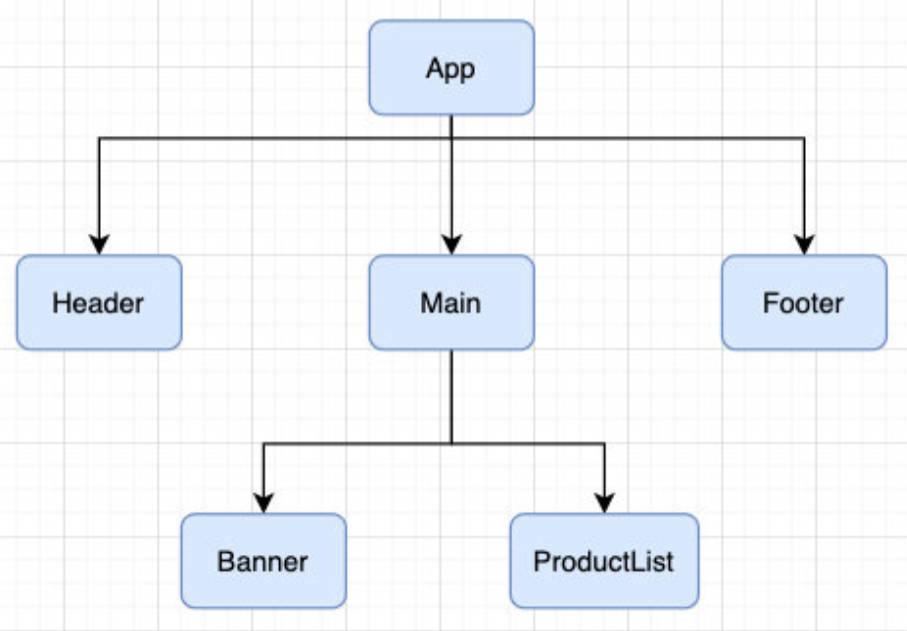
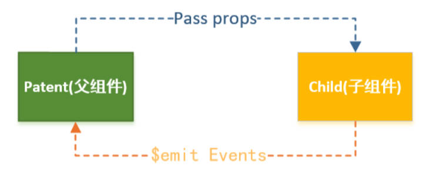
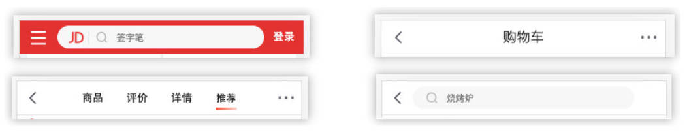
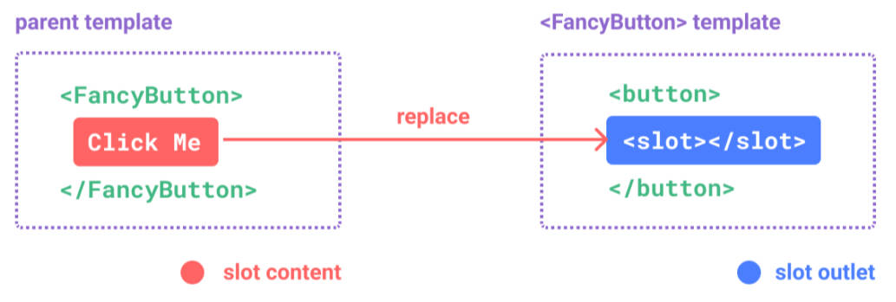
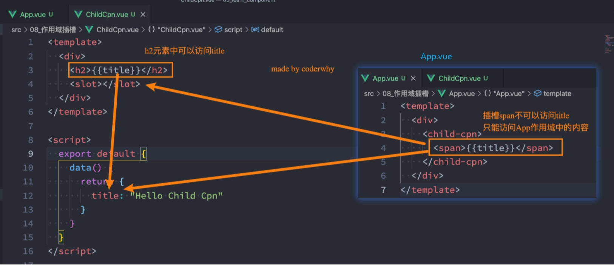

# 组件嵌套

如何理解组件的嵌套和拆分。

1. 如果我们一个应用程序将所有的逻辑都放在一个组件中，那么这个组件就会变成非常的臃肿和难以维护；
2. 所以组件化的核心思想应该是对组件进行拆分，拆分成一个个小的组件；
3. 再将这些组件组合嵌套在一起，最终形成我们的应用程序；



------

组件化开发的基本实现。

父组件 App.vue

```vue
<template>
  <div id="app">
    <Header></Header>
  </div>
</template>
<script>
import Header from "./Header.vue";
export default {
  components: {
    Header
  },
};
</script>
<style scoped>
</style>
```

子组件 Header.vue

```vue
<template>
  <div class="header">
    <h2>Header</h2>
    <h2>NavBar</h2>
  </div>
</template>
<script>
export default {};
</script>
<style scoped>
</style>
```

> 组件 template 如果没有根组件，vue3 会自动包裹一个 fragment。
>
> 组件化开发引入模块的注意事项2点：
>
> 1. vue cli 已经帮我们配置好了 webpack 中 extensions 后缀名。
> 2. 但是，引入 vue 组件时，还是推荐加上后缀名 `.vue` ，好处是：模板语法中引入有提示。并且可以做快速跳转。

-----

# 组件通信

组件通信的场景有哪些？

- 比如 App 可能使用了多个 Header，每个地方的 Header 展示的内容不同，那么我们就需要在 App 中传递给 Header 一些数据，让其进行展示；
- 又比如我们在 Main 中一次性请求了 Banner 数据和 ProductList 数据，那么就需要传递给它们来进行展示；
- 也可能是子组件中发生了事件，需要由父组件来完成某些操作，那就需要子组件向父组件传递事件；

-----

理解父子组件通信的方式。

- 父组件传递给子组件：通过 `props` 属性；
- 子组件传递给父组件：通过 `$emit` 触发事件（可携带参数）；



-----

## 父组件传子组件

父组件传递给子组件如何实现？

- 在开发中父子组件之间通信很常见，比如父组件有一些数据，需要子组件来进行展示：
	- 这个时候我们可以通过 props 来完成组件之间的通信；
- 什么是 props 呢？
	- props 是你可以在组件上注册一些自定义的 attribute；
	- 父组件给这些 attribute 赋值，子组件通过 attribute 的名称获取到对应的值；

props 的2种写法。

- 字符串数组，数组中的字符串就是 attribute 的名称；
- 对象类型，对象类型我们可以在指定 attribute 名称的同时，指定它需要传递的类型、是否是必须的、默认值等等；
	- 基本用法。
	- props 对象写法 type 为 引用类型，如 Object, Array, Fuction 时，默认值 default 的写法。
	- props 对象写法的自定义验证 validator 写法。

父组件 App.vue

```vue
<template>
  <!-- 1.展示 zzt 的个人信息 -->
  <show-info name="zzt" :age="18" :height="1.88" />
  <!-- 2.展示 kobe 的个人信息 -->
  <show-info name="kobe" :age="30" :height="1.87" />
  <!-- 3.展示默认的个人信息 -->
  <show-info name="Lingard" :age="100" />
</template>
<script>
  import ShowInfo from './ShowInfo.vue'
  export default {
    components: {
      ShowInfo
    }
  }
</script>
<style scoped>
</style>
```

子组件 Showinfo.vue

```vue
<template>
  <div class="infos">
    <h2>姓名: {{ name }}</h2>
    <h2>年龄: {{ age }}</h2>
    <h2>身高: {{ height }}</h2>
    <h2>Message: {{ showMessage }}</h2>
  </div>
  <div class="others" v-bind="$attrs"></div>
</template>
<script>
  export default {
    // props 作用: 接收父组件传递过来的属性
    // 1.props 数组语法；弊端: 1.不能对类型进行验证 2.没有默认值的
    props: ["name", "age", "height"]
    // 2.props 对象语法(必须掌握)
    props: {
      // 2.1. 基本用法
			height: Number,
      age: [String, Number],
      name: {
        type: String,
        default: "我是默认name",
        required: true
      },
      // 2.2. 引用类型默认值 default 用法：需要编写 default 的工厂函数, 函数返回默认值
      friend: {
        type: Object,
        default() {
          return { name: "james" }
        }
				// default: () => ({name: 'james'}) - 无需绑定 this 的话，也可以这么写
      },
      hobbies: {
        type: Array,
        default: () => ['唱', '跳', 'rap'， "篮球"]
      },
      showMessage: {
        type: Function,
        default() { // 此时，default 函数即为默认值。
          return '我是 show message'
        }
      },
      // 2.3. 自定义验证的写法
      msg: {
        type: "String",
        validator(value) {
          return ["success", "warnning", "danger"].includes(value);
        },
      }
    }
  }
</script>
<style scoped>
</style>
```

-----

props 对象写法 type 的类型有哪些

- String
- Number
- Boolean
- Array
- Object
- Date
- Function
- Symbol

-----

props 名命的大小写的注意事项

1. HTML 中的 attribute 是大小写不敏感的。浏览器解析原生 HTML 会把所有大写字符解释为小写字符。
2. 在 vue 工程化项目打包中， vue-loader 会解析大小写驼峰语法，可写成驼峰。

```vue
<show-info show-message="哈哈哈" />
<show-info showMessage="哈哈哈" />
```

-----

什么是非 prop 的 attribute？

1. 当我们传递某个属性给子组件，但是该属性并没有在子组件中定义对应的 props 或者 emits 时，称之为非 prop 的 attribute。
2. 常见的包括 class, style, id 属性等。

非 prop 的 attribute 的处理方式3种

- 当子组件有单个根节点时，非 prop 的 attribute 将自动添加到根节点的 attribute 中。

- 若不希望子组件的根节点继承 attribute，在子组件中设置 `inheritAttrs: false`，通过 `$attrs` 来访问所有的非 prop 的 attribute。

  ```vue
  <tenplate>
  	<div>
      <h2 :class="$attrs.class">title</h2>
    </div>
  </tenplate>
  <script>
  	export default {
      inheritAttrs: false,
    }
  </script>
  ```

- 当子组件有多个根节点时，需要通过 `$attrs` 设置继承属性的节点，否则会报警告。

  父组件 App.vue

  ```vue
  <show-message class="zzt" />
  ```

  子组件 showMessage.vue

  ```vue
  <tenplate>
    <h2>title1</h2>
    <h2 :class="$attrs.class">title2</h2>
    <h2>title3</h2>
  </tenplate>
  ```

-----

## 子组件传父组件

子组件传父组件的场景。

- 子组件有事件发生，需要父组件处理。
- 子组件有一些内容要传递给父组件。

3个步骤。（代码实现）

1. 在子组件中使用 emits 定义好在某些情况下触发的事件名称。
2. 在父组件中以 v-on 的方式绑定要监听的事件名称，并传入到对应的方法中。
3. 在子组件发生某个事件的时候，根据事件名触发事件。

父组件 App.vue

```vue
<template>
  <div class="app">
    <h2>当前计数: {{ counter }}</h2>
    <!-- 1.自定义 add-counter, 并且监听内部的 add 事件 -->
    <add-counter @addBtnClick="handleAddBtnClick"></add-counter>
  </div>
</template>
<script>
  import AddCounter from './AddCounter.vue'
  export default {
    components: {
      AddCounter
    },
    data() {
      return {
        counter: 0
      }
    },
    methods: {
      handleAddBtnClick(count) {
        this.counter += count
      }
    }
  }
</script>
<style scoped>
</style>
```

子组件 AddCounter.vue

```vue
<template>
  <div class="add">
    <button @click="btnClick(1)">+1</button>
    <button @click="btnClick(5)">+5</button>
    <button @click="btnClick(10)">+10</button>
  </div>
</template>
<script>
  export default {
    // 1.emits 数组语法
    emits: ["addBtnClick"],
    // 2.emmits 对象语法，用于做参数验证。
    emits: {
      addBtnClick: function(count) {
				return count <= 10
      }
    },
    methods: {
      btnClick(count) {
        console.log("btnClick:", count)
        this.$emit("addBtnClick", 100) // 让子组件发出去一个自定义事件，第一个参数自定义的事件名称，之后的参数是传递的参数
      }
    }
  }
</script>
<style scoped>
</style>
```

> emits 的规范写法：在 options 属性 emits 中注册事件，不注册父组件也可以监听，但按照规范还是需要注册。
>

-----

# TabBar 案例练习

tabbar 案例练习。

父组件 App.vue

```vue
<template>
  <div class="app">
    <!-- 1.tab-control -->
    <tab-control :titles="['衣服', '鞋子', '裤子']"
                 @tab-item-click="tabItemClick"/>
    <!-- 2.展示内容 -->
    <h1>{{ pageContents[currentIndex] }}</h1>
  </div>
</template>
<script>
  import TabControl from './TabControl.vue'
  export default {
    components: {
      TabControl
    },
    data() {
      return {
        pageContents: [ "衣服列表", "鞋子列表", "裤子列表" ],
        currentIndex: 0 // 用于控制要展示的内容
      }
    },
    methods: {
      tabItemClick(index) {
        console.log("app:", index)
        this.currentIndex = index
      }
    }
  }
</script>
<style scoped>
</style>
```

子组件 TabControl.vue

```vue
<template>
  <div class="tab-control">
    <template v-for="(item, index) in titles" :key="item">
      <div class="tab-control-item"
           :class="{ active: index === currentIndex }"
           @click="itemClick(index)">
        <span>{{ item }}</span>
      </div>
    </template>
  </div>
</template>
<script>
  export default {
    props: {
      titles: {
        type: Array,
        default: () => []
      }
    },
    data() {
      return {
        currentIndex: 0 // 用于控制子组件内的样式
      }
    },
    emits: ["tabItemClick"],
    methods: {
      itemClick(index) {
        this.currentIndex = index
        this.$emit("tabItemClick", index)
      }
    }
  }
</script>
<style scoped>
  .tab-control {
    display: flex;
    height: 44px;
    line-height: 44px;
    text-align: center;
  }
  .tab-control-item {
    flex: 1;
  }
  .tab-control-item.active {
    color: red;
    font-weight: 700;
  }
  .tab-control-item.active span {
    border-bottom: 3px solid red;
    padding: 8px;
  }
</style>
```

-----

# 认识插槽

认识插槽 Slot

- 为了让子组件具备更强的通用性，我们不能将子组件中的内容限制为固定的 div、span 等等这些元素；
- 比如某种情况下我们使用组件，希望组件显示的是一个按钮，某种情况下我们使用组件希望显示的是一张图片；
- 我们应该让使用者可以决定某一块区域到底存放什么内容和元素；
- 举个栗子：假如我们定制一个通用的导航组件 - NavBar
	- 这个组件分成三块区域：左边-中间-右边，每块区域的内容是不固定；
	- 左边区域可能显示一个菜单图标，也可能显示一个返回按钮，可能什么都不显示；
	- 中间区域可能显示一个搜索框，也可能是一个列表，也可能是一个标题，等等；
	- 右边可能是一个文字，也可能是一个图标，也可能什么都不显示；



-----

## 基本使用

使用插槽的原则；

- 插槽的使用过程其实是抽取共性、预留不同；
- 我们会将共同的元素、内容依然在组件内进行封装；
- 同时会将不同的元素使用 slot 作为占位，让外部决定到底显示什么样的元素；

如何使用插槽，基本使用。

- Vue 中将 `<slot>` 元素作为承载分发内容的出口；
- 在封装组件中，使用特殊的元素 \<slot\> 就可以为封装组件开启一个插槽；
- 该插槽插入什么内容取决于父组件如何使用；



-----

插槽的基本使用，插入元素/组件。

父组件 App.vue

```vue
<template>
	<MySlotCpn>
		<!-- 插入多个内容 -->
		Hello Frog <!-- 插入普通内容 -->
		<button>我是按钮</button> <!-- 插入html元素 -->
		<MyCpn></MyCpn> <!-- 插入组件 -->
	</MySlotCpn>
</template>
```

子组件 MySlotCpn.vue

```vue
<template>
	<h2>MySlotCpn开始</h2>
	<slot></slot>
	<h2>MySlotCpn结束</h2>
</template>
```

使用组件时插入多个内容，对应一个插槽，

- 多个内容作为整体会派发1份到这个插槽中。

使用组件时插入多个内容，对应 n 个插槽，

- 多个内容作为整体会派发 n 份到每个插槽中。

------

## 插槽的默认内容

展示插槽的默认内容。没有提供插入的内容时，才会显示。

父组件 App.vue

```vue
<template>
	<MySlotCpn></MySlotCpn>
</template>
```

子组件 MySlotCpn.vue

```vue
<template>
	<h2>MySlotCpn 开始</h2>
	<slot>
  	<h2>默认内容</h2>
  </slot>
	<h2>MySlotCpn 结束</h2>
</template>
```

-----

## 具名插槽的使用

具名插槽的使用。默认插槽名是什么？

- 在多个内容派发到插槽时，我们希望达到多个内容与多个插槽一一对应的效果，这个时候就可以使用具名插槽。
- 具名插槽顾名思义就是给插槽起一个名字，\<slot\> 元素有一个特殊的 attribute：`name`； 
- 一个不带 name 的 slot，会带有隐含的名字 `default`；

父组件 App.vue

```vue
<temeplate>
	<NavBar>
  	<template v-slot:left> <!-- #left -->
			<button>左边的按钮</button>
    </template>
  	<template #center> <!-- #center -->
			<h2>中间的标题</h2>
    </template>
  	<template #right> <!-- #right -->
			<i>右边的元素</i>
    </template>
  </NavBar>
</temeplate>
```

> 具名插槽的语法糖写法。`v-slot:` 语法塘是 `#`

子组件 NavBar.vue

```vue
<template>
	<div>
		<!-- 不带 name 的 slot 会隐式带有`name="default"` -->
    <slot name="left"></slot>
  </div>
	<div>
    <slot name="center"></slot>
  </div>
	<div>
    <slot name="right"></slot>
  </div>
</template>
```

-----

## 动态插槽名的使用

动态绑定插槽的名称用 `[]` 实现，代码实现。

父组件 App.vue

```vue
<temeplate>
	<NavBar :slotName="slotName">
  	<template v-slot:[slotName]>
			<button>左边的按钮</button>
    </template>
  </NavBar>
</temeplate>
<script>
import NavBar from './NavBar.vue'
export default {
  components: { NavBar }
  data() {
    return {
      slotName: 'zzt'
    }
  }
}
</script>
```

子组件 NavBar.vue

```vue
<template>
	<div>
    <slot :name="slotName"></slot>
  </div>
</template>
<script>
export default {
  props: ['slotName']
}
</script>
```

-----

## 作用域插槽的使用

插槽渲染作用域的理解。

1. 父模板里所有内容都是在父作用域中编译的；
2. 子模版里所有内容都是在子作用域中编译的；

与插槽结合如何理解：封装的组件（子组件）data 中定义的变量，不能在使用的组件（父组件）中访问。以下写法是错误的。



-----

认识作用域插槽。基本使用案例理解。

- 核心：将子组件中的数据传递给父组件的插槽来使用。
- 场景：当一个组件被用来渲染一个数组元素时，我们使用插槽，并且希望插槽中没有显示每项的内容（显示的内容由外界决定）

父组件 App.vue

```vue
<template>
  <div class="app">
    <!-- 1.tab-control，没插入内容，即使用默认插槽 -->
    <tab-control :titles="['衣服', '鞋子', '裤子']" 
                 @tab-item-click="tabItemClick"/>
    <!-- 2.展示内容 -->
    <h1>{{ pageContents[currentIndex] }}</h1>
    
    <!-- 1.tab-control: button 使用插槽，改变子组件中展示内容的标签 -->
    <tab-control :titles="['衣服', '鞋子', '裤子']" 
                 @tab-item-click="tabItemClick">
      <template v-slot:default="props">
        <button>{{ props.item }}</button><!-- 展示的内容为 button -->
      </template>
    </tab-control>
    <!-- 2.tab-control: a元素 使用插槽 改变子组件中展示内容的标签-->
    <tab-control :titles="['衣服', '鞋子', '裤子']" 
                 @tab-item-click="tabItemClick">
      <template #default="props">
        <a href="#">{{ props.item }}</a><!-- 展示的内容为 a 超文本连接 -->
      </template>
    </tab-control>
    <!-- 3.使用默认插槽的简写，作用域插槽省略插槽名传参。 -->
    <tab-control :titles="['衣服', '鞋子', '裤子']" 
                 @tab-item-click="tabItemClick">
      <template v-slot="props">
        <button>{{ props.item }}</button>
      </template>
    </tab-control>
    <!-- 4.独占默认插槽的简写，省略 template，将作用域插槽传参放在组件标签上 -->
    <tab-control :titles="['衣服', '鞋子', '裤子']" 
                 @tab-item-click="tabItemClick"
                 v-slot="props">
      <button>{{ props.item }}</button>
    </tab-control>
  </div>
</template>
<script>
  import TabControl from './TabControl.vue'
  export default {
    components: {
      TabControl
    },
    data() {
      return {
        pageContents: [ "衣服列表", "鞋子列表", "裤子列表" ], // 模拟展示的内容
        currentIndex: 0
      }
    },
    methods: {
      tabItemClick(index) {
        console.log("app:", index)
        this.currentIndex = index
      }
    }
  }
</script>
<style scoped>
</style>
```

子组件 TabControl.vue

```vue
<template>
  <div class="tab-control">
    <template v-for="(item, index) in titles" :key="item">
      <div class="tab-control-item"
           :class="{ active: index === currentIndex }"
           @click="itemClick(index)">
        <slot :item="item" abc="cba"><!-- slot 将 attribute 作为参数传给父组件 -->
          <span>{{ item }}</span>
        </slot>
      </div>
    </template>
  </div>
</template>
<script>
  export default {
    props: {
      titles: {
        type: Array,
        default: () => []
      }
    },
    data() {
      return {
        currentIndex: 0
      }
    },
    emits: ["tabItemClick"],
    methods: {
      itemClick(index) {
        this.currentIndex = index
        this.$emit("tabItemClick", index)
      }
    }
  }
</script>
<style scoped>
  .tab-control {
    display: flex;
    height: 44px;
    line-height: 44px;
    text-align: center;
  }
  .tab-control-item {
    flex: 1;
  }
  .tab-control-item.active {
    color: red;
    font-weight: 700;
  }
  .tab-control-item.active span {
    border-bottom: 3px solid red;
    padding: 8px;
  }
</style>
```

-----

默认插槽的作用域插槽传参的简写分析（3种情况）。

- 如果我们使用的插槽是默认插槽 default，那么在使用作用域插槽传参的时候 `v-slot:default="slotProps"` 可以简写为 `v-slot="slotProps"`： 亦或者 `#default="slotProps"`

  ```vue
  <tab-control :titles="['衣服', '鞋子', '裤子']"
               @tab-item-click="tabItemClick">
    <template v-slot="slotProps">
      <button>{{ slotProps.item }}</button>
    </template>
  </tab-control>
  ```

独占默认插槽简写形式。

- 如果我们在父组件中使用的插槽，只有默认插槽，那么我么使用的是独占默认插槽，可省略 template，将作用域插槽传参放在组件标签上，这样，我们就可以将 v-slot 直接用在组件上：

  ```vue
  <tab-control :titles="['衣服', '鞋子', '裤子']" 
               @tab-item-click="tabItemClick"
               v-slot="slotProps">
    <button>{{ slotProps.item }}</button>
  </tab-control>
  ```

混合使用

- 在父组件中使用插槽时，默认插槽和具名插槽混合使用，须要始终为所有的插槽使用完整的基于 \<template\> 的语法：

  ```vue
  <tab-control :titles="['衣服', '鞋子', '裤子']"
               @tab-item-click="tabItemClick">
    <template v-slot="slotProps">
      <button>{{ slotProps.item }}</button>
    </template>
    <template #zzt="slotProps">
    	{{slotProps.item}}
    </template>
  </tab-control>
  ```

  


  