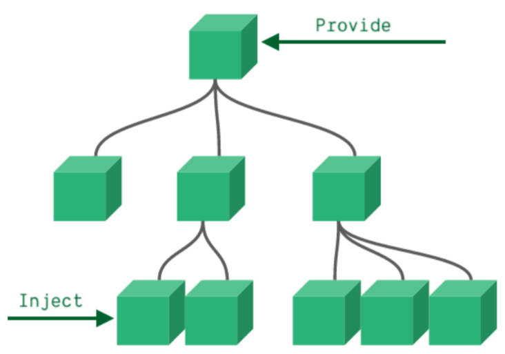
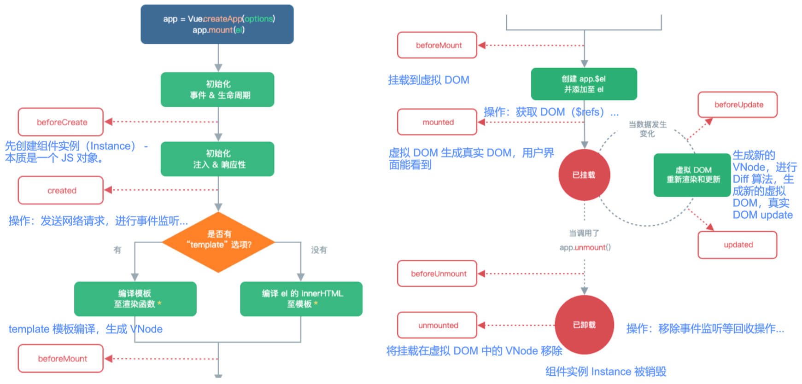

# 非父子组件通信

非父子组件通信两种方式。

- Provide / Inject
- Mitt 全局事件总线

## Provide & Inject

provide 和 inject 使用的场景：

- 深度嵌套的组件，子组件想要获取父组件中的内容。
- 用的不多，一般会用状态管理插件（Vuex，Pinia）替代这种方案。



provide 和 inject 如何使用 3 点描述：

1. 无论层级结构多深，父组件都可以作为其所有子组件的依赖提供者。
2. 父组件用 provide 选项提供数据。
3. 子组件用 inject 选项使用数据。

provide 和 inject 可看作 “long range props”，2 点理解。

1. 父组件不需要知道哪些子组件使用 provide 的 properties。
2. 子组件不需要知道 inject 的 properties 来自哪里。

Provide / Inject 基本使用；provide 的函数写法；处理响应式数据（需要解包）。

父组件：App.vue

```vue
<template>
  <div class="app">
    <home></home>
    <h2>App: {{ message }}</h2>
    <button @click="message = 'hello world'">修改message</button>
  </div>
</template>

<script>
import { computed } from 'vue'
import Home from './Home.vue'

export default {
  components: {
    Home
  },
  data() {
    return {
      message: 'Hello App'
    }
  },
  provide: {
    // 基本用法
    name: 'zzt',
    age: 18
  },
  provide() {
    // 函数写法，一般都用这种写法，在 provide 中使用 this 拿到 data 中的数据
    return {
      name: 'zzt',
      age: 18,
      message: computed(() => this.message) // 将 this.message 设置为响应式的数据，
    }
  }
}
</script>
```

> 不能在对象写法的 provide 中使用 this，因为 vue 的 sfc 文件中，\<script\> 标签中的代码会按照 Node 模块化打包，所以其中全局 this 指向 undefined。
>
> computed API 中传入的是 get 函数，并且要用箭头函数。
>
> computed 返回的是一个 ref 对象，需要使用 value 拿到值（解包）。

孙子组件：HomeBanner.vue

```vue
<template>
  <div class="banner">
    <h2>HomeBanner: {{ name }} - {{ age }} - {{ message.value }}</h2>
  </div>
</template>

<script>
export default {
  inject: ['name', 'age', 'message']
}
</script>
```

## 事件总线

事件总线的使用，

- 为了使框架功能专一，Vue3 移除了实例上的 `$on`, `$off`, `$once` 方法，官方推荐用第三方库实现全局事件总线，如 `mitt` 库或 `tiny-emitter` 库。

- 这里介绍 hy-event-store 库，它是一个轻量级的库，可以实现事件总线和状态管理的功能，

hy-event-store 基本使用

1. 安装 hy-evnet-store

   ```shell
   npm install hy-event-store
   ```

2. 实现事件总线中事件的监听和移除

   utils / event-bus.js

   ```js
   import { HYEventBus } from 'hy-event-store'

   const eventBus = new HYEventBus()
   export default eventBus
   ```

   上级组件 Category.vue

   ```vue
   <template>
     <div>
       <h2>Category</h2>
     </div>
   </template>

   <script>
   import eventBus from './utils/event-bus'

   export default {
     methods: {
       zztEventHandler(name, age, height) {
         console.log('zztEvent 在 category 中监听', name, age, height)
       }
     },
     created() {
       eventBus.on('zztEvent', this.zztEventHandler) // 监听（注册）事件
     },
     unmounted() {
       // 规范写法：有注册，一定有卸载。
       eventBus.off('zztEvent', this.zztEventHandler) // 移除（卸载）事件
     }
   }
   </script>
   ```

   下级组件 HomeBanner.vue

   ```vue
   <template>
     <div class="banner">
       <button @click="bannerBtnClick">banner按钮</button>
     </div>
   </template>

   <script>
   import eventBus from './utils/event-bus'

   export default {
     methods: {
       bannerBtnClick() {
         eventBus.emit('zztEvent', 'zzt', 18, 1.88) // 派发事件
       }
     }
   }
   </script>
   ```

# 生命周期

认识生命周期。

1. 生物学上，生物生命周期指得是一个生物体在生命开始到结束周而复始所历经的一系列变化过程；
2. 在 Vue 中每个组件都可能会经历从创建、挂载、更新、卸载等一系列的过程；
3. 在这个过程中的某一个阶段，我们可能会想要添加一些属于自己的代码逻辑（比如组件创建完后就请求一些服务器数据）；
4. 但是我们如何可以知道目前组件正在哪一个过程呢？Vue 给我们提供了组件的生命周期函数；



生命周期函数是什么。

1. 生命周期函数是一些钩子函数（回调函数），在某个时间会被 Vue 源码内部进行回调；
2. 通过对生命周期函数的回调，我们可以知道目前组件正在经历什么阶段；
3. 那么我们就可以在该生命周期中编写属于自己的逻辑代码了；

基本使用

```vue
<script>
export default {
  // 1.组件被创建之前
  beforeCreate() {
    console.log('beforeCreate')
  },
  // 2.组件被创建完成
  created() {
    console.log('created')
    console.log('1.发送网络请求, 请求数据')
    console.log('2.监听 eventbus 事件')
    console.log('3.监听 watch 数据')
  },
  // 3.组件 template 准备被挂载
  beforeMount() {
    console.log('beforeMount')
  },
  // 4.组件 template 被挂载: 虚拟 DOM -> 真实 DOM
  mounted() {
    console.log('mounted')
    console.log('1.获取 DOM')
    console.log('2.使用 DOM')
  },
  // 5.数据发生改变
  // 5.1. 准备更新 DOM
  beforeUpdate() {
    console.log('beforeUpdate')
  },
  // 5.2. 更新 DOM
  updated() {
    console.log('updated')
  },
  // 6.卸载 VNode -> DOM 元素
  // 6.1.卸载之前
  beforeUnmount() {
    console.log('beforeUnmount')
  },
  // 6.2.DOM 元素被卸载完成
  unmounted() {
    console.log('unmounted')
    console.log('移除 eventbus 事件监听')
  }
}
</script>
```

# 在 Vue 中获取 DOM 对象

在 Vue 开发中不推荐进行原生 DOM 操作；

1. 如果一定要获取 DOM。这个时候，我们可以给元素或者组件绑定一个 `ref` 的 attribute 属性；
2. 再通过 `this.$refs` 来获取元素 DOM 对象。

$refs 的使用步骤：

1. 给元素或组件绑定一个 `ref` 的 attribute。
2. 在组件实例中使用 $refs，它是一个对象，持有注册过 ref attribute 的所有 DOM 元素和子组件实例。
3. 元素会返回它本身，组件会返回一个 Proxy 且可以访问其中 data 定义的变量，调用 methods 中的方法。

父组件 App.vue

```vue
<template>
  <div class="app">
    <h2 ref="title" class="title" :style="{ color: titleColor }">{{ message }}</h2>
    <button ref="btn" @click="changeTitle">修改title</button>
    <banner ref="banner" />
  </div>
</template>

<script>
import Banner from './Banner.vue'

export default {
  components: {
    Banner
  },
  data() {
    return {
      message: 'Hello World',
      titleColor: 'red'
    }
  },
  methods: {
    changeTitle() {
      // 1.在 Vue 中，不要使用原生方法去获取 DOM，并且修改 DOM 内容
      /* const titleEl = document.querySelector('.title')
				title.textContent = '你好啊，李银河' */

      // 2.获取 h2/button DOM 对象
      console.log(this.$refs.title)
      console.log(this.$refs.btn)

      // 3.获取 banner 组件: 组件实例
      console.log(this.$refs.banner)
      // 3.1.在父组件中可以主动的调用子组件的对象方法
      this.$refs.banner.bannerClick()
      // 3.2.获取 banner 中的根元素
      console.log(this.$refs.banner.$el)
      // 3.3.如果 banner template 是多个根, 拿到的是第一个 node 节点，一般是 text 文本节点，需要通过元素导航去拿到多个根节点中的某一个。
      console.log(this.$refs.banner.$el.nextElementSibling)
      // 注意: 开发中不推荐一个组件的 template 中有多个根元素

      // 4.组件实例还有两个属性(了解):
      console.log(this.$parent) // 获取父组件
      console.log(this.$root) // 获取根组件
    }
  }
}
</script>
```

> 理解组件和组件实例（Instance）的关系，会不会出现一个组件有多个父组件的情况？
>
> - 不会，我们写一个.vue 组件，是在写一个组件描述，真正使用时，会创建出一个组件实例。
> - 组件实例，不等于组件导出的对象，Vue 通过导出的对象创建组件实例 Instance，组件导出的对象的功能类似于 class 类。

子组件 Banner.vue

```vue
<template>
  <div class="banner">
    <h2>Banner</h2>
  </div>
</template>

<script>
export default {
  methods: {
    bannerClick() {
      console.log('bannerClick')
    }
  }
}
</script>
```

`$parent` 和 `$root` 的使用。Vue3 中已移除 `$children`。

- $parent：用来访问父组件。
- $root：用来访问根组件。

不推荐使用，使用时耦合性太强。

# 内置 Component 组件

在学习路由（router）之前，切换组件的 2 种方式。

1. 通过 v-if 来判断，显示不同组件。
2. 动态组件（内置组件 Component）的方式

内置动态组件 Component 的使用。组件通信与普通父子组件无差别。

- 通过一个特殊的 attribute `is` 来实现。
- is 最好使用 v-bind 动态绑定，它的值可以是 2 种。
  - 注册的全局组件名。
  - 注册的局部组件名。

父组件 App.vue

```vue
<script>
import Home from './views/Home.vue'
import About from './views/About.vue'
import Category from './views/Category.vue'

export default {
  components: {
    Home,
    About,
    Category
  },
  data() {
    return {
      tabs: ["home", "about", "category"],
      currentIndex: 0
      currentTab: "home"
    }
  },
  methods: {
    itemClick(tab, index) {
      this.currentTab = tab
      this.currentIndex = index
    },
    homeClick(payload) {
      console.log("homeClick:", payload)
    }
  }
}
</script>

<template>
  <div class="app">
    <div class="tabs">
      <template v-for="(item, index) in tabs" :key="item">
        <button :class="{ active: currentTab === item }" @click="itemClick(item, index)">
          {{ item }}
        </button>
      </template>
    </div>
    <div class="view">
      <!-- 1.第一种做法: v-if 进行判断逻辑, 决定要显示哪一个组件 -->
      <template v-if="currentIndex === 0">
        <home></home>
      </template>
      <template v-else-if="currentIndex === 1">
        <about></about>
      </template>
      <template v-else-if="currentIndex === 2">
        <category></category>
      </template>
      <!-- 2.第二种做法: 动态组件 component -->
      <!-- is 中的组件需要来自两个地方: 1.全局注册的组件 2.局部注册的组件 -->
      <!-- <component :is="tabs[currentIndex]"></component> -->
      <component name="zzt" :age="18" @homeClick="homeClick" :is="currentTab"> </component>
    </div>
  </div>
</template>
<style scoped>
.active {
  color: red;
}
</style>
```

> is="xxx"，推荐小写加短横线的写法，vue-loader 下大写也可以

子组件 Home.vue

```vue
<script>
export default {
  props: {
    name: {
      type: String,
      default: ''
    },
    age: {
      type: Number,
      default: 0
    }
  },
  emits: ['homeClick'],
  methods: {
    homeBtnClick() {
      this.$emit('homeClick', 'home')
    }
  }
}
</script>

<template>
  <div>
    <h2>Home组件: {{ name }} - {{ age }}</h2>
    <button @click="homeBtnClick">homeBtn</button>
  </div>
</template>

<style scoped></style>
```

> 使用 component 时，父子组件通信的方式与之前的不变

# 内置 keep-alive 组件

内置 keep-alive 组件的使用场景。

- 默认情况下，组件切换后会被销毁，切换回来会重新创建组件；
- 如果希望保持组件的状态，则需要使用 keep-alive。

父组件 App.vue

```vue
<script>
import Home from './views/Home.vue'
import About from './views/About.vue'
import Category from './views/Category.vue'

export default {
  components: {
    Home,
    About,
    Category
  },
  data() {
    return {
      tabs: ['home', 'about', 'category'],
      currentTab: 'home'
    }
  },
  methods: {
    itemClick(tab) {
      this.currentTab = tab
    }
  }
}
</script>

<template>
  <div class="app">
    <div class="tabs">
      <template v-for="(item, index) in tabs" :key="item">
        <button :class="{ active: currentTab === item }" @click="itemClick(item)">
          {{ item }}
        </button>
      </template>
    </div>
    <div class="view">
      <!-- include: 组件的名称来自于组件定义时 name 选项，逗号后不能加空格 -->
      <keep-alive include="home,about">
        <component :is="currentTab"></component>
      </keep-alive>
    </div>
  </div>
</template>

<style scoped>
.active {
  color: red;
}
</style>
```

子组件 Home.vue

```vue
<script>
export default {
  name: 'home',
  data() {
    return {
      counter: 0
    }
  },
  created() {
    console.log('home created')
  },
  unmounted() {
    console.log('home unmounted')
  },
  // 对于保持 keep-alive 组件, 监听有没有进行切换，keep-alive 组件进入活跃状态
  activated() {
    console.log('home activated')
  },
  deactivated() {
    console.log('home deactivated')
  }
}
</script>

<template>
  <div>
    <h2>Home组件</h2>
    <h2>当前计数: {{ counter }}</h2>
    <button @click="counter++">+1</button>
  </div>
</template>

<style scoped></style>
```

keep-alive 的属性

- include - string | RegExp | Array。只有名称匹配的组件会被缓存；
- exclude - string | RegExp | Array。任何名称匹配的组件都不会被缓存；
- max - number | string。最多可以缓存多少组件实例，一旦达到这个数字，那么缓存组件中最近没有被访问的实例会被销毁；

> keep-alive 中属性 include / exclude 实际上匹配的是组件中设置属性 `name` 选项值。

对于 keep-alive 缓存的组件来说，再次进入时，是不会执行 created 或者 mounted 等生命周期函数的：

- 但是有时候我们确实希望监听到何时重新进入到了组件，何时离开了组件；
- 这个时候我们可以使用 `activated` 和 `deactivated` 这两个生命周期钩子函数来监听；

# webpack 代码分包

webpack 的代码分包理解。

1. 默认情况下，在构建整个组件树的过程中，组件之间通过模块化直接依赖。
2. webpack 在打包时会将组件模块打包到一起（比如一个 `app.js` 文件），将第三方库打包到一起（比如一个 `chunk-vendors.js` 文件）。

webpack 分包的使用场景：

- 随着项目的不断庞大，app.js 文件内容过多，会造成首屏渲染速度变慢的问题。

webpack 代码分包的好处：

1. 对一些不需要立即使用的组件，可以单独将它们拆分成一些小的代码块 `chunk.js`。
2. 这些 `chunk.js` 会在需要时，从服务器下载，并运行代码，显示对应的内容。

打包后的 dist 目录理解：

```
dist
	js
		app.fd14a7ae.js
		app.fd14a7ae.map
		chunk-2d0dda4d.88dfd768.js // 异步组件分包后生成的 js
		chunk-2d0dda4d.88dfd768.map // 异步组件分包后生成的 map，映射文件，source-map
		chunk-vendors.f9aa8ccb.js
		chunk-vendors.f9aa8ccb.map

```

webpack 代码分包的简单实现：在 JS 代码中使用 ESModule 的异步模块加载。

```javascript
import('./utils/math').then(res => console.log(res.sum(20, 30)))
```

# Vue 中实现异步组件

vue 中异步组件的使用场景：项目过大，对于某些组件我们希望通过异步的方式来进行加载，目的是可以对其进行分包处理。

vue 提供了一个函数：`defineAsyncComponent` 来实现异步组件加载。该函数接收 2 种类型的参数：

- 工厂函数，该工厂函数要返回一个 Promise 对象。
- 对象类型，对异步函数进行配置。

工厂函数：

```vue
<script>
import { defineAsyncComponent } from 'vue'

const AsyncHome = defineAsyncComponent(() => import('./AsyncHome.vue'))
export default {
  components: { AsyncHome }
}
</script>
```

对象类型：

```vue
<script>
import Loading from './Loading.vue'
import { defineAsyncComponent } from 'vue'

const AsyncHome = defineAsyncComponent({
  loader: () => import('./AsyncHome.vue'), // 工厂函数
  loadingComponent: Loading, // 正在加载时要展示的组件。
  errorComponent: Loading, // 加载出错时要展示的组件
  delay: 200, // 在显示 loadingComponent 之前的延迟 | 默认值：200（单位 ms）
  timeout: 3000, // 加载时间超过设定值，显示错误组件，默认值 infinity（即永不超时），单位 ms
  suspensible: false, // 定义组件是否可挂起 | 默认值：true
  /**
   * @param {*} error 错误信息对象
   * @param {*} retry 一个函数，用于指示当 promise 加载器 reject 时，加载器是否应该重试
   * @param {*} fail  一个函数，指示加载程序结束退出
   * @param {*} attempts 记录的尝试次数。
   */
  onError(error, retry, fail, attempts) {
    if (error.message.match(/fetch/) && attempts <= 3) {
      // 请求发生错误时重试，最多可尝试 3 次
      retry()
    } else {
      // 注意，retry/fail 就像 promise 的 resolve/reject 一样，必须调用其中一个才能继续错误处理。
      fail()
    }
  }
})
</script>
```

打包后的 dist 目录理解同上。

# Suspense 内置组件（实验性特性）

Suspense 是一个内置的全局组件，该组件有 2 个插槽并介绍：

- default：如果 default 可以显示，那么显示 default 的内容。
- fallback：如果 default 无法显示，那么显示 fallback 插槽的内容。

Suspense 与异步组件的结合使用：

```html
<template>
  <suspense>
    <!-- <template v-slot:default> -->
    <template #default>
      <AsyncCategory></AsyncCategory>
    </template>
    <template #fallback>
      <Loading></Loading>
    </template>
  </suspense>
</template>

<script>
  import Loading from './Loading.vue'
  import { defineAsyncComponent } from 'vue'

  const AsyncCategory = defineAsyncComponent(() => import('./AsyncCategory.vue'))
  export default {
    components: { AsyncCategory, Loading }
  }
</script>
```

# 组件 v-model

组件的 v-model 的使用。绑定多个属性。

1. 前面我们在 input 中可以使用 v-model 来完成双向绑定：

   - 这个时候 v-model 默认帮助我们完成了两件事； `v-bind:value` 的数据绑定和 `v-on:input` 的事件监听；

2. 如果我们现在封装了一个组件，其他地方在使用这个组件时，是否也可以使用 v-model 来同时完成这两个功能呢？
3. 也是可以的，vue 也支持在组件上使用 v-model；

## 基本使用：

父组件 App.vue

```vue
<template>
  <MyCpn v-model="message"></MyCpn>
  <!-- 等价于↓ -->
  <MyCpn :modelValue="message" @update:modelValue="newVal => (message = newVal)"></MyCpn>
</template>

<script>
import Mycpn from './MyCpn.vue'

export default {
  components: { MyCpn },
  data() {
    return { message: 'Hello Frog' }
  }
}
</script>
```

子组件 MyCpn.vue

```vue
<template>
  <imput :value="modelValue" @input="inputChange" />
</template>

<script>
export default {
  props: ['modelValue'],
  emits: ['update:modelValue'],
  methods: {
    inputChange(event) {
      this.$emit('update:modelValue', event.target.value)
    }
  }
}
</script>
```

## 使用 computed 处理

父组件 App.vue

```vue
<template>
  <MyCpn v-model="message"></MyCpn>
</template>

<script>
import Mycpn from './MyCpn.vue'

export default {
  components: { MyCpn },
  data() {
    return { message: 'Hello Frog' }
  }
}
</script>
```

子组件 MyCpn.vue

```vue
<template>
  <imput v-model="cpnModelValue" />
</template>

<script>
export default {
  props: ['modelValue'],
  emits: ['update:modelValue'],
  computed: {
    cpnModelValue: {
      get() {
        return this.modelValue
      },
      set(value) {
        this.$emit('update:modelValue', value)
      }
    }
  }
}
</script>
```

## 绑定多个值的使用：

App.vue

```vue
<template>
  <!-- 
		v-model:title 做了2件事：
      1.使用 v-bind 绑定了 title 属性。:title
      2.使用 v-on 监听了 update:title 的事件。@update:title=“newValue => title = newValue” 
  -->
  <MyCpn v-model="message" v-model:title="title"></MyCpn>
</template>

<script>
import Mycpn from './MyCpn.vue'

export default {
  components: { MyCpn },
  data() {
    return {
      message: 'Hello Frog',
      title: 'the title'
    }
  }
}
</script>
```

MyCpn.vue

```vue
<template>
  <imput v-model="cpnModelValue" />
  <input v-mode="cpnTitle" />
</template>

<script>
export default {
  props: ['modelValue', 'title'],
  emits: ['update:modelValue', 'update:title'],
  computed: {
    cpnModelValue: {
      get() {
        return this.modelValue
      },
      set(value) {
        this.$emit('update:modelValue', value)
      }
    },
    cpnTitle: {
      get() {
        return this.tilte
      },
      set(value) {
        this.$emit('update:title', value)
      }
    }
  }
}
</script>
```

# Mixin

## 使用场景：

- vue 项目的开发过程中，组件和组件之间有时会存在相同的代码逻辑，我们希望将相同的代码逻辑进行抽取，可以使用 Mixin
- Vue2 中使用 Mixin 进行相同逻辑的抽取，Vue3 用的很少，一般在 Composition API 中使用 Hooks 函数对相同逻辑进行抽取。

Mixin 的 3 点描述：

1. Mixin 用于分发 Vue 组件中可复用功能。
2. 一个 Mixin 对象可以包含任何组件选项 Options。
3. 当组件使用 Mixin 对象时，所有 Mixin 对象的选项将被混合进入该组件本身的选项中。

## 基本使用：

demoMixin.js

```javascript
export const demoMixin = {
  data() {
    return {
      message: 'Hello mixin',
      title: 'Mixin title'
    }
  },
  methods: {
    foo() {
      console.log('demo mixin foo')
    }
  },
  created() {
    console.log('执行了 demo mixin created')
  }
}
```

App.vue

```vue
<template>
  <h2>{{ message }}</h2>
  <button @click="foo">按钮</button>
</template>

<script>
import { demoMixin } from './mixins/demoMixin'

export default {
  mixins: [demoMixin]
}
</script>

<style scoped></style>
```

## 冲突合并的规则，

分 3 种情况：

1. 如果是 data 函数返回的对象属性产生冲突，保留组件自身的。
2. 如果是生命周期钩子函数产生冲突，会合并到数组中，都会被调用。
3. 如果是值为对象的选项（如 computed，methods），key 冲突，保留自身组件对象的键值对。

## 全局混入

全局混入的使用场景：

- 组件中的某些选项，是所有的组件都需要拥有的，那么将它们抽取出来，使用全局的 mixin。

全局混入的基本使用：

main.js

```javascript
import { createApp } from 'vue'
import App from './App.vue'

const app = createApp(App)
app.mixin({
  created() {
    console.log('global mixin created')
  }
})
app.mount('#app')
```

# extends

extends 的使用场景：

- 继承另外一个组件来做扩展，用的很少，在 Vue2 中一般也使用 mixin

extends 的基本使用

BasePage.vue

```vue
<script>
export default {
  data() {
    return {
      title: 'Hello BasePage'
    }
  },
  methods: {
    bar() {
      console.log('base page bar')
    }
  }
}
</script>
```

Home.vue

```vue
<template>
  <button @click="bar">Hoem 按钮</button>
</template>

<script>
import BasePage from './BasePage.vue'

export default {
  extends: BasePage,
  data() {
    return {}
  }
}
</script>
<style scoped></style>
```

# Composition API

Options API 的缺点，

- 对应的代码逻辑会被拆分到各个属性中，代码内聚性差，组件大时难以阅读和维护。

认识 Composition API

- 如果我们能将同一个逻辑关注点相关的代码收集在一起会更好。
- 这就是 Composition API 想要做的事情，以及可以帮助我们完成的事情。
- 也有人把 Vue Composition API 简称为 VCA。
- Vue 中的 Composition API 编写在 `setup` 函数里。
- setup 其实就是组件的另外一个选项：
  - 只不过这个选项强大到我们可以用它来替代之前所编写的大部分其他选项；
  - 比如 methods、computed、watch、data、生命周期等等；

## 认识 setup 函数。

setup 函数主要有 2 个参数：

1. `props`：Object 类型，父组件中传递过来的属性。它是**响应式的**，**不能使用解构语法**，除非使用 `toRefs`
   - `props`、`emits` 还是需要在选项 Options 中定义（`components` 属性也通过选项 Options 定义)，在 setup 函数中通过 props 参数获取，而不是 `this`
   - 在 template 中依然是可以正常去使用 props 中的属性。
2. `context`，Object 类型，称之为 SetupContext，它里面包含 3 个属性（可使用解构获取）：
   - `attrs`：所有非 prop 的 attribute。
   - `slots`：父组件传递过来的插槽，可用于 render 函数。
   - `emit`：发射事件时使用，而不是 this.$emit

> setup 函数中不允许使用 `this`
>
> 1. setup 被调用之前，data, computed, methods 等选项都没有被解析。
> 2. setup 函数调用时未绑定 this，所以它的 this 没有指向组件实例 Instance，而是 undefined。

setup 函数的返回值，可以用来做什么：

- 在模板 template 中使用（可代替 data, methods 等等选项中定义的内容）

基本使用，并使用 Hooks 体验抽取代码。

App.vue

```vue
<template>
  <div class="app">
    <h2>当前计数: {{ counter }}</h2>
    <!-- template 中 ref 对象自动解包 -->
    <button @click="increment">+1</button>
    <button @click="decrement">-1</button>
  </div>
</template>

<script>
import useCounter from './hooks/useCounter'

export default {
  setup() {
    return {
      ...useCounter()
    }
  }
}
</script>
<style></style>
```

useCounter.vue

```js
import { ref } from 'vue'

export default function useCounter() {
  // 定义 counter 默认不是响应式数据，需要使用 ref 将它变为响应式数据，方便在 tenplate 中使用。
  let counter = ref(100)
  const increment = () => counter.value++
  const decrement = () => counter.value--
  return { counter, increment, decrement }
}
```
