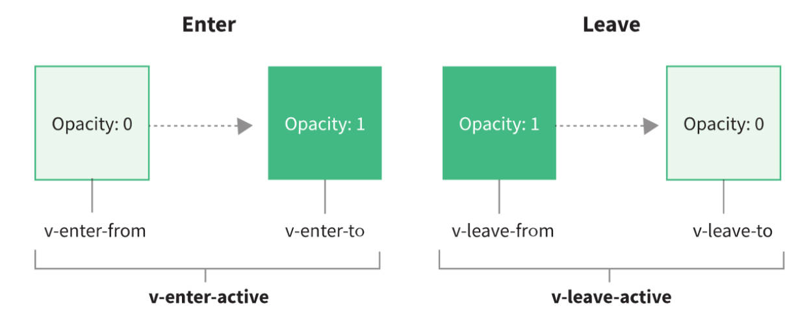

# Vue3实现动画-animate-gsap

## 一、认识框架中的动画

在开发中，我们想要给一个组件的显示和消失，添加某种过渡动画，可以很好的增加用户体验：

两大框架对动画的支持 2 点

- Vue 框架，中提供了内置的组件和对应的 API，来完成动画，利用它们可以方便的实现过渡和动画效果。
- React 框架，本身并没有提供动画相关的 API，需要使用第三方库 `react-transition-group`

> Vue 中的动画，不是现成的写好的动画；
>
> 而是将我们写好的类，在恰当的时机，添加到元素/组件上。

## 二、在 Vue 中实现动画效果

如果希望，单元素或者组件，实现动画，可以用 `transition` 内置组件完成。

## 三、transition 内置组件

Transition 过渡，用于完成动画

### 1.transition（过渡）完成动画

必须有 ”from“ 和 “to” 的 class 样式。

元素进入和离开的动画案例实现

```vue
<script>
export default {
  data() {
    return {
      isShow: true
    }
  }
}
</script>

<template>
  <div>
    <button @click="isShow = !isShow">显示/隐藏</button>
    <transition name="zzt">
      <h2 v-if="isShow">Hello Frog</h2>
    </transition>
  </div>
</template>

<style scoped>
.zzt-enter-from,
.zzt-leave-to {
  opacity: 0;
}
/* 可省略，是默认值↓ */
.zzt-enter-to,
.zzt-leave-from {
  opacity: 1;
}
.zzt-enter-active,
.zzt-leave-active {
  transition: opacity 1s ease;
}
</style>
```

### 2.transition 使用场景

transition 内置组件实现 组件/元素 进入和离开过渡的 3 个情形。

- 条件渲染（`v-if` / `v-show`）；
- 动态组件（`<Component>` 内置组件）。

> 为组件设置 v-if / v-show 指令，实际上设置在了组件的根节点上。

### 3.transition 工作机制

`<transition>` 内置组件的工作机制：

1. **自动嗅探**目标元素是否应用了 css 过渡/动画，如没有，那么在恰当的时间添加删除 css 类名。
2. 如果使用了 `<transition>` 提供的 JS 钩子函数，会在恰当时机被调用。
3. 如果没有找到 JS 钩子函数，且没检查到 css 过渡/动画，DOM 插入删除操作会立即执行。

### 4.name 属性（常用）

transition 中 class 的名命规则：

- 如果 `<transition>` 上没有限定 `name` 属性，那么默认以 `v-` 开头，如 `v-enter-from`。
- 有 `name` 属性，则以 `[name]-` 开头。

### 默认操作的 class

`<transition>` 中用于过度的 6 个 class，vue 会在适当时机添加/移除这些 class 之间来完成动画。

1. `v-enter-from`：定义进入过渡的开始状态，在元素被插入之前生效，在元素被插入之后的下一帧移除。
2. `v-enter-active`：定义过渡生效时的状态，在整个进入过渡的阶段中应用，在元素被插入之前生效，在过渡/动画完成之后移除。这个类可用来定义进入过渡的过程时间，延迟和曲线函数。
3. `v-enter-to`：定义进入过渡的结束状态，在元素被插入的下一帧生效（与此同时 `v-enter-from` 被移除），在过渡/动画完成后移除。
4. `v-leave-from`：定义离开过渡的开始状态，在离开过度被触发时立刻生效，下一帧被移除。
5. `v-leave-active`：定义离开过渡生效时的状态，在整个离开过渡的阶段中应用，在离开过渡被触发时立刻生效，在过渡/动画完成之后移除。这个类可以用来定义离开过渡的过程时间，延迟和曲线函数。
6. `v-leave-to`：离开过渡的结束状态，在离开过渡被触发后下一帧生效（与此同时 `v-leave-from` 被删除），在过渡/动画完成之后移除。

理解 transition 中 class 添加的时机图。



### 结合 css 序列帧（animation）完成动画

```vue
<script>
export default {
  name: '',
  data() {
    return {
      isShow: true
    }
  }
}
</script>

<template>
  <button @click="isShow = !isShow">显示/隐藏</button>
  <transition name="zzt">
    <h2 class="title" v-if="isShow">Hello Frog</h2>
  </transition>
</template>

<style scoped>
.app {
  width: 200px;
  margin: 0 auto;
}
.title {
  /* 行内元素（如 span）默认情况下是 inline，变化它的大小，宽度，高度，位移等等会有限制，需要将它变为inline-block 解除一些限制。*/
  display: inline-block;
}
.zzt-enter-active {
  animation: bounce 1s ease;
}
.zzt-leave-active {
  animation: bounce 1s ease reverse;
}
@keyframes bounce {
  0% {
    transform: scale(0);
  }
  50% {
    transform: scale(1.2);
  }
  100% {
    transform: scale(1);
  }
}
</style>
```

> transition 会根据元素/组件的锚点来执行动画，所以若动画效果夸张，需要调整它的样式。

### transition（过渡）和 animation（动画）同时使用

```vue
<script>
export default {
  name: '',
  data() {
    return {
      isShow: true
    }
  }
}
</script>

<template>
  <div class="app">
    <div>
      <button @click="isShow = !isShow">显示/隐藏</button>
    </div>
    <transition name="zzt">
      <h2 class="title" v-if="isShow">Hello Frog</h2>
    </transition>
  </div>
</template>

<style scoped>
.app {
  width: 200px;
  margin: 0 auto;
}
.title {
  display: inline-block;
}
/* transition 需要用到的 class */
.zzt-enter-from,
.zzt-leave-to {
  opacity: 0;
}
.zzt-enter-active,
.zzt-leave-active {
  transition: opacity 1s ease;
}
/* animation 需要用到的 class 和序列帧 */
.zzt-enter-active {
  animation: bounce 1s ease;
}
.zzt-leave-active {
  animation: bounce 1s ease reverse;
}
@keyframes bounce {
  0% {
    transform: scale(0);
  }
  50% {
    transform: scale(1.2);
  }
  100% {
    transform: scale(1);
  }
}
</style>
```

### type 属性（一般不用）

使用 transition 或 animation 其中的一个，vue 会自动识别类型并设置监听。

那么同时使用 transition 和 animation，vue 如何监听：（开发中避免这么做）

1. 这种情况下某一动画执行结束时，另一个动画还没结束。

2. 需要设置 `type` 属性为 `transition` 或 `animation` 来明确告知 Vue 监听的类型。以指定 type 的执行时间为准,

   ```vue
   <template>
     <transition name="zzt" type="animation">
       <h2 class="title" v-if="isShow">Hello Frog</h2>
     </transition>
   </template>
   ```

### duration 属性（一般不用）

transition 组件 `duration` 属性的使用场景，

- 显示的来指定过渡时间（开发中避免这么做）。

duration 可设置 2 种类型的值：

- Number 类型，同时设置进入和离开的过渡时间。

  ```vue
  <template>
    <transition name="zzt" :duration="1000">
      <h2 class="title" v-if="isShow">Hello Frog</h2>
    </transition>
  </template>
  ```

- Object 类型：分别设置进入和离开的过渡时间：

  ```vue
  <template>
    <transition name="zzt" :duration="{ enter: 800, leave: 1000 }">
      <h2 class="title" v-if="isShow">Hello Frog</h2>
    </transition>
  </template>
  ```

### mode 属性（常用）

transition 组件 `mode` 属性的使用场景，

- 默认情况下新老元素进入和离开过渡是同时发生的，如果不希望同时执行，需要设置 transition 的过渡模式。

mode 可设置的 2 个值：

- `in-out`：新元素先过渡进入，完成之后老元素过渡离开。
- `out-in`：老元素先过渡离开，完成之后新元素过渡进入（常用）。

```vue
<template>
  <transition name="zzt" mode="out-in">
    <h2 class="title" v-if="isShow">Hello Frog</h2>
    <h2 class="title" v-else>你好啊,李银河</h2>
  </transition>
</template>
```

### appear 属性

默认情况下，首次渲染是没有动画的，如果我们希望给首次渲染添加上动画，那么就可以添加属性`appear`

```vue
<script>
import Home from './pages/Home.vue'
import About from './pages/About.vue'

export default {
  components: {
    Home,
    About
  }
}
</script>

<template>
  <transition name="zzt" appear>
    <component :is="isShow ? 'Hone' : 'About'"></component>
  </transition>
</template>
```

### 自定义过渡 class 6 个

transition 内置组件，除了自动添加/移除特定的类名外，还可以通过 attribute 指定要添加/移除的类名；分别有以下 attribute：

- enter-from-class
- enter-active-class
- enter-to-class
- leave-from-class
- leave-active-class
- leave-to-class

**它们的优先级高于普通的类名**，多用于 Vue 的 transition 内置组件和其它第三方 css 动画库，如 `animate.css` 结合使用。

```vue
<template>
  <transition name="zzt" appear enter-from-class="abc">
    <component :is="isShow ? 'Hone' : 'About'"></component>
  </transition>
</template>
```

## animate.css 库

### 什么是 animate.css

animate.css 是一个准备好的、**跨平台的**动画库，其中帮我们定义了大量 css 动画相关的**序列帧**以及**类**，我们只需要添加类或使用序列帧实现动画即可。

### animate.css 使用步骤

1. 安装 animate.css

   ```shell
   npm install animate.css
   ```

2. 在 `main.js` 中引入 animate.css

   ```javascript
   import 'animate.css'
   ```

### 结合 transition 内置组件，基本使用

用法一：在 transition 内置组件上，使用 attribute 指定在特定时机要添加/移除的类：即 animate 库提供给我们的类。

```vue
<template>
  <transition
    enter-active-class="animate__animated animate__backInUp"
    leave-active-class="animate__animated animate__backOutRight"
  >
    <component :is="isShow ? 'home' : 'about'" />
  </transition>
</template>

<!-- script... -->

<style>
.animate__backOutRight {
  /* 离开时使用动画反转 */
  animation-direction: reverse;
}
</style>
```

用法二：结合 transition 内置组件在特定时机默认添加的类名，使用 animate 库中定义的 keyframes 动画。

```vue
<template>
  <button @click="isShow = !isShow">显示/隐藏</button>
  <transition name="zzt">
    <h2 class="title" v-if="isShow">Hello Frog</h2>
  </transition>
</template>

<!-- script... -->

<style scoped>
.app {
  width: 200px;
  margin: 0 auto;
}
.title {
  display: inline-block;
}
.zzt-enter-active {
  /*使用封装好的序列中 flip */
  animation: flip 1s;
}
.zzt-leave-active {
  /*离开时使用动画反转*/
  animation: flip 1s reverse;
}
</style>
```

## gsap 库

### 什么是 gsap 库

1. gsap 是 The GreenSock Animation Platform（GreenSock 动画平台）的缩写。
2. 它可以通过 JavaScript 为 css 属性，svg，canvas 等设置动画，并且是浏览器兼容的。

### 使用步骤

1. 安装 gsap 库。

   ```shell
   npm install gsap
   ```

2. `xxx.vue` 文件中导入 gsap 库。

   ```javascript
   import gsap from 'gsap'
   ```

3. 使用对应的 api

### transition 内置组件上提供了 8 个 JavaScript 钩子

transition 内置组件上还提供了 8 个事件，用于执行 JS 钩子函数。

- beforEnter
- enter
- afterEnter
- enterCancelled
- beforeLeave
- leave
- afterLeave
- leaveCancelled

### transition 内置组件上的 `css` 属性有什么用

添加 `:css="false"`，会让 vue 跳过 css 的检测，除了性能略高之外，可以避免过渡过程中 css 规则的影响

通常结合 transition 内置组件上的 JS 钩子函数使用。

### JS 钩子函数中的 done 怎么用

当我们使用 JS 钩子来执行过渡动画时，需要进行 done 回调，否则它们将会被同步调用，过渡会立即完成。

### 结合 transition 内置组件，基本使用

```vue
<script>
import gsap from 'gsap'

export default {
  name: '',
  data() {
    return {
      isShow: true
    }
  },
  methods: {
    enter(ele, done) {
      // gsap.to(target, {})
      gsap.from(ele, {
        scale: 0,
        x: 200,
        onComplete: done // 进行 done 回调
      })
    },
    leave(ele, done) {
      gsap.to(ele, {
        scale: 0,
        x: 200,
        onComplete: done // 进行 done 回调
      })
    }
  }
}
</script>

<template>
  <div class="app">
    <div>
      <button @click="isShow = !isShow">显示/隐藏</button>
    </div>
    <transition @enter="enter" @leave="leave" :css="false">
      <h2 class="title" v-if="isShow">Hello Frog</h2>
    </transition>
  </div>
</template>

<style scoped>
.app {
  width: 200px;
  margin: 0 auto;
}
.title {
  display: inline-block;
}
</style>
```

### 实现数字滚动变化的动画效果

```vue
<template>
  <div class="app">
    <input type="number" step="100" v-model="counter" />
    <h2>当前计数： {{ showCounter }}</h2>
  </div>
</template>
<script>
import gsap from 'gsap'

export default {
  name: '',
  data() {
    return {
      counter: 0,
      number: 0
    }
  },
  computed: {
    showCounter() {
      return this.number.toFixed(0)
    }
  },
  watch: {
    counter(newValue) {
      gsap.to(this, {
        duration: 1,
        number: newValue // 给 number 复制，间接给 showNumber 赋值
      })
    }
  }
}
</script>

<style scoped>
.div {
  background-color: #fff;
}
</style>
```

## transition-group 内置组件

### 使用场景

- 以上案例中，过渡针对的都是单个元素或组件，或同一时间渲染多个节点中的一个。
- 如果我们希望渲染的是一个列表，并且该列表中添加删除数据也希望有动画执行要使用 `transition-group`

### 特点

- 默认情况下，它不会渲染一个元素的包裹器（根元素），但可以使用 `tag` 属性指定一个元素作为包裹器并渲染。
- 过渡模式不可用（mode 属性无效），因为不再相互切换特有的元素。
- 内部元素总是需要提供唯一 `key` 属性值。(一般列表使用 for 渲染，都会指定 key)
- css 过渡的类将会应用在内部的元素中，而不是这个容器本身。

### 基本使用

安装 lodash

```shell
npm install lodash
```

实现列表元素添加/删除的动画。

```vue
<script>
import _ from 'lodash'

export default {
  name: '',
  data() {
    return {
      numbers: [0, 1, 2, 3, 4, 5, 6, 7, 8, 9],
      numberCounter: 10
    }
  },
  methods: {
    // 新增数字
    addNum() {
      this.numbers.splice(this.randomIndex(), 0, this.numberCounter++)
    },
    // 删除数字
    removeNum() {
      this.numbers.splice(this.randomIndex(), 1)
    },
    // 数字洗牌
    shuffle() {
      this.numbers = _.shuffle(this.numbers)
    },
    // 获取随机数
    randomIndex() {
      return Math.floor(Math.random() * this.numbers.length)
    }
  }
}
</script>

<template>
  <div>
    <button @click="addNum">添加数字</button>
    <button @click="removeNum">删除数字</button>
    <button @click="shuffle">数字洗牌</button>
    <transition-group tag="p" name="zzt">
      <span v-for="item in numbers" :key="item" class="item">{{ item }}</span>
    </transition-group>
  </div>
</template>

<style scoped>
.item {
  margin-right: 10px;
  /* 行内元素（如 span）默认情况下是display: inline，变化它的大小，宽度，高度，位移等等会有限制，需要将它变为 inline-block 解除一些限制。*/
  display: inline-block;
}
.zzt-enter-from,
.zzt-leave-to {
  opacity: 0;
  transform: translateY(30px);
}
.zzt-enter-active,
.zzt-leave-active {
  transition: all 1s ease;
}
</style>
```

### 实现列表中组件移动的动画

通过 `v-move` 的 class 来使用。

```vue
<style scoped>
.zzt-leave-active {
  /* 使移除的元素脱离标准流，实现流畅的动画效果。*/
  position: absolute;
}
.zzt-move {
  /* 不需要告知 transform, translate 的具体大小，vue 会自动帮助我们处理。*/
  transition: transform 1s ease;
}
</style>
```

### 结合 gsap 实现列表元素交错过渡的动画

注意元素上 `data-xxx` 的使用

```vue
<script>
import gsap from 'gsap'
export default {
  name: '',
  data() {
    return {
      names: ['abc', 'cba', 'nba', 'zzt', 'Lingard', 'Ronaldo', 'Debruyne', 'Salah'],
      keyword: ''
    }
  },
  computed: {
    showNames() {
      return this.names.filter(item => item.includes(this.keyword))
    }
  },
  methods: {
    // 进入时给一个初始状态。
    beforeEnter(ele) {
      ele.style.opacity = 0
      ele.style.height = 0
    },
    enter(ele, done) {
      // 也可以在这使用 gsap.from，不使用 beforeEnter
      gsap.to(ele, {
        opacity: 1,
        height: '1.5em',
        // 根据数组中元素的索引，设置动画延迟时间
        delay: ele.dataset.index * 0.5,
        onComplete: done
      })
    },
    leave(ele, done) {
      gsap.to(ele, {
        opacity: 0,
        height: '0',
        delay: ele.dataset.index * 0.5,
        onComplete: done
      })
    }
  }
}
</script>

<template>
  <div>
    <input type="text" v-model="keyword" />
    <transition-group
      tag="ul"
      name="zzt"
      :css="false"
      @beforeEnter="beforeEnter"
      @enter="enter"
      @leave="leave"
    >
      <li v-for="(item, index) in showNames" :key="item" :data-index="index">{{ item }}</li>
    </transition-group>
  </div>
</template>
```
