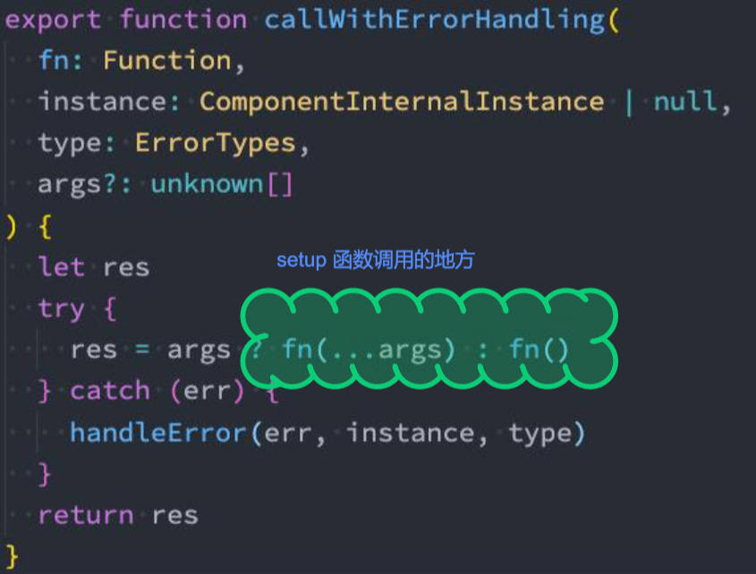

# reactive API

使用场景，

- 为 **Object / Array 等引用类型**数据提供响应式的特性。

reactive API 响应式原理介绍，3点：

1. 使用 `reactive` 函数处理后的数据，数据再次使用时会进行依赖收集。
2. 当数据改变时，所有收集的依赖，进行对应的响应式操作（比如更新界面）。
3. 事实上，data 选项返回的对象， 也是交给 reactive 函数将其编程响应式对象的。

reactive API 的基本使用：

```vue
<script>
  import { reactive } from 'vue'
  
  export default {
    setup() {
      // 定义响应式数据
      const account = reactive({
        username: "zzt",
        password: "123456"
      })
      function changeAccount() {
        account.username = "kobe"
      }
      return {
        account,
        changeAccount
      }
    }
  }
</script>
<template>
  <div>
    <h2>账号: {{ account.username }}</h2>
    <h2>密码: {{ account.password }}</h2>
    <button @click="changeAccount">修改账号</button>
  </div>
</template>
<style scoped>
</style>
```

# ref API

使用场景：

- 用于处理需要响应式的数据，返回响应式对象。

认识 ref API

1. ref 意为 Reference，返回一个可变的响应式对象，该对象作为一个响应式的引用维护着它内部的值。
2. 它内部的值是在 ref 对象的 `value` 属性中维护的。

需要注意的是：

1. 在 `<template>` 模板中引入 ref 的值时，vue 会自动帮助我们进行浅层解包操作，并不需要通过 `ref.value` 的方式使用。
2. 在 setup 函数内部，它依然是一个 ref 引用，所以需要通过 `ref.value` 的方式来使用。

如何理解 ref API 的浅层解包。

- 在早期，如果 ref 对象在外层包裹一个对象，那么它在 template 模板中不会自动解包，除非外层包裹的对象是 `reactive` 对象。
- 现在已经能做到不完全的深层解包（解包后可读取，不能操作）。

ref API 的基本使用：

```vue
<script>
  import { reactive, ref } from 'vue'
  
  export default {
    setup() {
      // ref 函数: 定义简单类型的数据(也可以定义复杂类型的数据)，为 counter 定义响应式数据
      const counter = ref(0)
      function increment() {
        counter.value++
      }
      // 将 ref 对象，放入到对象中，在 template 中使用时，最初是浅层解包，现已可以做到不完全的深层解包（见 template）。
      const info = { counter }
      return {
        counter,
        increment,
        info
      }
    }
  }
</script>
<template>
  <div>
    <!-- 默认情况下在 template 中使用 ref 时, vue 会自动对其进行解包(取出其中 value) -->
    <h2>当前计数: {{ counter }}</h2>
    <button @click="increment">+1</button>
    <button @click="counter++">+1</button>
    <!-- 不完全的深层解包 -->
    <h2>当前计数: {{ info.counter }}</h2><!-- 使用的时候不需要写.value -->
    <button @click="info.counter.value++">+1</button><!-- 修改的时候需要写.value（很少这么用） -->
  </div>
</template>
<style scoped>
</style>
```

# reactive, ref 如何选择

满足以下两个条件，推荐用 reactive：
- 本地产生的数据，比如本地定义的用户名，密码。
- 多个数据之间是有联系的，聚合的数据。

其它场景都推荐都使用 ref，能够更好的做到解耦，这样方便代码的抽取。

- 如网络请求中获取的数据，

> ref 和 reactive 默认都能实现对象的深层响应式。

# 在浏览器安装 Vue devtool 插件

# readonly API

> Vue3 中新增的 API，Vue2 中没有这种功能。

使用场景

- 常见的，给另外一个地方（组件）传入**普通值，reactive 对象，ref 对象**时，我们希望它们是只读的，需要使用 readonly API（默认就能做深度只读处理）

> 按照“单向数据流”的规范，在子组件中不能直接修改父组件的数据，而是通过发射事件的方式让父组件修改。

`readonly` API 的原理：

- readonly 会返回原始对象的只读代理（Proxy），这个代理对象中的 set 方法被劫持，使它不能进行修改。

readonly API 结合普通对象和响应式对象的使用：

父组件 App.vue

```Vue
<script>
  import { reactive, readonly } from 'vue'
  import ShowInfo from './ShowInfo.vue'
  
  export default {
    components: {
      ShowInfo
    },
    setup() {
      // 本地定义多个数据, 都需要传递给子组件
      const info = reactive({
        name: "zzt",
        age: 18,
        height: 1.88
      })
      // 使用 readOnly 包裹 info
      const roInfo = readonly(info)
      function changeRoInfoName(payload) {
        info.name = payload
      }
      return {
        roInfo,
        changeRoInfoName
      }
    }
  }
</script>

<template>
  <h2>App: {{ info }}</h2>
  <show-info :roInfo="roInfo" @changeRoInfoName="changeRoInfoName"></show-info>
</template>
```

子组件 ShowInfo.vue

```vue
<script>
  export default {
    props: {
      // readonly数据
      roInfo: {
        type: Object,
        default: () => ({})
      }
    },
    emits: ["changeRoInfoName"],
    setup(props, context) {
      function roInfoBtnClick() {
        context.emit("changeRoInfoName", "james")
      }
      return { roInfoBtnClick }
    }
  }
</script>

<template>
  <div>
    <!-- 使用 readonly 的数据 -->
    <h2>ShowInfo: {{ roInfo }}</h2>
    <!-- <button @click="roInfo.name = 'james'">ShowInfo 按钮</button> 直接修改父组件中传过来的 readonly 对象，代码就会无效(报警告) -->
    <button @click="roInfoBtnClick">roInfo按钮</button> <!-- 正确的做法 -->
  </div>
</template>
```

# reactive 相关 API

- `isProxy` - 检查对象是否由 `reactive` 或 `readonly` 创建的 Proxy。
- `isReactive` - 检查对象是否由 `reactive` 创建的响应式代理（reactive 对象包裹的 `readonly` 也会返回 true）。
- `isReadonly` - 检查对象是否由 `readonly` 创建的只读代理。
- `toRaw` - 返回 `reactive` 或 `readonly` 代理的原始对象（不建议保留对原始对象的持久引用，谨慎使用）。
- `shallowReactive` - 创建一个响应式代理，它跟踪自身 property 的响应式，但不执行嵌套对象的深层响应式转换（深层还是原始对象）。
- `shallowReadonly` - 创建一个 proxy，使其自身 property 为只读，但不执行嵌套对象的深度只读转换（深层还是可读可写的）

基本使用举例

```javascript
import { reactive, isReactive } from 'vue'

export default {
  setup() {
    const state = reactive({username: 'John'， password: '123456'})
    console.log(isReactive(state)) // true
  }
}
```

# toRefs, toRef API。

`toRefs` 的使用场景：使 reactive 返回的对象中的属性都转成 ref，可用于 reactive 对象的解构。

```javascript
import { reactive, toRefs } from 'vue'

export default {
  setup() {
    const state = reactive({ name: 'zzt', age: 18 })
    const { name, age } = toRefs(state)
  }
}
```

`toRef` 的使用场景：将 reactive 返回的对象中的某一个属性转成 ref

```javascript
import { reactive, toRef } from 'vue'

export default {
  setup() {
    const state = reactive({ name: 'zzt', age: 18 })
    const name = toRef(state, 'name')
  }
}
```

> 这种做法相当于将解构出来的值与 reactive 返回的对象中的属性建立联系，任何一个修改都会引起另外一个变化。

# ref 相关 API

- `isRef` - 判断值是否是一个 ref 对象。
- `unref` - 用于获取 ref 引用中的 value，这是 `val = isRef(val) ? val.value : val` 的语法糖函数。
- `shallowRef` - 创建一个浅层的 ref 对象。
- `triggerRef` - 手动触发和 `shallowRef` 相关联的副作用。
- `customRef` - 创建一个自定义 ref，对其依赖项跟踪和重新触发。

shallowRef 和 triggerRef 的结合使用案例实现。

```vue
<script>
import { shallowRef, triggerRef } from "vue";
  
export default {
  setup() {
    const shallowInfo = shallowRef({ name: "zzt" });
    const changeInfo = () => {
      shallowInfo.value.name = "Lingard";
      triggerRef(shallowInfo); // 手动触发 shallowRef 的副作用，执行 shallowInfo 对象深层的响应式。
    };
    return { shallowInfo, changeInfo, };
  },
};
</script>

<template>
  <h2>{{ shallowInfo }}</h2>
  <button @click="changeInfo">修改Info</button>
</template>
```

customRef 的使用场景，ref-debounce 案例（双向绑定属性进行防抖操作）

App.vue

```vue
<script>
import useDebounceRef from "./hook/useDebounceRef";
  
export default {
  setup() {
    const message = useDebounceRef("Hello World");
    return { message };
  },
};
</script>

<template>
  <input type="text" v-model="message" />
  <h2>{{ message }}</h2>
</template>
```

useDebounceRef.js

```javascript
import { customRef } from 'vue'

// 自定义ref
export default function (value, delay = 300) {
  let timer = null
  return customRef((track, trigger) => {
    return {
      get() {
        track() // 收集依赖
        return value
      },
      set(newValue) {
        clearTimeout(timer)
        timer = setTimeout(() => {
          value = newValue
          trigger() // 触发响应式
        }, delay);
      }
    }
  })
}
```

# setup 中不可以使用 this

为什么不能使用 this

1. 首先，setup 被调用之前，data, computed, methods 等选项都没有被解析。
2. 本质上，setup 函数**调用时未绑定 this**，所以它的 this 没有指向组件实例 Instance，而是 undefined。

setup 函数的执行过程在阅读源码的过程中，代码是按照如下顺序执行的： 

1. 调用 createComponentInstance 创建组件实例； 
2. 调用 setupComponent 初始化 component 内部的操作；
5. 调用 setupStatefulComponent 初始化有状态的组件；
3. 在 setupStatefulComponent 取出了 setup 函数； 
4. 通过 callWithErrorHandling 的函数执行 setup；

  

从上面的代码我们可以看出， 组件的 instance 肯定是在执行 setup 函数之前就创建出来的，并且 setup 函数在执行时没有绑定 this。

# computed API

Vue 官方文档推荐，对于任何**包含响应式数据**的复杂逻辑，你都应该使用计算属性

setup 中实现计算属性 API 是 `computed`，基本使用：

- 接受一个 `getter` 函数，并为 getter 函数返回的值，返回一个**不可写的** ref 对象。

   ```vue
   <script>
   import { ref, computed } from "vue";
     
   export default {
     setup() {
       const firstName = ref("Jesse");
       const lastName = ref("Lingard");
       // 1. 用法一：传入一个 getter 函数，computed 的返回值是一个 ref 对象
       const fullName = computed(() => firstName.value + ' ' + lastName.value)
       return { fullName };
     },
   };
   </script>
   
   <template>
    <h2>{{ fullName }}</h2>
   </template>
   ```
   
- 接受一个具有 `get` 和 `set` 方法的对象，返回一个可变的（可读写）ref 对象。

   ```Vue
   <script>
   import { ref, computed } from "vue";
     
   export default {
     setup() {
       const firstName = ref("Jesse");
       const lastName = ref("Lingard");
       // 用法二：传入一个对象，对象包含 getter/setter
       const fullName = computed({
         get: () => firstName.value + " " + lastName.value,
         set: (newValue) => {
           const names = newValue.split(" ");
           firstName.value = names[0];
           lastName.value = names[1];
         },
       });
       const changeName = () => {
         fullName.value = "Zhu Zetian";
       };
       return { fullName, changeName };
     },
   };
   </script>
   
   <template>
    <h2>{{ fullName }}</h2>
    <button @click="changeName">设置fullname</button>
   </template>
   ```

setup 中侦听器提供了2种 API ：

- `watchEffect` - 用于自动收集响应式数据依赖。
- `watch` - 手动指定侦听的数据源。

# watchEffect API

2个特点：

1. 传入的函数会被立即执行一次，在执行过程中收集依赖。
2. 当收集的依赖发生变化时，侦听函数会再次执行。

## 基本使用：

```vue
<script>
  import { ref, watchEffect } from 'vue';
  
  export default {
    setup() {
      const name = ref("zzt");
      const age = ref(18);
      // watchEffect: 自动收集响应式的依赖
      watchEffect(() => {
        console.log("name:", name.value, "age:", age.value);
      });
      const changeName = () => name.value = "kobe"
      const changeAge = () => age.value++
      return { name, age, changeName, changeAge }
    }
  }
</script>

<template>
	<h2>{{name}}-{{age}}</h2>
	<button @click="changeName">修改name</button>
	<button @click="changeAge">修改age</button>
</template>
```

## 停止侦听：

```javascript
const stopWatch = watchEffect(() => {
  console.log("name:", name.value, "age:", age.value);
});
const changeAge = () => {
  age.value++
  if (age.value > 20) { // age 大于20，停止侦听。
    stopWatch()
  }
}
```

## 清除副作用

什么是 watchEffect 的副作用？

- watchEffect 传入的侦听函数中执行的代码称之为副作用。

怎么清除副作用？

1. watchEffect 传入的侦听函数被回调时，可获取到一个函数类型的参数：通常名命为 `onInvalidate`，
2. 在侦听函数再次执行或侦听器停止时，会执行 onInvalidate 中传入的回调函数。
3. 可在该回调函数中执行一些清理工作。

```javascript
const name = ref("zzt");
const age = ref(18);
watchEffect(onInvalidate => {
  const timer = setTimeout(() => {
    console.log("网络请求成功~");
  }, 2000)
  // 在这个函数中清除额外的副作用
  onInvalidate(() => {
    clearTimeout(timer);
  })
  console.log("name:", name.value, "age:", age.value);
});
```

# watch API

## 使用场景

1. 需要侦听特定的数据源，并在回调函数中执行副作用。
2. 默认情况下是惰性的，只有当侦听的数据源发生变化时才会执行回调。

## watch 与 watchEffect 的区别：

- watch 会指定侦听的数据源。
- watch 会惰性执行副作用（第一次不会直接执行）
- watch 可访问侦听数据源变化前后的值（watchEffect 只能访问变化后的值）。

## 侦听单个数据源

watch 侦听单个数据源，可传2种类型：

- 一个 `getter` 函数，该函数返回值必须要引用响应式对象（如 reactive 或 ref 对象）。
- 一个响应式对象，`reactive` 或者 `ref` 对象（常用）

watch 侦听单个数据源，`newVal` 和 `oldVal` 拿到普通值和响应式对象的4种情况。侦听 Reactive 对象后获取普通对象。

- 侦听一个 reactive 对象，newVal 和 oldVal 是响应式对象（Proxy）。

   ```javascript
   const info = reactive({ name: "zzt", age: 18 });
   watch(info, (newVal, oldVal) => {
     // newVal 和 oldVal 拿到的是响应式对象（Proxy）
   })
   ```

- 侦听一个 reactive 对象中的某一属性，newVal 和 oldVal 拿到的是值本身。

   ```javascript
   const info = reactive({ name: "zzt", age: 18 });
   watch(() => info.name, (newVal, oldVal) => {
     // newVal 和 oldVal 拿到的是值本身
   })
   ```

- 侦听一个 ref 对象，newVal 和 oldVal 拿到的是值本身。

   ```javascript
   const name = ref('zzt');
   watch(name, (newVal, oldVal) => {
     // newVal 和 oldVal 拿到的是值本身
   })
   ```

- 侦听一个展开复制后 reactive 对象，newVal 和 oldVal 拿到的是对象本身，而不是响应式对象（Proxy）

   ```javascript
   const info = reactive({name: "zzt", age: 18});
   watch(() => ({...info}), (newVal, oldVal) => {
     // newVal 和 oldVal 拿到的是对象的浅层拷贝（非响应式的对象）
   })
   ```

> - 针对 reactive 对象默认会深度侦听。
> - 监听普通对象，或者 Proxy 转的普通对象时，要做深度监听的配置。

## 侦听多个数据源

watch 侦听多个数据源，传入一个数组，对应的 newVal 和 oldVal 可做**数组解构**：

```javascript
const info = reactive({ name: "zzt", age: 18 });
const players = reactive(['Lingard', 'Ronaldo', 'DeBruyne', 'Vardy'])
const name = ref('zzt')
watch([info, () => [...players], name], ([newInfo, newPlayer, newName], [oldInfo, oldPlayer, oldName]) => {
  // newInfo, oldInfo 拿到的是响应式对象，
  // newPlayer, oldPlayer, newName, oldName 拿到的是非响应式的值。
})
```

## 深度监听

watch 传入 **reactive 对象**默认能深度侦听

```javascript
const info = reactive({
  name: "zzt",
  friend: {
    name: 'lingard'
  }
});
watch(info, (newVal, oldVal) => {
  // info 默认能做深度监听。
  console.log('监听到 info 中的值改变')
})
const changeData = () => {
  info.friend.name = "james";
}
```

watch 传入的 get 函数返回一个响应式对象的展开复制，即一个**普通对象**，是不会做深度侦听的，在 watch 中配置使用深度侦听和立即执行。

```javascript
const info = reactive({
  name: "zzt",
  friend: {
    name: 'lingard'
  }
});
watch(() => ({...info}), (newVal, oldVal) => {
  // info 的浅层拷贝不能做深度监听。需要配置
}, {
  deep: true, // 深度监听
  immediate: true // 立即执行
})
const changeData = () => {
  info.friend.name = "james";
}
```

# setup 中获取 DOM / 组件对象

在 `setup` 中如何使用类似于 `this.$refs` 的功能拿到元素或组件实例对象

1. 定义一个 ref 对象（传入 null），将它绑定到元素或者组件的 ref 属性上即可

2. 可在对应的生命周期函数（`onMounted`）中通过 `titleRef` 拿到元素本身。

   ```vue
   <script>
     import { ref, onMounted } from 'vue'
     
     export default {
       setup() {
         const titleRef = ref(null)
         onMounted(() => {
           console.log(titleRef.value)
         })
         return { titleRef }
       }
     }
   </script>
   
   <template>
     <h2 ref="titleRef">我是标题</h2>
   </template>
   ```
   
3. 也可以使用 `watcheffect` 通过 titleRef 来拿元素，会发现副作用执行了2次，第一次 titleRef 为 null，第二次为元素本身。这是因为：

   1. setup 函数在执行时，watchEffect 会立即执行副作用函数，这个时候 DOM 并没有挂载，所以获取 null
   2. 当 DOM 挂载时，会给 titleRef 的 ref 对象赋新的值，副作用函数再次执行，获取对应的元素。

   ```javascript
   const titleRef = ref(null);
   watchEffect(() => {
     console.log(titleRef.value);
   })
   ```

4. 如果希望在第一次就拿到元素本身，需要改变副作用函数的执行时机。

   ```javascript
   const titleRef = ref(null);
   watchEffect(() => {
     console.log(titleRef.value);
   }, {
     flush: 'post' // 设置副作用函数的执行时机，默认值 pre，还可接收 sync，低效，谨慎使用。
   })
   ```
   
   > 调整 watchEffect 的执行时机，一般就用于取模版中元素或组件实例对象的场景。

# setup 生命周期

VCA 的生命周期钩子函数有哪些？

- `setup` 函数是围绕 `beforeCreate` 和 `created` 生命周期钩子运行的，可代替它们。
- `onBeforeMount`：代替 beforeMount。
- `onMounted`：代替 mounted。
- `onBeforeUpdate`：代替 beforeUpdate。
- `onUpdated`：代替 updated。
- `onBeforeUnmount`：代替 beforeUnmount。
- `onUnmounted`：代替 unmounted。

> `beforeCreat` 和 `created` 中的代码应直接写在 `setup` 函数中，setup 函数的执行时机比这两个阶段还早，

VCA 用于动态组件（keep-alive + component）的生命周期钩子：

- `onActivated`：代替 activated。
- `onDeactivated`：代替 deactivated。

VCA 生命周期 API 的基本使用：

```javascript
import { onMounted } from 'vue'

export default {
  setup() {
    onMounted(() => {
      console.log('App Mounted1')
    })
  }
}
```

> 同一个生命周期钩子函数可以多次使用而不会被覆盖，有什么好处？
>
> - 有利于代码的抽取复用。

# Provide, Inject API

结合响应式 API 和 readonly，使用 `Provide`, `Inject` API.

父组件 App.vue

```vue
<script>
import { ref, readonly, provide } from "@vue/runtime-core"
import Home from "./Home.vue"
  
export default {
  components: { Home },
  setup () {
    let name = ref('zzt')
    let counter = ref(100)
    // provide 可传两个参数：prop1：属性名称，prop2：属性值
    provide('name', readonly(name))
    provide('counter', readonly(counter))
    const increment = () => counter.value++
    return { increment, counter }
  }
}
</script>

<template>
  <Home />
  <h2>App Counter: {{ counter }}</h2>
  <button @click="increment">App中的+1</button>
</template>
```

子组件 Home.vue

```vue
<script>
import { inject } from 'vue'
  
export default {
  setup() {
    // inject 可传2个参数，prop1：属性名，prop2：默认值。
    const name = inject('name', 'zzt')
    const counter = inject('counter')
    return { name, counter }
  }
}
</script>
<template>
  <h2>{{ name }}</h2>
  <h2>{{ counter }}</h2>
</template>
```

> 对于 Inject 注入的 ref 对象，
>
> - option 写法在 template 中不会自动解包，
> - setup 写法在 template 中会自动解包。

# Hooks 抽取思想，案例理解。

> vue3 中抽取出来的逻辑代码，因为太像 react 中的 Hook 函数了，所以一般称为 Hook 函数，，社区中的名命规范是 `use + xxx`，如 `useCounter.js`

## 封装一个 Hook，用来修改 title

父组件 App.vue

```vue
<script>
import useTitle from './hooks/useTitle.js'
  
export default {
  setup() {
    const titleRef = useTitle('zzt')
    setTimeout(() => {
      titleRef.value = 'Lingard'
    }, 3000);
  }
}
</script>
```

工具 useTitle.js

```javascript
import { ref, watch } from 'vue'

export default function (title = '默认的title') {
  const titleRef = ref(title)
  watch(titleRef, newValue => {
    document.title = newValue
  }, { 
    immediate: true
  })
  return titleRef
}
```

## 封装一个 Hook，用来实时显示页面滚动位置的实时显示

父组件 App.vue

```vue
<script>
import useScrollPosition from './hooks/useScrollPosition.js'
  
export default {
  setup() {
    return { ...useScrollPosition() }
  }
}
</script>

<template>
  <p class="content"></p>
  <div class="scroll">
    <div class="scroll-x">scrollX: {{ position.x }}</div>
    <div class="scroll-y">scrollY: {{ position.y }}</div>
  </div>
</template>

<style scoped>
.content {
  width: 3000px;
  height: 5000px;
}
.scroll {
  position: fixed;
  right: 30px;
  bottom: 30px;
}
</style>
```

工具 useScrollPosition.js

```javascript
import { reactive } from 'vue'

export default function () {
  const position = reactive({
    x: 0,
    y: 0
  })
  document.addEventListener('scroll', () => {
    position.x = window.scrollX
    position.y = window.scrollY
  })
  return { position }
}
```

## 封装一个 Hook，用来实现鼠标位置的实时显示

父组件 App.vue

```vue
<script>
import useMousePosition from './hooks/useMousePosition.js'
  
export default {
  setup() {
    return{ ...useMousePosition() }
  }  
}
</script>

<template>
  <div class="mouse">
    <div class="mouse-x">mouseX:{{ mouseX }}</div>
    <div class="mouse-Y">mouseY:{{ mouseY }}</div>
  </div>
</template>

<style scoped>
.mouse {
  position: fixed;
  right: 30px;
  bottom: 80px;
}
</style>
```

工具 useMousePosition.js

```javascript
import { ref } from 'vue'

export default function () {
  const mouseX = ref(0)
  const mouseY = ref(0)
  window.addEventListener('mousemove', event => {
    mouseX.value = event.pageX
    mouseY.value = event.pageY
  })
  return { mouseX, mouseY }
}
```

## 封装一个 Hook，实现 localStorage 存储。

父组件 App.vue

```vue
<script>
import useLocalStorage from './hooks/useLocalStorage.js'
  
export default {
  setup() {
    const data = useLocalStorage('info')
    const changeData = () => data.value = '呵呵呵呵'
    return { data, changeData }
  }
}
</script>
```

工具 useLocalStorage.js

```javascript
import { ref, watch } from 'vue'

export default function (key, value) {
  const data = ref(value)
  if (value) {
    window.localStorage.setItem(key, JSON.stringify(value))
  } else {
    data.value = JSON.parse(window.localStorage.getItem(key))
  }
  watch(data, newValue => {
    window.localStorage.setItem(key, JSON.stringify(newValue))
  })
  return data
}
```

# script setup 语法糖。

`<script setup>` 是在单文件组件 (SFC) 中使用 Composition API 的编译时语法糖，当同时使用 SFC 与 Composition API 时推荐该语法。 有什么好处？

- 更少的样板内容，更简洁的代码； 
- 能够使用纯 Typescript 声明 prop 和抛出事件； 
- 更好的运行时性能；(将 script 代码与 template 中的引用放在同一作用域中，不需要通过组件实例 Instance)
- 更好的 IDE 类型推断性能；

`<script setup>` 里面的代码会被编译成组件 setup() 函数的内容： 

>  这意味着，与普通的 \<script\> 只在组件被首次引入的时候执行一次不同；\<script setup\> 中的代码会在每次组件实例被创建的时候执行。

基本用法

1. 不用写 `return`，任何在顶层定义的标识符可直接用于模板。
2. 不用写 `components` 选项，直接 import 引入子组件即可使用。
3. 定义 `props` 中的数据：使用 `defineProps` API。
4. 定义 `emits` 中的事件，使用 `defineEmits` API.

## defineProps 和 defineEmits 的使用

为了在声明 `props` 和 `emits` 选项时获得完整的类型推断支持，我们可以使用 `defineProps` 和 `defineEmits` API，它们将自动地在 \<script setup\> 中可用：

基本使用：

```vue
<script setup>
// defineProps，defineEmits 只能用于 <script setup>，不需要导入。
const props  = defineProps({
  message: {
    type: String,
    default: '哈哈哈'
  }
})
console.log('---message---', props.message);
const emit = defineEmits(['increment', 'decrement'])
const clickbtn = () => emit('increment', 1000000)
</script>

<template>
  <h2>{{ message }}</h2>
  <button @click="clickbtn">发射事件</button>
</template>
```

## defineExpose 的使用

- 使用 \<script setup\> 的组件是默认关闭的：通过模板 `ref` 或者 `$parent` 链获取到的组件的公开实例，不会暴露任何在 \<script setup\> 中声明的绑定；
- 通过 `defineExpose` 编译器宏来显式指定在 \<script setup\> 组件中要暴露出去的 property：

子组件 Home.vue

```vue
<script setup>
function foo() {
  console.log("foo function")
}
defineExpose({
  foo
})
</script>
```

父组件 App.vue

```vue
<script setup>
import { onMounted } from 'vue'
import Hoem from './Home.vue'
  
const homeRef = ref(null)
onMounted(() => {
  homeRef.value.foo()
})
</script>

<template>
	<home ref="homeRef"></home>
</template>
```

