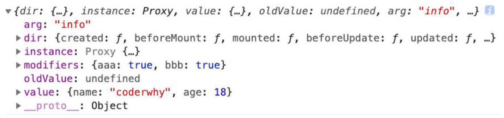

# 认识自定义指令

自定义指令的使用场景：

- 在 Vue 中，代码抽象或复用主要还是通过组件，
- 当需要对 DOM 元素进行底层操作时，会用到自定义指令。

自定义指令分为2种，如何使用？

- 局部自定义指令，只能在注册的组件中使用（很少使用）。
  - VOA：通过组件中 `directives` 选项注册。
  - VCA：以 `vNameOfDirective` 的形式来命名自定义指令。在模板中引用时 `v-name-of-directive`
- 全局自定义指令，可以在任意的组件中使用。
  - 通过 app 的 `derective` 方法注册，

## 基本使用（案例理解）

实现 input 元素挂载后自动聚焦的案例，2种方式。

### 不使用自定义指令实现：

```vue
<script setup>
import { onMounted, ref } from 'vue'
  
const inputEl = ref(null)
onMounted(() => {
	inputEl.value.focus();
})
</script>

<template>
	<input type="text" ref="inputEl" />
</template>
```

### 使用局部自定义指令，VOA, VCA 2种写法

VOA，使用 directives 选项。

```vue
<script>
export default {
	directives: {
		focus: {
			// 生命周期 mounted 函数，可传4个参数：el, bindings, vnode, preVnode
			mounted(el) {
				el.focus()
			}
		}
	}
}
</script>

<template>
  <input type="text" v-focus />
</template>
```

VCA，使用 `vNameOfDirective` 方式名命标识符并引用。

```vue
<script setup>
const vFocus = {
	mounted(el) {
		el.focus()
	}
}
</script>

<template>
	<input type="text" v-focus />
</template>
```

### 使用全局自定义指令

main.js

```js
import { createApp } from 'vue'

const app = createApp(App)
app.directive("focus", {
	mounted(el) {
		el.focus()
	}
})
app.mount("#app")
```

## 指令的7个生命周期（与 Vue2 不同）：

1. `created`：在绑定元素的 attribute 或事件监听被应用之前调用。
2. `beforeMount`：在指令第一次绑定到元素，挂载父组件之前调用。
3. `mounted`：在绑定元素的父组件被挂载后调用。
4. `beforeUpdate`：在更新包含组件的 VNode 之前被调用。
5. `updated`：在包含组件的 VNode 和它子组件的 VNode 更新后调用。
6. `beforeUnmount`：在卸载绑定元素的父组件之前调用。
7. `unmounted`：当指令与元素解除绑定并且父组件已卸载时，只调用一次。

代码演示

```vue
<script setup>
import { ref } from 'vue'
const vZzt = {
	created() {
		console.log('zzt created'); // 直接打印1
	},
	beforeMount() {
		console.log('zzt beforeMount'); // 直接打印2
	},
	mounted() {
		console.log('zzt mounted'); // 直接打印3
	},
	beforeUpdate() {
		console.log('zzt beforeUpdate'); // 点击按钮后打印1
	},
	updated() {
		console.log('zzt updated'); // 点击按钮后打印2
	},
	beforeUnmount() {
		console.log('zzt beforeUnmount'); // counter >= 2 后打印1
	},
	unmounted() {
		console.log('zzt unmounted'); // counter >= 2 后打印2
	},
}
const counter = ref(0)
</script>

<template>
	<button v-if="counter < 2" v-zzt="'zzt'" @click="counter++">当前计数：{{ counter }}</button>
</template>
```

指令生命周期函数中4个参数分别是：`el`, `bindings`, `vnode`, `preVnode`

- el：指令绑定的元素/组件本身。
- bindings：其中有：指令绑定的参数，修饰符，值等等。


## 自定义指令的参数，修饰符，值

什么是自定义指令的参数，修饰符和值？使用以下自定义指令举例：

```html
<button v-zzt:info.aaa.bbb="{ name: 'coderwhy', age: 18 }"></button>
```

- `info` 是参数的名称； 
- `aaa`, `bbb` 是修饰符的名称；
- `{ name: 'ZeTian', age: 18 }` 是传入的具体的值；

如何获取自定义指令中传入的参数，修饰符，值。

- 获取参数：`bindings.arg`
- 获取修饰符：`bindings.modifiers`，对象类型。
- 获取值：`bindings.value`



## 拼接价格符号案例理解

src / directives / unit.js

```js
export default function directiveUnit(app) {
  app.directive("unit", {
    mounted(el, bindings) {
      const unit = bindintg.value ||= "￥"
      el.textContent = unit + el.textContent
    }
  })
}
```

src / main.js

```js
import { createApp } from 'vue'
import App from './App.vue'
import directives from "./directives/unit"

const app = createApp(App)
app.use(directiveUnit)
app.mount("#app")
```

src / App.vue

```vue
<h2 v-unit> {{ 111 }} </h2>
```

## 时间戳转换案例理解（利用封装思想）

> 时间戳，秒钟是10位，毫秒是13位。
>
> 对时间做转换的第三方库有`dayjs`

先安装第三方库 `dayjs` 用于做 timestamp 转换。

```shell
npm install dayjs
```

src / App.vue

```vue
<script setup>
const timestamp = 1624452193
</script>

<template>
	<h2 v-format-time="YYYY/MM/DD">{{ timestamp }}</h2>
</template>
```

src / main.js

```javascript
import { createApp } from 'vue'
import App from './03_自定义指令/App.vue'
import directives from './directives/index'

const app = createApp(App)
app.use(directives)
app.mount('#app')
```

src / directives / index.js（自定义指令入口文件）

```javascript
import registerFormat from './format-time'

export default function (app) {
	registerFormat(app)
}
```

src / directives / format-time.js

```javascript
import dayjs from 'dayjs'

export default function (app) {
	app.directive('format-time', {
		created(_, bindings) {
			bindings.formatString = bindings.value || 'YYYY-MM-DD HH:mm:ss'
		},
		mounted(el, bindings) {
			const textContent = el.textContent
      const timestamp_ms = textContent.length === 10 ? textContent * 1000 : textContent * 1
			el.textContent = dayjs(timestamp_ms).format(bindings.formatString)
		}
	})
}
```

# Teleport 内置组件

teleport 是一个 Vue 提供的内置组件，类似于 react 中的 Portals。（Vue2 中没有）

## 使用场景

某些情况下，我们希望组件中的元素挂载到根节点以外的节点上，即 `div#app`之外的元素。

## 基本使用

telepor t的2个属性

- `to`：指定将其中的内容移动到的目标元素，可以使用选择器。
- `disabled`：是否禁用 teleport 的功能。

基本使用：

public / index.html

```html
<div id="app"></div>
<div id="zzt"></div>
```

App.vue

```vue
<template>
	<div class="app">
    <!-- 向 #zzt 中传递多份内容，会合并，不会覆盖 -->
		<teleport to="#zzt">
			<h2>当前计数</h2>
			<button>+1</button>
			<HelloWorld></HelloWorld>
		</teleport>
		<teleport to="#zzt">
			<span>呵呵呵呵</span>
		</teleport>
	</div>
</template>
```

teleport 也可以和组件一起使用

# 认识 Vue 的插件

一种组织代码设计思想。

## 使用场景：

用于添加一些全局功能。

## 基本使用

Vue 插件的2种编写方式：

- 对象类型：一个对象，必须包含一个 `install` 方法，该方法在插件安装时执行，传入 app。
- 函数类型：一个函数，在插件安装时自动执行，传入 app。

Vue 插件可以完成的功能例举：

1. 添加全局方法或者属性，通过把它们添加到 `config.globalProperties` 上实现（全局标识符名命规范：以`$`开头）
2. 添加全局资源：如指令/过滤器/过渡等。
3. 添加全局的 mixin，混入一些组件选项。
4. 添加一个库中的 API，同时提供以上的一个或多个功能。

### Vue 插件对象类型基本使用

main.js

```javascript
import { createApp } from 'vue'
import App from './04_teleport的使用/App.vue'
import pluginObject from './plugins/plugins_object'

const app = createApp(App)
// 调用 pluginObject 对象中的 install 方法，并传入 app
app.use(pluginObject)
app.mount('#app')
```

plugins / plugins_object.js

```javascript
export default {
	install(app) {
		app.config.globalProperties.$name = 'zzt'
	}
} 
```

App.vue

```vue
<script>
import { getCurrentInstance } from 'vue'
  
export default {
	setup() {
		// VCA 中拿到全局定义的标识符。
    const name = getCurrentInstance().appContext.config.globalProperties.$name;
	},
	mounted() {
    // VOA 中拿到全局定义的标识符。
		console.log(this.$name);
	}
}
</script>
```

### Vue 插件函数类型基本使用

main.js

```javascript
import { createApp } from 'vue'
import App from './04_teleport的使用/App.vue'
import pluginFunction from './plugins/plugins_function'

const app = createApp(App)
// 调用 pluginFunction 函数，并传入 app
app.use(pluginFunction)
app.mount('#app')
```

plugins / plugins_function

```javascript
export default function (app) {
	console.log(app);
}
```

重构 registerDirectives。

main.js

```javascript
import registerDirective from './directives/index'

// registerDirective(app)
app.use(registerDirective)
```