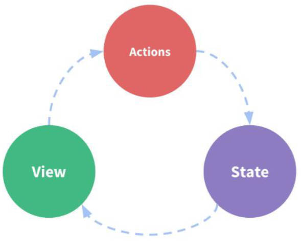
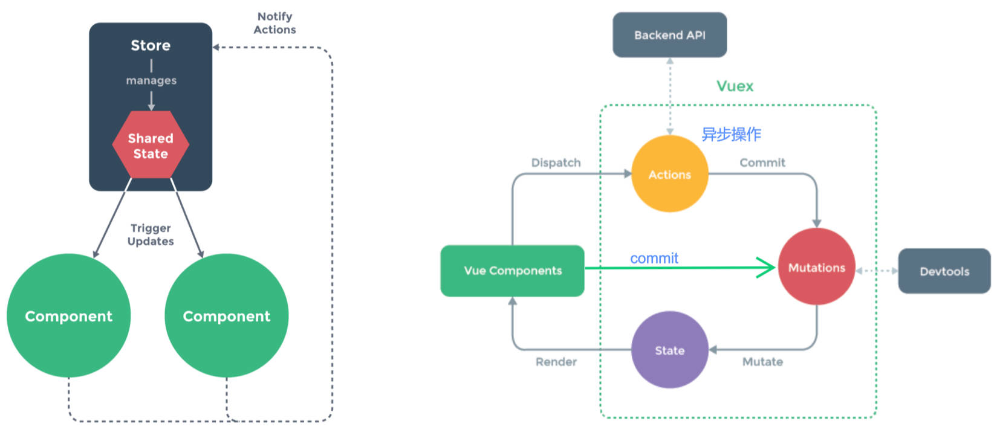

# 前端产品分类

客户端：

- PC 端网站，
  - 如商家端，用户端等等。
- 移动端 IOS / Android
- H5 产品端，如小程序端。
  - H5 通常指产品端，而非 HTML5 这项技术。
  - 通过移动端中某一个浏览器，无论是微信的 WebView 还是别的浏览器打开的页面。

后端管理系统：

- PC 端网站，
  - 如客服端，产品经理端等等。往往有更高的权限。

---

# vue-router 补充

## router-link 结合插槽使用

vue-router 4 删除了 router-linke 上 `tag` 属性，使用插槽的方式来渲染内容。

基本使用：放入普通元素和组件。

```vue
<template>
	<div>
		<router-link to="/home" custom>
			<button>首页</button>
			<Foo></Foo>
		</router-link>
		<router-link to="/about">关于</router-link>
		<router-view></router-view>
	</div>
</template>
```

增强写法，结合作用域插槽 `v-slot` 如何使用。

1. 在 router-link 组件上使用 `custom` 表示自定义元素，否则内容外层会包裹 `<a>`
2. 使用 `v-slot` （独占默认插槽语法），来获取作用域插槽内部传递的对象 slotProps，对象中有以下属性：
   - href：解析后的 url，如 "/home".
   - route：解析后的规范化 route 对象，里面有 params，query，meta 等属性。
   - navigate：触发导航的函数。
   - isActive：是否匹配状态。
   - isExactActive：与嵌套组件有关，是否精确匹配状态。

App.vue

```vue
<template>
	<router-link to="/home" v-slot="slotProps" custom>
		<button @click="slotProps.navigate">{{ slotProps.href }}</button>
		<span :class="{ active: slotProps.isActive }">{{
			slotProps.isActive
		}}</span>
	</router-link>
	<router-link to="/about">关于</router-link>
	<router-view></router-view>
</template>
<style scoped>
.active {
	color: green;
}
</style>
```

## router-view 结合插槽使用

增强写法，结合作用域插槽 v-slot，使用动态组件，缓存，动画。

```vue
<template>
	<router-link to="/home">主页</router-link>
	<router-link to="/about">关于</router-link>
	<!-- slotProps解构：{ Component } -->
	<router-view v-slot="{ Component }">
		<transition name="zzt" mode="out-in" appear>
			<keep-alive>
				<component :is="Component"></component>
			</keep-alive>
		</transition>
	</router-view>
</template>
<style scoped>
.zzt-enter-from,
.zzt-leave-to {
	opacity: 0;
}
.zzt-enter-active,
.zzt-leave-active {
	transition: opacity 0.3s ease;
}
</style>
```

router-view 使用 `v-slot` 来获取作用域插槽内部传递的对象，对象中有以下属性：

- Component：要渲染的组件的名称（不能通过 router-view 拿到组件实例对象，它只能起到占位的作用。）。
- route：解析出的标准化路由对象。里面有 params，query，meta 等属性。

# vue-router 动态添加路由

## 使用场景：

根据用户不同的权限，注册不同的路由。

### 系统实现角色权限管理的 3 种方案。

后台权限设计的思想之一：RBAC (role based access control) 基于访问权限控制的角色管理。

- 后端维护用户表，权限表和关系表。

理解 3 种在前端控制权限的方法，
- 方法一：注册所有路由，弊端：用户可通过手动改 url 实现禁止的权限。
- 方法二：在前端用数组维护好各个角色对应的路由，获取角色后**动态添加路由**。弊端：后端修改角色权限，需要前端修改代码再部署。
- 方法三：在前端获取用户权限，如访问的菜单，根据用户权限**动态添加路由**。，这么做要求后端要返回需要动态添加的路由对应的组件，有 2 种方式：
  1. 后端返回数据中有 component 字段，里面是组件名称，如 Role.vue。
  2. 后端只返回 path，前端根据已有的配置，找到对应的 component。

## 基本使用

动态添加一个一级路由和二级路由

src / router / index.js

```javascript
import { createRouter, createWebHistory } from 'vue-router'
import Home from '../pages/Home.vue'
import About from '../pages/About.vue'
const routes = [
	{ path: '/home', component: Home },
	{ path: '/about', component: About }
]
const router = createRouter({
	routes,
	history: createWebHistory()
})
// 动态添加一级路由
router.addRoute({
	path: '/category',
	component: () => import('../pages/Category.vue')
})
// 动态添加二级路由，第一个参数是上级路由的 name
router.addRoute('home', {
	path: 'moment', // 要么写完整路径‘/home/moment’，要么写成‘moment’
	component: () => import('../pages/HomeMoment.vue')
})
export default router
```

## 动态删除路由：

- 添加一个 name 相同的路由做替换。

  ```javascript
  router.addRoute({ path: '/category', name: 'category', component: Category })
  router.addRoute({ path: '/other', name: 'category', component: Other }) // 使用 /other 替换 /category
  ```

- 通过 `removeRoute` 的方法，传入路由的 `name`。

  ```javascript
  router.addRoute({ path: '/category', name: 'category', component: Category })
  router.removeRoute('category')
  ```

- 通过 `addRoute` 方法的返回函数回调。

  ```javascript
  const removeCategoryRoute = router.addRoute({
  	path: '/category',
  	name: 'category',
  	component: Category
  })
  removeCategoryRoute()
  ```

## 路由的其他方法

- `router.hasRoute(name)`：检查路由是否存在。
- `router.getRoutes()`：获取一个包含所有路由的记录数组。

# 导航守卫

## 使用场景。

- 主要用来通过跳转或取消的方式守卫导航。
- 比如，用户访问某一页面，如果处于未登陆的状态，那么跳转到登陆页面。

## beforeEach 介绍

### 回调函数传入的参数：

- `to`：即将进入的路由 Route 对象。
- `from`：即将离开的路由 Route 对象。
- `next`：Vue2 中通过 next 函数来决定如何跳转。Vue3 中使用返回值来控制，不推荐使用 next 函数。因为开发中容易调用多次。

### 回调函数的返回值：

- `false`；取消当前导航。
- `undefined`：进行默认导航。
- 一个要跳转到的路由，
  - 一个 string 类型的路径，如 `'/login'`。
  - 一个对象，其中包含 path, query, params，如 `{ path: '/login', param: { id: 123 } }`，

## 基本使用。

在注册 route 时，模拟进行导航守卫，

src / router / index.js

```javascript
router.beforeEach((to, from, next) => { // next 已不推荐使用
	const token = window.localStorage.getItem('token')
	if (to.path === '/order ' && !token) {
		return '/login'
	}
})
```

在 Login.vue 中模拟发送网络请求，获取 token

Login.vue

```vue
<script setup>
import { useRouter } from 'vue-router'

const router = useRouter()
const loginClick = () => {
	const token = 'zzt'
	window.localStorage.setItem('token', token)
	router.push({ path: '/order' })
}
</script>
<template>
	<div>
		Login
		<button @click="loginClick">登录</button>
	</div>
</template>
```

在 Home.vue 中，模拟退出登录操作。

Home.vue

```vue
<script setup>
function logoutClick() {
	window.localStorage.removeItem('token')
}
</script>
<template>
	<div class="home">
		<h2>Home</h2>
		<button @click="logoutClick">退出登录</button>
	</div>
</template>
```

## 其它导航守卫

官方文档：https://router.vuejs.org/zh/guide/advanced/navigation-guards.html

其它导航守卫函数的执行时机：

1. 导航被触发。在失活的组件里调用 `beforeRouteLeave` 守卫（**组件内的守卫**）。能通过 this 拿到组件实例

   ```js
   // Home.vue （VOA 写法）
   export default {
   	beforeRouteLeave(to, from) {
   		const answer = window.confirm(
   			'Do you really want to leave? you have unsaved changes!'
   		)
   		if (!answer) return false
   	}
   }
   ```

2. 调用全局的 `beforeEach` 守卫（**全局守卫**）。

3. 在重用的组件里调用 `beforeRouteUpdate` 守卫（**组件内的守卫**）

   - 本质上还未跳转，而是组件发生更新，比如动态路由 /user/123 -> /user/321。能通过 this 拿到组件实例

   ```vue
   <!-- User.vue（VCA 写法） -->
   <script setup>
   import { useRoute, onBeforeRouteUpdate } from 'vue-router'

   const route = useRoute()
   console.log(route.params.id)
   // 获取 route 跳转前后的 id
   onBeforeRouteUpdate((to, from) => {
   	console.log('from:', from.params.id)
   	console.log('to:', to.params.id)
   })
   </script>
   ```

4. 在调用路由配置里的 `beforeEnter` 守卫（**路由独享守卫**）

   ```js
   // src / router / index.js
   const routes = [
   	{
   		path: '/users/:id',
   		component: User,
   		beforeEnter: (to, from) => {
   			// reject the navigation
   			return false
   		}
   	}
   ]
   ```

5. 解析异步路由组件。在被激活的组件里调用 `beforeRouteEnter` 守卫（**组件内的守卫**）。

   - 异步组件已经解析，但回调函数中不能通过 this 拿到组件实例，需要使用 next

   ```js
   // Home.vue
   export default {
   	beforeRouteEnter(to, from, next) {
   		next(instance => {
   			// 通过 `instance` 访问组件实例
   		})
   	}
   }
   ```

6. 调用全局的 `beforeResolve` 守卫（**全局守卫**）(2.5+)。

   - 名字取得不好，类似与 beforeEach，但触发时机是在异步组件解析之后，跳转之前。能确保获取到自定义 `meta` 属性。

   ```js
   router.beforeResolve(async to => {
   	if (to.meta.requiresCamera) {
   		try {
   			await askForCameraPermission()
   		} catch (error) {
   			if (error instanceof NotAllowedError) {
   				// ... 处理错误，然后取消导航
   				return false
   			} else {
   				// 意料之外的错误，取消导航并把错误传给全局处理器
   				throw error
   			}
   		}
   	}
   })
   ```

7. 导航被确认。调用全局的 `afterEach` 钩子（**全局守卫**）。触发 DOM 更新。

   - 对于分析、更改页面标题、声明页面等辅助功能以及许多其他事情都很有用。

   ```js
   router.afterEach((to, from, failure) => {
   	if (!failure) sendToAnalytics(to.fullPath)
   })
   ```

---

# Vuex

> Vue 的全家桶包括：Vue 核心语法，vue-router，Vuex / Pinia。

## 认识状态管理

什么是状态管理？

- 对于应用中各种复杂数据的管理。

为什么需要复杂状态的管理？

1. 组件里面管理的状态过多，变得非常臃肿。
2. 别的组件要改变或者使用该组件的状态，非常困难。
3. 当我们的应用遇到多个组件共享状态时，单向数据流的简洁性很容易被破坏：

复杂的状态包含哪些方面数据：

- 服务器返回的数据，缓存数据，用户操作产生的数据。
- UI 状态，如元素是否被选中，是否显示加载动效，当前分页。

复杂状态共享包括 3 个场景：

- 深层父传子。子传父，非父子关系的共享，如兄弟共享。

复杂状态共享 2 个维度：

- 来自不同视图，依赖同一状态。
- 来自不同视图的行为，需要变更同一状态。

> 在 vue 中通过 Vuex / Pinia 实现状态管理，在 React 中通过 Redux 实现状态管理。

什么是状态管理中的 view，state，action

- view：组件 template 模块渲染成 DOM。
- state：组件中 data，setup 返回的数据。
- action：组件中产生的修改 `state` 的事件。



---

## Vuex 的状态管理。

Vuex 的状态管理模式：

1. 将组件内部状态抽离出来，以一个全局单例的方式来管理。
2. 通过定义和隔离状态管理的各个概念，并通过强制性的规则，来维护 view 和 state 的独立性
3. 借鉴了 Flux、Redux、Elm（纯函数语言，redux 有借鉴它的思想）



> vue devtool 的使用场景之一：对组件或者 Vuex 进行调试。

---

## 使用步骤

1. 安装 vuex

   ```shell
   npm install vuex
   ```

2. 使用 vuex 中的 `createStore` 创建 store，本质上是一个容器，包含应用中全部需要实现状态管理的 state

   - Vuex 的状态存储是响应式的
     - 当 Vue 组件从 store 中读取状态的时候，若 store 中的状态发生变化，那么相应的组件也会被更新；
   - 不能直接改变 store 中的状态
     - 改变 store 中的状态的唯一途径就显示提交 (commit) mutation；
     - 这样使得我们可以方便的跟踪每一个状态的变化，从而让我们能够通过一些工具，如 devtool ，帮助我们更好的管理应用的状态；

3. 配置 store 的状态管理。

4. 在全局使用 `app.use(store)` 安装插件。

5. 组件中使用 store

## 基本使用

使用 Vuex 实现计数器案例。

src / store / index.js

```javascript
import { createStore } from 'vuex'
const store = createStore({
	state: () => ({
		rootCounter: 100
	}),
	// mutation 中不允许有异步操作，异步操作在 action 中处理。
	mutations: {
		increment(state) {
			state.rootCounter++
		},
		decrement(state) {
			state.rootCounter--
		}
	}
})
export default store
```

main.js

```javascript
import { createApp } from 'vue'
import App from './App.vue'
import store from './store'

const app = createApp(App)
app.use(store) // 加入了全局属性 $store
app.mount('#app')
```

App.vue

```vue
<template>
	<div>
		<h2>当前计数：{{ $store.state.rootCounter }}</h2>
		<button @click="increment">+1</button>
		<button @click="decrement">-1</button>
	</div>
</template>
<script>
export default {
	methods: {
		increment() {
			this.$store.commit('increment')
		},
		decrement() {
			this.$store.commit('decrement')
		}
	}
}
</script>
```

## 单一状态树理解

Vuex 的单一状态数理解：

1. 用一个对象（store），包含应用程序全部层级的状态（全局单例模式）。
2. 也就是 SSOT(Single Source of Truth)，也可翻译成单一数据源。
3. 意味着每个应用程序只包含一个 store 实例。
4. 单状态树与模块（module）并不冲突。

Vuex 单一状态树的优势 1 点。

- 能够直接地找到某个状态片段，方便管理和维护。

> Vuex 的 5 大核心，state，getters，mutations，actions，modules。

## Vuex 核心一 state

### VOA（Vue Options Api）中

#### 直接获取

template 中取 state，VOA 直接展示，结合计算属性。

src / store / index.js

```javascript
import { createStore } from 'vuex'
const store = createStore({
	state() {
		return { rootCounter: 100 }
	}
})
export default store
```

App.vue

```vue
<template>
	<div>{{ $store.state.rootCounter }}</div>
	<div>{{ rootCounter }}</div>
</template>
<script>
export default {
	computed: {
		rootCounter() {
			return this.$store.state.rootCounter
		}
	}
}
</script>
```

#### 通过映射函数 mapState

template 中取 state，VOA 使用 `mapState` 辅助函数进行映射。2 种写法。分别的使用场景。

src/store/index.js

```javascript
import { createStore } from 'vuex'
const store = createStore({
	state() {
		return { name: 'zzt', age: 18 }
	}
})
export default store
```

App.vue

```vue
<template>
	<div>{{ name }} - {{ age }}</div>
	<div>{{ myName }} - {{ myAge }}</div>
</template>
<script>
// mapState 返回的是对象，对象中是一个个函数，函数中本质上也是通过 this.$store.state.xxx 来读取数据。
import { mapState } from 'vuex'
export default {
	computed: {
		// 第一种写法，传入数组。
		...mapState(['name', 'age']),
		// 第二种写法，传入对象，key 为重名命的名称，value 为传入参数为 state 的 getter 函数，返回指定状态
		...mapState({
			myName: state => state.name,
			myAge: state => state.age
		})
	}
}
</script>
```

### VCA（Vue Composition API） 中

#### 直接获取（推荐）

template 中取 state，VCA 结合计算属性，

App.vue

```vue
<template>
	<div>{{ myName }} - {{ myAge }}</div>
</template>
<script>
import { computed } from 'vue'
import { useStore, mapState } from 'vuex'

export default {
	setup() {
		const store = useStore()
		// VCA 结合计算属性使用。
		const myName = computed(() => store.state.name)
		const myAge = computed(() => store.state.age)
		return {
			myName,
			myAge
		}
	}
}
</script>
```

#### 直接对 store.state 进行解构（推荐）

App.vue

```vue
<template>
	<div class="app">
		<h2>name: {{ name }}</h2>
		<h2>age: {{ age }}</h2>
	</div>
</template>
<script setup>
import { toRefs } from 'vue'
import { useStore } from 'vuex'

const store = useStore()
const { name, age } = toRefs(store.state)
</script>
```

#### 通过映射函数 mapState

##### 基本使用

App.vue

```vue
<template>
	<div>{{ myName }} - {{ myAge }}</div>
</template>
<script>
import { computed } from 'vue'
import { useStore, mapState } from 'vuex'
  
export default {
	setup() {
		// name, age 为存放一个个名称为属性名的 geeter 函数。函数中未绑定 this，也就是 $store 对象，函数没有被 computed 包裹。
		const { name, age } = mapState(['name', 'age'])
		const store = useStore()
		const myName = computed(name.bind({ $store: store }))
		const myAge = computed(age.bind({ $store: store }))
		return {
			myName,
			myAge
		}
	}
}
</script>
```

##### VCA 结合 mapState 做封装

src / hooks / useState.js

```javascript
import { computed } from 'vue'
import { useStore, mapState } from 'vuex'

/**
 * @param {Array} mapper state名称字符串数组
 * @return {Array} state名称对应的 ref Object 对象
 */
export default function (mapper) {
	// VCA 结合 mapState 使用。
	// objFns 为 Object 类型，其中存放一个个名称为属性名的 geeter 函数。函数中未绑定 this，函数没有被 computed 包裹。
	const objFns = mapState(mapper)
	const store = useStore()
	const storeState = {}
	Object.keys(objFns).forEach(fnKey => {
		// 函数中通过 this.$store.state.xxx 来取值，因此绑定一个 this
		const fn = objFns[fnKey].bind({ $store: store })
		storeState[fnKey] = computed(fn)
	})
	return storeState
}
```

App.vue

```vue
<template>
	<div>{{ name }} - {{ age }}</div>
</template>
<script>
import useState from '../hooks/useState'
  
export default {
	setup() {
		const storeState = useState(['name', 'age'])
		return { ...storeState }
	}
}
</script>
```

---

## Vuex 核心二 getters

### 使用场景

- 某些状态（state）可能需要经过一些计算逻辑变化后，再来使用。
- 类似于组件中的计算属性 computed，使用时不需要加 “()”

### 基本使用，

src / store / index.js

```javascript
import { createStore } from 'vuex'
const store = createStore({
	state: () => ({
		books: [
			{ name: 'vuejs', count: 2, price: 110 },
			{ name: 'react', count: 3, price: 120 },
			{ name: 'webpack', count: 4, price: 130 }
		],
		discount: 0.9 // 折扣
	}),
	getters: {
		// getters 的基本使用，计算书籍的总价。
		totalPrice(state) {
			return state.books
				.map(book => book.count * book.price)
				.reduce((accumulator, currVal) => accumulator + currVal)
		},
		currentDiscount(state) {
			// 当前折扣
			return state.discount * 0.7
		},
		// getters 第2个参数的使用,实现书籍折上折案例。
		totalPriceWithDoubleCount(state, getters) {
			return (
				state.books
					.map(book => book.count * book.price)
					.reduce((accumulator, currVal) => accumulator + currVal) *
				getters.currentDiscount
			)
		},
		// getters 返回函数（柯里化）的使用。实现自定义折扣案例
		totalPriceWithCount(state) {
			return function (n) {
				return (
					state.books
						.map(book => book.count * book.price)
						.reduce((accumulator, currVal) => accumulator + currVal) * n
				)
			}
		}
	}
})
export default store
```

### VOA（Vue Options Api）中

#### 直接获取

template 中取 getters，VOA 直接展示，结合计算属性

App.vue

```vue
<template>
	<div>
		{{ $store.getters.totalPrice }}
		{{ $store.getters.totalPriceWithDoubleCount }}
		{{ $store.getters.totalPriceWithCount(0.8) }}
	</div>
	<div>
		{{ totalPrice }}
		{{ totalPriceWithDoubleCount }}
		{{ totalPriceWithCount }}
	</div>
</template>
<script>
export default {
  computed: {
    totalPrice: this.$store.getters.totalPrice
    totalPriceWithDoubleCount: this.$store.getters.totalPriceWithDoubleCount
    totalPriceWithCount: this.$store.getters.totalPriceWithCount
  }
}
</script>
```

#### 通过映射函数 mapGetters

template 中取 getters，VOA 使用 `mapGetters` 辅助函数进行映射。2 种写法。分别的使用场景。

App.vue

```vue
<script>
import { mapGetters } from 'vuex'

export default {
  computed: {
    // 写法一
    ...mapGetters(["totalPrice", "totalPriceWithDoubleCount"]),
    // 写法二：传入对象，取别名
    ...mapGetters({
      myTotalPrice :'totalPrice'
      myTotalPriceWithDoubleCount :'totalPriceWithDoubleCount'
    })
  }
}
</script>
```

### VCA（Vue Composition API） 中

#### 直接获取（推荐）

template 中取 getters，VCA 结合计算属性，

App.vue

```vue
<template>
	<div>{{ totalPrice }}</div>
</template>
<script>
import { computed } from 'vue'
import { useStore } from 'vuex'
export default {
	setup() {
		// VCA 的基本使用
		const store = useStore()
		const totalPrice = computed(() => store.getters.totalPrice)
		return {
			totalPrice
		}
	}
}
</script>
```

#### 直接对 store.getters 进行解构（推荐）

App.vue

```vue
<template>
	<div>{{ totalPrice }}</div>
</template>
<script setup>
import { toRefs } from 'vue'
import { useStore } from 'vuex'

const store = useStore()
const { totalPrice } = toRefs(store.getters)
</script>
```

#### 通过映射函数 mapGetters 获取

##### 基本使用

App.vue

```vue
<template>
	<div>{{ totalPrice }}</div>
</template>
<script>
import { computed } from 'vue'
import { mapGetters, useStore } from 'vuex'
  
export default {
	setup() {
		const store = useStore()
		const { totalPrice: totalPriceFn } = mapGetters(['totalPrice'])
		const totalPrice = computed(totalPriceFn.bind({ $store: store }))
		return {
			totalPrice
		}
	}
}
</script>
```

##### VCA 结合 mapGetters 做封装

App.vue

```vue
<template>
	<div>{{ nameInfo }} - {{ ageInfo }}</div>
</template>
<script>
import { computed } from 'vue'
import { mapGetters, useStore } from 'vuex'
  
export default {
	setup() {
		// VCA的基本使用
		const store = useStore()
		// 结合 mapGetter 使用。
		// objFns 为 Object 类型，其中存放一个个名称为属性名的 geeter 函数。
		const objFns = mapGetters(['nameInfo', 'ageInfo'])
		const storeGetter = {}
		Reflect.ownKeys(objFns).forEach(fnKey => {
			// 函数中通过 this.$store.getters.xxx 来取值，因此绑定一个 this
			const fn = objFns[fnKey].bind({ $store: store })
			storeGetter[fnKey] = computed(fn)
		})
		return {
			...storeGetter
		}
	}
}
</script>
```

封装函数 useGetters。结合 useStates 进行 2 层封装。

src/store/useMapper.js

```javascript
import { computed } from 'vue'
import { useStore } from 'vuex'

/**
 * @param {Array} mapper state名称字符串数组
 * @param {Fuction} mapFn 要使用的map函数。
 * @return {Array} state名称对应的 ref Object 数组
 */
export default function (mapper, mapFn) {
	const objFns = mapFn(mapper)
	const store = useStore()
	const res = {}
	Reflect.ownKeys(objFns).forEach(fnKey => {
		const fn = objFns[fnKey].bind({ $store: store })
		res[fnKey] = computed(fn)
	})
	return res
}
```

src/store/useGetters.js

```javascript
import useMapper from './useMapper'
import { mapGetters } from 'vuex'

export default function (mapper) {
	return useMapper(mapper, mapGetters)
}
```

---

## Vuex 核心三 mutation

### 使用场景

- 修改 Vuex 的 state 的唯一方法是提交 mutation。

### 基本使用

#### 传参（第二个参数）

mutations 中方法传参（第二个参数）。一般用对象。

src / store / index.js

```javascript
import { createStore } from 'vuex'
const store = createStore({
	state() {
		return {
			rootCounter: 100
		}
	},
	mutations: {
		increment(state, n) { // 传一个 Number 类型
			state.rootCounter = state.rootCounter + n
		},
		decrement(state, payload) { // 传一个 Object 类型
			state.rootCounter = state.rootCounter - payload.n
		}
	}
})
export default store
```

App.vue

```vue
<template>
  <div>
    <h2>当前计数：{{ $store.state.rootCounter }}</h2>
    <button @click="$store.commit('increment', 10)">+10</button>
    <button @click="decrement">-10/button>
  </div>
</template>
<script>
export default {
  methods: {
    decrement() {
      this.$store.commit("decrement", { n: 10 });
    },
  },
}
</script>
```

#### 提交风格

mutations 中对象风格的提交方式，基本使用。

```vue
<script>
export default {
	methods: {
		// 对象风格的提交方式
		decrement() {
			this.$store.commit({
				type: 'decrement',
				age: 10,
				name: 'zzt'
			})
		}
	}
}
</script>
```

---

#### 标识符值抽成常量

将 mutations 中标识符值抽成常量，结合 ES6 对象增强语法计算属性名使用。这是一种设计规范，官方文档推荐这么做。

src / store / mutationTypes.js

```javascript
export const DECREMENT = 'decrement'
```

src/store/index.js

```javascript
import { createStore } from 'vuex'
import { DECREMENT } from './mutationTypes'
const store = createStore({
	state() {
		return { rootCounter: 100 }
	},
	mutations: {
		// ES6 对象字面量增强 计算属性名
		[DECREMENT](state, payload) {
			state.rootCounter = state.rootCounter - payload.n
		}
	}
})
export default store
```

App.vue

```vue
<script>
import { DECREMENT } from './store/mutationTypes'
export default {
	methods: {
		decrement() {
			this.$store.commit(DECREMENT, { age: 10, name: 'zzt' })
		}
	}
}
</script>
```

### 重要原则

mutation 必须是同步函数

- 这是因为 devtool 工具会记录 mutation 的日记；
- 每一条 mutation 被记录，devtools 都需要捕捉到前一状态和后一状态的快照；
- 但是在 mutation 中执行异步操作，就无法追踪到数据的变化；

### VOA（Vue Options Api）中

#### 直接获取

template 中提交 mutations，结合 methods 使用：

```vue
<template>
	<div>
		<h2>当前计数：{{ $store.state.rootCounter }}</h2>
		<button @click="$store.commit('increment', 10)">+1</button>
		<button @click="decrement">-1</button>
	</div>
</template>
<script>
export default {
	methods: {
		decrement() {
			this.$store.commit('decrement', { age: 18, name: 'zzt' })
		}
	}
}
</script>
```

#### 通过映射函数 mapMutations

template 中取 mutations，VOA 使用 `mapMutations` 辅助函数进行映射。2 种写法。分别的使用场景。

App.vue

```vue
<template>
	<div>
		<h2>当前计数：{{ $store.state.rootCounter }}</h2>
		<!-- mapMutation 省略了操作步骤 this.$store.commit -->
		<button @click="decrement({ n: 10 })">-1</button>
		<button @click="sub10({ n: 10 })">sub-1</button>
	</div>
</template>
<script>
import { mapMutations } from 'vuex'
export default {
	data() {
		return {}
	},
	methods: {
		// 传入数组
		...mapMutations(['decrement']),
		// 传入对象
		...mapMutations({
			sub10: 'decrement'
		})
	}
}
</script>
```

### VCA（Vue Composition API） 中

#### 直接获取（推荐）

template 中直接提交 commit mutations，VCA 结合 methods，

```vue
<template>
	<div>
		<h2>当前计数：{{ $store.state.rootCounter }}</h2>
		<button @click="$store.commit('decrement', { n: 10 })">-10</button>
		<button @click="handleDecrement">-10</button>
	</div>
</template>
<script>
import { useStore } from 'vuex'
  
export default {
	setup() {
		const store = useStore()
		function handleDecrement() {
			store.commit('decrement', { n: 10 })
		}
		return { handleDecrement }
	}
}
</script>
```

#### 通过映射函数 mapMutations

App.vue

```vue
<template>
	<div>
		<h2>当前计数：{{ $store.state.rootCounter }}</h2>
		<button @click="decrement({ n: 10 })">-1</button>
	</div>
</template>
<script>
import { useStore, mapMutations } from 'vuex'
  
export default {
	setup() {
		const store = useStore()
		// 手动的映射和绑定
		const mutations = mapMutations(['decrement', 'increment'])
		const newMutations = {}
		Object.keys(mutations).forEach(key => {
			newMutations[key] = mutations[key].bind({ $store: store })
		})
		const { increment, decrement } = newMutations
	}
}
</script>
```
