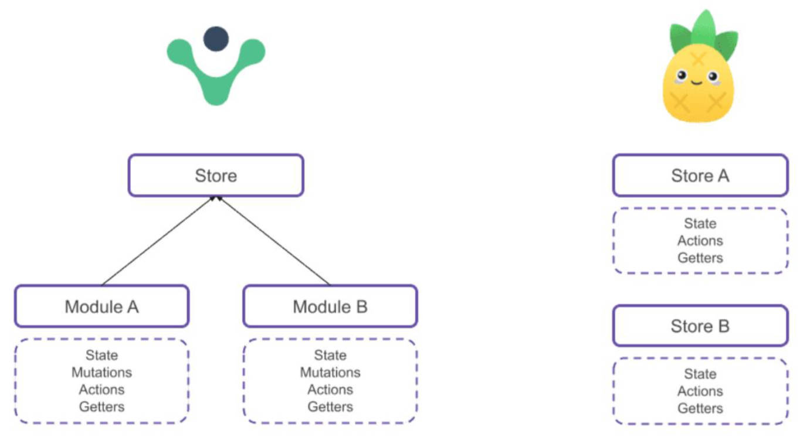

# Vue 中页面数据的 2 种管理方案

分层结构的使用。

- 所有状态数据维护在组件的 data 中，在组件中发送网络请求，将请求下来的数据维护在组件的 data 中。
- 所有的状态数据维护在 store 的 state 中，在 store 中发送网络请求，将请求下来的数据维护在 store 的 state 中，

# Vuex 核心四 actions

## 与 mutations 的不同之处 2 点。

- action 提交的是 mutation，而不是直接变更状态。
- action 可以包含异步操作。

## context 参数。

- `context` 是一个和 store 实例有相同方法和属性的对象。
- 它与 store 实例相同的属性/方法：`state`, `getters`, `commit`, `dispatch`；它特有的属性（有 namespace 的情况下）：`rootState`, `rootGetters`.

## 基本使用。

携带参数，

src / store / index.js

```js
import { createStore } from 'vuex'

const store = createStore({
  state() {
    return {
      counter: 0
    }
  },
  mutations: {
    increment(state, num) {
      state.counter = state.counter + num
    }
  },
  // action 的基本使用，可传递参数。
  actions: {
    incrementAction(ctx, num) {
      setTimeout(() => {
        ctx.commit('increment', num)
      }, 1000)
    }
  }
})
export default store
```

Home.vue

```vue
<template>
  <div>
    计数器：{{ $store.state.counter }}
    <button @click="increment">+100</button>
  </div>
</template>

<script>
import { useStore } from 'vuex'

export default {
  // VOA 中的写法
	methods: {
		increment() {
      // 可传递参数
			this.$store.dispatch('incrementAction', 100)
		}
	},
  // VCA 中的写法
  setup(): {
    const store = useStore()
    function increment() {
      store.dispatch("incrementAction", 10)
    }
  	return { increment }
  }
}
</script>
```

## 对象类型的提交风格

src / store / index.js

```javascript
const store = createStore({
  state() {
    return {
      counter: 0
    }
  },
  mutations: {
    increment(state, count) {
      state.counter = state.counter + count
    }
  },
  actions: {
    // payload 传递的是对象，需要解构。
    incrementAction(ctx, { count }) {
      setTimeout(() => {
        ctx.commit('increment', count)
      }, 1000)
    }
  }
})
export default store
```

Home.vue

```javascript
export default {
  methods: {
    increment() {
      // 对象类型提交时，传递的参数为对象类型。
      this.$store.dispatch({
        type: 'incrementAction',
        count: 100
      })
    }
  }
}
```

## 辅助函数，

在 VOA 和 VCA 中使用。

src / store / index.js

```javascript
import { createStore } from 'vuex'

const store = createStore({
  state() {
    return {
      counter: 0
    }
  },
  mutations: {
    increment(state) {
      state.counter++
    }
  },
  actions: {
    incrementAction(ctx, payload) {
      setTimeout(() => {
        ctx.commit('increment')
      }, 1000)
    }
  }
})
export default store
```

Home.vue

```vue
<template>
  <div>
    计数器：{{ $store.state.counter }}
    <button @click="incrementAction({ name: 'zzt' })">+1</button>
    <button @click="add">+1</button>
  </div>
</template>

<script>
import { useStore, mapActions } from 'vuex'

export default {
  // VOA 中的写法
  methods: {
    ...mapActions(['incrementAction']), // 传入数组的写法
    ...mapActions({
      // 传入对象的写法
      add: 'incrementAction'
    })
  },
  // VCA 中的写法（不推荐）
  setup() {
    const store = useStore()
    const actions = mapActions(['incrementAction'])
    const newActions = {}
    Object.keys(actions).forEach(key => {
      newActions[key] = actions[key].bind({ $store: store })
    })
    return {
      ...mapActions(['incrementAction']),
      ...mapActions({
        add: 'incrementAction'
      })
    }
  }
}
</script>
```

## 返回 Promise

actions 通常是异步的，如何知道什么时候异步操作完成？返回一个 Promise。

src / store / index.js

```javascript
import { createStore } from 'vuex'

const store = createStore({
  state() {
    return {
      counter: 0
    }
  },
  mutations: {
    increment(state) {
      state.counter++
    }
  },
  actions: {
    incrementAction(ctx) {
      return new Promise(resolve => {
        setTimeout(() => {
          ctx.commit('increment')
          resolve('请求完成')
        }, 1000)
      })
    }
  }
})
export default store
```

Home.vue

```vue
<template>
  <div>
    计数器：{{ $store.state.counter }}
    <button @click="incrementAction">+1</button>
  </div>
</template>

<script>
import { useStore } from 'vuex'

export default {
  setup() {
    const store = useStore()
    const incrementAction = () => {
      const promise = store.dispatch('incrementAction').then(res => console.log(res))
    }
    return { incrementAction }
  }
}
</script>
```

# Vuex 核心五 modules，

什么是 modules？

- modules 是用于分割 store 的模块，每个模块拥有自己的 state，getters，mutations，actions，modules（嵌套子模块）。

## 使用场景

Vuex 中使用单一状态树，所有状态集中在一个对象显得比较臃肿，使用 modules 对不同模块的状态进行管理。

使用 modules 后，四个核心怎么获取：

- `store.state.moduleName.stateName`
- `store.getters['moduleName/getterName']`
- `store.commit('moduleName/mutationName')`
- `store.dispatch('moduleName/actionName')`

## 基本使用。

src / store / modules / home.js

```javascript
const home = {
  state() {
    return {
      homeCounter: 100
    }
  }
}
export default home
```

src / store / index.js

```javascript
import { createStore } from 'vuex'
import home from './modules/home'

const store = createStore({
  modules: {
    home
  }
})
export default store
```

Home.vue

```vue
<template>
  <div>HomeCouter: {{ $store.state.home.homeCounter }}</div>
</template>
```

默认情况下，modules 中的 `getters`，如何获取？

Home.vue

```vue
<template>
  <div>
    <!-- 这种方式取不到 home 模块中的 getter -->
    <!-- HomeGetter: {{ $store.state.home.homeGetter }} -->
    <!-- 这种方式才能取到，但是可能会有名命冲突 -->
    HomeGetter: {{ $store.getters.homeGetter }}
  </div>
</template>
```

默认情况下，modules 中的 `getters`, `actions` 和 `mutations` 注册在全局名命空间中。

- 意味着提交一个 mutation，那么所有模块中的同名 mutation 都会触发。

src / store / modules / home.js

```javascript
const home = {
  state() {
    return {
      homeCounter: 100
    }
  },
  getters: {
    homeGetter(state) {
      return state.homeCounter
    }
  },
  mutations: {
    increment(state) {
      state.homeCounter++
    }
  }
}
export default home
```

src / store / index.js

```javascript
import { createStore } from 'vuex'
import home from './modules/home'

const store = createStore({
  state() {
    return {
      counter: 0
    }
  },
  mutations: {
    increment(state) {
      state.counter++
    }
  },
  modules: {
    home
  }
})
export default store
```

Home.vue

```vue
<script>
import { useStore } from 'vuex'

export default {
  setup() {
    const store = useStore()
    const homeIncrement = () => {
      // 在此处直接提交，counter，homeCounter 都会+1
      store.commit('increment')
    }
    return { homeIncrement }
  }
}
</script>
```

## 命名空间。

使 modules 成为带命名空间的模块，需要使用 `namespaced: true`，基本使用。

src / store / modules / home.js

```javascript
const home = {
  namespaced: true
  // ...
}
export default home
```

Home.vue

```vue
<template>
  <div>
    <!-- 获取 home 模块中的 homeGetter -->
    HomeCouter: {{ $store.state.home.homeCounter }} HomeGetter:
    {{ $store.getters['home/homeGetter'] }}
    <button @click="homeIncrement">home+1</button>
  </div>
</template>

<script>
import { useStore } from 'vuex'

export default {
  setup() {
    const store = useStore()
    const homeIncrement = () => {
      // 提交 home 模块中的 increment mutation，dispatch 同理
      store.commit('home/increment')
    }
    return { homeIncrement }
  }
}
</script>
```

**增加名命空间后**，modules 中的 getter 方法有 4 个参数：`state`, `getters`, `rootState`, `rootGetters`.

src / store / modules / home.js

```javascript
const home = {
  namespaced: true,
  state() {
    return {
      homeCounter: 100
    }
  },
  getters: {
    homeGetter(state, getters, rootState, rootGetters) {
      return state.homeCounter
    }
  }
}
export default home
```

**增加名命空间后**，modules 中的 action 方法 context 参数对象有 6 个属性。`commit`, `dispatch`, `state`, `rootState`, `getters`, `rootGetters`

src / store / moudels / home.js

```javascript
const home = {
  namespaced: true,
  state() {
    return {
      homeCounter: 100
    }
  },
  mutations: {
    increment(state) {
      state.homeCounter++
    }
  },
  actions: {
    // {} 解构语法
    homeIncrementAction({ commit, dispatch, state, rootState, getters, rootGetters }) {
      commit('increment')
    }
  }
}
export default home
```

## 派发事件到根组件。

在 modules 中使用 actions 向根提交和派发事件，传第三个参数。

src / store / modules / home.js

```javascript
const home = {
  namespaced: true,
  actions: {
    homeIncrementAction({ commit }) {
      // {} 解构语法
      commit('increment', null, { root: true }) // 第二个参数是 payload，第三个参数是对象，设置 root:true
    }
  }
}
export default home
```

## 辅助函数

### 在 VOA（Vue Options API）中

使用 modules 中对应状态的辅助函数 VOA 的 2 种常用写法。

Home.vue

写法一：

```vue
<script>
import { mapActions, mapGetters, mapMutations, mapState } from 'vuex'

export default {
  computed: {
    ...mapState('home', ['homeCounter']),
    ...mapGetters('home', ['homeGetter'])
  },
  methods: {
    ...mapMutations('home', ['increment']),
    ...mapActions('home', ['homeIncrementAction'])
  }
}
</script>
```

写法二：

```vue
<script>
import { createNamespacedHelpers } from 'vuex'

const { mapActions, mapGetters, mapMutations, mapState } = createNamespacedHelpers('home')
export default {
  computed: {
    ...mapState(['homeCounter']),
    ...mapGetters(['homeGetter'])
  },
  methods: {
    ...mapMutations(['increment']),
    ...mapActions(['homeIncrementAction'])
  }
}
</script>
```

### 在 VCA（Vue Composition API）中

使用 modules 中对应状态的辅助函数 VCA 写法，针对 mapState，mapGetters 重新封装。以 mapState 封装举例：

src / hooks / useState.js

```javascript
import useMapper from './useMapper'
import { mapState, createNamespacedHelpers } from 'vuex'

export default function (mapper, moduleName) {
  let mapperFn = mapState
  if (typeof moduleName === 'string' && moduleName.length > 0) {
    mapperFn = createNamespacedHelpers(moduleName).mapState
  }
  return useMapper(mapper, mapperFn)
}
```

Home.vue

```vue
<script>
import { createNamespacedHelpers } from 'vuex'
import useState from '../hooks/useState'
import useGetters from '../hooks/useGetters'

const { mapActions, mapMutations } = createNamespacedHelpers('home')
export default {
  setup() {
    const states = useState(['homeCounter'], 'home')
    const getters = useGetters(['homeGetter'], 'home')
    const mutations = mapMutations(['increment'])
    const actions = mapActions(['homeIncrementAction'])
    return {
      ...states,
      ...getters,
      ...mutations,
      ...actions
    }
  }
}
</script>
```

# Vue 中 的 nextTick

nextTick 是什么，

- 一个钩子函数，将回调函数加入 Vue 中维护的微任务队列。

nextTick 的使用场景。

- 将回调推迟到下一个 DOM 更新之后执行，例如向 h2 标签中添加内容，获取它添加内容后的高度。

nextTick 的基本使用。

```Vue
<script>
  import { ref, nextTick } from "vue";

  export default {
    setup() {
      const message = ref("")
      const titleRef = ref(null)
      const addMessageContent = () => {
        message.value += "哈哈哈哈哈哈哈哈哈哈"
        // 更新 DOM
        nextTick(() => {
          console.log(titleRef.value.offsetHeight)
        })
      }
      return { message, titleRef, addMessageContent }
    }
  }
</script>

<template>
  <div>
    <h2 class="title" ref="titleRef">{{ message }}</h2>
    <button @click="addMessageContent">添加内容</button>
  </div>
</template>

<style scoped>
  .title {
    width: 120px;
  }
</style>
```

# 认识 pinia

Pinia（发音为/piːnjʌ/，如英语中的“peenya”）是最接近 piña（西班牙语中的菠萝）的词；

Pinia 开始于大概 2019 年，最初是作为一个实验为 Vue 重新设计状态管理，让它用起来像组合式 API（Composition API）。

从那时到现在，最初的设计原则依然是相同的，并且目前同时兼容 Vue2、Vue3，也并不要求你使用 Composition API；

Pinia 本质上依然是一个状态管理的库，用于跨组件、页面进行状态共享（这点和 Vuex、Redux 一样）；

# Pinia 与 Vuex 的区别（面试）

和 Vuex 相比，Pinia 有很多的优势：

- mutations 不再存在：
  - 经常被认为是非常冗长；
  - 最初为了实现 devtools 集成，但这不再是问题；
- 不再有 modules 的嵌套结构：
  - 可以灵活使用每一个 store，它们是通过扁平化的方式来相互使用的；
  - 也不再有命名空间的概念，不需要记住它们的复杂关系；
- 更友好的 TypeScript 支持，Vuex 之前对 TS 的支持很不友好；



# Pinia 基本使用。

## 安装 Pinia

```shell
npm install pinia
```

## 插件注册

src / stores / index.js

```js
import { createPinia } from 'pinia'

const pinia = createPinia() // 创建一个 pinia，将其传递给应用程序
export default pinia
```

src / main.js

```js
import { createApp } from 'vue'
import App from './App.vue'
import pinia from './stores'

const app = createApp(App)
app.use(pinia) // 使用 pinia
app.mount('#app')
```

## 认识 Pinia 中的 Store 实例

Pinia 中一个 store 是一个实体，它持有能够绑定到组件树的状态和业务逻辑，也就是保存了全局的状态；

它有点像始终存在，并且每个人都可以读取和写入的组件；

允许在应用程序中定义任意数量的 store 来管理不同模块的状态；

一个 store 有三个核心概念：

- state、getters、actions；这些概念等同于组件的 data、computed、methods；
- 一旦 store 被实例化，就可以直接在 store 上访问 state、getters 和 actions 中定义的任何属性；

## 定义一个 Store

创建 store 的函数是使用 `defineStore()` 定义的；

它需要一个唯一名称 `name`，作为第一个参数传递；这个 name，也称为 id，是必要的，Pinia 使用它来将 store 连接到 devtools。

返回的函数，统一使用 `useXxx ` 作为命名方案，这是约定的规范；

src / store / home.js

```js
import { defineStore } from 'pinia'

// 返回一个函数
const useHome = defineStore('home', {
  state: () => ({
    name: 'zzt',
    age: 18,
    level: 100,
    couter: 0,
    banners: [],
    recommends: []
  })
})
export default useHome
```

## 使用定义的 store

Store 在它被使用之前是不会创建的，我们可以通过调用之前导出的 useXxx 函数来获取并使用 Store：

注意 Store 获取到后不能被解构，否则会失去响应式：

- 为了从 Store 中提取属性同时保持其响应式，需要使用 Pinia 库提供的 `storeToRefs()`，或 Vue 提供的 `toRefs()` API。

src / components / Home.vue

```vue
<script setup>
import { toRefs } from 'vue'
import { storeToRefs } from 'pinia'
import useHome from '@/stores/home'

const homeStore = useHome()
function incrementCount() {
  homeStore.count++
}
// const { count } = toRefs(homeStore)
const { count } = storeToRefs(homeStore)
</script>

<template>
  <div class="home">
    <h2>Home View</h2>
    <h2>count: {{ homeStore.count }}</h2>
    <h2>count: {{ count }}</h2>
    <button @click="incrementCount">count+1</button>
  </div>
</template>
<style scoped></style>
```

# Pinia 核心一 State

## 认识 state

state 是 store 的核心部分，因为 store 是用来帮助我们管理状态的。

在 Pinia 中，状态被定义为返回初始状态的函数；

## 定义 state

src / stores / home.js

```js
import { defineStore } from 'pinia'

const useHome = defineStore('home', {
  state: () => ({
    name: 'zzt',
    age: 18,
    level: 100,
    friends: []
  })
})
export default useHome
```

## 读取和写入

默认情况下，可以通过 store 实例访问状态来直接读取和写入状态

还可通过 `$patch()` 同时应用多个更改。

Home.vue

```vue
<script setup>
import useHome from '@/stores/home'
import { storeToRefs } from 'pinia'

const homeStore = useHome()
const { name, age, level } = storeToRefs(homeStore)
function changeState1() {
  homeStore.name = 'kobe'
  homeStore.age = 20
  homeStore.level = 200
}
</script>

<template>
  <div class="home">
    <h2>Home View</h2>
    <h2>name: {{ name }}</h2>
    <h2>age: {{ age }}</h2>
    <h2>level: {{ level }}</h2>
    <button @click="changeState">修改 state</button>
  </div>
</template>
```

## 同时修改多个 state

可以通过调用 store 上的 `$patch()` 方法将修改多个状态。

同时，`$patch` 也接受一个函数，用于修改 store 中的集合类型数据

```vue
<script setup>
import useHome from '@/stores/home'
import { storeToRefs } from 'pinia'

const homeStore = useHome()
const { name, age, level } = storeToRefs(homeStore)

function changeStatese() {
  homeStore.$patch({
    name: 'james',
    level: homeStore.level + 1
  })
}
function addFriend() {
  homeStore.$patch(state => {
    state.friends.push({ name: 'CR7', age: '37' })
    state.level = 101
  })
}
</script>

<template>
  <div class="home">
    <h2>Home View</h2>
    <h2>name: {{ name }}</h2>
    <h2>age: {{ age }}</h2>
    <h2>level: {{ level }}</h2>
    <button @click="changeState">修改 state</button>
    <button @click="addFriend">添加 friend</button>
  </div>
</template>
```

## 重置 state

可以通过调用 store 上的 `$reset()` 方法将状态重置到其初始值。

Home.vue

```vue
<script setup>
import useHome from '@/stores/home'
import { storeToRefs } from 'pinia'

const homeStore = useHome()
const { name, age, level } = storeToRefs(homeStore)

function resetState() {
  homeStore.$reset()
}
</script>

<template>
  <div class="home">
    <h2>Home View</h2>
    <h2>name: {{ name }}</h2>
    <h2>age: {{ age }}</h2>
    <h2>level: {{ level }}</h2>
    <button @click="resetState">重置state</button>
  </div>
</template>

<style scoped></style>
```

# Pinia 核心二 Getters

## 认识 Getters

Getters 相当于 Store 的计算属性：

可以用 defineStore() 中的 `getters` 属性定义；

getters 中可以定义接收一个 state 作为参数的函数；

## 定义 Getters

src / store / counter.js

```js
import { defineStore } from 'pinia'
import useUser from './user'

const useCounter = defineStore('counter', {
  state: () => ({
    count: 99,
    friends: [
      { id: 111, name: 'why' },
      { id: 112, name: 'kobe' },
      { id: 113, name: 'james' }
    ]
  }),
  getters: {
    // 1.基本使用
    doubleCount: state => state.count * 2,
    // 2.一个 getter 引入另外一个 getter
    doubleCountAddOne() {
      return this.doubleCount + 1 // this 是 store 实例
    },
    // 3.getters 也支持返回一个函数
    getFriendById: state => id => state.friend.find(item => item.id === id),
    // 4.getters 中用到别的 store 中的数据
    showMessage: state => {
      const userStore = useUser() // 1.获取 user 信息
      return `name:${userStore.name}-count:${state.count}` // 2.拼接信息
    }
  }
})
export default useCounter
```

## 访问 Getters

```vue
<script setup>
import useCounter from '@/stores/counter'
const counterStore = useCounter()
</script>

<template>
  <div class="home">
    <h2>Home View</h2>
    <h2>doubleCount: {{ counterStore.doubleCount }}</h2>
    <h2>doubleCountAddOne: {{ counterStore.doubleCountAddOne }}</h2>
    <h2>friend-111: {{ counterStore.getFriendById(111) }}</h2>
    <h2>showMessage: {{ counterStore.showMessage }}</h2>
  </div>
</template>
```

# Pinia 核心三 Actions

## 认识 Actions

Actions 相当于组件中的 methods。可以使用 `defineStore()` 中的 `actions` 属性定义，并且它们非常适合定义业务逻辑；

和 getters 一样，在 action 中可以通过 `this` 访问整个 store 实例的所有操作；

Actions 中是支持异步操作的，通过返回一个 Promise 告知使用者异步操作执行状态。

## 定义 actiuons

src / stores / home.js

```js
import { defineStore } from 'pinia'

const useHome = defineStore('home', {
  state: () => ({
    banners: [],
    recommends: []
  }),
  actions: {
    async fetchHomeMultidata() {
      const res = await fetch('http://123.207.32.32:8000/home/multidata')
      const data = await res.json()
      this.banners = data.data.banner.list
      this.recommends = data.data.recommend.list
      return data // 异步（async）函数默认会将返回值包裹在 promise 中返回。
    }
  }
})
export default useHome
```

## 执行 Actions

Home.vue

```vue
<script setup>
import useHome from '@/stores/home'

const homeStore = useHome()
// 执行 actions
homeStore.fetchHomeMultidata().then(res => {
  console.log('fetchHomeMultidata 的 action 已经完成了:', res)
})
</script>

<template>
  <div class="home">
    <h2>Home View</h2>
    <h2>轮播的数据</h2>
    <ul>
      <template v-for="item in homeStore.banners">
        <li>{{ item.title }}</li>
      </template>
    </ul>
  </div>
</template>
```

# 认识 axios 库

axios 名称的由来，个人理解：

- 没有具体的翻译，一般认为是 ajax i/o system 的缩写。

## 为什么会有 axios 库？

我们已经可以通过 ajax 技术（XMLHttpRequests / Fetch）发送网络请求，为什么还会有 axios 库这种第三方网络请求库？

1. 原生 ajax 操作步骤过多，需要自行封装，才能保持代码的简洁性。
2. 原生某些功能不具备，如请求拦截，响应拦截。
3. JS 代码运行环境可能不同（浏览器 / Node），造成发送网络请求的方式也不同 （fetch / http 模块）

## 功能特点。

axios 能够帮助我们：

- 在浏览器中发送 ajax 请求；在 node.js 中发送 http 请求
- 支持 Promise API；
- 拦截请求和响应；转换请求和响应数据；

# axios 安装

```shell
npm install axios
```

# axios 的请求方式

- `axios(config) `
- `axios.request(config) `
- `axios.get(url[, config]) `
- `axios.delete(url[, config]) `
- `axios.head(url[, config]) `
- `axios.post(url[, data[, config]]) `
- `axios.put(url[, data[, config]])`
- `axios.patch(url[, data[, config]])`

```js
import axios from 'axios'

// 1.发送 request 请求
axios
  .request({
    url: 'http://123.207.32.32:8000/home/multidata',
    method: 'get'
  })
  .then(res => {
    console.log('res:', res.data)
  })

// 2.发送 get 请求
axios.get(`http://123.207.32.32:9001/lyric?id=500665346`).then(res => {
  console.log('res:', res.data.lrc)
})

axios
  .get('http://123.207.32.32:9001/lyric', {
    params: {
      id: 500665346
    }
  })
  .then(res => {
    console.log('res:', res.data.lrc)
  })

// 3.发送 post 请求
axios
  .post('http://123.207.32.32:1888/02_param/postjson', {
    name: 'zzt',
    password: 123456
  })
  .then(res => {
    console.log('res', res.data)
  })

axios
  .post('http://123.207.32.32:1888/02_param/postjson', {
    data: {
      name: 'zzt',
      password: 123456
    }
  })
  .then(res => {
    console.log('res', res.data)
  })
```

# axios 常见的配置选项

- 请求地址（**常用**）
  - url: '/user',
- 请求类型（**常用**）
  - method: 'get',
- 请根路径（**常用**）
  - baseURL: 'http://www.mt.com/api',
- 自定义的请求头（**常用**）
  - headers:{'x-Requested-With':'XMLHttpRequest'},
- URL 查询对象（**常用**）（get 请求拼接 query 字符串）
  - params:{ id: 12 },
- request body（**常用**）（post 请求请求体）
  - data: { key: 'aa' },
- 超时设置（**常用**）
  - timeout: 1000,
- 请求前的数据处理
  - transformRequest:[function(data){}],
- 请求后的数据处理
  - transformResponse: [function(data){}],
- 查询对象序列化函数
  - paramsSerializer: function(params){ }

```js
import axios from 'axios'

const baseURL = 'http://123.207.32.32:8000'
// 给 axios 实例配置公共的基础配置
axios.defaults.baseURL = baseURL
axios.defaults.timeout = 10000
axios.defaults.headers = {}
// 1.发送 get 请求: /home/multidata
axios.get('/home/multidata').then(res => {
  console.log('res:', res.data)
})
// 2.axios 发送多个请求
axios
  .all([
    // 原理 Promise.all
    axios.get('/home/multidata'),
    axios.get('http://123.207.32.32:9001/lyric?id=500665346')
  ])
  .then(res => {
    console.log('res:', res)
  })
```

# axios 创建实例

为什么要创建 axios 的实例呢?

- 当我们从 axios 模块中导入对象时, 使用的实例是默认的实例；
- 当给该实例设置一些默认配置时, 这些配置就被固定下来了.
- 但是后续开发中, 某些配置可能会不太一样；
- 比如某些请求需要使用特定的 baseURL 或者 timeout 等.
- 这个时候, 我们就可以创建新的实例, 并且传入属于该实例的配置信息.

基本使用。

```js
import axios from 'axios'

// axios 默认库提供给我们的实例对象
axios.get('http://123.207.32.32:9001/lyric?id=500665346')
// 创建其他的实例发送网络请求
const instance1 = axios.create({
  baseURL: 'http://123.207.32.32:9001',
  timeout: 6000,
  headers: {}
})
instance1
  .get('/lyric', {
    params: {
      id: 500665346
    }
  })
  .then(res => {
    console.log('res:', res.data)
  })
const instance2 = axios.create({
  baseURL: 'http://123.207.32.32:8000',
  timeout: 10000,
  headers: {}
})
```

# axios 的请求和响应拦截

axios 也可以设置拦截器：拦截每次请求和响应

- `axios.interceptors.request.use(请求成功拦截, 请求失败拦截)`
- `axios.interceptors.response.use(响应成功拦截, 响应失败拦截)`

基本使用。

```js
import axios from 'axios'

// 对实例配置拦截器，请求拦截
axios.interceptors.request.use(
  config => {
    // 传入请求的配置信息 config
    console.log('请求成功的拦截')
    // 1.开始 loading 的动画
    // 2.对原来的配置进行一些修改
    // 3.添加 header，如认证登录: token / cookie
    // 4.请求参数进行某些转化
    return config
  },
  err => {
    console.log('请求失败的拦截')
    return err
  }
)
// 响应拦截
axios.interceptors.response.use(
  res => {
    console.log('响应成功的拦截')
    // 1.结束 loading 的动画
    // 2.对数据进行转化, 再返回数据
    return res.data
  },
  err => {
    console.log('响应失败的拦截:', err)
    return err
  }
)
axios
  .get('http://123.207.32.32:9001/lyric?id=500665346')
  .then(res => {
    console.log('res:', res)
  })
  .catch(err => {
    console.log('err:', err)
  })
```

# 基于 axios 再封装

为什么要基于 axios 再进行封装？

- 降低对 axios 依赖的耦合度，当 axios 不再维护时，方便切换别的库。

基本使用：

```js
import axios from 'axios'

class ZTRequest {
  constructor(baseURL, timeout = 10000) {
    this.instance = axios.create({
      baseURL,
      timeout
    })
  }
  request(config) {
    return new Promise((resolve, reject) => {
      this.instance
        .request(config)
        .then(res => {
          resolve(res.data)
        })
        .catch(reject)
    })
  }
  get(config) {
    return this.request({ ...config, method: 'get' })
  }
  post(config) {
    return this.request({ ...config, method: 'post' })
  }
}
export default new ZTRequest('http://123.207.32.32:9001')
```
