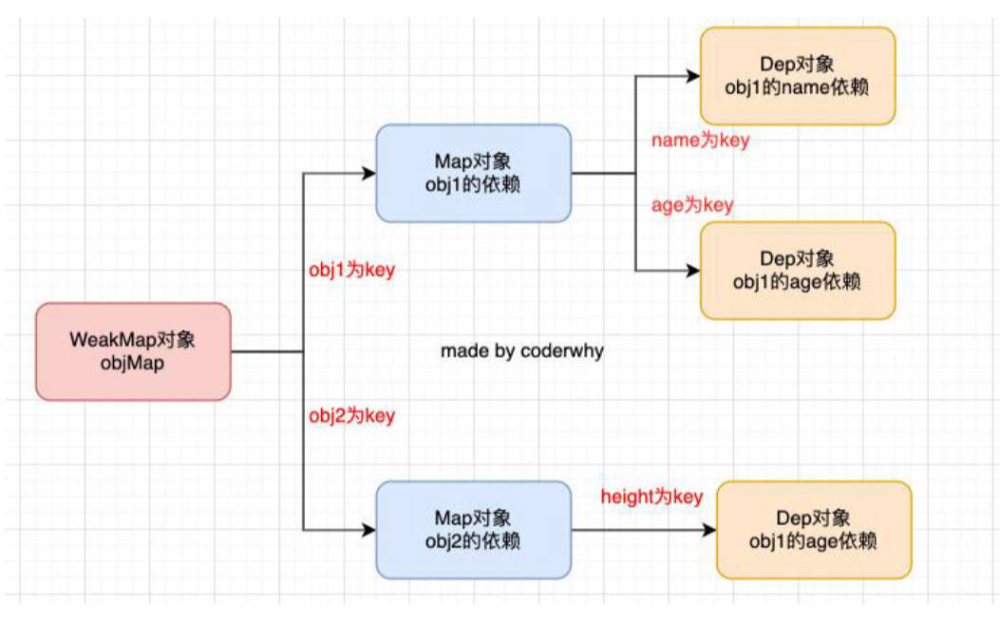

# 什么是响应式？

1. 标识符 `num` 有一个初始值，有一段代码使用了这个值；
2. 那么，当 `num` 有一个新值时，这段代码能够自动执行。

上面这样一种可以自动响应数据变量的代码机制，就称之为是响应式的。

```js
let num = 100

console.log(num * 2)
console.log(num * num)

num = 200
```

# 响应式函数的设计

需要响应的代码，往往设计成函数，响应式函数的设计。

在开发中我们有很多的函数，

- 很明显，下面的函数中 foo 需要在 obj 的 name 发生变化时，重新执行，做出响应；
- bar 函数是一个完全独立于 obj 的函数，它不需要执行任何响应式的操作；

```js
// 对象的响应式
const obj = {
  name: "zzt",
  age: 18
}

function foo() {
  console.log(obj.name)
  console.log(obj.age)
}
function bar() {
  const result = 20 + 30
  console.log('Hello Frog')
}

// 修改 obj 对象
obj.name = "kobe"
obj.age = 20
```

我们如何区分一个函数需要响应式，还是不需要响应式呢？

1. 这个时候我们封装一个新的函数 `watchFn`； 
2. 凡是传入到 `watchFn` 的函数，就是需要响应式的，将它们放入到一个数组结构中进行收集；
3. 其他默认定义的函数都是不需要响应式的。

```js
const obj = {
  name: "zzt",
  age: 18
}

// 设置一个专门执行响应式函数的一个函数，依赖收集到一个数组中。
const reactiveFns = []
function watchFn(fn) {
  reactiveFns.push(fn)
  fn()
}

watchFn(function foo() {
  console.log('foo：', obj.name)
  console.log('foo：', obj.age)
	console.log('foo function')
})
function bar() {
  const result = 20 + 30
  console.log('Hello Frog')
}

// 修改 obj 的属性
console.log("name发生变化-----------------------")
obj.name = "kobe"
reactiveFns.forEach(fn => {
  fn()
})
```

# 响应式依赖收集重构，使用类收集。

目前我们收集的依赖是放到一个数组 `reactiveFns` 中来保存的，但是这里会存在数据管理的问题： 
- 我们在实际开发中需要监听对象中很多属性的响应式，它们很多属性的变化，都会有对应的响应式函数； 
- 我们不可能在全局维护一大堆的数组来保存这些响应函数；

所以我们要设计一个类，这个类用于管理**某一个对象的某一个属性**的所有响应式函数：
- 相当于替代了原来的简单 reactiveFns 的数组；

```js
class Depend {
  constructor() {
    this.reactiveFns = []
  }
  addDepend(fn) {
    if (fn) {
      this.reactiveFns.push(fn)
    }
  }
  notify() {
    this.reactiveFns.forEach(fn => {
      fn()
    })
  }
}

const obj = {
  name: "zzt",
  age: 18
}

// 设置一个专门执行响应式函数的一个函数
const dep = new Depend()
function watchFn(fn) {
  dep.addDepend(fn)
  fn()
}

watchFn(function foo() {
  console.log("foo:", obj.name)
  console.log("foo", obj.age)
  console.log("foo function")
})

// 修改 obj 的属性
console.log("name发生变化-----------------------")
obj.name = "kobe"
dep.notify()
```

# 监听属性的变化，执行响应式代码。

那么我们接下来就可以通过之前学习的方式来监听对象属性的变化： 
- 方式一：通过 `Object.defineProperty` 的方式（vue2 采用的方式）； 
- 方式二：通过 `new Proxy` 的方式（vue3 采用的方式）；

我们这里先以 `Object.defineProperty` 的方式来监听：

```js
class Depend {
  constructor() {
    this.reactiveFns = []
  }
  addDepend(fn) {
    if (fn) {
      this.reactiveFns.push(fn)
    }
  }
  notify() {
    this.reactiveFns.forEach(fn => fn())
  }
}

const obj = {
  name: "zzt",
  age: 18
}

const dep = new Depend()
function watchFn(fn) {
  dep.addDepend(fn)
  fn()
}

// 方案一: Object.defineProperty() -> Vue2
Object.keys(obj).forEach(key => {
  let value = obj[key]

  Object.defineProperty(obj, key, {
		set: function(newValue) {
			// 如果在此处使用 `obj[key] = newValue` 会产生递归
      value = newValue
      dep.notify()
    },
    get: function() {
      return value
    }
  })
})

watchFn(function foo() {
  console.log("foo:", obj.name)
  console.log("foo", obj.age)
  console.log("foo function")
})
watchFn(function bar() {
  console.log("bar:", obj.name + " hello")
  console.log("bar:", obj.age + 10)
  console.log("bar function")
})

// 修改obj的属性
console.log("name发生变化-----------------------")
obj.name = "kobe"

console.log("age发生变化-----------------------")
obj.age = 20

console.log("name发生变化-----------------------")
obj.name = "james"
```

# 自动收集依赖

理解依赖管理的数据结构。

1. 我们目前是创建了一个 Depend 对象，用来管理对于 name 变化需要监听的响应函数： 
2. 但是，前面也提到，在实际开发中我们会有不同的对象，另外会有不同的属性需要管理；
3. 我们如何可以使用一种数据结构来管理不同对象的不同依赖关系呢？最好的办法是通过 WeakMap 来实现。




自动收集依赖

```js
/**
  1.dep 对象数据结构的管理(最难理解)
		* 每一个对象的每一个属性都会对应一个 dep 对象
		* 同一个对象的多个属性的 dep 对象是存放一个 map 对象中
		* 多个对象的 map 对象, 会被存放到一个 objMap（WeakMap 类型） 的对象中
  2.依赖收集: 当执行 get 函数, 自动的添加 fn 函数
 */
class Depend {
  constructor() {
    this.reactiveFns = []
  }
  addDepend(fn) {
    if (fn) {
      this.reactiveFns.push(fn)
    }
  }
  notify() {
    this.reactiveFns.forEach(fn => {
      fn()
    })
  }
}

let reactiveFn = null // reactiveFns 是自由变量（闭包中的概念）。
function watchFn(fn) {
  reactiveFn = fn
  fn()
  reactiveFn = null
}

// 封装一个函数: 负责通过 obj 的 key 获取对应的 Depend 对象
const objMap = new WeakMap()
function getDepend(obj, key) {
  // 1.根据对象 obj, 找到对应的 map 对象
  let map = objMap.get(obj)
  if (!map) {
    map = new Map()
    objMap.set(obj, map)
  }
  // 2.根据 key, 找到对应的 depend 对象
  let dep = map.get(key)
  if (!dep) {
    dep = new Depend()
    map.set(key, dep)
  }
  return dep
}

const obj = {
  name: "zzt",
  age: 18
}

// 方案一: Object.defineProperty() -> Vue2
Object.keys(obj).forEach(key => {
  let value = obj[key]
  Object.defineProperty(obj, key, {
    set: function(newValue) {
      value = newValue
      const dep = getDepend(obj, key)
      dep.notify()
    },
    get: function() {
      // 找到对应的 obj 对象的 key 对应的 dep 对象
      const dep = getDepend(obj, key)
      dep.addDepend(reactiveFn)
      return value
    }
  })
})

// ========================= 业务代码 ========================

watchFn(function foo() {
  console.log("foo function")
  console.log("foo:", obj.name)
  console.log("foo", obj.age)
})
watchFn(function bar() {
  console.log("bar function")
  console.log("bar:", obj.age + 10)
})

// 修改obj的属性
console.log("name发生变化-----------------------")
obj.name = "kobe"
console.log("age发生变化-----------------------")
obj.age = 20
```

# 多个对象响应式，并对 Depend 进行重构

为什么对 Depend 类重构？因为面临了以下问题：

- 如果函数中有用到两次 key，比如 name，那么这个函数会被收集两次，这是多余的；

- 我们并不希望将添加 reactiveFn 放到 get 描述符的监听中，因为它是属于 Dep 的行为；

解决办法：

1. 不使用数组，而是使用 Set； 
2. 添加一个新的方法，用于收集依赖；


```js
class Depend {
  constructor() {
    this.reactiveFns = new Set()  // 为保证响应式函数不重复执行，使用 Set 代替数组。
  }
  depend() {
    if (reactiveFn) {
      this.reactiveFns.add(reactiveFn) // 并不希望将添加 reactiveFn 放到 get 中，因为它是属于 Dep 的行为；
    }
  }
  notify() {
    this.reactiveFns.forEach(fn => {
      fn()
    })
  }
}

// 设置一个专门执行响应式函数的一个函数
let reactiveFn = null
function watchFn(fn) {
  reactiveFn = fn
  fn()
  reactiveFn = null
}

// 封装一个函数: 负责通过 obj 的 key 获取对应的 Depend 对象
const objMap = new WeakMap()
function getDepend(obj, key) {
  // 1.根据对象 obj, 找到对应的 map 对象
  let map = objMap.get(obj)
  if (!map) {
    map = new Map()
    objMap.set(obj, map)
  }
  // 2.根据 key, 找到对应的 depend 对象
  let dep = map.get(key)
  if (!dep) {
    dep = new Depend()
    map.set(key, dep)
  }
  return dep
}

// 方式二: new Proxy() -> Vue3
function reactive(obj) {
  const objProxy = new Proxy(obj, {
    set: function(target, key, newValue, receiver) {
      Reflect.set(target, key, newValue, receiver)
      const dep = getDepend(target, key)
      dep.notify()
    },
    get: function(target, key, receiver) {
      const dep = getDepend(target, key)
      dep.depend()
      return Reflect.get(target, key, receiver)
    }
  })
  return objProxy
}

// ========================= 业务代码 ========================

console.log("=============== obj =================")
const obj = reactive({
  name: "zzt",
  age: 18,
  address: "深圳市"
})

watchFn(function() {
  console.log(obj.name)
  console.log(obj.age)
  console.log(obj.age)
})

// 修改name
obj.name = "kobe"
obj.age = 20
obj.address = "上海市"

console.log("=============== user =================")
const user = reactive({
  nickname: "abc",
  level: 100
})

watchFn(function() {
  console.log("nickname:", user.nickname)
  console.log("level:", user.level)
})

user.nickname = "cba"
```

项目开发模式的理解。
云服务器购买，项目打包和部署。
远程连接云服务器。
