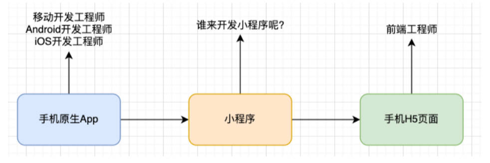
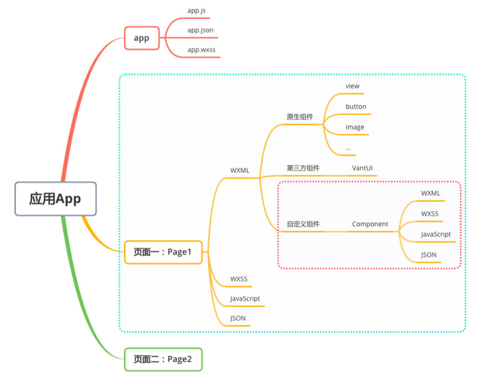
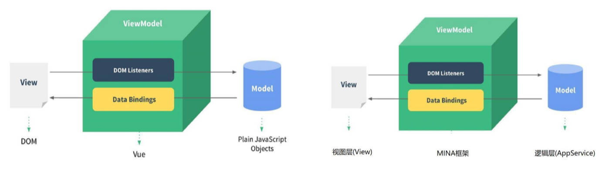
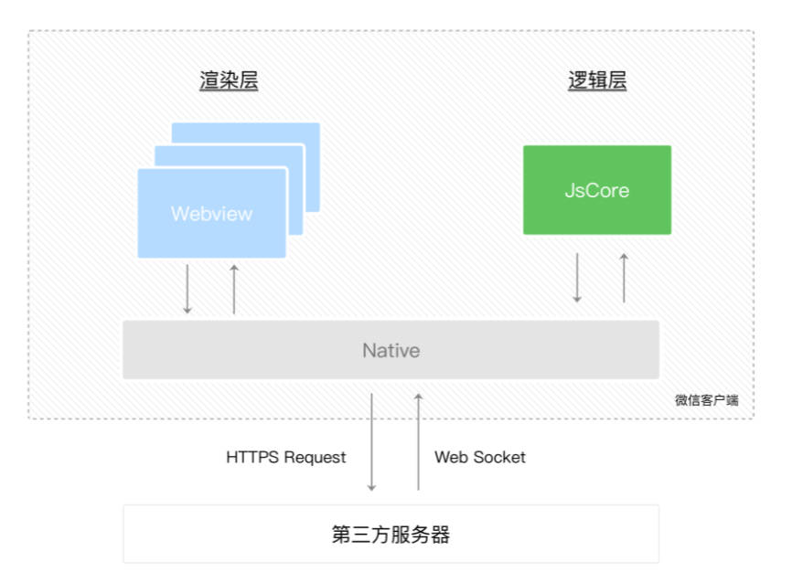

# 什么是小程序？

小程序是什么呢？

- 小程序（Mini Program）是一种不需要下载安装即可使用的应用，它实现了“触手可及”的梦想，使用起来方便快捷，用完即走。
- 事实上，目前小程序在我们生活中已经随处可见（特别是这次疫情的推动，不管是什么岗位、什么年龄阶段的人，都需要打开健康码）；

最初我们提到小程序时，往往指的是微信小程序：但是目前小程序技术本身已经被各个平台所实现和支持。那么目前常见的小程序有哪些呢？

- 微信小程序、支付宝小程序、淘宝小程序、抖音小程序、头条小程序、QQ 小程序、美团小程序等等；

# 小程序的发展背景

各个平台小程序大概的发布时间线：

- 2017 年 1 月 微信小程序上线，依附于微信 App；
- 2018 年 7 月 百度小程序上线，依附于百度 App；
- 2018 年 9 月 支付宝程序线，依附于支付宝 App；
- 2018 年 10 月 抖音小程序上线，依附于抖音 App；
- 2018 年 11 月 头条小程序上线，依附于头条 App；
- 2019 年 5 月 QQ 小程序上线，依附于 QQApp；
- 2019 年 10 月 美团小程序上线，依附于美团 App；

各平台为什么都要支持小程序？

第一：你有，我也得有。

- 大厂竞争格局中一个重要的一环。

第二：小程序作为介于 H5 页面和 App 之间的一项技术，它有自身很大的优势；

- 体验比传统 H5 页面要好很多；
- 相当于传统的 App，使用起来更加方便，不需要在应用商店中下载安装，甚至注册登录等麻烦的操作；

第三：小程序可以间接的动态为 App 添加新功能。

- 传统的 App 更新需要先打包，上架到应用商店之后需要通过审核（App Store）；
- 但是小程序可以在 App 不更新的情况下，动态为自己的应用添加新的功能需求；

那么目前在这么多小程序的竞争格局中，哪一个是使用最广泛的呢？

- 显然是微信小程序，目前支付宝、抖音小程序也或多或少有人在使用；
- 其实我们透过小程序看本质，他们本身还是应用和平台之间的竞争，有最大流量入口的平台，对应的小程序也是用户更多一些；
- 目前在公司开发小程序主要开发的还是微信小程序，其他平台的小程序往往是平台本身的一些公司或者顺手开发的；

所以重点学习的一定是微信小程序开发。

# 小程序的产品定位：

小程序的产品定位：

- 介于原生 App 和手机 H5 页面之间的一个产品定位。

那么小程序由谁来开发？

1. 由谁开发事实上是由它的技术特点所决定的，比如微信小程序的技术栈主要是 WXML、WXSS、JavaScript；
2. 它更接近于我们前端的开发技术栈，所以小程序都是由我们前端来开发的；



# 小程序开发技术选型

原生小程序开发：

- 微信小程序：[开发文档](https://developers.weixin.qq.com/miniprogram/dev/framework/)
  - 主要技术包括：WXML、WXSS、JavaScript；
- 支付宝小程序：[开发文档](https://opendocs.alipay.com/mini/developer)
  - 主要技术包括：AXML、ACSS、JavaScript；

选择框架开发小程序：

- mpvue（不推荐）：

  - mpvue 是一个使用 Vue 开发小程序的前端框架，也是支持微信小程序、百度智能小程序，头条小程序和支付宝小程序；
  - 该框架在 2018 年之后就不再维护和更新了，所以目前已经被放弃；

- wepy（不推荐）：

  - WePY (发音: /'wepi/)是由腾讯开源的，一款让小程序支持组件化开发的框架，通过预编译的手段让开发者可以选择自己喜欢的开发风格去开发小程序。
  - 该框架目前维护的也较少，在前两年还有挺多的项目在使用，现在已不推荐使用；

- uni-app：
  - 由 DCloud 团队开发和维护（HBuild 也是该团队开发）；
  - uni-app 是一个使用 Vue 开发所有前端应用的框架，开发者编写一套代码，可发布到 iOS、Android、Web（响应式）、以及各种小程序（微信/支付宝/百度/头条/飞书/QQ/快手/钉钉/淘宝）、快应用等多个平台。
  - uni-app 目前是很多公司的技术选型，特别是希望适配移动端 App 的公司；
- taro：

  - 由京东团队开发和维护；
  - taro 是一个开放式跨端跨框架解决方案，支持使用 React / Vue / Nerv 等框架来开发微信/京东/百度/支付宝/字节跳动/QQ/飞书小程序，H5 / RN 等应用；
  - taro 因为本身支持 React、Vue 的语法，给了我们更加灵活的选择空间；特别是在 Taro3.x 之后，支持 Vue3、React Hook 写法等；

    > taro['tɑ:roʊ]，泰罗·奥特曼，宇宙警备队总教官，实力最强的奥特曼；

uni-app 和 taro 开发原生 App：

- 无论是适配原生小程序还是原生 App，都有较多的适配问题，所以你还是需要多了解原生的一些开发知识；
- 产品使用体验整体相较于原生 App 差很多，仍然不是最终解决方案；

- 也有其他的技术选项来开发原生 App，如 ReactNative、Flutter（更接近原生）；

# 准备 AppID 和开发工具

申请 AppID：[接入流程](https://mp.weixin.qq.com/cgi-bin/wx)

下载微信开发者工具：官方提供的开发工具，必须下载安装：[下载地址](https://developers.weixin.qq.com/miniprogram/dev/devtools/download.html)

> 新建 Page 包的 2 种方式：
>
> - 在开发工具中创建页面，component 右击 -> 新建 Page；
> - app.json 中添加路径。

# 小程序开发使用的技术栈

小程序的核心技术主要是三个：

- 页面布局：WXML，类似 HTML；
- 页面样式：WXSS，几乎就是 CSS (某些不支持，某些进行了增强，如 rpx 单位，但是基本是一致的) ；
- 页面脚本：JavaScript + WXS (WeixinScript) ；

如果你之前已经掌握了 Vue 或者 React 等框架开发，那么学习小程序是更简单的；因为里面的核心思想都是一致的（比如组件化开发、数据响应式、mustache 语法、事件绑定等等）

# 小程序项目结构



# 小程序文档指南

[指南](https://developers.weixin.qq.com/miniprogram/dev/framework/)：小程序起步。

[框架](https://developers.weixin.qq.com/miniprogram/dev/reference/)：项目的配置文件；options API；项目文件的语法。

[组件](https://developers.weixin.qq.com/miniprogram/dev/component/)：WXML 中用到的组件（HTML 中称为元素，移动端原生称为控件，其中包括了 webview）。

[API](https://developers.weixin.qq.com/miniprogram/dev/api/)：原生提供的类似于 wx.request 这样用于发送网络请求的 API。

[平台服务](https://developers.weixin.qq.com/miniprogram/dev/platform-capabilities/)：微信提供的一些特色功能。

[服务器](https://developers.weixin.qq.com/miniprogram/dev/OpenApiDoc/)：需要配合后端服务完成的一些操作，比如获取用户的手机号。

[工具](https://developers.weixin.qq.com/miniprogram/dev/devtools/devtools.html)：微信开发工具。

[云开发](https://developers.weixin.qq.com/miniprogram/dev/wxcloud/basis/getting-started.html)：云开发相关 API

[云托管](https://developers.weixin.qq.com/miniprogram/dev/wxcloudrun/src/)：省去购买云服务器，托管后端服务代码。

更新日志。

# 小程序开发体验

三个案例：1.数据绑定；2.列表渲染；3.事件监听。

index.wxml

```html
<!-- 1.显示普通的文本 -->
<text class="title">我是普通的文本</text>

<!-- 2.动态绑定message属性 -->
<view class="message">{{ message }}</view>

<!-- 3.动态展示列表数据 -->
<view class="movies">
  <!-- 可省略 wx:for-item="item"、wx:for-index="index" -->
  <block wx:for="{{ movies }}" wx:key="*this">
    <view> {{ item }}-{{ index }} </view>
  </block>
</view>

<!-- 4.事件绑定: 计数器案例 -->
<view class="counter">
  <view class="count">当前计数: {{ counter }}</view>
  <button size="mini" type="primary" bindtap="increment">+1</button>
  <button size="mini" type="warn" bindtap="decrement">-1</button>
</view>
```

index.js

```js
// 实例化: 页面实例
Page({
  data: {
    // 1.案例一: 数据绑定 mustache 语法
    message: 'Hello World',
    // 2.案例二: 列表数据
    movies: ['少年派', '大话西游', '星际穿越', '独行月球'],
    // 3.案例三: 计数器
    counter: 0
  },
  // 监听的事件方法
  increment() {
    // 修改 data 中的数据, 但是你的修改并不会引起页面的刷新(自动检测你的新数据重新渲染页面, 在小程序中不会, 在 react 中也不会)
    // this.data.counter += 1
    // console.log(this.data.counter);

    // 修改 data, 并且希望页面重新渲染, 这里必须使用 this.setData()
    this.setData({
      counter: this.data.counter + 1
    })
  },
  decrement() {
    this.setData({
      counter: this.data.counter - 1
    })
  }
})
```

> 页面事件绑定的方法，直接写在 Page 传入的对象中，组件中要写在 methods option 中。

# 小程序的启动过程

1. 加载 app.json
2. 运行 app.js，创建 app 实例
3. 加载 app.json 中指定的第一个页面（使用双线程模型）创建页面实例，通过 `Page()` 函数。
4. ...

# 小程序中组件与 HTML 中元素的类比

小程序中称为组件，HTML 中称为元素。

- view <-> div
- text <-> span
- image <-> img
- block <-> template

APP 中称为控件，其中就包含控件 `webview`

# 理解小程序中的 MVVM 架构

Vue 的 MVVM 和小程序 MVVM 对比：



MVVM 为什么好用呢?

- DOM Listeners: ViewModel 层可以将 DOM 的监听绑定到 Model 层。
- Data Bindings: ViewModel 层可以将数据的变量, 响应式的反应到 View 层。

MVVM 架构将我们从命令式编程转移到声明式编程。

# 小程序的双线程模型

谁是小程序的宿主环境呢？微信客户端.。

- 宿主环境为了执行小程序的各种文件：wxml 文件、wxss 文件、js 文件

当小程序基于 WebView 环境下渲染时，

- WebView 的 JS 逻辑、DOM 树创建、CSS 解析、样式计算、Layout、Paint (Composite) 都发生在同一线程，在 WebView 上执行过多的 JS 逻辑可能阻塞渲染，导致界面卡顿。

以此为前提，小程序同时考虑了性能与安全，采用了目前称为「双线程模型」的架构。

- WXML 模块和 WXSS 样式运行于渲染层，渲染层使用 WebView 线程渲染（一个程序有多个页面，会使用多个 WebView 的线程）。
- JS 脚本（app.js / home.js 等）运行于逻辑层，逻辑层使用 JsCore 运行 JS 脚本。
- 这两个线程都会经由微信客户端（Native）进行中转交互。



了解 skyline 渲染引擎，目前是 Beta 版本。

# 小程序的配置文件

小程序的很多开发需求被规定在了配置文件中。为什么这样做呢?

- 这样做可以更有利于我们的开发效率；
- 并且可以保证开发出来的小程序的某些风格是比较一致的；比如导航栏、底/顶部 TabBar，以及页面路由等等。

常见的配置文件有哪些呢?

- `project.config.json`：项目配置文件, 比如项目名称、appid 等；[官方文档](https://developers.weixin.qq.com/miniprogram/dev/devtools/projectconfig.html)
- `project.private.config.json`： 文件是私有配置文件，应放入 .gitignore 中
- `sitemap.json`：小程序搜索相关的；[官方文档](https://developers.weixin.qq.com/miniprogram/dev/framework/sitemap.html)
- `app.json`：全局配置；
- `page.json`：页面配置；

# 全局配置文件 app.json

全局配置比较多, 我们这里将几个比较重要的. 完整的查看[官方文档](https://developers.weixin.qq.com/miniprogram/dev/reference/configuration/app.html)

常见的配置：

| 属性   | 类型     | 必填 | 描述               |
| ------ | -------- | ---- | ------------------ |
| pages  | String[] | 是   | 页面路径列表       |
| window | Object   | 否   | 全局的默认窗口表现 |
| tabBar | Object   | 否   | 底部 tab 栏的表现  |

- pages: 页面路径列表
  - 用于指定小程序由哪些页面组成，每一项都对应一个页面的路径（含文件名）信息。
  - 小程序中所有的页面都是必须在 pages 中进行注册的。
- window: 全局的默认窗口展示
- tabBar: 底部 tab 栏的展示

## 配置一个 tabbar

```json
{
  "pages": [
    "pages/index/index",
    "pages/favor/favor",
    "pages/order/order",
    "pages/profile/profile",
    "pages/01test/index"
  ],
  "window": {
    "backgroundTextStyle": "dark",
    "navigationBarBackgroundColor": "#ff8189",
    "navigationBarTitleText": "ZT旅途",
    "navigationBarTextStyle": "white"
  },
  "tabBar": {
    "selectedColor": "#ff8189",
    "list": [
      {
        "text": "首页",
        "pagePath": "pages/index/index",
        "iconPath": "assets/tabbar/home.png",
        "selectedIconPath": "assets/tabbar/home_active.png"
      },
      {
        "text": "收藏",
        "pagePath": "pages/favor/favor",
        "iconPath": "assets/tabbar/category.png",
        "selectedIconPath": "assets/tabbar/category_active.png"
      },
      {
        "text": "订单",
        "pagePath": "pages/order/order",
        "iconPath": "assets/tabbar/cart.png",
        "selectedIconPath": "assets/tabbar/cart_active.png"
      },
      {
        "text": "我的",
        "pagePath": "pages/profile/profile",
        "iconPath": "assets/tabbar/profile.png",
        "selectedIconPath": "assets/tabbar/profile_active.png"
      }
    ]
  },
  "style": "v2",
  "sitemapLocation": "sitemap.json"
}
```

# 页面配置文件 page.json

每一个小程序页面也可以使用 `.json` 文件来对本页面的窗口表现进行配置。[官方文档](https://developers.weixin.qq.com/miniprogram/dev/reference/configuration/page.html)

页面中配置项在当前页面会覆盖 `app.json` 的 `window` 中相同的配置项。

## 配置上拉刷新和触底加载更多

pages / profile / index.json

```json
{
  "usingComponents": {},
  "navigationBarTitleText": "个人信息",
  "navigationBarBackgroundColor": "#f00",
  "enablePullDownRefresh": true, // 上拉刷新
  "onReachBottomDistance": 100 // 触底前 100px，触发触底的回调
}
```

pages / profile / index.js

```js
Page({
  data: {
    avatarURL: '',
    listCount: 30
  },

  // 监听下拉刷新
  onPullDownRefresh() {
    console.log('用户进行下拉刷新~')

    // 模拟网络请求:
    setTimeout(() => {
      this.setData({ listCount: 30 })

      // API: 停止下拉刷新
      wx.stopPullDownRefresh({
        success: res => {
          console.log('成功停止了下拉刷新', res)
        },
        fail: err => {
          console.log('失败停止了下拉刷新', err)
        }
      })
    }, 1000)
  },

  // 监听页面滚动到底部
  onReachBottom() {
    console.log('onReachBottom')
    this.setData({
      listCount: this.data.listCount + 30
    })
  }
})
```
