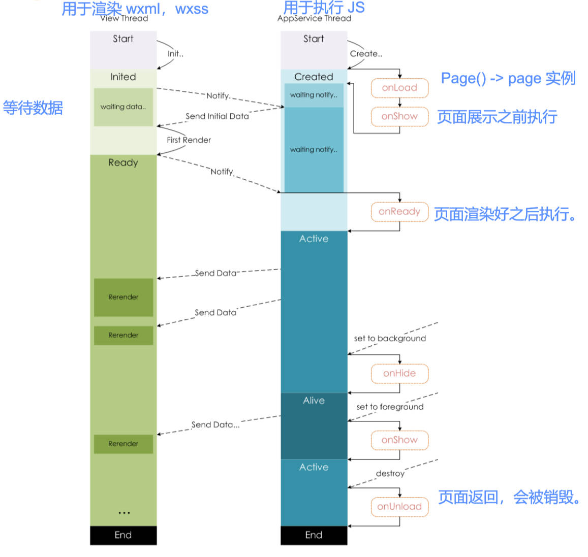
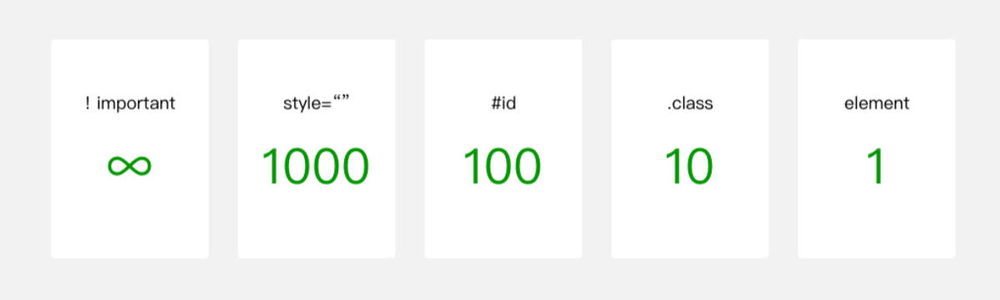

# 注册 App，理解 App 函数。

APP 函数：[官方文档](https://developers.weixin.qq.com/miniprogram/dev/reference/api/App.html)

- 每个小程序都需要在 `app.js` 中调用 `App` 函数 注册小程序实例，全局只有一个 app 实例；
- 在注册时, 可以绑定对应的生命周期函数；
- 在生命周期函数中, 执行对应的代码；

注册 app 时，我们通常会做些什么？

1. 监听生命周期函数，
   - 判断小程序的进入场景。

   - 执行对应的业务逻辑，比如在某个生命周期函数中进行登录操作或者请求网络数据；

2. 因为 app 实例只有一个，并且是全局共享的（单例对象），所以我们可以将一些共享数据放在这里（仅限非响应式的数据，如 token，用户信息等等）；

## 案例演示：

判断小程序的进入场景。[场景值](https://developers.weixin.qq.com/miniprogram/dev/framework/app-service/scene.html)

app.js

```js
App({
  onLaunch(options) {
    console.log("scene code:", options.scene);
  },
  onShow(options) {
    console.log("scene code:", options.scene);
  },
})
```

定义全局的数据用于在页面中共享；

在生命周期中执行对应的业务逻辑，如进行登录操作或者请求网络数据等初始化工作。

1. 从 Storage 读取数据，如没有数据或数据已失效，进行下一步操作。
2. 登录操作
3. 将数据保存 Storage 中
4. 保存到 globalData 中

app.js

```js
App({
  // globalData 是自己定义的属性名，用于共享数据，数据不是响应式的, 这里共享的数据通常是一些固定的数据
  globalData: {
    token: "",
    userInfo: {}
  },
  onLaunch(options) {
    // 1.从本地获取保存到 storage 中的 token / userInfo
    const token = wx.getStorageSync("token")
    const userInfo = wx.getStorageSync("userInfo")
    // 2.先模拟进行登录操作(判断逻辑)，真实登录操作在后续章节中讲解。
    if (!token || !userInfo) {
      // 发送网络请求, 优先请求一些必要的数据
      wx.request({ url: 'url'})
      // 将登录成功的数据, 保存到 storage
      wx.setStorageSync("token", "kobetoken")
      wx.setStorageSync("userInfo", { nickname: "kobe", level: 100 })
      // 3.将获取到数据保存到 globalData 中
      this.globalData.token = token
      this.globalData.userInfo = userInfo
    }
  }
})
```

pages \ order \ order.js

```js
Page({
  data: {
    userInfo: {}
  },
  onLoad() {
    // 1.获取 app 实例对象
    const app = getApp()
    // 2.从 app 实例对象获取数据
    const token = app.globalData.token
    const userInfo = app.globalData.userInfo
    // 3.拿到 token 后，可发送网络请求
    // 4.将数据展示到界面上面
    this.setData({ userInfo })
  }
})
```

> 微信小程序跳转的 page 路径中（`wx.navigateTo`），不能有中文。

# 注册页面 理解 Page 函数。

Page 函数：[官方文档](https://developers.weixin.qq.com/miniprogram/dev/reference/api/Page.html)

- 小程序中的每个页面, 都有一个对应的 js 文件, 其中调用 `Page` 函数注册页面实例。
- 在注册时, 可以绑定初始化数据、生命周期回调、事件处理函数等。

注册 page 时，通常会做些什么？

1. 初始化一些数据 data，以方便被 wxml 引用展示；
2. 在生命周期函数中发送网络请求，从服务器获取数据；
3. 监听 wxml 中的事件，绑定对应的事件函数；
4. 其他一些监听（比如页面滚动、上拉刷新、下拉加载更多等）；

## 案例理解

发送网络请求，请求轮播图数据并展示。

index.js

```js
Page({
  data: {
    banners: [],
    recommends: [],
    counter: 100,
    btns: ["red", "blue", "green", "orange"]
  },
  onLoad() {
    // 发送网络请求，请求轮播图数据。
    wx.request({
      url: "http://123.207.32.32:8000/home/multidata",
      success: res => {
        const data = res.data.data
        const banners = data.banner.list
        const recommends = data.recommend.list
        this.setData({ banners, recommends })
      }
    })
  },

  // 处理自定义事件：绑定 wxml 中产生事件后的回调函数
  onBtnClick(event) {
    console.log("btn click:", event.target.dataset.color);
  },

  // 处理原生事件：绑定下拉刷新/达到底部/页面滚动
  onPullDownRefresh() {
    console.log("onPullDownRefresh");
  },
  onReachBottom() {
    console.log("onReachBottom");
  },
  onPageScroll(event) {
    console.log("onPageScroll:", event);
  },

  // 生命周期函数:
  onShow() {
    console.log("onShow");
  },
  onReady() {
    console.log("onReady");
  },
  onHide() {
    console.log("onHide");
  },
  onUnload() {
    console.log("onUnload");
  }
})
```

> 小程序中发送网络请求，要注册合法域名。

index.wxml

```html
<view class="banner">
  <swiper circular autoplay indicator-dots>
    <block wx:for="{{ banners }}" wx:key="acm">
      <swiper-item>
        <!-- image 组件默认宽度和高度: 320 x 240 -->
        <image mode="widthFix" src="{{ item.image }}"></image>
      </swiper-item>
    </block>
  </swiper>
</view>

<view class="counter">
  <view>当前计数: {{ counter }}</view>
</view>

<view class="buttons">
  <block wx:for="{{ btns }}" wx:key="*this">
    <button
      class="btn"
      style="background: {{ item }};"
      bindtap="onBtnClick"
      data-color="{{ item }}"
    >
      {{ item }}
    </button>
  </block>
</view>

<view class="list">
  <block wx:for="{{ 30 }}" wx:key="*this">
    <view>列表数据:{{ item }}</view>
  </block>
</view>
```

# Page 页面的生命周期

结合双线程模型，理解 Page 页面的生命周期。




# text 组件

text 组件：[官方文档](https://developers.weixin.qq.com/miniprogram/dev/component/text.html)

常用的属性

- `user-select` 属性决定文本内容是否可以让用户选中。
- `space` 有三个取值(了解)。
- `decode` 是否解码(了解)，默认不解码，即展示原字符。
	- decode 可以解析的有 `&nbsp;` `&lt;` `&gt;` `&amp;` `&apos;` `&ensp;` `&emsp;`

index.wxml

```html
<text>Hello World</text>
<text user-select>{{ message }}</text>
<text decode>&gt;</text>
```

# button 组件

button 组件：[官方文档](https://developers.weixin.qq.com/miniprogram/dev/component/button.html)

Button 组件用于创建按钮，默认**块级元素**

- 设置 `size=“mini"` 时，本质是通过 css 将样式改成：`width: auto; display: inline-block`；其它属性同理，本质也是改变样式。
- `open-type` 属性的使用。用于开启微信开放能力，比如，获取用户信息和手机号（个人开发者无权限）.

> `wx.getUserInfo` API 用于获取用户信息，直接使用已经失效，获取到的 **username** 是”微信用户“，获取到的**头像**是默认头像。
>
> 需要使用特定的方式结合 `wx.getUserProfile` API 来拿用户信息。
>
> 获取用户信息 API 的变化过程：
>
> 1. 直接静默调用 `wx.getUserInfo`（废弃）
> 2. `button` + `open-type="getUserInfo"` + 事件监听 `event` 获取（废弃）
> 3. `button`或其它组件载体 + 事件监听 + `wx.getUserProfile` 获取（目前的方案）

index.wxml

```html
<!-- 1.基本使用 -->
<button>按钮</button>
<button size="mini">size属性</button>
<button size="mini" type="primary">type属性</button>
<button size="mini" type="warn">type属性</button>
<button size="mini" class="btn">自定义属性</button>
<button size="mini" plain>plain属性</button>
<button size="mini" disabled>disabled属性</button>
<button size="mini" loading class="btn">loading属性</button>
<button size="mini" hover-class="active">hover效果</button>
<!-- 2.open-type 属性 -->
<button open-type="contact" size="mini" type="primary">打开客服会话</button>
<!-- 早期获取用户信息做法 -->
<button
  size="mini"
  type="primary"
  open-type="getUserInfo"
  bindgetuserinfo="getUserInfo"
>
  获取用户信息
</button>
<!-- 现在获取用户信息做法 -->
<button
  size="mini"
  type="primary"
  bindtap="getUserInfo"
>
  用户信息2
</button>
<!-- 现在获取用户的手机号 -->
<button
  size="mini"
  type="primary"
  open-type="getPhoneNumber"
  bindgetphonenumber="getPhoneNumber"
>
  手机号码
</button>
```

index.js

```js
Page({
  getUserInfo() {
    // 调用 API, 获取用户的信息
    wx.getUserProfile({
      desc: '请求获取您的头像和昵称',
    }).then(res => {
      console.log(res);
    })
  },
  getPhoneNumber(event) {
    console.log(event.detail.code);
  },
})
```

> 早期小程序很多 API 不持支 Promise 风格，现在新的 API 可支持。

# view 组件

view 组件：[官方文档](https://developers.weixin.qq.com/miniprogram/dev/component/view.html)

视图组件（块级元素，独占一行，通常用作容器组件）

index.wxml

```html
<view bindtap="onViewClick" hover-class="active">我是view组件</view>
<view>哈哈哈</view>
```

index.wxss

```css
.active {
  background-color: skyblue;
}
```

# image 组件

image 组件：[官方文档](https://developers.weixin.qq.com/miniprogram/dev/component/image.html)

- image 组件用于显示图片；
- 其中 `src` 属性引用的路径，可以是本地图片，也可以是网络图片；
- `mode` 属性使用也非常关键；
  - 常用值 `widthFix` 表示使用缩放模式，宽度不变，高度自动变化，保持原图宽高比不变。

与 HTML 中的 img 元素不同；

- image 组件默认有宽高，默认宽度 320px、高度 240px
- image 组件是**行内块级**的（img 元素是行内可替换的）

index.wxml

```html
<!-- 根目录: “/” 表示项目根目录 -->
<!-- 1.图片的基本使用 --> <!-- image 元素宽度和高度: 320x240 -->
<image src="/assets/zznh.png" />
<image src="https://pic3.zhimg.com/v2-9be23000490896a1bfc1df70df50ae32_b.jpg" />

<!-- 2.图片重要的属性: mode -->
<image src="/assets/zznh.png" mode="aspectFit"/>
<!-- image 基本都是设置 widthFix -->
<image src="/assets/zznh.png" mode="widthFix"/>
<image src="/assets/zznh.png" mode="heightFix"/>

<!-- 3.选择本地图片: 将本地图片使用 image 展示出来 -->
<button bindtap="onChooseImage">选择图片</button>
<image class="img" src="{{ chooseImageUrl }}" mode="widthFix"/>
```

index.js

```js
Page({
	data: {
    chooseImageUrl: "",
	},
	onChooseImage() {
		wx.chooseMedia({
			mediaType: "image"
		}).then(res => {
			const imagePath = res.tempFiles[0].tempFilePath
			this.setData({ chooseImageUrl: imagePath })
		})
	},
})
```

> 小程序中，'/' 在某些场景下可以表示根目录。

# scroll-viwe 组件

scroll-view 组件：[官方文档](https://developers.weixin.qq.com/miniprogram/dev/component/scroll-view.html)

- scroll-view 可以实现局部滚动；
- scroll-view 组件实现滚动的前提：
	- 有固定高度/宽度，
	- 内容大于固定高度/宽度。
	- 设置了朝哪个方向滚动（添加 `scroll-x` 或者 `scroll-y` 属性）。
- scroll-view 如果要开启 flex 布局，需要添加属性 `enable-flex`;

index.wxml

```html
<!-- 上下滚动(y轴) -->
<scroll-view class="container scroll-y" scroll-y>
  <block wx:for="{{ viewColors }}" wx:key="*this">
    <view class="item" style="background: {{ item }};">{{ item }}</view>
  </block>
</scroll-view>

<!-- 左右滚动(x轴) -->
<scroll-view
  class="container scroll-x"
  scroll-x
  enable-flex
>
  <block wx:for="{{ viewColors }}" wx:key="*this">
    <view class="item" style="background: {{ item }};">{{ item }}</view>
  </block>
</scroll-view>

<!-- 监听事件 -->
<scroll-view
  class="container scroll-x"
  scroll-x
  enable-flex
  bindscrolltoupper="onScrollToUpper"
  bindscrolltolower="onScrollToLower"
  bindscroll="onScroll"
>
  <block wx:for="{{ viewColors }}" wx:key="*this">
    <view class="item" style="background: {{ item }};">{{ item }}</view>
  </block>
</scroll-view>
```

index.js

```js
Page({
  data: {
    viewColors: ["red", "blue", "green", "skyblue", "purple", "yellow"]
	},
	// 监听 scroll-view 滚动
  onScrollToUpper() {
    console.log("滚动到最顶部/左边");
  },
  onScrollToLower() {
    console.log("滚到到最底部/右边");
  },
	// 可滚动区域的宽度 = scrollLeft + 组件的宽度；
  // 同理，可滚动区域的高度 = scrollTop + 组件的高度；
  onScroll(event) {
    console.log("scrollview 发生了滚动:", event.detail);
    // deltalX > 0，表示向左滚动，反之向右滚动。deltalY 同理
		/* detail: {
			deltaX: -5.7318878173828125
			deltaY: 0
			scrollHeight: 170
			scrollLeft: 105.93421936035156
			scrollTop: 0
			scrollWidth: 600
		}*/
  }
})
```

# 组件共同的属性

类似于 HTML 元素的公共属性，组件也有一些共有的属性：[官方文档](https://developers.weixin.qq.com/miniprogram/dev/framework/view/component.html#%E5%B1%9E%E6%80%A7%E7%B1%BB%E5%9E%8B)

# input 组件

小程序在 input 组件上引入了双向绑定的功能（早期不支持，现已支持），使用 `model:value="{{ msg }}"` 双向绑定 data 中的数据。

index.html

```html
<input type="text" model:value="{{ msg }}"/>
```

index.js

```js
Page({
  data: {
    msg: '你好啊，李银河！'
  }
})
```

# WXSS 编写样式

小程序样式的3种形式：行内样式、页面样式、全局样式。

优先级：行内样式 > 页面样式 > 全局样式。权重图：



支持的选择器，[官方文档](https://developers.weixin.qq.com/miniprogram/dev/framework/view/wxss.html)，推荐使用类选择器。

WXSS 扩展的单位 rpx，用于做自适应。

- 尺寸单位
	- rpx（responsive pixel）: 可以根据屏幕宽度进行自适应，规定屏幕宽为 750rpx。
	- 如在 iPhone6 上，屏幕宽度为 375px，共有 750 个物理像素，则 750rpx = 375px = 750物理像素，1rpx = 0.5px = 1物理像素。
- 建议：开发微信小程序时设计师用 iPhone6 作为视觉稿的标准（宽度375px）。

行内样式

```css
<view style="color: blue;">inline style</view>
```

页面样式：index.wxss

```css
.message {
  color: green;
}
.item {
  font-size: 32rpx;
  /* iphone6: 1px === 2rpx */
  width: 200rpx;
  height: 200rpx;
  background-color: #f00;
}
```

全局样式：app.wxss

```css
page {
	background-color: #fafafa;
	box-sizing: border-box;
}
```

