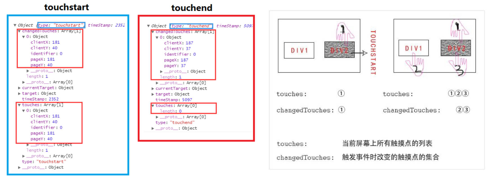

# WXML 语法

与 html 相同之处：

- 类似于 HTML 代码：比如组件可以写成单标签，也可以写成双标签；
- 组件必须有严格的闭合：没有闭合会导致编译错误。

与 html 不同之处

- 大小写敏感：如 `class` 和 `Class` 是不同的属性。

## Mustache 语法。

- 小程序和 Vue 一样, 提供了插值语法: Mustache 语法；
- 小程序中的 Mustache 中只能写标识符和表达式，不能写函数。

index.js

```js
Page({
	data: {
		message: 'Hello World',
		firstname: 'kobe',
		lastname: 'bryant',
		date: new Date().toLocaleDateString() // 2022/10/10 这样的字符串
	}
})
```

index.wxml

```html
<view>{{ message }}</view>
<view>{{ firstname + " " + lastname }}</view>
<view>{{ date }}</view>
```

## 条件判断

- 当条件为 true 时, view 组件会渲染出来。
- 当条件为 false 时, view 组件不会渲染出来。

index.js

```js
Page({
	data: {
		score: 10
	}
})
```

index.wxml

```html
<view wx:if="{{score > 90}}">优秀</view>
<view wx:elif="{{score > 80}}">良好</view>
<view wx:elif="{{score >= 60}}">及格</view>
<view wx:else>不及格</view>
```

## hidden 属性。

- hidden 是所有的组件都默认拥有的属性；
- 当 hidden 属性为 true 时, 组件会被隐藏；
- 当 hidden 属性为 false 时, 组件会显示出来。

> 小程序中没有类似于 wx:show 的写法

index.js

```js
Page({
	data: {
		isHidden: false
	},
	onChangeTap() {
		this.setData({
			isHidden: !this.data.isHidden
		})
	}
})
```

index.wxml

```html
<!-- 基本使用 -->
<view hidden>我是 hidden 的 view</view>
<!-- 切换案例 -->
<button bindtap="onChangeTap">切换</button>
<view hidden="{{ isHidden }}">哈哈哈哈</view>
<view wx:if="{{ !isHidden }}">呵呵呵呵</view>
```

## 列表渲染，

### 基本使用：

index.js

```js
Page({
	data: {
		books: [
			{ id: 111, name: '代码大全', price: 98 },
			{ id: 112, name: '你不知道JS', price: 87 },
			{ id: 113, name: 'JS高级设计', price: 76 }
		]
	}
})
```

index.wxml

```html
<!-- 遍历 data 中的数组 -->
<view class="books">
	<view wx:for="{{ books }}" wx:key="id">
		<!-- item: 每项内容, index: 每项索引 -->
		{{ item.name }}-{{ item.price }}
	</view>
</view>
<!-- 遍历数字 -->
<view class="number">
	<view wx:for="{{10}}" wx:key="*this"> {{ item }} </view>
</view>
<!-- 遍历字符串 -->
<view class="str">
	<view wx:for="coderzzt" wx:key="*this"> {{ item }} </view>
</view>
```

### block 的使用

- 常被用于，使用 `wx:if` 或 `wx:for` 时，对一组组件进行整体操作。
- `<block/>` 并不是一个组件，它仅仅是一个包装元素，不会在页面中做任何渲染，只接受控制属性。

index.wxml

```html
<view class="books">
	<block wx:for="{{ books }}" wx:key="id">
		<view>{{ item.name }}-{{ item.price }}-{{ index }}</view>
	</block>
</view>
```

### 指定 item / index 的名称

- 默认情况下，`item` / `index` 的名字是固定的
  - 某些情况下，我们可能想使用其他名称；
  - 或者当出现多层遍历时，名字会重复。
- 这个时候，我们可以指定 item 和 index 的名称：

index.wxml

```html
<view class="books">
	<block wx:for="{{books}}" wx:key="id" wx:for-item="book" wx:for-index="i">
		<view>{{ book.name }}-{{ book.price }}-{{ i }}</view>
	</block>
</view>
```

### 绑定 key

- 在小程序中，使用列表渲染，必须绑定 key，否则会报警告。
- 这个其实和小程序内部也使用了虚拟 DOM 有关系（和 Vue、React 很相似）。
- 当某一层有很多相同的节点时，也就是列表节点时，我们希望插入、删除一个新的节点，可以更好的复用节点；

绑定 key 的传值有 2 种形式：

- 字符串，代表在 for 循环遍历的 item 中某个 property，该 property 的值需要是列表中唯一的字符串或数字，且不能动态改变。
- 保留关键字 `*this` 代表在 for 循环中的 item 本身，这种表示需要 item 本身是一个唯一的字符串或者数字。

# WXS 语法

WXS（WeiXin Script）是小程序的一套脚本语言，结合 WXML，可以构建出页面的结构。

- 官方描述：WXS 与 JavaScript 是不同的语言，有自己的语法，并不和 JavaScript 一致（不过基本一致）

为什么要设计 WXS 语言呢？

- 在 WXML 中是不能直接调用 Page / Component 中定义的函数的.
- 但是某些情况, 我们可能希望使用函数来处理 WXML 中的数据(类似于 Vue 中的过滤器)，这个时候就使用 WXS 了

WXS 使用的限制和特点：

- WXS 不依赖于运行时的基础库版本，可以在所有版本的小程序中运行；
- WXS 的运行环境和其他 JavaScript 代码是隔离的，WXS 中不能调用其他 JavaScript 文件中定义的函数，也不能调用小程序提供的 API，
- WXS 中只能写 es5 语法；
- 由于运行环境的差异，在 iOS 设备上小程序内的 WXS 会比 JavaScript 代码快 2 ~ 20 倍。在 android 设备上二者运行效率无差异；

> - 因为小程序采用的是双线程模型，所以在 mustache 中不能引用函数（如果这么设计，底层需要进行频繁的传递，会造成较大的性能损耗）
> - wxs 运行在 webview 线程中。不要在其中做耗时操作，会影响性能。

## 可写在 2 种位置

### 写在 `<wxs>` 标签中。

index.html

```html
<!-- 1.方式一: 标签 -->
<wxs module="format">
	function formatPrice(price) {
  	return "¥" + price
  }
  // 必须导出后，才能被其他地方调用: 必须使用 CommonJS 导出
  module.exports = {
    formatPrice: formatPrice
  }
</wxs>

<view class="books">
	<block wx:for="{{books}}" wx:key="id">
		<view>name:{{item.name}}-price:{{format.formatPrice(item.price)}}</view>
	</block>
</view>
```

index.js

```js
Page({
	data: {
		books: [
			{ id: 111, name: '代码大全', price: 98, coverURL: '' },
			{ id: 112, name: '你不知道JS', price: 87, coverURL: '' },
			{ id: 113, name: 'JS高级设计', price: 76, coverURL: '' }
		]
	},
	// 不能在 view 层中使用
	formatPrice(price) {
		return '¥' + price
	}
})
```

### 写在 `.wxs` 结尾的文件中。

index.html

```html
<!-- 2.方式二: 独立的文件, 通过 src 引入 -->
<wxs module="format" src="/utils/format.wxs"></wxs>

<view class="books">
	<block wx:for="{{books}}" wx:key="id">
		<view>name:{{item.name}}-price:{{format.formatPrice(item.price)}}</view>
	</block>
</view>
<view class="total">总价格: {{format.calcPrice(books)}}</view>
```

utils \ format.wxs

```js
function formatPrice(price) {
	return '¥' + price
}

function calcPrice(books) {
	// es5 中可以写高阶函数，不能写箭头函数
	return (
		'¥' +
		books.reduce(function (preValue, item) {
			return preValue + item.price
		}, 0)
	)
}

module.exports = {
	formatPrice: formatPrice,
	calcPrice: calcPrice
}
```

## `<wxs>` 标签的属性

| 属性名 | 类型   | 说明                                                                          |
| ------ | ------ | ----------------------------------------------------------------------------- |
| module | String | 模块名，必填字段                                                              |
| src    | String | 引用 wxs 文件的相对路径，仅当本标签为**单闭合标签**或**标签的内容**为空时有效 |

> - 每一个 .wxs 文件和 \<wx\> 标签都是一个单独的模块。
> - 每个模块都有自己独立的作用域。即在一个模块里面定义的变量与函数，默认为私有的，对其他模块不可见；
> - 一个模块要想对外暴露其内部的私有变量与函数，只能通过 `module.exports` 实现；

## 案例练习

### 案例一：对播放量进行格式化

utils \ format.wxs

```js
function formatCount(count) {
	count *= 1
	return count >= 100000000	? (count / 100000000).toFixed(1) + '亿'
		: count >= 10000 ? (count / 10000).toFixed(1) + '万'
		: count
}

module.export = {
	formatCount: formatCount
}
```

index.js

```js
Page({
	data: {
		playCount: 2237232
	}
})
```

index.wxml

```html
<wxs module="format" src="/utils/format.wxs"></wxs>

<view class="count">播放量: {{format.formatCount(playCount)}}</view>
```

### 案例二：对歌曲时间进行格式化

utils \ format.wxs

```js
function padLeft(time) {
	time += ''
	return ('00' + time).slice(time.length)
}
// 100 -> 01:40
function formatTime(time) {
	// 1.获取时间
	var minute = Math.floor(time / 60)
	var second = Math.floor(time) % 60
	// 2.拼接字符串
	return padLeft(minute) + ':' + padLeft(second)
}

module.export = {
	formatTime: formatTime
}
```

index.js

```js
Page({
	duration: 255,
	currentTime: 65
})
```

index.wxml

```html
<wxs module="format" src="/utils/format.wxs"></wxs>

<view class="time">
	{{format.formatTime(currentTime)}}/{{format.formatTime(duration)}}
</view>
```

# 事件处理

## 事件的产生和处理

什么时候会产生事件呢？

- 小程序需要经常和用户进行某种交互，比如点击界面上的某个按钮或者区域，比如滑动了某个区域；
- 事件是视图层（view）到逻辑层（model）的通讯方式；
- 事件可以将用户的行为反馈到逻辑层进行处理；
- 事件可以绑定在组件上，当触发事件时，就会执行逻辑层中对应的事件处理函数；
- 事件对象可以携带额外信息，如 `id`, `dataset`, `touches`；

事件如何处理呢？

- 事件是通过 `bind` / `catch` 这个属性绑定在组件上的；
- 属性以 `bind` 或 `catch` 开头, 从 1.5.0 版本开始, 可以在 `bind` 和 `catch` 后加上一个冒号；
- 同时在当前页面的 Page 构造器中定义对应的事件处理函数, 如果没有对应的函数, 触发事件时会报错；
- 比如当用户点击该 button 区域时，达到触发条件生成事件 `tap`，该事件处理函数会被执行，同时还会收到一个事件对象 `event`。

## 基本使用

index.js

```js
Page({
	// 绑定事件监听函数
	onBtnTap(event) {
		console.log('onBtnTap:', event)
	}
})
```

index.wxml

```html
<button bindtap="onBtnTap">按钮</button>
```

## 组件的事件类型

组件共有的事件类型，[官方文档](https://developers.weixin.qq.com/miniprogram/dev/framework/view/wxml/event.html#%E4%BA%8B%E4%BB%B6%E5%88%86%E7%B1%BB)

某些组件会有自己特有的事件类型，具体查看对应的文档

- 比如 input 有 `bindinput` / `bindblur` / `bindfocus` 等
- 比如 scroll-view 有 `bindscrolltoupper` / `bindscrolltolower` 等

## 事件对象 event

当某个事件触发时, 会产生一个事件对象, 并且这个对象被传入到回调函数中, 事件对象有哪些常见的属性呢? [官方文档](https://developers.weixin.qq.com/miniprogram/dev/framework/view/wxml/event.html#%E4%BA%8B%E4%BB%B6%E5%AF%B9%E8%B1%A1)

### 属性 currentTarget 和 target 的区别（再次强调）。

- `currentTarget` 是当前处理事件的对象。
- `target` 是事件触发的对象。

index.js

```js
Paage({
	onOuterViewTap(event) {
		// 1.target - 触发事件的元素
		const name = event.target.dataset.name
		console.log(name) // undefined
		// 2.currentTarget - 处理事件的元素
		const name = event.currentTarget.dataset.name
		console.log(name) // zzt
	}
})
```

index.wsml

```html
<view id="outer" class="outer" data-name="zzt" bindtap="onOuterViewTap">
	<view id="inner" class="inner"></view>
</view>
```

### 属性 touches 和 changedTouches 的区别（了解，很少用）

- 在 `touchend` 事件对象中不同
- 多手指触摸时不同。

index.js

```js
Page({
	onTouchTap(event) {
		console.log('tap:', event)
	},
	onLongPress(event) {
		console.log('long:', event)
	},
	onTouchEnd(event) {
		console.log('end:', event) // changedTouches 中有元素，touches 中没有。
	}
})
```

index.wxml

```html
<view
	class="touches"
	bindtap="onTouchTap"
	bindlongpress="onLongPress"
	bindtouchend="onTouchEnd"
>
	多指触摸
</view>
```



## 事件参数的传递

当视图层发生事件时，某些情况需要事件携带一些参数到执行的函数中，在小程序中，目前有 2 种方式，实现事件参数传递。

### 通过 `data-*`，

本质上是 HTML 中 DOM 元素对象的特性：

index.js

```js
Page({
	onArgumentsTap(event) {
		const { name, age, height } = event.currentTarget.dataset
		console.log(name, age, height)
	}
})
```

index.wxml

```html
<!-- 4.event的参数传递 -->
<view
	class="arguments"
	bindtap="onArgumentsTap"
	data-name="zzt"
	data-age="18"
	data-height="1.88"
>
	参数传递
</view>
```

### 通过属性 `mark:*`

小程序的特性。

- 当涉及事件冒泡时，mark 会将值进行合并传递。不需要关心用 `target` 还是 `currentTarget`。

index.js

```js
Page({
	// mark 的数据传递
	onMarkTap(event) {
		const data1 = event.target.dataset
		console.log(data1) // {} 空对象

		const data2 = event.mark
		console.log(data2) // {address: "洛杉矶", age: "30", name: "kobe"}
	}
})
```

index.wxml

```html
<view
	class="mark"
	bindtap="onMarkTap"
	data-name="why"
	data-age="18"
	mark:name="kobe"
	mark:age="30"
>
	<text mark:address="洛杉矶" class="title">mark</text>
</view>
```

## TabControl 案例

index.js

```js
Page({
  data: {
    titles: ["手机", "电脑", "iPad", "相机"],
    currentIndex: 0
  }
	onItemTap(event) {
    const currentIndex = event.currentTarget.dataset.index
    this.setData({ currentIndex })
  },
})
```

index.html

```html
<!-- 5.tab-control案例(重要) -->
<view class="tab-control">
	<block wx:for="{{ titles }}" wx:key="*this">
		<view
			class="item {{index === currentIndex ? 'active': ''}}"
			bindtap="onItemTap"
			data-index="{{index}}"
		>
			<text class="title">{{ item }}</text>
		</view>
	</block>
</view>
```

index.wxss

```css
.tab-control {
	display: flex;
	height: 40px;
	line-height: 40px;
	text-align: center;
}
.tab-control .item {
	flex: 1;
}
.tab-control .item.active {
	color: #ff8189;
}
.tab-control .item.active .title {
	border-bottom: 3px solid #ff8189;
	padding: 5px;
}
```

## 事件捕获和冒泡

当界面产生一个事件时，事件分为了捕获阶段和冒泡阶段。


index.wxml

```html
<!-- 6.捕获和冒泡阶段 -->
<view class="view1" capture-bind:tap="onView1CaptureTap" bindtap="onView1Tap">
	<view class="view2" capture-bind:tap="onView2CaptureTap" bindtap="onView2Tap">
		<view
			class="view3"
			capture-bind:tap="onView3CaptureTap"
			bindtap="onView3Tap"
		></view>
	</view>
</view>
```

index.js

```js
Page({
	// 捕获和冒泡过程
	onView1CaptureTap() {
		console.log('onView1CaptureTap') // 1
	},
	onView2CaptureTap() {
		console.log('onView2CaptureTap') // 2
	},
	onView3CaptureTap() {
		console.log('onView3CaptureTap') // 3
	},
	onView1Tap() {
		console.log('onView1Tap') // 6
	},
	onView2Tap() {
		console.log('onView2Tap') // 5
	},
	onView3Tap() {
		console.log('onView3Tap') // 4
	}
})
```

### catch 绑定

会阻止事件的冒泡，不会阻止事件捕获。

```html
<view class="view3" catchtap="onView3Tap"></view>
```

# 组件化开发

## 认识小程序的组件化开发

- 小程序在刚刚推出时是不支持组件化的, 也是为人诟病的一个点：
  - 但是从 v1.6.3 开始, 小程序开始支持自定义组件开发, 也让我们更加方便的在程序中使用组件化.
- 组件化思想的应用：
  - 有了组件化的思想，我们在之后的开发中就要充分的利用它。
  - 尽可能的将页面拆分成一个个小的、可复用的组件。
  - 这样让我们的代码更加方便组织和管理，并且扩展性也更强。

## 创建一个组件

- 类似于页面，自定义组件由 json wxml wxss js 4 个文件组成。
  - 按照我的个人习惯, 我们会先在根目录下创建一个文件夹 components, 里面存放我们之后自定义的公共组件；
- 自定义组件的步骤：
  1.  首先需要在 json 文件中进行自定义组件声明 `component: true`：
  2.  在 wxml 中编写属于组件自己的模板
  3.  在 wxss 中编写属于组件自己的样式
  4.  在 js 文件中, 可以定义数据或组件内部的相关逻辑。

## 引用自定义组件

- 除了在页面引用自定义组件，自定义组件也是可以引用自定义组件，引用方法：json 文件中使用 `usingComponents` 字段）。
- 自定义组件和页面所在项目根目录名，不能以“wx-”为前缀，否则会报错。
- 如果在 `app.json` 的 `usingComponents` 声明某个组件，那么所有页面和组件可以直接使用该组件（全局注册，很少用）。

## 组件的样式细节

- 课题一：组件内的样式对外部样式的影响
  - 结论一：组件内的 class 样式，只对组件 wxml 内的节点生效，对于引用组件的 Page 页面不生效。
  - 结论二：组件内使用 id 选择器、属性选择器、元素选择器会对外界产生影响）。
- 课题二：外部样式对组件内样式的影响
  - 结论一：外部使用 class 的样式，只对外部 wxml 节点生效，对组件内是不生效的 ；
  - 结论二：外部使用了 id 选择器、属性选择器不会对组件内产生影响。
  - 结论三：外部使用了标签选择器，会对组件内产生影响。
- 课题三：如何让 class 可以相互影响

  - 在 Component 对象中，可以传入一个 `options` 属性，其中 `options` 属性中有一个 `styleIsolation`（隔离）属性。
  - `styleIsolation` 有三个取值：
    - `isolated` 表示启用样式隔离，在自定义组件内外，使用 class 指定的样式将不会相互影响（默认取值）；
    - `apply-shared` 表示页面 wxss 样式将影响到自定义组件，但自定义组件 wxss 中指定的样式不会影响页面；
    - `shared` 表示页面 wxss 样式将影响到自定义组件，自定义组件 wxss 中指定的样式也会影响页面。

  ```js
  Component({
  	options: {
  		styleIsolation: 'apply-shared'
  	}
  })
  ```

## 组件的通信

很多情况下，组件内展示的内容（数据、样式、标签），并不是在组件内写死的，而是可以由使用者来决定。

常见的 4 种通信方式


section-info 组件

components \ section-info \ section-info.json

```json
{
	"component": true,
	"usingComponents": {}
}
```

components \ section-info \ section-info.js

```js
Component({
	properties: {
		title: {
			type: String,
			value: '默认标题'
		},
		content: {
			type: String,
			value: '默认内容'
		}
	},

	externalClasses: ['info'], // 接收传递的样式名

	methods: {
		onTitleTap() {
			// 自定义事件，发送给组件的使用者
			this.triggerEvent('titleclick', 'aaa')
		}
	}
})
```

components \ section-info \ section-info.wxml

```html
<view class="section">
	<view class="title" bindtap="onTitleTap">{{ title }}</view>
	<!-- 使用接收的样式名 info -->
	<view class="content info">{{ content }}</view>
</view>
```

components \ section-info \ section-info.wxss

```css
.section .title {
	font-size: 40rpx;
	font-weight: 700;
	color: red;
}
.section .content {
	font-size: 24rpx;
	color: purple;
}
```

页面

index.json

```json
{
	"usingComponents": {
		"section-info": "/components/section-info/section-info"
	}
}
```

index.js

```js
Page({
	// 处理自定义事件
	handleSectionTitleClick(event) {
    // 传递过来的参数，放在 event 的 detail 中。
		console.log('区域title发生了点击', event.detail)
	}
})
```

index.wxml

```html
<!-- 1.内置组件 -->
<text>哈哈哈</text>

<!-- 2.自定义组件 -->
<!-- 传递样式。本质是传递类选择器，应用类的样式 -->
<section-info
	info="abc"
	title="我与地坛"
	content="要是有些事情我没说, 别以为是我忘记了"
	bind:titleclick="handleSectionTitleClick"
/>
<section-info
	info="cba"
	title="黄金时代"
	content="在我一生中最好的黄金时代, 我想吃, 我想爱"
/>
```

index.wxss

```css
.title {
	background-color: skyblue;
}
/* 传给组件的样式 */
.abc {
	background-color: #0f0;
}
/* 传给组件的样式 */
.cba {
	background-color: #00f;
}
```

## 重构 TabControl

TabControl 组件

components \ tab-control \ tab-control.json

```json
{
	"component": true,
	"usingComponents": {}
}
```

components \ tab-control \ tab-control.js

```js
Component({
	properties: {
		titles: {
			type: Array,
			value: []
		}
	},

	data: {
		currentIndex: 0
	},

	methods: {
		onItemTap(event) {
			const currentIndex = event.currentTarget.dataset.index
			this.setData({ currentIndex })
			// 自定义事件
			this.triggerEvent('indexchange', currentIndex)
		}
	}
})
```

components \ tab-control \ tab-control.wxml

```html
<view class="tab-control">
	<block wx:for="{{ titles }}" wx:key="*this">
		<view
			class="item {{index === currentIndex ? 'active': ''}}"
			bindtap="onItemTap"
			data-index="{{index}}"
		>
			<text class="title">{{ item }}</text>
		</view>
	</block>
</view>
```

components \ tab-control \ tab-control.wxss

```css
.tab-control {
	display: flex;
	height: 40px;
	line-height: 40px;
	text-align: center;
}
.tab-control .item {
	flex: 1;
}
.tab-control .item.active {
	color: #ff8189;
}
.tab-control .item.active .title {
	border-bottom: 3px solid #ff8189;
	padding: 5px;
}
```

页面

index.json

```json
{
	"usingComponents": {
		"tab-control": "/components/tab-control/tab-control"
	}
}
```

index.js

```js
Page({
	data: {
		digitalTitles: ['电脑', '手机', 'iPad'],
		currentIndex: 0
	},
	handleTabIndexChange(event) {
		const index = event.detail
		console.log('点击了', this.data.digitalTitles[index])
		this.setData({ currentIndex })
	}
})
```

index.wxml

```html
<tab-control
	class="tab-control"
	titles="{{digitalTitles}}"
	bind:indexchange="handleTabIndexChange"
/>
```
