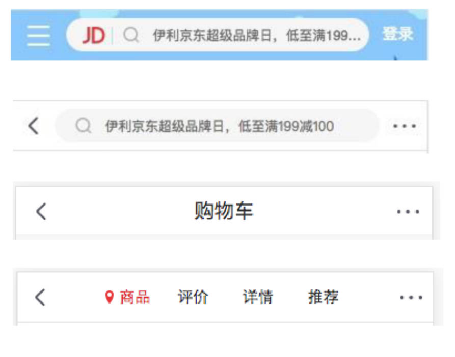
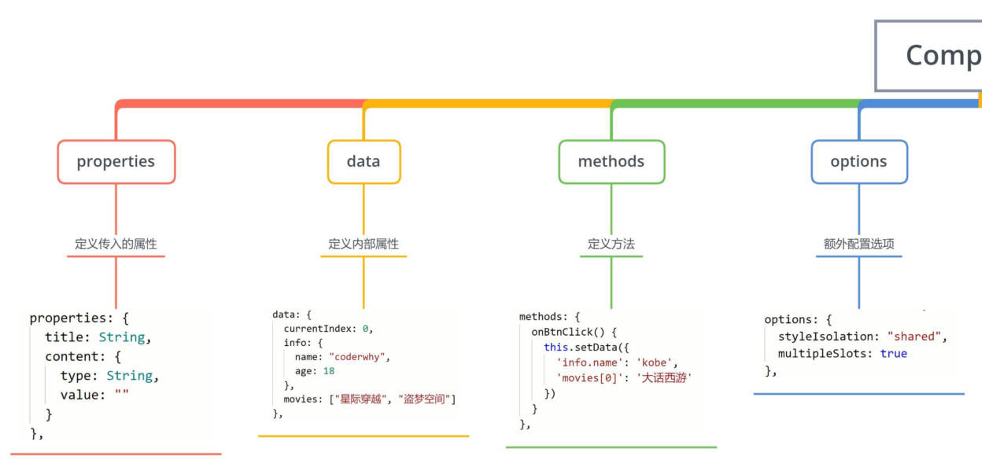
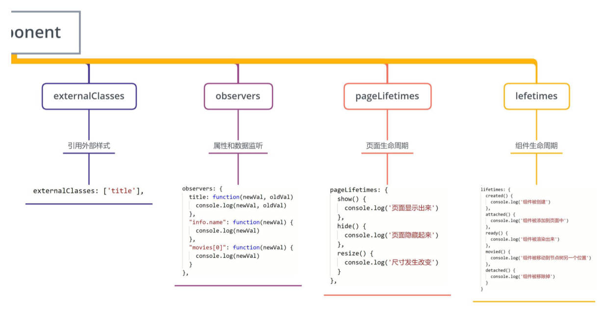
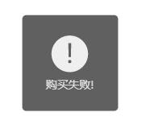
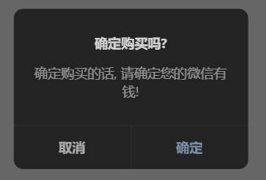
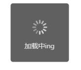
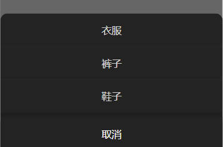
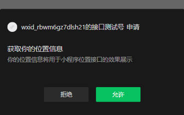
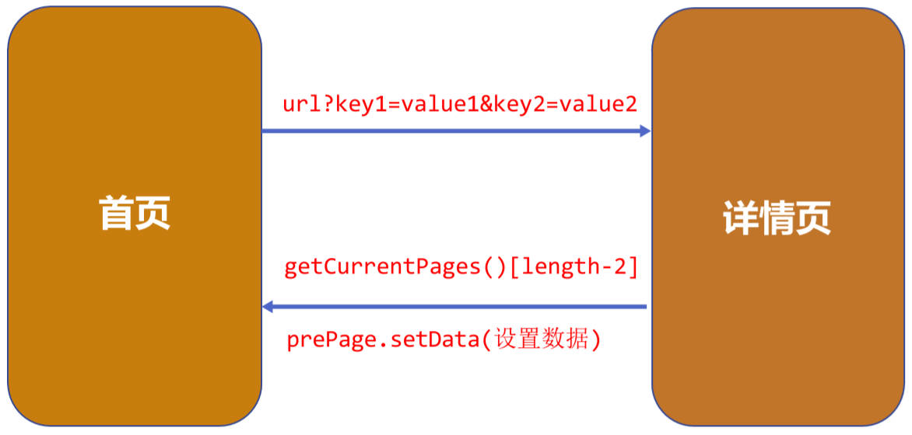
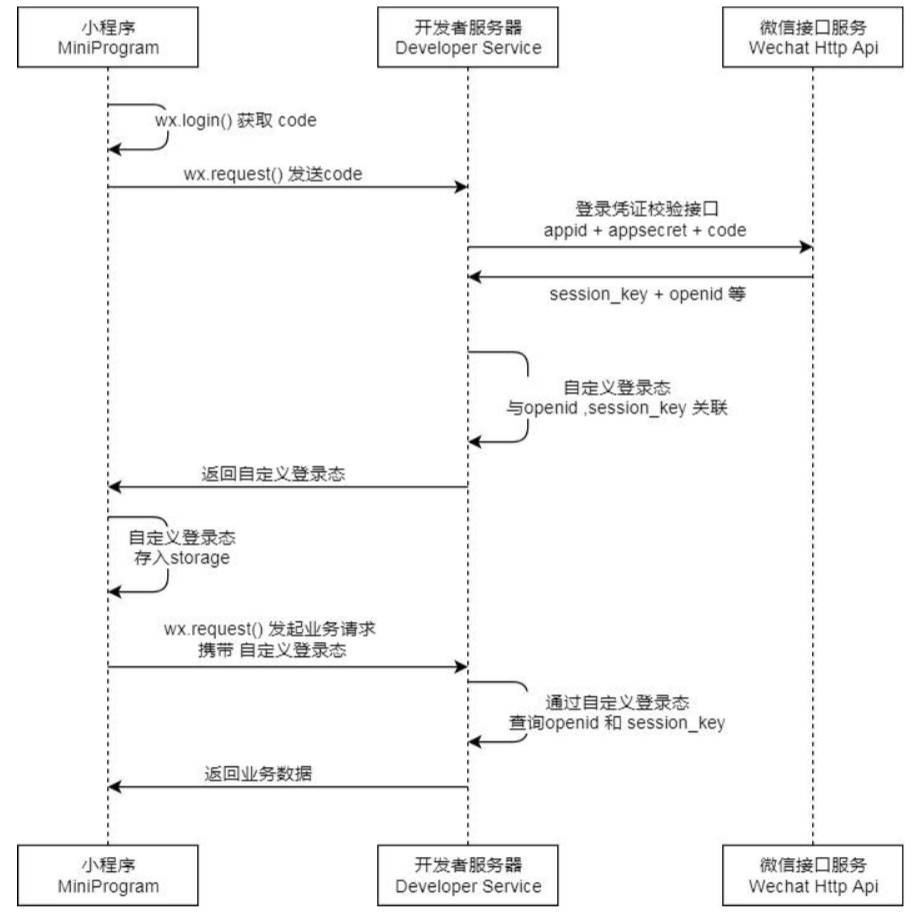

# 组件化开发

## 页面（Page）调用组件中的方法

类似于 Vue 中使用 ref 拿到组件实例对象调用其中方法，小程序也可在页面中调用组件中的方法。

- 可在父组件里调用 `this.selectComponent` ，获取子组件的实例对象。
- 调用时需要传入一个匹配选择器 selector，如：`this.selectComponent(".my-component")`

tab-control 组件

components \ tab-control \ tab-control.js

```js
Component({
  data: {
    currentIndex: 0
  },
  methods: {
    callByPage(index) {
      this.setData({
        currentIndex: index
      })
    }
  }
})
```

页面

index.js

```js
Page({
  onExecTCMethod() {
    // 1.获取对应的组件实例对象
    const tabControl = this.selectComponent('.tab-control')
    // 2.调用组件实例的方法
    tabControl.callByPage(2)
  }
})
```

index.wxml

```html
<tab-control class="tab-control" /> <button bindtap="onExecTCMethod">调用TC方法</button>
```

## Component 的插槽

slot 翻译为插槽：

- 在生活中很多地方都有插槽，电脑的 USB 插槽，插板当中的电源插槽。
- 插槽的目的是让我们原来的设备具备更多的扩展性。
- 比如电脑的 USB 我们可以插入 U 盘、硬盘、手机、音响、键盘、鼠标等等。

组件的插槽：

- 组件的插槽也是为了让我们封装的组件更加具有扩展性。
- 让使用者可以决定组件内部的一些内容到底展示什么。

栗子：移动网站中的导航栏。

- 移动开发中，几乎每个页面都有导航栏。
- 导航栏我们必然会封装成一个插件，比如 nav-bar 组件。
- 一旦有了这个组件，我们就可以在多个页面中复用了。



### 单个插槽的使用。

前面我们学习了内容和样式在页面和组件之间的传递，那么在使用组件的过程中，外界可能想决定内容显示的方式：

- 比如我们有一个组件定义了头部和尾部，但是中间的内容可能是一段文字，也可能是一张图片，或者是一个进度条。
- 在不确定外界想插入什么其他组件的前提下，我们可以在组件内预留插槽：

单个插槽的使用，实现默认插槽的效果。

my-slot 组件

components \ my-slot \ my-slot.wxml

```html
<view class="my-slot">
  <view class="header">Header</view>
  <view class="content">
    <!-- 预留一个插槽，小程序中插槽是不支持默认值的 -->
    <slot></slot>
  </view>
  <!-- 使用 .default 元素结合伪类 :empty 实现默认插槽的效果 -->
  <view class="default-content">哈哈哈哈</view>
  <view class="footer">Footer</view>
</view>
```

components \ my-slot \ my-slot.wxss

```css
.default-content {
  display: none;
}
.content:empty + .default-content {
  display: block;
}
```

页面

index.html

```html
<my-slot>
  <button>我是按钮</button>
</my-slot>
<my-slot>
  <image src="/assets/nhlt.jpg" mode="widthFix"></image>
</my-slot>
```

### 多个插槽的使用

有时候为了让组件更加灵活, 我们需要定义多个插槽：

- 在小程序中实现类似于 Vue 中具名插槽的效果。

multi-slot 组件

components \ mul-slot \ mul-slot.js

```js
Component({
  options: {
    // 开启使用多个插槽的功能
    multipleSlots: true
  }
})
```

components \ mul-slot \ mul-slot.wxml

```html
<view class="mul-slot">
  <view class="left">
    <slot name="left"></slot>
  </view>
  <view class="center">
    <slot name="center"></slot>
  </view>
  <view class="right">
    <slot name="right"></slot>
  </view>
</view>
```

页面

index.html

```html
<mul-slot>
  <!-- 这也是 Vue 的早期写法 -->
  <button slot="left" size="mini">left</button>
  <view slot="center">哈哈哈</view>
  <button slot="right" size="mini">right</button>
</mul-slot>
```

## Component 的混入

behaviors 是用于组件间代码共享的特性，类似于 Vue 中的 “mixins”。

- 每个 behavior 可以包含一组属性、数据、生命周期函数和方法；
- 组件引用它时，它的属性、数据和方法会被合并到组件中，生命周期函数也会在对应时机被调用；
- 每个组件可以引用多个 behavior，behavior 也可以引用其它 behavior；

behaviors \ counter.js

```js
export const counterBehavior = Behavior({
  data: {
    counter: 100
  },
  methods: {
    increment() {
      this.setData({ counter: this.data.counter + 1 })
    },
    decrement() {
      this.setData({ counter: this.data.counter - 1 })
    }
  }
})
```

c-behavior 组件

components \ c-behavior \ c-behavior.js

```js
import { counterBehavior } from '../../behaviors/counter'

Component({
  behaviors: [counterBehavior]
})
```

components \ c-behavior \ c-behavior.wxml

```html
<view>
  <view class="counter">当前计数: {{ counter }}</view>
  <button bindtap="increment">+1</button>
  <button bindtap="decrement">-1</button>
</view>
```

> 基础库版本 2.9.2 后，Page 也支持 behaviors

## Component 的生命周期

[官方文档](https://developers.weixin.qq.com/miniprogram/dev/framework/custom-component/lifetimes.html)

- 组件的生命周期，指的是组件自身的一些函数，这些函数在特殊的时间点或遇到一些特殊的框架事件时被自动触发。
- 其中，最重要的生命周期是 `created`、`attached`、`detached` ，包含一个组件实例生命流程的最主要时间点。
- 自小程序基础库版本 2.2.3 起，组件的的生命周期也可以在 `lifetimes` 字段内进行声明（这是推荐的方式，其优先级最高）。

```js
Component({
  lifetimes: {
    created() {
      console.log('组件被创建created')
    },
    attached() {
      console.log('组件被添加到组件树中attached')
    },
    detached() {
      console.log('组件从组件树中被移除detached')
    }
  }
})
```

## Component 所在页面的生命周期

Component 所在页面的生命周期 [官方文档](https://developers.weixin.qq.com/miniprogram/dev/framework/custom-component/lifetimes.html)

还有一些特殊的生命周期，它们并非与组件有很强的关联，但有时组件需要获知，以便组件内部处理。这样的生命周期称为“组件所在页面的生命周期”，在 pageLifetimes 定义段中定义。

```js
Component({
  pageLifetimes: {
    show: function () {
      // 页面被展示
    },
    hide: function () {
      // 页面被隐藏
    },
    resize: function (size) {
      // 页面尺寸变化
    }
  }
})
```

## Component 构造器，总结

Component 构造器，能传哪些 options？





## Component 的数据侦听

Component 的 observers option [官方文档](https://developers.weixin.qq.com/miniprogram/dev/framework/custom-component/observer.html)

# 系统 API 调用

## 网络请求 API。

微信提供了专属的 API 接口,用于网络请求: [wx.request](https://developers.weixin.qq.com/miniprogram/dev/api/network/request/wx.request.html)

比较关键的几个属性解析:

- `url`: 必传, 不然请求什么。
- `data`: 请求参数（无论 post、get 请求参数都放在这里）；
- `method`: 请求的方式；
- `success`: 成功时的回调；
- `fail`: 失败时的回调。

### 基本使用

```js
wx.request({
  url: 'http://codercba.com:1888/api/city/all',
  success: res => {
    const data = res.data.data
    this.setData({ allCities: data })
  },
  fail: err => {
    console.log('err:', err)
  }
})
```

### 使用函数进行封装

service \ index.js

```js
export function ztRequest(options) {
  return new Promise((resolve, reject) => {
    wx.request({
      ...options,
      success: res => {
        resolve(res.data)
      },
      fail: reject
    })
  })
}
```

index.js

```js
import { ztRequest } from '../../service/index'

// ...
ztRequest({
  url: 'http://codercba.com:1888/api/city/all'
}).then(res => {
  this.setData({ allCities: res.data })
})

ztRequest({
  url: 'http://codercba.com:1888/api/home/houselist',
  data: {
    page: 1
  }
}).then(res => {
  this.setData({ houselist: res.data })
})
// ...
```

### 使用类进行封装

service \ index.js

```js
class ZtRequest {
  constructor(baseURL) {
    this.baseURL = baseURL
  }
  request(options) {
    const { url } = options
    return new Promise((resolve, reject) => {
      wx.request({
        ...options,
        url: this.baseURL + url,
        success: res => {
          resolve(res.data)
        },
        fail: err => {
          console.log('err:', err)
        }
      })
    })
  }
  get(options) {
    return this.request({ ...options, method: 'get' })
  }
  post(options) {
    return this.request({ ...options, method: 'post' })
  }
}

export const ztRequest = new ZtRequest('http://codercba.com:1888/api')
```

index.js

```js
import { ztRequest } from '../../service/index'

ztRequest
  .get({
    url: '/city/all'
  })
  .then(res => {
    console.log(res)
  })
```

> 与页面展示不相干的数据，
>
> - 可定义在 data 中，直接使用 `this.data.xxx = xxx` 修改，
> - 也可以直接定义在实例对象中，直接使用 `this.xxx = xxx` 修改。

## 网络请求的域名配置

每个微信小程序需要事先设置通讯域名，小程序只可以跟指定的域名进行网络通信。

服务器域名请在 「小程序后台 - 开发 - 开发设置 - 服务器域名」 中进行配置，配置时需要注意：

- 域名只支持 `https` (`wx.request`、`wx.uploadFile`、`wx.downloadFile`) 和 `wss` (`wx.connectSocket`) 协议；
- 域名不能使用 IP 地址（小程序的局域网 IP 除外）或 localhost；
- 可以配置端口，如 https://myserver.com:8080，但是配置后只能向 https://myserver.com:8080 发起请求。如果向 https://myserver.com、https://myserver.com:9091 等 URL 请求则会失败。
- 如果不配置端口。如 https://myserver.com，那么请求的 URL 中也不能包含端口，甚至是默认的 443 端口也不可以。如果 向 https://myserver.com:443 请求则会失败。
- 域名必须经过 ICP 备案；
- 出于安全考虑，[api.weixin.qq.com]() 不能被配置为服务器域名，相关 API 也不能在小程序内调用。 开发者应将 AppSecret 保存到后台服务器中，通过服务器使用 getAccessToken 接口获取 access_token，并调用相关 API；
- 不支持配置父域名，使用子域名。

## 实现弹窗效果

小程序中展示弹窗有四种方式:

[wx.showToast](https://developers.weixin.qq.com/miniprogram/dev/api/ui/interaction/wx.showToast.html) 显示消息提示框。

```js
wx.showToast({
  title: '购买失败!',
  icon: 'success', // 默认值
  duration: 1500, // 默认值
  mask: false, // 默认值
  success: res => {
    console.log('res:', res)
  },
  fail: err => {
    console.log('err:', err)
  }
})
```



[wx.showModal](https://developers.weixin.qq.com/miniprogram/dev/api/ui/interaction/wx.showModal.html) 显示模态对话框

```js
wx.showModal({
  title: '确定购买吗?',
  content: '确定购买的话, 请确定您的微信有钱!',
  confirmColor: '#f00',
  cancelColor: '#0f0',
  success: res => {
    if (res.cancel) {
      console.log('用户点击取消')
    } else if (res.confirm) {
      console.log('用户点击了确定')
    }
  }
})
```



[wx.showLoading](https://developers.weixin.qq.com/miniprogram/dev/api/ui/interaction/wx.showLoading.html) 显示 loading 提示框。需主动调用 `wx.hideLoading` 才能关闭提示框。

```js
wx.showLoading({
  title: '加载中'
})

setTimeout(function () {
  wx.hideLoading()
}, 2000)
```



[wx.showActionSheet](https://developers.weixin.qq.com/miniprogram/dev/api/ui/interaction/wx.showActionSheet.html) 显示操作菜单。

```js
wx.showActionSheet({
  itemList: ['衣服', '裤子', '鞋子'],
  success: res => {
    console.log(res.tapIndex)
  },
  fail: err => {
    console.log('err:', err)
  }
})
```



## 分享功能

分享是小程序扩散的一种重要方式，小程序中有两种分享方式：

- 方式一：点击右上角的菜单按钮，之后点击转发。
- 方式二：点击某一个按钮（`open-type="share"`），直接转发。

当我们转发给好友一个小程序时，通常小程序中会显示一些信息：

- 如何决定这些信息的展示呢？通过 [onShareAppMessage](https://developers.weixin.qq.com/miniprogram/dev/reference/api/Page.html#onShareAppMessage-Object-object) 事件 API
- 监听用户点击页面内转发按钮（button 组件 `open-type="share"`）或右上角菜单“转发”按钮的行为，并自定义转发内容。
- 此事件处理函数需要 return 一个 Object，用于自定义转发内容；

```js
onShareAppMessage() {
  return {
    title: "旅途的内容",
    path: "/pages/favor/favor",
    imageUrl: "/assets/nhlt.jpg"
  }
}
```

## 获取设备信息

在开发中，我们需要经常获取当前设备的信息，用于手机信息或者进行一些适配工作。 小程序提供了相关 API：[wx.getSystemInfo](https://developers.weixin.qq.com/miniprogram/dev/api/base/system/wx.getSystemInfo.html)

```js
wx.getSystemInfo({
  success: res => {
    console.log(res)
  }
})
```

## 获取位置信息

- 开发中我们需要经常获取用户的位置信息，以方便给用户提供相关的服务： 我们可以通过 API 获取：[wx.getLocation](https://developers.weixin.qq.com/miniprogram/dev/api/location/wx.getLocation.html)
- 对于用户的关键信息，需要在 app.json 中进行配置，如[获取用户的位置配置](https://developers.weixin.qq.com/miniprogram/dev/reference/configuration/app.html#permission)，最后得到用户的授权后才能获得：

app.json

```json
{
  "pages": ["pages/index/index"],
  "permission": {
    "scope.userLocation": {
      "desc": "你的位置信息将用于小程序位置接口的效果展示"
    }
  }
}
```



```js
wx.getLocation({
  success: res => {
    console.log('res:', res)
  }
})
```

## Storage 存储

在开发中，常见地，我们需要将一部分数据存储在本地：比如 token、用户信息等。

- 小程序提供了专门的 Storage 用于进行本地存储。

同步存取数据的方法：

- [wx.setStorageSync(string key, any data)](https://developers.weixin.qq.com/miniprogram/dev/api/storage/wx.setStorageSync.html)
- [any wx.getStorageSync(string key)](https://developers.weixin.qq.com/miniprogram/dev/api/storage/wx.getStorageSync.html)
- [wx.removeStorageSync(string key)](https://developers.weixin.qq.com/miniprogram/dev/api/storage/wx.removeStorageSync.html)
- [wx.clearStorageSync()](https://developers.weixin.qq.com/miniprogram/dev/api/storage/wx.clearStorageSync.html)

异步存储数据的方法：

- [wx.setStorage(Object object)](https://developers.weixin.qq.com/miniprogram/dev/api/storage/wx.setStorage.html)，使用参数 `encrypt` 可对内容进行加密。
- [wx.getStorage(Object object)](https://developers.weixin.qq.com/miniprogram/dev/api/storage/wx.getStorage.html)
- [wx.removeStorage(Object object)](https://developers.weixin.qq.com/miniprogram/dev/api/storage/wx.removeStorage.html)
- [wx.clearStorage(Object object)](https://developers.weixin.qq.com/miniprogram/dev/api/storage/wx.clearStorage.html)

```js
// 异步操作
wx.setStorage({
  key: 'books',
  data: '哈哈哈',
  encrypt: true,
  success: res => {
    wx.getStorage({
      key: 'books',
      encrypt: true,
      success: res => {
        console.log(res)
      }
    })
  }
})
```

## 页面跳转

界面的跳转有两种方式：

### 通过 wx 的 API 跳转

有以下 API 支持页面跳转，或者说路由跳转：

| 名称                                                                                               | 功能说明                                                                                                                                                                                                         |
| -------------------------------------------------------------------------------------------------- | ---------------------------------------------------------------------------------------------------------------------------------------------------------------------------------------------------------------- |
| [wx.switchTab](https://developers.weixin.qq.com/miniprogram/dev/api/route/wx.switchTab.html)       | 跳转到 tabBar 页面，并关闭其他所有非 tabBar 页面。                                                                                                                                                               |
| [wx.reLaunch](https://developers.weixin.qq.com/miniprogram/dev/api/route/wx.reLaunch.html)         | 关闭所有页面，打开到应用内的某个页面。                                                                                                                                                                           |
| [wx.redirectTo](https://developers.weixin.qq.com/miniprogram/dev/api/route/wx.redirectTo.html)     | 关闭当前页面，跳转到应用内的某个页面。但是不允许跳转到 tabbar 页面。                                                                                                                                             |
| [wx.navigateTo](https://developers.weixin.qq.com/miniprogram/dev/api/route/wx.navigateTo.html)     | 保留当前页面，跳转到应用内的某个页面。但是不能跳到 tabbar 页面。使用 [wx.navigateBack](https://developers.weixin.qq.com/miniprogram/dev/api/route/wx.navigateBack.html) 可以返回到原页面。小程序中页面栈最多十层 |
| [wx.navigateBack](https://developers.weixin.qq.com/miniprogram/dev/api/route/wx.navigateBack.html) | 关闭当前页面，返回上一页面或多级页面。可通过 [getCurrentPages](https://developers.weixin.qq.com/miniprogram/dev/reference/api/getCurrentPages.html) 获取当前的页面栈，决定需要返回几层。                         |

基本使用：

index.js

```js
Page({
  onNavTap() {
    wx.navigateTo({
      url: '/pages2/detail/detail'
    })
  }
})
```

index.html

```html
<button bindtap="onNavTap">跳转</button>
```

### 通过 navigator 组件

[navigator](https://developers.weixin.qq.com/miniprogram/dev/component/navigator.html) 组件，`open-type` 默认值为 `navigate`

```html
<navigator class="nav" url="/pages2/detail/detail">跳转</navigator>
```

### 跳转时传递数据

#### 方式一：

在路径后面拼接。`?queryString`

Page1 index.js

```js
Page({
  onNavTap() {
    wx.navigateTo({
      // 跳转的过程, 传递一些参数过去
      url: '/pages2/detail/detail?name=zzt&age=18'
    })
  }
})
```

Page2 detail.js

```js
Page({
  data: {
    name: '',
    age: 0
  },
  onLoad(options) {
    console.log(options)
    const name = options.name
    const age = options.age
    this.setData({ name, age })
  }
})
```

#### 方式二：

在小程序基础库 2.7.3 版本后支持 [EventChannel](https://developers.weixin.qq.com/miniprogram/dev/api/route/EventChannel.html)，`wx.navigateTo` 成功的回调结果中，可获取 eventChannel 实例。

Page1 index.js

```js
Page({
  onNavTap() {
    wx.navigateTo({
      url: '/pages2/detail/detail',
      success: res => {
        // 通过 eventChannel 向被打开页面传送数据
        res.eventChannel.emit('sendDataToOpenPage', { name: 'zzt'. age: 18 })
      }
    })
  }
})
```

Page2 detail.js

```js
Page({
  onLoad() {
    const eventChannel = this.getOpenerEventChannel()
    // 监听 sendDataToOpenPage 事件，获取上一页面通过 eventChannel 传送到当前页面的数据
    eventChannel.on('sendDataToOpenPage', function (data) {
      console.log(data)
    })
  }
})
```

### 返回时传递数据

#### 方式一：

早期做法，通过 [getCurrentPages](https://developers.weixin.qq.com/miniprogram/dev/reference/api/getCurrentPages.html) 获取页面实例，并通过 `prePage.setData` 设值

Page2 detail.html

```html
<button size="mini" type="primary" bindtap="onBackTap">返回</button>
```

Page2 detail.js

```js
Page({
  onBackTap() {
    // 2.方式一: 给上一级的页面传递数据
    // 2.1. 获取到上一个页面的实例
    const pages = getCurrentPages()
    const prePage = pages[pages.length - 2]
    // 2.2.通过 setData 给上一个页面设置数据
    prePage.setData({ message: '呵呵呵' })
  },
  // 如果是默认返回（即点击默认导航上的返回按钮），也需要传递数据，那么将逻辑放在 `onUnload` 生命周期中会更合适。
  onUnload() {
    const pages = getCurrentPages()
    const prePage = pages[pages.length - 2]
    prePage.setData({ message: '呵呵呵' })
  }
})
```

Page1 index.js

```js
Page({
  data: {
    message: '哈哈哈'
  }
})
```



#### 方式二：

在小程序基础库 2.7.3 `wx.navigateTo` 开始支持 `events` 参数，也可以用于数据的传递。

Page1 index.js

```js
Page({
  // 监听事件点击并进行跳转
  onNavTap() {
    wx.navigateTo({
      url: '/pages2/detail/detail?name=kobe&age=30',
      events: {
        acceptDataFromOpenPage(data) {
          console.log('detail page data:', data)
        }
      }
    })
  }
})
```

Page2 detail.js

```js
Page({
  onBackTap() {
    // 3.方式二: 回调 events 的函数
    // 3.1. 拿到 eventChannel
    const eventChannel = this.getOpenerEventChannel()
    // 3.2. 通过 eventChannel 回调函数
    eventChannel.emit('acceptDataFromOpenPage', { name: 'back', age: 111 })
  }
})
```

# 小程序用户登录

### 为什么需要用户登录

增加用户的粘性和产品的停留时间；

### 认识小程序登录流程



### openid 和 unionid

- openid 用于在同一小程序中，识别唯一用户。
- unionid 用于在微信生态（小程序，公众号等等）中，识别唯一用户。

### 用户静默登录

1. 在 service 文件夹中，封装：

   - 一个判断 session 是否过期的方法、
   - 一个判断登录态 token 是否过期的方法（与后端沟通）。
   - 一个获取 code 的方法、
   - 一个从后端获取登录态 token 的方法（与后端沟通）。

   service \ login.js

   ```js
   // 导入发送网络请求的 request 实例
   import { ztRequest } from './index'

   /**
    * @description: 此函数用于，调用微信 api，检查用户 session 是否过期
    * @Author: ZeT1an
    * @return {Promise} 返回封装的请求，wx.checkSession 支持 Promise 风格
    */
   export const checkSession = () =>
     new Promise(resolve => {
       wx.checkSession({
         success() {
           resolve(true)
         },
         fail() {
           resolve(false)
         }
       })
     })

   /**
    * @description: 此函数用于发送请求，获取后端对 token 的校验结果
    * @Author: ZeT1an
    * @param {String} token 用户 token
    * @return {*} 返回封装的请求
    */
   export const checkToken = token =>
     ztRequest.post({
       url: '/path',
       header: { token }
     })

   /**
    * @description: 此函数用于，调用微信 api，获取用户登录 code
    * @Author: ZeT1an
    * @return {Promise} 返回封装的请求
    */
   export const getCode = () =>
     new Promise((resolve, reject) => {
       wx.login({
         timeout: 1000,
         success: res => {
           const code = res.code
           resolve(code)
         },
         fail: reject
       })
     })

   /**
    * @description: 此函数用于发送请求，获取后端返回的 token
    * @Author: ZeT1an
    * @param {String} code 用户 code
    * @return {Promise} 返回封装的请求
    */
   export const getToken = code =>
     ztRequest.post({
       url: '/login',
       header: { code }
     })
   ```

2. 一般在 app.js 中进行静默登录操作：

   app.js

   ```js
   import { getCode, checkSession, checkToken, getToken } from "../../service/login";

   App({
      async onLaunch() {
        // 1.获取 Storage 中的 token
        const token = wx.getStorageSync('token') || ""

        // 2.获取 session 是否过期的状态
        const isSessionExpire = await checkSession()

        // 3.如果 token 有值，且 session 没有过期，则验证 token 是否过期，否则直接进行登录操作。
        if (token && isSessionExpire) {
          const checkResult = await checkToken(token)
          // 如果 token 过期，则进行登录操作
          if (checkResult.errorCode) {
            this.login()
          }
        } else {
          this.login()
        }
      }

      // 4.封装登录的方法
      async login() {
        // 1.获取 code
        const code = await getCode()
        // 2.将 code 发送给服务器，获取 token
        const res = await getToken(code)
        wx.setStorageSync('token', res.token)
      }
   })
   ```

### 用户信息，手机号

在上文 [button 组件](https://gitee.com/Zt2tzzt/front-end--engineering/blob/master/05-%E5%B0%8F%E7%A8%8B%E5%BA%8F%E5%BC%80%E5%8F%91%E5%AE%9E%E6%88%98/02-App%E5%87%BD%E6%95%B0-Page%E5%87%BD%E6%95%B0-%E5%B8%B8%E7%94%A8%E7%BB%84%E4%BB%B6-WXSS.md#button-%E7%BB%84%E4%BB%B6) 中回顾获取**用户信息**、**用户手机**号的方式
