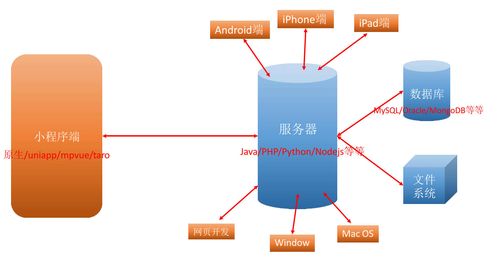
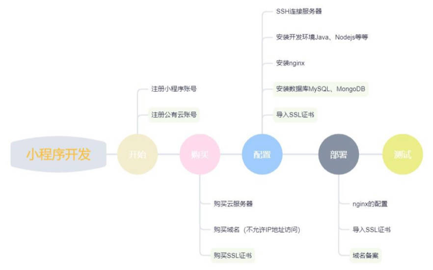
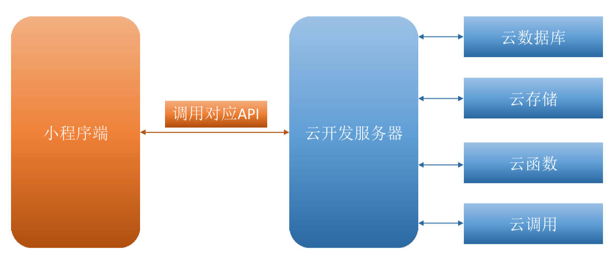
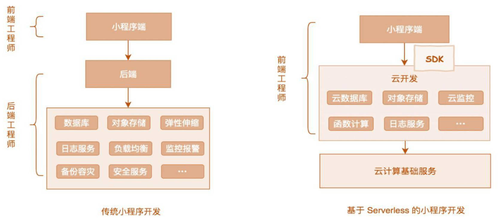
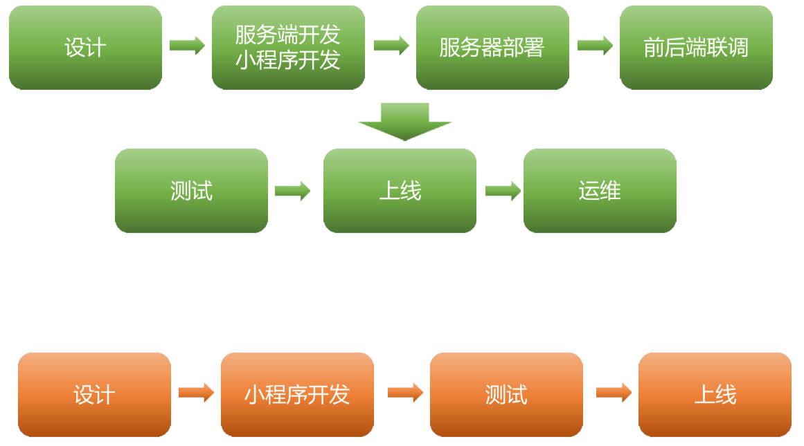
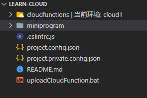

# 一个完整的项目，包含多端

理解图解。



# 传统模式开发的成本考虑

- 如果一个小公司或个人只是想开发一个小程序推广自己的产品或者实现某个想法，按照传统的开发模式，我们需要考虑哪些东西呢？
  - 成本角度：维护服务器成本，并且需要考虑并发量大后服务器的扩展。
  - 技术研发：对于单纯会前端的人来说，学习后端相关的技术，成本较高。



# 云开发的介绍

## 云开发的定位

* 个人的项目或者想法, 不想开发服务器, 直接使用云开发
* 某些公司的小程序项目也是使用云开发(不多)
* 了解一些云开发中的思想, 比如服务器/数据库/存储, 有利于以后学习服务器相关的开发技术
  * MySQL/Node/上传文件

## 云开发和传统开发的对比

云开发的模式



云开发模式与传统开发模式对比



项目流程对比



# 云开发三大核心技术

云开发主要包含三大核心技术：

- 云数据库：
	- 提供在小程序端直接对数据库进行增删改查的能力；
	- 数据库是类似于 MongoDB 的文档存储的数据库，操作非常方便；
- 云存储：
	- 可以在小程序端直接上传、下载、删除文件；
	- 自带CDN，提高文件访问速度；
	- 可以获取临时链接，支持在小程序外访问；
- 云函数：
	- 提供了在服务器执行代码的能力，需要编写函数，上传到服务器；
	- 包含微信天然的私有鉴权；
	- 更大权限的操作数据库等；
	- 进行云调用、HTTP 请求等操作；

# 创建一个云开发项目

在微信开发者工具中，创建小程序项目，后端服务选择【微信云开发】。

目录结构如下，miniprogram 为小程序项目的根目录。



# 云开发控制台

在微信开发者工具中，点击上方云开发，进入云开发控制台。有以下模块：

- 运营分析
- 数据库（云数据库）
- 存储（云存储）
- 云函数
- 云托管（本质上不属于云开发范畴，广告推广性质）

开通云开发环境

- 设置 – 环境名称 – 创建环境

云开发的环境和配额：

- 什么是环境：
	- 一个环境对应一整套独立的云开发资源，包括数据库、存储空间、云函数等资源（相当于一个新的服务器）。
	- 各个环境是相互独立的，用户开通云开发后即创建了一个环境，默认可拥有最多两个环境。
	- 在实际开发中，建议每一个正式环境都搭配一个测试环境，所有功能先在测试环境测试完毕后再上到正式环境。
- 什么是配额：
	- 默认有一定的免费配额（已经改成了1个月免费）；
	- 后期可以根据自己的业务量选择对应的更高配额；
	- [官方文档](https://developers.weixin.qq.com/miniprogram/dev/wxcloud/billing/quota.html)

# 云开发项目初始化

在小程序端开始使用云能力前，需先调用 `wx.cloud.init` 方法完成云能力初始化

传入的两个参数

| 字段      | 数据类型         | 必填 | 默认值                       | 说明                                           |
| --------- | ---------------- | ---- | ---------------------------- | ---------------------------------------------- |
| env       | string \| object | 否   | 默认环境（第一个创建的环境） | API 调用的默认环境                             |
| traceUser | boolean          | 否   | false                        | 是否将用户访问，记录到用户管理中，在控制台可见 |

miniprogram\app.js

```js
App({
  onLaunch: function () {
    if (!wx.cloud) {
      console.error('请使用 2.2.3 或以上的基础库以使用云能力');
    } else {
      wx.cloud.init({
        env: 'cloud1-8g4a3iira9235aea',
        traceUser: true,
      });
    }
  }
});

```

配置小程序项目根目录和云函数根目录

project.config.json

```json
{
  "miniprogramRoot": "miniprogram/",
  "cloudfunctionRoot": "cloudfunctions/",
}
```

# 云数据库

## 什么是云数据库

- JSON 数据库：

  - 云开发提供了一个文档型数据库，类似于 MongoDB，里面存放的是一条条 JSON 格式的对象；

  - 一个数据库可以包含多个集合，一个集合中包含多个 JSON 对象；

  - 理解关系型数据库和文档型数据库的区别。

    | 关系型          | 文档型            |
    | --------------- | ----------------- |
    | 数据库 database | 数据库 database   |
    | 表 table        | 集合 collection   |
    | 行 row          | 记录 record / doc |
    | 列 column       | 字段 field        |

- 提供方便的 API 调用：学习这些 API 即可；

- 提供了小程序端和服务器端（云函数）中调用的区分；

## 控制台手动添加数据

- 创建集合
- 创建一条数据（使用默认模式，或 JSON 模式）
- 添加字段
- 导入一组数据
  - 手动导入，使用 JSON 模式时，外层是一个个对象，中间不能有逗号。

## 代码插入数据。

- 添加数据的调用过程：

  1. 获取数据库对象；`const db = wx.cloud.database()`

  2. 获取操作的集合；`const collection = db.collection('students')`

  3. 添加数据。`collection.add({ ... })`

- 获取操作后的回调结果，两种方式：
  - 方式一：基于回调：传入 `success`、`fail`、`complete`。
  - 方式二：基于 Promise：使用 `then`、`catch`、`finally`。

- 插入成功后，会返回自动生成的 `_id`。

- 小程序代码插入的数据，自动添加了 `openid` 字段，用于记录哪个用户添加的数据。

miniprogram\pages\cloud-database\index.js

```js
// 1.获取到对应的数据库
const db = wx.cloud.database()
// 2.获取到操作的集合（collection）
const studentsColl = db.collection('students')

Page({
  onAddBtnTap() {
    // 向云数据库中添加一条数据
    studentsColl.add({
      data: {
        name: 'Martines',
        age: 20,
        address: {
          name: 'Manchester',
          code: '54321',
          alias: 'Man'
        },
        hobbies: ['football', 'tennis']
      },
      /* success: res => {
        console.log('success res:', res);
      } */
    }).then(res => {
      console.log('success res:', res);
    })
  }
})
```

miniprogram\pages\cloud-database\index.wxml

```html
<button type="primary" bindtap="onAddBtnTap">新增数据</button>
```

## 代码删除数据

对文档（记录）使用 `remove` 方法可以删除该条文档（记录）

miniprogram\pages\cloud-database\index.js

```js
// 1.获取到对应的数据库
const db = wx.cloud.database()
const cmd = db.command
// 2.获取到操作的集合（collection）
const studentsColl = db.collection('students')

Page({
  onDeleteBtnTap() {
    // 1.删除一条文档（记录）
    studentsColl.doc('c658c1c56353f7e3001235167d7e6c81')
    .remove()
    .then(res => {
      console.log('delete res:', res);
    })

    // 2.删除年龄大于 25 的文档
    const cmd = db.command
    studentsColl.where({
      age: cmd.gt(25)
    })
    .remove()
    .then(res => {
      console.log('delete condition res:', res);
    })
  }
})
```

miniprogram\pages\cloud-database\index.wxml

```html
<button type="primary" bindtap="onDeleteBtnTap">删除数据</button>
```

> 写入一般指的是新增，修改，删除。

## 查询指令

什么是查询指令？

- 假设我们需要查询进度大于 30% 的待办事项，那么传入对象表示全等匹配的方式就无法满足了，这时就需要用到查询指令。
- 数据库 API 提供了大于、小于等等多种查询指令，这些指令都暴露在 `db.command` 对象上。

常见的查询指令：

| 查询指令 | 说明                 |
| -------- | -------------------- |
| eq       | 等于                 |
| neq      | 不等于               |
| lt       | 小于                 |
| lte      | 小于或等于           |
| gt       | 大于                 |
| gte      | 大于或等于           |
| in       | 字段值在给定数组中   |
| nin      | 字段值不在给定数组中 |

## 代码修改数据

两种方式。

- `update`：更新（增加）某一个字段
- `set`: 使用新对象替换原来对象

miniprogram\pages\cloud-database\index.js

```js
// 1.获取到对应的数据库
const db = wx.cloud.database()
// 1.1.获取查询指令对象
const cmd = db.command
// 2.获取到操作的集合（collection）
const studentsColl = db.collection('students')

Page({
  onUpdateBtnTap() {
    // 1.更新某一条明确的数据
    // 1.1.使用 update 的方式
    studentsColl.doc('8655d51b6354e047001258933d0254ac')
    .update({
      data: {
        age: 38
      }
    })
    .then(res => {
      console.log('update res:', res);
    })
    // 1.2.使用 set 的方式
    studentsColl.doc('5d055c866354da040012425222d0b5b3')
    .set({
      data: {
        age: 24
      }
    })
    .then(res => {
      console.log('set res:', res);
    })

    // 2.更新多条数据
    studentsColl.where({
      age: cmd.gt(18)
    })
    .update({
      data: {
        age: 10
      }
    })
    .then(res => {
      console.log('update multi res:', res);
    })
  }
})
```

miniprogram\pages\cloud-database\index.wxml

```html
<button type="primary" bindtap="onUpdateBtnTap">修改数据</button>
```

## 小程序代码查询数据

六种方式。

- 方式一：通过 ID 精确的查询某一条数据；
  - 使用 `doc` 查询 ID
- 方式二：根据条件查询满足条件的数据，查询到的是多条数据，返回的是数组；
  - 使用 `where` 作为条件
- 方式三：通过指令过滤数据；
  - 使用 `db.command` 的指令
- 方式四：通过正则表达式匹配符合的数据；[官方文档](https://developers.weixin.qq.com/miniprogram/dev/wxcloud/reference-sdk-api/database/Database.RegExp.html)，有3种方式。
  - 使用 `db.RegExp` 创建正则规则
- 方式五：获取整个集合的数据（小程序端一次性最多20条，云函数中可以获取100条）；
  - 直接调用 `get`
- 方式六：过滤、分页、排序查询数据
  - 使用 `field`、`skip`、`limit`、`orderBy`

> 使用云数据库提供的 API 查询最多一次返回 20 条数据；云函数一次最多返回 100 条数据。
>
> 如果查询出错，注意数据库集合的权限设置是否正确。

miniprogram\pages\cloud-database\index.js

```js
// 1.获取到对应的数据库
const db = wx.cloud.database()
// 1.1.获取查询指令对象
const cmd = db.command
// 2.获取到操作的集合（collection）
const biliColl = db.collection('bili-channel1')

Page({
  onQueryBtnTap() {
    // 方式一，根据 id 查询某一条数据。
    biliColl.doc('a0197c3e6353e65e02c161fd72e396c7')
    .get()
    .then(res => {
      console.log('方式一 res:', res);
    })

    // 方式二：根据条件查询多条数据
    biliColl.where({
      author: '在下老酷'
    })
    .get()
    .then(res => {
      console.log('方式二 res:', res);
    })

    // 方式三：查询指令，gt / lt
    biliColl.where({
      coins: cmd.get(1000)
    })
    .get()
    .then(res => {
      console.log('方式三 res:', res);
    })

    // 方式四：正则表达式
    biliColl.where({
      author: db.RegExp({
        regexp: 'a',
        options: 'i'
      })
    })
    .get()
    .then(res => {
      console.log('方式四 res:', res);
    })

    // 方式五：获取整个集合中的数据
    biliColl.get().then(res => {
      console.log('方式五 res:', res);
    })

    // 方式六：过滤字段，分页，排序，
    biliColl.field({
      _id: true,
      author: true,
      bvid: true,
      play: true,
      title: true
    })
    .skip(0)
    .limit(5)
    .orderBy('play', 'desc')
    .get()
    .then(res => {
      console.log('方式六 res:' ,res);
    })
  }
})
```

miniprogram\pages\cloud-database\index.wxml

```html
<button type="primary" bindtap="onQueryBtnTap">查询数据</button>
```

## 案例理解

对 bili 的数据做增删改查，

miniprogram\pages\bili-channel\index.js

```js
const db = wx.cloud.database()
const biliColl = db.collection('bili-channel1')

Page({
  data: {
    biliChannelList: [],
  },
  offset: 0,
  size: 10,

  onLoad() {
    this.fetchBiliChannelData()
  },

  onReachBottom() {
    this.fetchBiliChannelData()
  },

  fetchBiliChannelData() {
    biliColl.skip(this.offset).limit(5).get().then(res => {
      console.log('res:', res);
      this.setData({
        biliChannelList: this.data.biliChannelList.concat(res.data)
      })
      this.offset = this.data.biliChannelList.length
    })
  },

  onItemDeleteTap(e) {
    const { item, index } = e.currentTarget.dataset
    biliColl.doc(item._id).remove().then(res => {
      console.log('delete res:', res);
      if (res) {
        this.setData({
          biliChannelList: [],
        })
        this.offset = 0
        this.fetchBiliChannelData() // 数据回显
      }
    })
  },
})
```

miniprogram\pages\bili-channel\index.wxml

```html
<viwe class="title">bili channel 的视频</viwe>
<view class="list">
  <block wx:for="{{ biliChannelList }}" wx:key="bvid">
    <view class="item">
      <image src="{{ item.pic }}" mode="widthFix"></image>
      <view>{{ item.author }} - {{ item.title }}</view>
      <view class="control">
        <button size="mini" bindtap="onItemDeleteTap" data-item="{{ item }}" data-index="{{ index }}">删除</button>
      </view>
    </view>
  </block>
</view>
```

> 如果删除、修改了数据库中的数据，一般会再次查询新的数据集合，做数据回显。
>
> 为集合中的记录添加索引，[官方文档](https://developers.weixin.qq.com/miniprogram/dev/wxcloud/guide/database/)，可以提高查找效率。小程序中推荐我们应该为所有作为查询条件的字段建立索引。默认 _id, _openid 两字段已经建立了索引。
>
> - 如果将字段 rid 作为索引，会建立一张只存放 rid 的索引表；按照升序或降序排列，查找 rid 时，不需要挨个进行比较。会使用某种算法进行查找（如最简单的例子，二分查找）
>
> 关系型数据库中通过 B 树数据结构进行查找。
>

# 云存储

云存储用于将文件存储到云端：

- 云存储提供高可用、高稳定、强安全的云端存储服务；
- 持任意数量和形式的非结构化数据存储，如视频和图片；
- 并在控制台进行可视化管理；

## 控制台中的操作：

- 上传文件到云存储中；
- 获取 fileID 在项目中显示；
- 获取 URL 临时链接在浏览器显示。

## 代码上传文件：

上传文件到云存储中（图片、视频、音频等等都可以）

## 代码下载文件：

下载文件到本地（本地文件缓存）

- 如果文件是放在云存储中，那么必然需要有网络的情况下才能访问。 
- 某些情况下，我们可能希望把某些重要的文件下载到本地，就可以使用云存储的文件下载了。

## 代码删除文件：

某些文件不再使用时，可以将其从云存储中删除掉，这样可以节省空间.


## 代码获取文件临时链接：

为什么要获取临时链接？ 

- 我们将文件上传到云存储后，可以通过 fileID 在小程序中直接访问； 
- 但是，如果我们希望在小程序以外的地方访问（比如浏览器、手机端），那么 fileID 是不可以的；
- 这个时候，我们可以通过获取临时链接，该链接可以在小程序以外访问（在外网可以访问）；

miniprogram\pages\cloud-storage\index.js

```js
Page({
  data: {
    tempFilePath: ''
  },

  // 小程序代码上传文件
  onUploadTap() {
    // 1.选择本地图片（相册/拍照）
    wx.chooseMedia({
      type: 'image',
    }).then(res => {
      console.log('choose image res:', res);
      // 2.获取图片
      const filePath = res.tempFiles[0].tempFilePath
      // 3.将图片上传到云存储中。
      const timestamp = Date.now()
      const openid = 'open_xxx' // 模拟获取到用户的 openid
      const extension = filePath.split('.').pop() // 获取图片后缀名
      
      const name = `${timestamp}_${openid}.${extension}` // 生成图片名称
      return wx.cloud.uploadFile({
        filePath,
        cloudPath: 'SondsEufonium/' + name
      })
    }).then(res => {
      console.log('upload image res:', res);
      this.setData({
        tempFilePath: res.fileID
      })
    })
  },

  // 小程序代码下载文件
  onDownloadTap() {
    // 1.根据 fileID 下载图片
    wx.cloud.downloadFile({
      fileID: 'cloud://cloud1-8g4a3iira9235aea.636c-cloud1-8g4a3iira9235aea-1306746431/SondsEufonium/1666528766271_open_xxx.jpg' // 真实开发中不会写死
    }).then(res => {
      console.log('download image res:', res);
      // 2.将图片的路径放到 data 中
      this.setData({
        tempFilePath: res.tempFilePath
      })
    })
  },

  // 小程序代码删除文件
  onDeleteloadTap() {
    wx.cloud.deleteFile({
      fileList: [
        'cloud://cloud1-8g4a3iira9235aea.636c-cloud1-8g4a3iira9235aea-1306746431/SondsEufonium/1666528766271_open_xxx.jpg'
      ]
    }).then(res => {
      console.log('delete image res:', res);
    })
  },

  // 小程序代码生成临时连接。
  onTempFileTap() {
    wx.cloud.getTempFileURL({
      fileList: [
        'cloud://cloud1-8g4a3iira9235aea.636c-cloud1-8g4a3iira9235aea-1306746431/SondsEufonium/1666529836647_open_xxx.jpg'
      ]
    }).then(res => {
      console.log('temp file res:', res);
    })
  },

})
```

miniprogram\pages\cloud-storage\index.wxml

```html
<button bindtap="onUploadTap">上传文件</button>
<button bindtap="onDownloadTap">下载文件</button>
<button bindtap="onDeleteloadTap">删除文件</button>
<button bindtap="onTempFileTap">临时文件</button>

<image src="{{ tempFilePath }}"></image>
```

