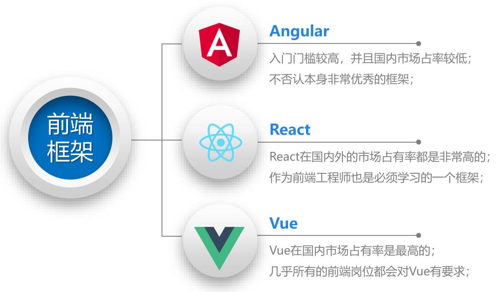
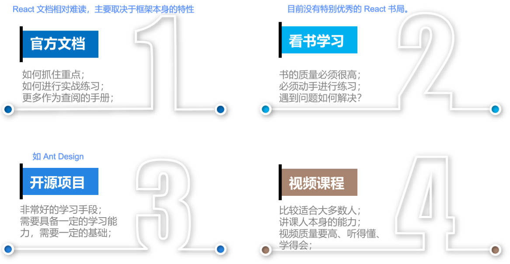
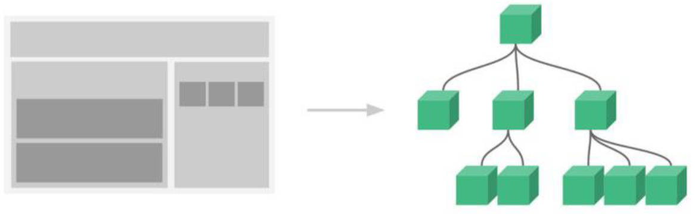

# 01-邂逅React-JSX语法

## 一、React 是什么？

### 1.官方的说法

官方对它的解释：用于**构建用户界面的 JavaScript 库**；

### 2.前端框架的发展

目前前端开发，几乎不直接使用原生的 JavaScript 来开发应用程序，而是选择一个 JS 库 / 框架。

在过去很长时间，jQuery 是被使用最多的 JS 库；目前已经处于淘汰的边缘了；

现在，无论是国内还是国外，最流行的其实是三大框架：Vue、React、Angular。



### 3.React 与其它框架关系

React 由 Facebook 更新和维护，它是大量优秀程序员的思想结晶：

React 不仅仅局限开发者对它的认可；其它流行的框架，或多或少也借鉴 React 的思想；比如：

- Vue.js 框架设计之初，有很多的灵感来自 Angular 和 React。

  - 比如 React Hooks 是开创性的思想，Vue Composition API 借鉴了 React Hooks 的思想；

- Flutter 的很多灵感都来自 React：
  - 官网描述：Flutter 中的 “Widget”，“Element”，“RenderObject”；分别对应 React 的 “JSX”，“虚拟 DOM”，“真实 DOM”；

React 是前端的先驱者，它引领整个前端的潮流。

### 4.Vue 和 React 选择？

首先，React 和 Vue 是前端开发人员必须掌握的两个框架。

下面的观点是一个目前比较普遍的共识：

- 大中型公司选择 React 会较多，灵活和稳定；
- 中小型公司选择 Vue 会较多，易上手和代码统一；


## 二、新技术栈学习方法



## 三、React 适用人群

学习 React 要具备那些基础？（什么人适合学习）

- 前端基础知识掌握牢固（HTML、CSS、JavaScript）。
- 高级的 JavaScript 语法掌握牢固。
  - 比如 ES6 以上的语法、this 绑定规则等等；

## 四、React 技术特点

### 1.声明式编程

声明式编程，目前是整个大前端，流行的开发的模式。比如：Vue、React、Flutter、SwiftUI；都是用生命是编程。

声明式编程允许我们只维护状态，当它改变时，根据最新的状态去渲染 UI 界面；


### 2.组件化开发

组件化开发，是目前前端的流行趋势，我们会将复杂的界面拆分成一个个小的组件；



### 3.多平台适配

2013 年，React 发布之初，主要是开发 Web 页面；

2015 年，Facebook 推出了 ReactNative，用于开发移动端跨平台；

- 虽然目前 Flutter 非常火爆，但是还是有很多公司在使用 ReactNative；

2017 年，Facebook 推出 ReactVR 用于开发虚拟现实 Web 应用程序；

- VR 未来也许会是一个火爆的应用场景。


## 五、React 初体验：创建根组件

在界面上通过 React 显示一个 Hello World

```html
<body>
	<div id="root"></div>

	<!-- 添加依赖，需要三个包，-->

  <!-- 使用 CDN 引入，crossorigin 这个属性的目的是为了拿到跨域脚本的错误信息-->
	<script crossorigin src="https://unpkg.com/react@18/umd/react.development.js"></script>
  <script crossorigin src="https://unpkg.com/react-dom@18/umd/react-dom.development.js"></script>
  <script src="https://unpkg.com/babel-standalone@6/babel.min.js"></script><!-- babel -->

  <!-- 必须添加 `type="text/babel"`，作用是可以让 babel 解析 jsx 的语法 -->
	<script type="text/babel">
    // React 18 之前的写法 *
		ReactDOM.render(<h2>Hello world</h2>, document.querySelector('#root'))

    // React 18 之后的写法
		const root = ReactDOM.createRoot(document.querySelector('#root'))
		root.render(<h2>Hello World</h2>)

	</script>
</body>
```

创建 react 根组件的代码解析：

```jsx
// React 18 之后的写法
const root = ReactDOM.createRoot(document.querySelector('#root'))
root.render(<h2>Hello World</h2>)
```

`ReactDOM.createRoot`：创建一个 React 根，渲染的内容，会被挂载到这个根中。

`root.render`：渲染根组件。

通过 `{}` 语法，来引入外部的变量或者表达式

## 六、React 的开发依赖

对于 Vue 来说，只依赖一个 vue.js 文件即可；

然而 React 必须依赖三个库。即上文 CDN 引入的三个库；这三个库各司其职。依赖的引入方式：

- 方式一：直接 CDN 引入。

- 方式二：下载后，作为本地依赖引入。

- 方式三：通过 npm 管理（后续脚手架再使用）。

### 1.react 依赖

其中包含 react 所必须的核心代码。

### 2.react-dom 依赖

其中包含渲染在不同平台所需要的核心代码。

早期没有 *react-dom* 库，所有功能都包含在 *react* 库里；

在 React 0.14 版本之后，加入了 react-native 的功能，将 react-dom 拆分为一个独立的包，在使用 react 时引入；

针对 web 端和 native 端，完成不同的渲染任务：

- web 端：react-dom 会将 jsx 最终渲染成真实的 DOM，显示在浏览器中。
- native 端：react-dom 会将 jsx 最终渲染成原生的控件（比如 Android 中的 `Button`，iOS 中的 `UIButton`）。

### 3.babel 依赖

将 jsx 转换成 `React.createElement` 编写的源代码。

> Babel 是一个工具链，最早用于在旧浏览器或环境中将 ES6+ 代码转成向后兼容的版本。
>
> 现在主要用于语法转换，源代码转换等。
>
> Babel 本质上是一个编译器。

babel 与 react 的关系：

- 不使用 babel，需要使用 `React.createElement` 来编写代码，非常的繁琐，可读性差。
- 使用 babel，可直接编写 jsx（JavaScript XML）代码；babel 会将 jsx 编译成 `React.createElement` 形式的源码。

## 七、React 初体验：实现简单案例

实现案例，点击按钮，修改文本；

理解 react 创建根的做法，

- 将文本定义成变量，并在 jsx 中引用（jsx 中对标识符的引用，都是用 `{}`）
- jsx 中实现事件的监听，监听按钮的点击。
- React 在默认情况下，不会进行重新渲染。

```jsx
<body>

	<div id="root"></div>

	<!-- 引入下载到本地的依赖 -->
	<script src="../../lib/react.development.js"></script>
	<script src="../../lib/react-dom.development.js"></script>
	<script src="../../lib/babel.min.js"></script>

	<script type="text/babel">
		const root = ReactDOM.createRoot(document.querySelector('#root'))

		// 1.将文本定义成变量
		let msg = 'Hello world'

		// 2.定义按钮点击执行的函数
		function onbtnClick() {
			msg = 'Hello React'
			render()
		}

		// 3.封装一个渲染函数，并调用一次。
		function render() {
			// 第一个括号表示 render 方法执行，第二个括号表示 jsx 代码块整体
			root.render((
				<div>
					<h2>{ msg }</h2>
					<button onClick={ onbtnClick }>修改文本</button>
				</div>
			))
		}
		render()
	</script>
</body>
```

## 八、React 组件化开发

以上案例中，整个逻辑其实可以看做一个整体，将其封装成一个组件：

- 我们知道 `root.render` 的参数，是一个 HTML 元素或者一个组件；
- 所以可以将业务逻辑封装到一个组件中，然后作为参数，传入到 `root.render` 中；

在 React 中，封装一个组件有两种方式，**类组件** 和 **函数式组件**；

这里先使用类组件。

首先，定义一个类；
- 类名首字母必须大写，组件的名称是必须大写的，否则会被认为是 HTML 元素。
- 这个类要继承自 `React.Component`。

然后，实现组件的 `render` 函数。返回的 jsx 内容，就是 React 会渲染的内容。

```jsx
<body>
	<div id="root"></div>

	<script src="../../lib/react.development.js"></script>
	<script src="../../lib/react-dom.development.js"></script>
	<script src="../../lib/babel.min.js"></script>

	<script type="text/babel">
		// 使用组件进行代码重构
		class App extends React.Component {
			constructor() {
				super()
				// 组件的状态
				this.state = {
					msg: 'Hello World',
					name: 'zzt',
					age: 18
				}

				// 为在 jsx 标签属性中使用的方法提前绑定好 this
				this.onBtnClick = this.onBtnClick.bind(this)
			}

			onBtnClick() {
				this.setState({
					msg: 'Hello React'
				})
			}

			// 渲染内容 render 方法
			render() {
				return (
					<div>
						<h2>{ this.state.msg }</h2>
						<button onClick={ this.onBtnClick }>修改文本</button>
					</div>
				)
			}
		}

		// 将组件渲染到界面上
		const root = ReactDOM.createRoot(document.querySelector('#root'))
		root.render(<App/>)
	</script>
</body>
```

### 1.状态定义

在组件中的数据，我们可以分成两类：

- 参与界面更新的数据：当数据变化时，需要更新组件渲染的内容；
- 不参与界面更新的数据：当数据变化时，不需要更新组建渲染的内容；

参与界面更新的数据称之为是**参与数据流**，这个数据是定义在当前对象的 `state` 中

- 在构造函数中进行初始化 `this.state = {...}`
- 当数据发生变化时，调用 `this.setState` ，该方法是从 `React.Component` 继承过来的，会做两件事：
  - 更新 `this.state` 中的状态值；
  - 通知 React 进行 update 操作；改操作会调用 `render` 函数，使用最新的状态，来渲染界面。

### 2.事件绑定中的 this 指向

在类中定义一个实例方法，将这个方法，绑定到元素的 `onClick` 事件上，这个方法中的 `this` 默认情况下指向 `undefined`

1. 原生的 DOM 操作中，监听点击，监听函数中的 `this` 指向节点对象（比如 button 对象）；
2. React 中的代码，并非直接渲染成真实的 DOM，我们所使用 JSX 编写的 `<button>` 只是一个语法糖，它的本质是 React 的 Element 对象；
3. React 在执行 React 的 Element 对象上绑定的函数时，并没有为它绑定 `this`；所以默认情况下就是一个 `undefined`；
   1. ES6 中使用 class，里面的实例方法，默认开启**严格模式**；React 项目中，引用的 babel 库，其中也会开启**严格模式**。
   2. 而在严格模式下，`this` 的默认就是 `undefined`。
   3. jsx 代码会被 babel 编译为一段 js 代码，这段代码运行在**严格模式**中，因此，在 jsx 中引用类的实例方法，方法中的 `this` 默认绑定的是 `undefined`。

综上所述，在绑定事件处理的函数中，想要使用当前组件实例对象，即 `this`，需要在绑定事件处理函数前，给该函数绑定 `this`：

```jsx
<button onClick={this.changeText.bind(this)}>改变文本</button>
```

## 九、React 初体验（三）

### 1.电影列表案例

```jsx
<body>
	<div id="root"></div>

	<script src="../../lib/react.development.js"></script>
	<script src="../../lib/react-dom.development.js"></script>
	<script src="../../lib/babel.min.js"></script>

	<script type="text/babel">
		// 封装 App 组件
		class App extends React.Component {
			constructor() {
				super()
				this.state = {
					movies: ['星际穿越', '大话西游', '盗梦空间', '黑客帝国']
				}
			}

			render() {
				return (
					<div>
						<h2>电影列表</h2>
						<ul>
							{ this.state.movies.map(item => <li>{ item }</li>) }
						</ul>
					</div>
				)
			}
		}

		// 创建 root
		const root = ReactDOM.createRoot(document.querySelector('#root'))
		// 渲染组件
		root.render(<App/>)
	</script>
</body>
```

### 2.计数器案例的

```jsx
<body>
	<div id="root"></div>

	<script src="../../lib/react.development.js"></script>
	<script src="../../lib/react-dom.development.js"></script>
	<script src="../../lib/babel.min.js"></script>

	<script type="text/babel">

		// 封装 App 组件
		class App extends React.Component {
			constructor() {
				super()
				this.state = {
					counter: 100
				}
				this.increment = this.increment.bind(this)
				this.decrement = this.decrement.bind(this)
			}

			increment() {
				this.setState({
					couter: ++this.state.counter
				})
			}
			decrement() {
				this.setState({
					couter: --this.state.counter
				})
			}

			render() {
				const counter = this.state.counter

				return (
					<div>
						<h2>当前计数：{ counter }</h2>
						<button onClick={ this.increment }>+1</button>
						<button onClick={ this.decrement }>-1</button>
					</div>
				)
			}
		}

		// 创建 root 对象
    const root = ReactDOM.createRoot(document.querySelector('#root'))
		// 渲染组件
		root.render(<App/>)
	</script>
</body>
```

为了方便编写 Demo，生成 VSCode 的 react 渐进式代码片段。

## 十、JSX 是什么？

JSX 是一种 JavaScript 的语法扩展（javaScript extension）;

JSX 也在很多地方称之为 JavaScript XML，因为看起就是一段 XML 语法；

它用于描述我们的 UI 界面，并且其完全可以和 JavaScript 融合在一起使用；

它不同于 Vue 中的模块语法，你不需要专门学习模块语法中的一些指令（比如 `v-for`、`v-if`、`v-else`、`v-bind`）；

## 十一、React 为什么用 jsx？（面试）

React 认为渲染逻辑本质上与其他 UI 逻辑存在内在耦合：

- 比如 UI 需要绑定事件；
- 比如 UI 中需要展示数据状态；
- 比如在某些状态发生改变时，又需要改变 UI；

渲染逻辑与 UI 逻辑之间是密不可分，所以 React 旋转选择用 jsx 将它们组合到了一起，这就是组件（Component）；

## 十二、jsx 书写规范

JSX 的顶层只能有一个根元素，所以一般在最外层包裹一个 `<div>` ,或者 `Fragment`；

jsx 通常包裹在 `()` 中，为进行换行书写，方便阅读。

JSX 中的标签可以是单标签，也可以是双标签；单标签必须以 `/>` 结尾（HTML 中单标签元素可省略）。

## 十三、jsx 使用

### 1.注释的写法

```jsx
const divEl = (
  <div>
    {/* 我是注释 */}
    哈哈哈
  </div>
)
```

### 2.嵌入变量作为子元素

情况一：当变量是 `Number`、`String`、`Array` 类型时，可以直接显示 。

情况二：当变量是 `null`、`undefined`、`Boolean` 类型时，内容为空；

- 如需显示，要转成字符串； 比如 1.`toString` 方法；2.和空字符串拼接；3.`String(变量)` 等方式；

情况三：Object 对象类型不能作为**子元素**在 JSX 语法中引用。

### 3.嵌入表达式

运算表达式，如三元运算表达式；执行一个函数。

> react 中没有计算属性，完全在 jsx 中处理。

```jsx
<body>

	<div id="root"></div>

	<script src="../../lib/react.development.js"></script>
	<script src="../../lib/react-dom.development.js"></script>
	<script src="../../lib/babel.min.js"></script>

	<script type="text/babel">
		class App extends React.Component {
			constructor() {
				super()
				this.state = {
					counter: 100,
					msg: 'Hello React',
					movies: ['星际穿越', '大话西游', '盗梦空间', '黑客帝国'],

					aaa: undefined,
					bbb: null,
					ccc: true,

					friend: { name: 'kobe', age: 30, address: 'LA' },

					firstname: 'jesse',
					lastname: 'lingard',
					age: 29,

				}
			}

			render() {
				const { msg, counter, movies } = this.state
				const { aaa, bbb, ccc } = this.state
				const { friend } = this.state
				const { firstname, lastname, age } = this.state

				const fullName = firstname + lastname
				const liEls = movies.map(item => <li> { item } </li>)

				return (
					<div>
						{ /* 可直接显示出来 */ }
						<h2>{ counter }</h2>
						<h2>{ msg }</h2>
						<h2>{ movies }</h2>

						{ /* undefined / null / Boolean 显示成文本 */ }
						<h2>{ String(aaa) } 或 { aaa + '' }</h2>
						<h2>{ String(bbb) } 或 { bbb + '' }</h2>
						<h2>{ ccc.toString() }</h2>

						{ /* Object 类型不能作为 jsx 标签的子元素被引用 */ }
						<h2>{ friend.name }</h2>
						<h2>{ Object.keys(friend) }</h2>

						{ /* 插入计算结果 */ }
						<h2>{ fullName }</h2>
						<ul>{ liEls }</ul>

						{ /* 插入表达式 */ }
						<h2>{ age >= 18 ? '成年人' : '未成年人'  }</h2>

						{ /* 调用方法 */ }
						<ul>{ this.getMovieEls() }</ul>
					</div>
				)
			}

			getMovieEls() {
				console.log('this:', this)
				return this.state.movies.map(item => <li>{ item }</li>)
			}
		}

		const root = ReactDOM.createRoot(document.querySelector('#root'))
		root.render(<App/>)
	</script>
</body>
```

### 3.元素属性绑定

动态绑定 class 通常有 3 种方式

动态绑定 style （内联样式）有很多方式？先了解 1 种基本方式。

```jsx
<body>
	<div id="root"></div>

	<script src="../../lib/react.development.js"></script>
	<script src="../../lib/react-dom.development.js"></script>
	<script src="../../lib/babel.min.js"></script>

	<script type="text/babel">
		class App extends React.Component {
			constructor() {
				super()
				this.state = {
					title: '哈哈哈',
					imgUrl: 'https://images5.alphacoders.com/109/1096785.jpg',
					isActive: true,
					styleObj: {
						color: 'red',
						fontSize: '30px'
					}
				}
			}

			render() {
				const { title, imgUrl, isActive, styleObj } = this.state

				// 绑定 class 写法一
				const classList1 = `abc cba ${ isActive ? 'active' : '' }`
				// 绑定 class 写法二
				const classList2 = ['abc', 'cba']
				if (isActive) classList2.push('active')
				// 绑定 class 写法三，第三方库 classnames，一般通过 npm install classnames 引入

				return (
					<div>
						{ /* 基本属性绑定 */ }
						<h2 title={ title }>title 属性绑定</h2>
						

						{ /* 绑定 class 属性，最好使用 className */ }
						<h2 className={ classList1 }>绑定 class 属性</h2>
						<h2 className={ classList2.join(' ') }>绑定 class 属性</h2>

						{ /* 绑定 style 属性，即绑定对象类型 */ }
						<h2 style={ styleObj }>绑定 style 属性</h2>
					</div>
				)
			}
		}

		const root = ReactDOM.createRoot(document.querySelector('#root'))
		root.render(<App/>)
	</script>
</body>
```
