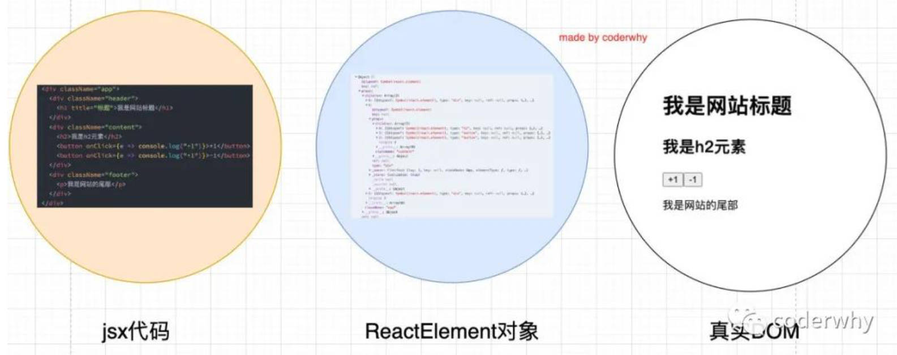
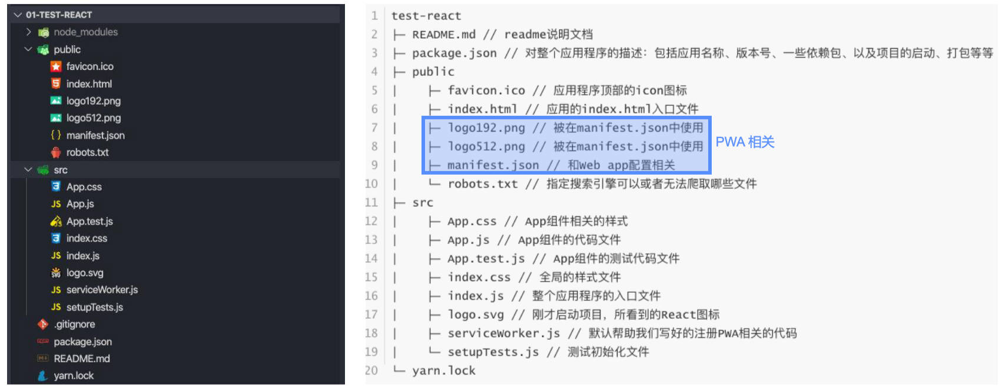

# 一、DOM 事件绑定

为原生 DOM 添加监听事件：

- 方式一：获取原生 DOM 对象，添加监听事件；

  ```js
  const boxEl = document.querySelector('.box')
  boxEl.addEventListener('click', function () {
    /*...*/
  })
  ```

- 方式二：在原生 DOM 对象上，直接绑定 `onclick`；

  ```js
  const boxEl = document.querySelector('.box')
  boxEl.onclick = function () {
    /*...*/
  }
  ```

# 二、JSX 事件绑定

在 React 中，为 jsx 代码添加事件绑定：

- 事件的命名，采用小驼峰式（camelCase），而非纯小写；
- 我们需要通过 `{}` 传入一个事件处理函数，这个函数会在事件发生时被执行；

```jsx
<body>
	<div id="root"></div>

	<script src="../../lib/react.development.js"></script>
	<script src="../../lib/react-dom.development.js"></script>
	<script src="../../lib/babel.min.js"></script>

	<script type="text/babel">
		class App extends React.Component {
			constructor() {
				super()
				this.state = {
					meg: 'Hello World',
					counter: 30
				}

				this.onBtn1Click = this.onBtn1Click.bind(this)
			}

			onBtn1Click() {
				this.setState({
					counter: ++this.state.counter
				})
			}

			render() {
				const { counter } = this.state

				return (
					<div>
						<h2>{ counter }</h2>
						<button onClick={ this.onBtn1Click }>按钮1</button>
					</div>
				)
			}
		}

		const root = ReactDOM.createRoot(document.querySelector('#root'))
		root.render(<App/>)
	</script>
</body>
```

# 三、JSX 事件绑定中的 this

在事件执行的处理函数中，获取当前类的实例对象，这个时候需要用到 `this`

默认情况下，事件执行的处理函数中的 `this` 为 `undefined`，如何让 `this` 指向组件实例？

- 方案一：使用 `bind` 给事件处理函数显示绑定 `this`
- 方案二：使用 ES13 class fields 语法，将事件处理函数定义在类属性中，并赋值一个箭头函数作为默认值，
  - 此时，箭头函数中的 `this`，取的是上层作用域中的 `this`，即 class 作用域中的 `this`，即组件实例。
- 方案三：事件绑定一个箭头函数，在其中调用事件处理函数（推荐），
  - 这样做，传递参数非常方便。

```jsx
<body>
	<div id="root"></div>

	<script src="../../lib/react.development.js"></script>
	<script src="../../lib/react-dom.development.js"></script>
	<script src="../../lib/babel.min.js"></script>

	<script type="text/babel">
		class App extends React.Component {
			constructor() {
				super()
				this.state = {
					meg: 'Hello World',
					counter: 30
				}

				this.onBtn1Click = this.onBtn1Click.bind(this)
			}

			onBtn1Click() {
				this.setState({ counter: ++this.state.counter })
			}

      // 使用 ES13 class fields 语法
			onBtn2Click = () => {
				// 这里的 this，是 class 作用域中的 this 指向的是当前类创建出来的实例。
				this.setState({ counter: 1000 })
			}

			onBtn3Click() {
				this.setState({ counter: 9999 })
			}

			render() {
				const { counter } = this.state
				return (
					<div>
						<h2>{ counter }</h2>

						{/* this 绑定方式一：bind 绑定 */}
						<button onClick={ this.onBtn1Click }>按钮1</button>

						{/* this 绑定方式二：ES6 class fields */}
						<button onClick={ this.onBtn2Click }>按钮2</button>

						{/* this 绑定方式三：直接传入一个箭头函数 */}
						<button onClick={ () => this.onBtn3Click() }>按钮3</button>
					</div>
				)
			}
		}

		const root = ReactDOM.createRoot(document.querySelector('#root'))
		root.render(<App/>)
	</script>
</body>
```

# 四、JSX 事件绑定中参数的传递

在执行事件函数时，传入参数信息：比如 event 对象、以及其他参数：

- 情况一：传入 `event` 对象
  - 传入的是 react 包装后的 `event` 对象，而非原生 `event` 对象。
- 情况二：获取 event 对象和其它参数：
  - 有更多参数时，我们最好的方式就是传入一个箭头函数，主动执行事件处理函数，并且传入相关的其他参数；

```jsx
<body>
	<div id="root"></div>

	<script src="../../lib/react.development.js"></script>
	<script src="../../lib/react-dom.development.js"></script>
	<script src="../../lib/babel.min.js"></script>

	<script type="text/babel">
		class App extends React.Component {
			constructor() {
				super()
				this.state = {
					msg: 'Hello World'
				}
			}

			onBtn1Click(event) {
				console.log('btn1 event:', event)
			}

			onBtn2Click(event) {
				console.log('btn2 event:', event)
			}

			// 通过 bind 绑定 this 后，event 参数只能作为最后一个参数传递
			onBtn3Click(name, age, event) {
				console.log('name:', name)
				console.log('age:', age)
				console.log('event:', event)
			}

			onBtn4Click(event, name, age) {
				console.log('event:', event)
				console.log('name:', name)
				console.log('age:', age)
			}

			render() {
				return (
					<div>
						{/* 传入 event 参数 */}
						<button onClick={this.onBtn1Click.bind(this)}>按钮1</button>
						<button onClick={ evnet => this.onBtn2Click(event) }>按钮2</button>

						{/* 传入 event 和额外的参数 */}
						<button onClick={ this.onBtn3Click.bind(this, 'zzt', 18) }>按钮3（不推荐）</button>
						<button onClick={ e => this.onBtn4Click(e, 'zzt', 18) }>按钮4（推荐）</button>
					</div>
				)
			}
		}

		const root = ReactDOM.createRoot(document.querySelector('#root'))
		root.render(<App />)
	</script>
</body>
```

# 五、列表元素颜色切换案例。

```jsx
<body>
	<div id="root"></div>

	<script src="../../lib/react.development.js"></script>
	<script src="../../lib/react-dom.development.js"></script>
	<script src="../../lib/babel.min.js"></script>

	<script type="text/babel">
		class App extends React.Component {
			constructor() {
				super()
				this.state = {
					movies: ['星际穿越', '大话西游', '盗梦空间', '黑客帝国'],
					currenIndex: 0
				}
			}

			onItemClick(index) {
				this.setState({ currenIndex: index })
			}

			render() {
				const { movies, currenIndex } = this.state

				return (
					<div>
						<ul>
							{
								movies.map((item, index) => (
									<li
										className={currenIndex === index ? 'active' : ''}
										key={item}
										onClick={() => this.onItemClick(index)}
									>
										{ item }
									</li>
								))
							}
						</ul>
					</div>
				)
			}
		}

		const root = ReactDOM.createRoot(document.querySelector('#root'))
		root.render(<App />)
	</script>
</body>
```

理解几种重构方式，体现了 React 的灵活性。

## 1.重构一

```jsx
class App extends React.Component {
  constructor() {
    super()
    this.state = {
      movies: ['星际穿越', '大话西游', '盗梦空间', '黑客帝国'],
      currenIndex: 0
    }
  }

  onItemClick(index) {
    this.setState({ currenIndex: index })
  }

  render() {
    const { movies, currenIndex } = this.state

    const liEls = movies.map((item, index) => (
      <li
        className={currenIndex === index ? 'active' : ''}
        key={item}
        onClick={() => this.onItemClick(index)}
      >
        {item}
      </li>
    ))

    return (
      <div>
        <ul>{liEls}</ul>
      </div>
    )
  }
}

const root = ReactDOM.createRoot(document.querySelector('#root'))
root.render(<App />)
```

## 2.重构二

```jsx
<body>
	<div id="root"></div>

	<script src="../../lib/react.development.js"></script>
	<script src="../../lib/react-dom.development.js"></script>
	<script src="../../lib/babel.min.js"></script>

	<script type="text/babel">
		class App extends React.Component {
			constructor() {
				super()
				this.state = {
					movies: ['星际穿越', '大话西游', '盗梦空间', '黑客帝国'],
					currenIndex: 0
				}
			}

			onItemClick(index) {
				this.setState({ currenIndex: index })
			}

			render() {
				const { movies, currenIndex } = this.state

				const itemHandle = (item, index) => (
					<li
						className={currenIndex === index ? 'active' : ''}
						key={item}
						onClick={() => this.onItemClick(index)}
					>
						{item}
					</li>
				)

				return (
					<div>
						<ul>
							{/* 如果 itemHandle 为普通函数而非箭头函数，map 高阶函数第二个参数可以为 itemHandle 绑定 this */}
							{movies.map(itemHandle)}
						</ul>
					</div>
				)
			}
		}

		const root = ReactDOM.createRoot(document.querySelector('#root'))
		root.render(<App />)
	</script>
</body>
```

# 六、JSX 条件渲染

界面根据不同的条件显示不同内容，或者决定是否渲染某部分内容：

- 在 vue 中，我们会通过指令来控制：比如 `v-if`、`v-show`；
- 在 React 中，所有的条件判断都和普通的 JavaScript 代码一致；

常见的条件渲染的方式有哪些呢？

- 方式一：`if` 语句
  - 适合逻辑较多的情况。
- 方式二：三元运算符。
  - 适合逻辑比较简单。
- 方式三：与运算符 `&&`。
  - 适合如果条件成立，渲染某一个组件；如果条件不成立，什么内容也不渲染的情况；

```jsx
<body>
	<div id="root"></div>

	<script src="../../lib/react.development.js"></script>
	<script src="../../lib/react-dom.development.js"></script>
	<script src="../../lib/babel.min.js"></script>

	<script type="text/babel">
		class App extends React.Component {
			constructor() {
				super()
				this.state = {
					msg: 'Hello World',
					isReady: false,
					friend: null
				}
			}

			render() {
				const { isReady, friend } = this.state

				let showEle = null
				if (isReady) {
					showEle = <h2>准备开始比赛吧</h2>
				} else [
					showEle = <div>请提前做好准备</div>
				]

				return (
					<div>
						{/* 方式一：根据条件给变量赋值不同的内容 */}
						<div>{ showEle }</div>

						{/* 方式二：三元运算符 */}
						<div>{ isReady ? <h2>开始战斗</h2> : <div>赶紧准备</div> }</div>

						{/* 方式三：&& 逻辑运算符，friend 为 null 时，后面的内容不会展示，JSX 的特性 */}
						<div>{ friend && friend.name + ' ' + friend.desc }</div>
					</div>
				)
			}
		}

		const root = ReactDOM.createRoot(document.querySelector('#root'))
		root.render(<App />)
	</script>
</body>
```

## 1.内容点击隐藏案例

在 React 中使用条件渲染，实现 Vue 中 `v-show` 的效果：即控制 `display` 属性是否为 `none`

```jsx
<body>
	<div id="root"></div>

	<script src="../../lib/react.development.js"></script>
	<script src="../../lib/react-dom.development.js"></script>
	<script src="../../lib/babel.min.js"></script>

	<script type="text/babel">
		class App extends React.Component {
			constructor() {
				super()
				this.state = {
					isShow: true
				}
			}

			onChangeClick() {
				this.setState({
					isShow: !this.state.isShow
				})
			}

			render() {
				const { isShow } = this.state

				return (
					<div>
						<button onClick={() => this.onChangeClick()}>切换</button>
						<h2 style={{ display: isShow ? 'block' : 'none' }}>哈哈哈</h2>
					</div>
				)
			}
		}

		const root = ReactDOM.createRoot(document.querySelector('#root'))
		root.render(<App />)
	</script>
</body>
```

# 七、JSX 列表渲染

在 React 中，展示列表最多的方式就是使用数组的 `map` 高阶函数；

某些情况下，展示一个数组中的数据之前，需要先对它进行一些处理：

- 比如过滤掉一些内容：就使用 `filter` 函数。
- 比如截取数组中的一部分内容：就使用 `slice` 函数。

列表渲染中元素绑定 `key` 主要作用是为了提高 diff 算法时的效率；

```jsx
	<body>
		<div id="root"></div>

		<script src="../../lib/react.development.js"></script>
		<script src="../../lib/react-dom.development.js"></script>
		<script src="../../lib/babel.min.js"></script>

		<script type="text/babel">
			 class App extends React.Component {
				 constructor() {
					 super()
					 this.state = {
						 students: [
							{ id: 111, name: 'zzt', score: 99 },
							{ id: 112, name: 'kobe', score: 98 },
							{ id: 113, name: 'james', score: 97 },
							{ id: 114, name: 'curry', score: 96 }
						 ]
					 }
				 }

				render() {
					const { students } = this.state

           return (
             <div>
               <h2>学生列表数据</h2>
               <div className="list">
                 {
                  students.filter(item => item.score > 97)
                    .slice(0, 1)
                    .map(item => (
                      <div className="item" key={item.id}>
                        <h2>学号：{item.id}</h2>
                        <h2>姓名：{item.name}</h2>
                        <h2>分数：{item.score}</h2>
                      </div>
                    ))
                }
               </div>
             </div>
           )
				 }
			}

			const root = ReactDOM.createRoot(document.querySelector('#root'))
			root.render(<App/>)
		</script>
	</body>
```

# 八、JSX 的本质，

实际上，jsx 仅仅只是 `React.createElement(component, props, ...children)` 函数的语法糖。所有的 jsx 最终都会被转化成 `React.createElement` 的函数调用。

`createElement` 需要传递三个参数：

- 参数一：`type`，表示当前 ReactElement 的类型；
  - 标签元素，那么就使用字符串表示，如 “div”；
  - 组件，那么就直接使用组件的名称；
- 参数二：`config`，表示标签元素上的属性，以对象的键值对的形式存储；
  - 比如传入 `className` 作为元素的 class；
- 参数三：`...children`
  - 标签中的子元素，以数组的方式传入；

## 1.Babel 编译前

Babel 编译前的代码

```jsx
// 1.定义 App 根组件
class App extends React.Component {
  constructor() {
    super()
    this.state = {
      message: 'Hello World'
    }
  }

  render() {
    const { message } = this.state

    return (
      <div>
        <div className='header'>Header</div>
        <div className='Content'>
          <div>{message}</div>
          <ul>
            <li>列表数据1</li>
            <li>列表数据2</li>
            <li>列表数据3</li>
            <li>列表数据4</li>
            <li>列表数据5</li>
          </ul>
        </div>
        <div className='footer'>Footer</div>
      </div>
    )
  }
}

// 2.创建root并且渲染App组件
const root = ReactDOM.createRoot(document.querySelector('#root'))
root.render(<App />)
```

## 2.Babel 编译后

> `/*#__PURE__*/` 将函数标记为纯函数，有利于做 tree shaking

```jsx
// 1.定义App根组件
class App extends React.Component {
  constructor() {
    super()
    this.state = {
      message: 'Hello World'
    }
  }

  render() {
    const { message } = this.state

    const element = React.createElement(
      'div',
      null,
      /*#__PURE__*/ React.createElement(
        'div',
        {
          className: 'header'
        },
        'Header'
      ),
      /*#__PURE__*/ React.createElement(
        'div',
        {
          className: 'Content'
        },
        /*#__PURE__*/ React.createElement('div', null, 'Banner'),
        /*#__PURE__*/ React.createElement(
          'ul',
          null,
          /*#__PURE__*/ React.createElement('li', null, '\u5217\u8868\u6570\u636E1'),
          /*#__PURE__*/ React.createElement('li', null, '\u5217\u8868\u6570\u636E2'),
          /*#__PURE__*/ React.createElement('li', null, '\u5217\u8868\u6570\u636E3'),
          /*#__PURE__*/ React.createElement('li', null, '\u5217\u8868\u6570\u636E4'),
          /*#__PURE__*/ React.createElement('li', null, '\u5217\u8868\u6570\u636E5')
        )
      ),
      /*#__PURE__*/ React.createElement(
        'div',
        {
          className: 'footer'
        },
        'Footer'
      )
    )

    console.log(element)
    return element
  }
}

// 2.创建 root 并且渲染 App 组件
const root = ReactDOM.createRoot(document.querySelector('#root'))
root.render(React.createElement(App, null))
```

由上述案例可知，当我们直接使用 `React.createElement` 编写 React 代码时，babel 相关的依赖就不需要了，

- 所以，`<script>` 上的 `type="text/babel"` 可以去掉了；
- 所以，`<script src="../react/babel.min.js"></script>` 也可以去掉了；

# 九、React 虚拟 DOM

## 1.创建过程

> 虚拟 DOM 本质上是一个 JS 对象，它是元素在 JS 中的一种表示。

`React.createElement` 最终创建出来一个 `ReactElement` 对象：

React 将创建出来的 `ReactElement` 对象组成了一个 JavaScript 的对象树；也就是虚拟 DOM。

如 y 要查看 `ReactElement` 的树结构，可以将之前的 jsx 返回结果进行打印；

> Vue 中对 template 的解析，需要对指令等特殊语法做解析。
>
> React 中，只需要使用 babel 对 JSX 进行解析，
>
> PS：JSX 不属于 React 框架的范畴。

理解 JSX 代码 -> 虚拟 DOM -> 真实 DOM 的过程。



## 2.主要作用（面试）：

虚拟 DOM 的作用：

- React 官方说法：帮助我们从命令式编程转为声明式编程。
- 有利于做 diff 算法，更新数据时，没必要将所有数据重新渲染。
- 有利于实现跨平台，在 React 中，虚拟 DOM 既可以做 DOM 元素的渲染，也可以通过桥接的方式，用于 React Native 中，实现移动端控件的渲染。
  - 补充：Weex 是 Vue 和阿里维护的用于做跨平台的库，用的非常少）。

# 十、React 声明式编程

React 官方的说法：虚拟 DOM 是一种编程理念，帮助我们从命令式编程转到了声明式编程的模式。

- 在这个理念中，UI 以一种理想化（虚拟化）的方式保存在内存中；
- 通过 `root.render` 让虚拟 DOM 和真实 DOM 同步起来，这个过程叫做**协调**（Reconciliation）；

这种编程的方式赋予了 React 声明式的 API：

- 只需要告诉 React 希望让 UI 呈现什么状态；React 来确保 DOM 和这些状态是匹配的；
- 不需要直接进行 DOM 操作，从手动更改 DOM、属性操作、事件处理中解放出来；

# 十一、购物车案例

在 React 中，不要直接设值 state；

当我们需要设值引用类型中的属性值时，一般通过浅拷贝进行设值。

```jsx
<!DOCTYPE html>
<html lang="en">
<head>
	<meta charset="UTF-8">
	<meta http-equiv="X-UA-Compatible" content="IE=edge">
	<meta name="viewport" content="width=device-width, initial-scale=1.0">
	<title>购物车</title>
	<style>
		table {
			border-collapse: collapse;
			text-align: center;
		}
		thead {
			background-color: #f2f2f2;
		}
		td, th {
			padding: 10px 16px;
			border: 1px #aaa solid;
		}

	</style>
</head>
<body>
	<div id="root"></div>

	<script src="../../lib/react.development.js"></script>
	<script src="../../lib/react-dom.development.js"></script>
	<script src="../../lib/babel.min.js"></script>
	<script src="./data.js"></script>
	<script src="./format.js"></script>

 <script type="text/babel">
	 class App extends React.Component {
		 constructor() {
			 super()
			 this.state = {
				 books: books
			 }
		 }

		onChangeCountClick(index, count) {
			const books = [...this.state.books]
			books[index].count += count
			this.setState({ books })
		}

		onRemoveItemClick(index) {
			const books = [...this.state.books]
			books.splice(index, 1)
			this.setState({ books })
		}

		getTotalPrice() {
			return this.state.books.reduce((accumulator, item) => {
				accumulator += item.price * item.count
				return accumulator
			}, 0)
		}

		renderBookList() {
      const books = this.state.books

			return (
				<div>
					<table>
						<thead>
							<tr>
								<th>序号</th>
								<th>书籍名称</th>
								<th>出版日期</th>
								<th>价格</th>
								<th>购买数量</th>
								<th>操作</th>
							</tr>
						</thead>
						<tbody>
							{
								books.map((item, index) => (
									<tr key={ item.id }>
										<td>{index + 1}</td>
										<td>{item.name}</td>
										<td>{item.date}</td>
										<td>{formatPrice(item.price)}</td>
										<td>
											<button
												onClick={() => this.onChangeCountClick(index, -1)}
												disabled={item.count <= 1}>
												-
											</button>
											{item.count}
											<button onClick={() => this.onChangeCountClick(index, 1)}>
												+
											</button>
										</td>
										<td>
											<button onClick={() => this.onRemoveItemClick(index)}>删除</button>
										</td>
									</tr>
								))
							}
						</tbody>
					</table>
					<h2>总价格：{formatPrice(this.getTotalPrice())}</h2>
				</div>
			)
		}

		renderBookEmpty() {
			return <div><h2>购物车为空</h2></div>
		}

		render() {
      const books = this.state.books
			return books.length ? this.renderBookList() : this.renderBookEmpty()
		}
	}

	const root = ReactDOM.createRoot(document.querySelector('#root'))
	root.render(<App/>)
 </script>
</body>
</html>
```

# 十二、前端工程化的复杂性

如果我们只是开发几个小的 demo 程序，那么永远不需要考虑一些复杂的问题：

- 比如目录结构如何组织划分；
- 比如如何管理文件之间的相互依赖；
- 比如如何管理第三方模块的依赖；
- 比如项目发布前如何压缩、打包项目；
- 等等...

现代的前端项经越来越复杂了：不会再是在 HTML 中引入几个 css 文件，js 文件或者第三方的 js 文件这么简单；

- 比如 css 可能是使用 less、sass 等预处理器进行编写，我们需要将它们转成普通的 css 才能被浏览器解析；
- 比如 JavaScript 代码不再只是编写在单独几个文件中，而是通过模块化的技术来管理它们之间的相互依赖；
- 比如对项目需要依赖很多的第三方库进行管理（依赖管理、版本升级...）；

为了解决上面这些问题，需要使用一些工具：

- 比如 babel、webpack、gulp，配置它们转换规则、打包依赖、热更新等等一些的内容；
- 脚手架的出现，就是帮助我们解决这一系列问题的；

# 十三、脚手架是什么？

传统的脚手架指的是建筑学的一种结构：在搭建楼房、建筑物时，临时搭建出来的一个框架；

编程中提到的脚手架（Scaffold），其实是一种工具，帮我们快速生成项目的工程化结构；

- 每个项目基本工程化结构是相似的；
- 没有必要每次都从零开始搭建，使用一些工具，生成基本的工程化模板；
- 不同的项目，在这个模板的基础之上，进行开发，对某些配置进行简单修改即可；
- 这样也间接保证了项目的基本结构一致，方便后期的维护；

总结：脚手架让项目从搭建到开发，再到部署，整个流程变得快速和便捷；

# 十四、React 脚手架安装，创建项目

1. 安装 Node 环境。

2. 安装 react 脚手架工具。

   ```shell
   npm install create-react-app -g

   create-react-app --version
   ```

3. 创建一个 React 项目。

   ```shell
   create-react-app [项目名称] # 项目名称不能有大写英文字母
   ```

# 十五、React 项目目录结构



实际开发中，我们根据自身情况，删除掉项目中不必要的文件。

## 1.PWA 是什么 ？

整个目录结构都非常好理解，只是有一个 PWA 相关的概念：

- PWA 全称 Progressive Web App，即渐进式 WEB 应用；
- 一个 PWA 应用首先是一个网页, 可以通过 Web 技术编写出一个网页应用；
- 随后添加上 `App Manifest` 和 `Service Worker` 来实现 PWA 的安装和离线等功能；
- 这种 Web 存在的形式，我们也称之为是 Web App；

PWA 解决了哪些问题呢？

- 可以添加至主屏幕，点击主屏幕图标可以实现启动动画以及隐藏地址栏；
- 实现离线缓存功能，即使用户手机没有网络，依然可以使用一些离线功能；
- 实现了消息推送；
- 等等一系列类似于 Native App 相关的功能；

[更多 PWA 相关的知识](https://developer.mozilla.org/zh-CN/docs/Web/Progressive_web_apps)

# 十六、从零搭建一个项目

02-learn-scaffold\src\index.js

```js
import ReactDOM from 'react-dom/client'

import App from './App'

const root = ReactDOM.createRoot(document.querySelector('#root'))
root.render(<App />)
```

02-learn-scaffold\src\App.jsx

```jsx
import React from 'react'
import HelloWorld from './components/HelloWorld'

class App extends React.Component {
  constructor() {
    super()
    this.state = {
      msg: 'Hello React Scaffold'
    }
  }

  render() {
    const { msg } = this.state

    return (
      <div>
        <h2>{msg}</h2>
        <HelloWorld />
      </div>
    )
  }
}

export default App
```

02-learn-scaffold\src\components\HelloWorld.jsx

```jsx
import React from 'react'

class HelloWorld extends React.Component {
  render() {
    return (
      <div>
        <h2>Hello World</h2>
        <p>Hello World，你好，师姐</p>
      </div>
    )
  }
}

export default HelloWorld
```

# 十七、react 项目 webpack 配置弹出

React 脚手架默认是基于 Webpack 来开发的；但是，默认脚手架生成的项目目录结构中，没有看到任何 webpack 相关的配置。

- 原因是 React 脚手架将 webpack 相关的配置隐藏起来了（其实从 Vue CLI3 开始，Vue 项目也是进行了隐藏）；

如果我们希望看到 webpack 的配置信息，应该怎么来做呢？

- 我们可以执行一个 `package.json` 文件中的一个脚本：`"eject": "react-scripts eject"`

  ```shell
  npm run eject
  ```

- 这个操作是不可逆的，所以在执行过程中会给与我们提示；
