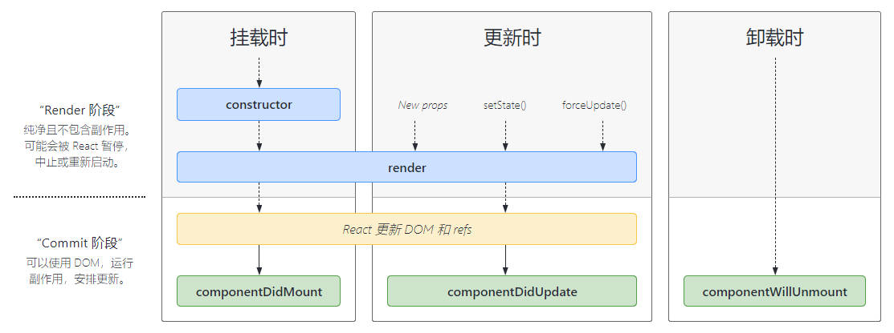
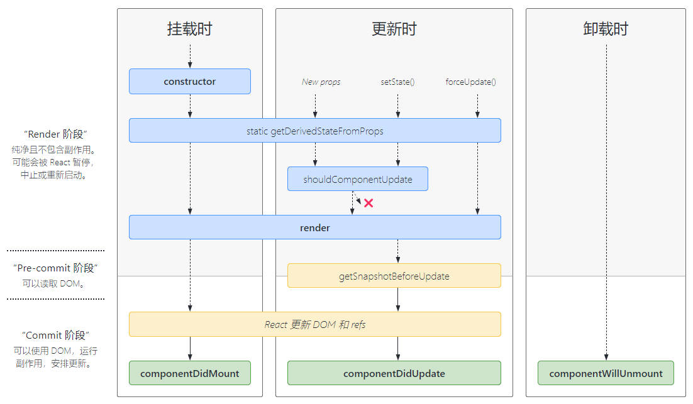
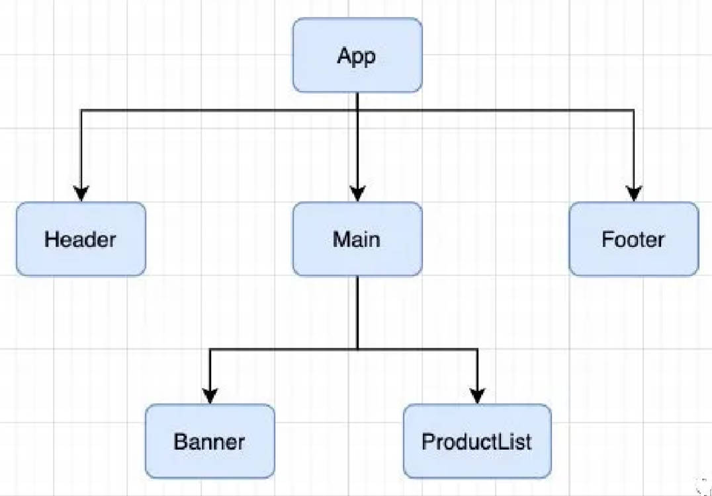

# 什么是组件化开发？

- 组件化是一种分而治之的思想：
	- 如果我们将一个页面中所有的处理逻辑全部放在一起，处理起来就会变得非常复杂，而且不利于后续的管理以及扩展。
	- 但如果，我们将一个页面拆分成一个个小的 功能块，每个功能块完成属于自己这部分独立的功能，那么之后整个页面的管理和维护就变得非常容易了。
- 我们需要通过组件化的思想来思考整个应用程序：
	- 我们将一个完整的页面分成很多个组件；
	- 每个组件都用于实现页面的一个功能块；
	- 而每一个组件又可以进行细分；
	- 而组件本身又可以在多个地方进行复用；


- 组件化是 React 的核心思想，前面我们封装的 App 本身就是一个组件：
	- 组件化提供了一种抽象，让我们可以开发出一个个独立可复用的小组件来构造我们的应用。
	- 任何的应用都会被抽象成一颗组件树。
- 组件化思想的应用：
	- 有了组件化的思想，我们在之后的开发中就要充分的利用它。
	- 尽可能的将页面拆分成一个个小的、可复用的组件。
	- 这样让我们的代码更加方便组织和管理，并且扩展性也更强。

# React 组件化，有哪些类型？

- React 的组件相对于 Vue 更加的灵活和多样，按照不同的方式可以分成很多类组件：
	- 根据组件的定义方式，可以分为：**函数组件（Functional Component）**和**类组件（Class Component）**；
	- 根据组件内部是否有状态需要维护，可以分成**无状态组件（Stateless Component）**和**有状态组件（Stateful Component）**；
	- 根据组件的不同职责，可以分成**展示型组件（Presentational Component）**和**容器型组件（Container Component）**；
- 这些概念有很多重叠，但是他们最主要是关注数据逻辑和UI展示的分离：
	- 函数组件、无状态组件、展示型组件主要关注UI的展示；
	- 类组件、有状态组件、容器型组件主要关注数据逻辑；
- 当然还有很多组件的其他概念：比如异步组件、高阶组件等，我们后续再学习。

# 类组件

- 类组件的定义有如下要求：
	- 组件的名称是大写字符开头（无论类组件还是函数组件）
	- 类组件需要继承自 `React.Component`
	- 类组件必须实现 `render` 函数
- 在 ES6 之前，可以通过 create-react-class 模块来定义类组件，但是目前官网建议我们使用 ES6 的 class 类定义。
- 使用 class 定义一个组件：
	- constructor 构造函数编写是可选的，我们通常在 constructor 中初始化一些数据；
	- this.state 中维护的就是我们组件内部的数据；
	- render() 方法是 class 组件中唯一必须实现的方法；

## 类组件中的 render 函数

在什么时机被调用？

- 在组建被创建时，会被调用。
- 当 render 被调用时，它会检查 `this.props` 和 `this.state` 的变化并返回值：

能返回哪些类型的值？

- React 元素：
	- 通常通过 JSX 创建。
	- 例如，<div /> 会被 React 渲染为 DOM 节点，<MyComponent /> 会被 React 渲染为自定义组件；
	- 无论是 <div /> 还是 <MyComponent /> 均为 React 元素。
- 数组或 fragments：使得 render 方法可以返回多个元素。
- Portals：可以渲染子节点到不同的 DOM 子树中。
- 字符串或数值类型：它们在 DOM 中会被渲染为文本节点
- 布尔类型、null 或 undefined：什么都不渲染。

03-learn-component\src\01-类组件和函数式组件\App_Class.jsx

```jsx
import React from 'react'

export class App extends React.Component {
	constructor() {
		super()
		this.state = {
			msg: 'App Component'
		}
	}

	render() {
		const { msg } = this.state

		// ----------------------伪代码-----------------------

		// 1. 返回 react 元素，jsx 代码会被编译成 React.createElement 函数，会返回一个 React 元素。
		return (
			<div>{ msg }</div>
		)

		// 2. 返回组件或者 fragments
		return [
			<h1>h1 元素</h1>,
			<h2>h2 元素</h2>,
			<div>哈哈哈</div>
		]

		// 3. 返回字符串
		return 'Hello world'

		// ----------------------伪代码-----------------------
	}
}

export default App
```

# 函数式组件

- 函数组件是使用 function 来进行定义的函数，只是这个函数会返回和类组件中 render 函数返回一样的内容。
- 函数组件有自己的特点，早期的函数式组件，仅仅只是用来做展示（当然，使用了 hooks 后，就不一样了）
	- 会被更新并挂载，但是没有生命周期函数；
	- this 关键字不能指向组件实例（因为没有组件实例）；
	- 没有内部状态（state）；

03-learn-component\src\01-类组件和函数式组件\App_Func.jsx

```jsx
function App() {
	// 返回值：和类组件中 render 函数返回值一致
	return (
		<div>App Functional Component</div>
	)
}

export default App
```

# React 有哪些生命周期，

- 生命周期是一个抽象的概念，在生命周期的整个过程，分成了很多个阶段； 
	- 比如装载阶段（Mount），组件第一次在 DOM 树中被渲染的过程； 
	- 比如更新过程（Update），组件状态发生变化，重新更新渲染的过程； 
	- 比如卸载过程（Unmount），组件从 DOM 树中被移除的过程；
- React 内部为了告诉我们当前处于哪些阶段，会对我们组件内部实现的某些函数进行回调，这些函数就是生命周期函数： 
	- 比如实现 `componentDidMount` 函数：组件已经挂载到DOM上时，就会回调； 
	- 比如实现 `componentDidUpdate` 函数：组件已经发生了更新时，就会回调； 
	- 比如实现 `componentWillUnmount` 函数：组件即将被移除时，就会回调； 
	- 我们可以在这些回调函数中编写自己的逻辑代码，来完成自己的需求功能；
- 我们谈 React 生命周期时，主要谈的类的生命周期，因为函数式组件是没有生命周期函数的；（后面我们可以通过 hooks 来模拟一些生命周期的回调）

[组建的生命周期图谱](https://projects.wojtekmaj.pl/react-lifecycle-methods-diagram/)




- `Constructor` 
	- 如果不初始化 state 或不进行方法绑定，则不需要为 React 组件实现构造函数。 
	- constructor 中通常只做两件事情： 
		- 通过给 this.state 赋值对象来初始化内部的 state； 
		- 为事件绑定实例（this）；
- `componentDidMount` 
	- 会在组件挂载后（插入 DOM 树中）立即调用。 
	- componentDidMount 中通常进行哪里操作呢？ 
		- 依赖于 DOM 的操作可以在这里进行； 
		- 在此处发送网络请求是最好的地方；（官方建议）
		- 可以在此处添加一些订阅（会在 componentWillUnmount 取消订阅）；
- `componentDidUpdate` 
	- 会在更新后被立即调用，首次渲染不会执行此方法。 
		- 当组件更新后，可以在此处对 DOM 进行操作； 
		- 如果你对更新前后的 props 进行了比较，也可以选择在此处进行网络请求；（例如，当 props 未发生变化时，则不会执行网 络请求）。
- `componentWillUnmount` 
	- 会在组件卸载及销毁之前直接调用。 
		- 在此方法中执行必要的清理操作；
		- 例如，清除 timer，取消网络请求或清除在 componentDidMount() 中创建的订阅等；

## 不常用的生命周期（了解）。

- `getDerivedStateFromProps`：state 的值在任何时候都依赖于 props 时使用；该方法返回一个对象来更新 state；
- `getSnapshotBeforeUpdate`：在 React 更新 DOM 之前回调的一个函数，可以获取 DOM 更新前的一 些信息（比如说滚动位置）；
- `shouldComponentUpdate`：该生命周期函数很常用，但是我们一般不会手动编写，而是使用 PureComponent 时用到了它，用于做性能优化；



03-learn-component\src\02-组件生命周期函数\App.jsx

```jsx
import React, { Component } from 'react'
import HelloWorld from './HelloWorld'

export class App extends Component {
	constructor() {
		super()
		this.state = {
			isShow: true
		}
	}


	render() {
		const { isShow } = this.state
		
		return (
			<div>
				<button>切换</button>
				{ isShow && <HelloWorld /> }
			</div>
		)
	}
}

export default App
```

03-learn-component\src\02-组件生命周期函数\HelloWorld.jsx

```jsx
import React, { Component } from 'react'

export class HelloWorld extends Component {
	// 1.构造方法
	constructor() {
		console.log('HelloWorld Construct');
		super()

		this.state = {
			msg: 'Hello World'
		}
	}

	changeText() {
		this.setState({ msg: '你好啊，李银河'})
	}

	// 2.执行 render 函数
	render() {
		console.log('Hello World render');
		const { msg } = this.state

		return (
			<div>
				<h2>{ msg }</h2>
				<p>{ msg } 是程序员的第一行代码</p>
				<button onClick={e => this.changeText()}>修改文本</button>
			</div>
		)
	}

	// 3.组件被挂载在 DOM 上
	componentDidMount() {
		console.log('Hello World componentDidMount');
	}

	// 4.组件 DOM 更新完成
	componentDidUpdate(prevProsps, prevState, snapShot) {
		console.log('HelloWorld componentDidUpdate:', prevProsps, prevState, snapShot);
	}

	// 5.组件从 DOM 中卸载
	componentWillUnmount() {
		console.log('HelloWorld componentWillUnmount');
	}

	// --------不常用的生命周期---------
	
	shouldComponentUpdate() {
		return true // 表示进行更新，返回 false 表示阻止更新
	}

	getSnapshotBeforeUpdate() {
		console.log('getSnapshotBeforeUpdate');
		// 给 componentDidUpdate 中的 snapShot 参数传值。
		return {
			scrollPosition: 1000
		}
	}

}

export default HelloWorld
```

# 组建的嵌套


编写组件嵌套的代码。

- 组件之间存在嵌套关系： 
	- 在之前的案例中，我们只是创建了一个组件 App； 
	- 如果我们一个应用程序将所有的逻辑都放在一个组件中，那么这个组件就会变成非常的臃肿和难以维护； 
	- 所以组件化的核心思想应该是对组件进行拆分，拆分成一个个小的组件； 
	- 再将这些组件组合嵌套在一起，最终形成我们的应用程序；



- 上面的嵌套逻辑如下，它们存在如下关系： 
	- App 组件是 Header、Main、Footer 组件的父组件；
	- Main 组件是 Banner、ProductList 组件的父组件；

# 组件间的通信

- 在开发过程中，我们会经常遇到需要组件之间相互进行通信： 
	- 比如 App 可能使用了多个 Header，每个地方的 Header 展示的内容不同，那么我们就需要使用者传递给 Header 一些数据，让其进行展示；
	- 又比如我们在 Main 中一次性请求了 Banner 数据和 ProductList 数据，那么就需要传递给他们来进行展示； 
	- 也可能是子组件中发生了事件，需要由父组件来完成某些操作，那就需要子组件向父组件传递事件；
- 总之，在一个 React 项目中，组件之间的通信是非常重要的环节；

## 父传子通信

- 父组件通过 属性=值 的形式来传递给子组件数据； 
- 子组件通过 props 参数获取父组件传递过来的数据；

在父组件中，通过网络请求拿到数据，再传递给子组件。

03-learn-component\src\04-组件通信-父传子\Main.jsx

```jsx
import React, { Component } from 'react'
import axios from 'axios'
import MainBanner from './MainBanner'
import MainProductList from './MainProductList'

export class Mani extends Component {
	constructor() {
		super()

		this.state = {
			banners: [],
			productList: []
		}
	}

	componentDidMount() {
		axios.get("http://123.207.32.32:8000/home/multidata").then(res => {
			const banners = res.data.data.banner.list
			const recommend = res.data.data.recommend.list
			this.setState({
				banners,
				productList: recommend
			})
		})
	}

	render() {
		const { banners, productList } = this.state

		return (
			<div className='main'>
				<div>Main</div>
				<MainBanner banners={ banners }, title="我是轮播图" />
				<MainProductList productList={ productList } />
			</div>
		)
	}
}

export default Mani
```

03-learn-component\src\04-组件通信-父传子\MainBanner.jsx

```jsx
import React, { Component } from 'react'

export class MainBanner extends Component {
	constructor(props) {
		super(props)
		this.state = {}
	}

	render() {
		const { title, banners } = this.props

		return (
			<div className='banner'>
				<h2>封装一个轮播图</h2>
				<ul>
					{
						banners.map(item => <li key={ item.acm }>{ item.title }</li>)
					}
				</ul>
			</div>
		)
	}
}

export default MainBanner
```

03-learn-component\src\04-组件通信-父传子\MainProductList.jsx

```jsx
import React, { Component } from 'react'

export class MainProductList extends Component {
	// 如果组件中不写 constructor，还是会执行 super(props)
	render() {
		const { productList } = this.props

		return (
			<div>
				<h2>商品列表</h2>
				<ul>
					{
						productList.map(item => <li key={ item.acm }>{ item.title }</li>)
					}
				</ul>
			</div>
		)
	}
}

export default MainProductList
```

