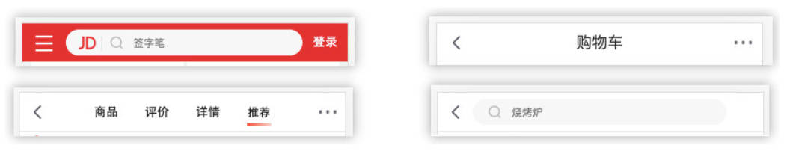

# 组件间的通信

## 父传子通信

### 类型验证

- 对于传递给子组件的数据，有时候我们可能希望进行验证，特别是对于大型项目来说：
	- 当然，如果你项目中默认使用了 Flow 或者 TypeScript，那么直接就可以进行类型验证；
	- 即使我们没有使用 Flow 或者 TypeScript，也可以通过 prop-types 库来进行参数验证；
- 从 React v15.5 开始，React.PropTypes 已移入另一个包中：prop-types 库，需要单独引入。

```jsx
import React, { Component } from 'react'
import PropTypes from 'prop-types';

export class MainBanner extends Component {
	// ES13 中使用 static class field 为传递过来的参数赋默认值。
	static propTypes = {
		banners: PropTypes.array,
		title: PropTypes.string
	}

	constructor(props) {
		super(props)
		this.state = {}
	}

	render() {
		const { title, banners } = this.props

		return (
			<div className='banner'>
				<h2>封装一个轮播图：{ title }</h2>
				<ul>
					{
						banners.map(item => <li key={ item.acm }>{ item.title }</li>)
					}
				</ul>
			</div>
		)
	}
}

MainBanner.propTypes = {
	banners: PropTypes.array,
	title: PropTypes.string
}

export default MainBanner
```

- 更多验证方式参考[官方文档](https://zh-hans.reactjs.org/docs/typechecking-with-proptypes.html)
	- 比如验证数组，并且数组中包含哪些元素；
	- 比如验证对象，并且对象中包含哪些 key 以及 value 是什么类型；
	- 比如某个参数是必须的，使用 `requiredFunc: PropTypes.func.isRequired`

### 设置默认值

- 如果没有传递，我们希望有默认值，使用 `defaultProps`

```jsx
import React, { Component } from 'react'
import PropTypes from 'prop-types';

export class MainBanner extends Component {
	// ES13 中进行参数赋默认值的另外一种写法。
	static propTypes = {
		banners: PropTypes.array,
		title: PropTypes.string
	}

	static defaultProps = {
		banners: [],
		title: '默认标题'
	}

	constructor(props) {
		super(props)
		this.state = {}
	}

	render() {
		const { title, banners } = this.props

		return (
			<div className='banner'>
				<h2>封装一个轮播图：{ title }</h2>
				<ul>
					{
						banners.map(item => <li key={ item.acm }>{ item.title }</li>)
					}
				</ul>
			</div>
		)
	}
}

MainBanner.propTypes = {
	banners: PropTypes.array,
	title: PropTypes.string
}

MainBanner.defaultProps = {
	banners: [],
	title: '默认标题'
}

export default MainBanner
```

## 子传父通信

- 某些情况，我们也需要子组件向父组件传递消息： 
	- 在 vue 中是通过在子组件中发射自定义事件来完成的；
	- 在 React 中则是通过 props 传递消息，只是让父组件给子组件传递一个回调函数，在子组件中调用这个函数即可；

父组件 App.jsx

```jsx
import React, { Component } from 'react'
import AddCounter from './AddCounter';

export class App extends Component {
	constructor() {
		super()
		this.state = {
			counter: 100
		}
	}

	handleChangeCounter(count) {
		this.setState({ counter: this.state.counter + count })
	}

	render() {
		const { counter } = this.state;

		return (
			<div>
				<h2>当前计数：{ counter }</h2>
				<AddCounter onAddClick={ (count) => this.handleChangeCounter(count) } />
			</div>
		)
	}
}

export default App
```

子组件 AddCounter.jsx

```jsx
import React, { Component } from 'react'

export class AddCounter extends Component {
	onAddCount(count) {
		this.props.onAddClick(count)
	}
	
	render() {
		return (
			<div>
				<button onClick={ e => this.onAddCount(1) }>+1</button>
				<button onClick={ e => this.onAddCount(5) }>+5</button>
				<button onClick={ e => this.onAddCount(10) }>+10</button>
			</div>
		)
	}
}

export default AddCounter
```

# 实现 Tabcontrol 案例。

03-learn-component\src\06-组件通信案例练习TabControl\App.jsx

```jsx
import React, { Component } from 'react'
import TabControl from './TabControl'

export class App extends Component {
	constructor() {
		super()
		this.state = {
			titles: ['流行', '新歌', '精选'],
			tabIndex: 0
		}
	}

	handleTabClick(index) {
		this.setState({ tabIndex: index })
	}

	render() {
		const { titles, tabIndex } = this.state
		return (
			<div className='app'>
				<TabControl
					titles={ titles }
					handleTabClick={ index => this.handleTabClick(index) }
        />
        {/* 内容 */}
				<h1>{ titles[tabIndex] }</h1>
			</div>
		)
	}
}

export default App
```

03-learn-component\src\06-组件通信案例联系TabControl\TabControl.jsx

```jsx
import React, { Component } from 'react'
import './style.css' // 直接在 jsx 中引入样式文件，默认会当作全局样式。

export class TabControl extends Component {
	constructor(ptops) {
		super(ptops)
		this.state = {
			currentIndex: 0
		}
	}

	onItemClick(index) {
		// 自己保存最新的 index
		this.setState({ currentIndex: index })
		// 让父组件执行对应的函数
		this.props.handleTabClick(index)
	}

	render() {
		const { titles } = this.props
		const { currentIndex } = this.state;
		return (
			<div className='tab-control'>
				{
					titles.map((item, index) => (
						<div
							className={`item ${index === currentIndex ? 'active' : ''}`}
							key={ item }
							onClick={ () => this.onItemClick(index) }>
								<span className='text'>{ item }</span>
						</div>
					))
				}
			</div>
		)
	}
}

export default TabControl
```

03-learn-component\src\06-组件通信案例联系TabControl\style.css

```css
.tab-control {
	display: flex;
	align-items: center;
	height: 40px;
	text-align: center;
}

.tab-control .item {
	flex: 1;
}

.tab-control .item.active {
	color: #f00;
}

.tab-control .item.active .text {
	padding: 3px;
	border-bottom: 3px solid #f00;
}
```

# 实现组件插槽

- 在开发中，我们抽取了一个组件，但是为了让这个组件具备更强的通用性，我们不能将组件中的内容限制为固定的 div、span 等等这些元素。

- 我们应该让使用者可以决定某一块区域到底存放什么内容。

  

- 这种需求在 Vue 当中有一个固定的做法是通过 slot 来完成的，React 呢？

- React 对于这种需要插槽的情况非常灵活，有两种方案可以实现： 
	- 组件的 children 子元素；
	- props 属性传递 React 元素；

## children 实现插槽

- 每个组件都可以获取到 `props.children`：它包含组件的开始标签和结束标签之间的内容。
- 放多个元素时，children 是一个数组，放一个元素时，children 是一个 ReactElement，可通过参数类型验证，限制传一个或传多个。

03-learn-component\src\07-组件的插槽实现\App.jsx

```jsx
import React, { Component } from 'react'
import NavBar from './NavBar'

export class App extends Component {
	render() {
		return (
			<div>
				{/* 使用 children 实现插槽 */}
				<NavBar>
					<button>按钮</button>
					<h2>哈哈哈</h2>
					<i>斜体文本</i>
				</NavBar>
			</div>
		)
	}
}

export default App
```

03-learn-component\src\07-组件的插槽实现\NavBar\index.jsx

```jsx
import React, { Component } from 'react'
import PropTypes from 'prop-types'
import './index.css'

export class NavBar extends Component {
	render() {
		const children= this.props.children
		console.log('children:', children);

		return (
			<div className='nav-bar'>
				<div className="left">{ children[0] }</div>
				<div className="center">{ children[1] }</div>
				<div className="right">{ children[2] }</div>
			</div>
		)
	}
}

// children 传多个元素，进行验证
NavBar.propTypes = {
	children: PropTypes.array
}
// children 传单个元素，进行验证
/* NavBar.propTypes = {
	children: PropTypes.element
} */

export default NavBar
```

## props 实现插槽

- 通过 children 实现的方案虽然可行，但是有2个弊端：
	- children 有两种类型（Array，ReactElement），使用比较麻烦。
	- 通过索引值获取传入的元素很容易出错，不能精准的获取传入的元素； 
- 另外一种方案就是使用 props 实现：通过具体的属性名，可以让我们在传入和获取时更加的精准；

03-learn-component\src\07-组件的插槽实现\App.jsx

```jsx
import React, { Component } from 'react'
import NavBarTwo from './NavBarTwo'

export class App extends Component {
	render() {
		return (
			<div>
				{/* 使用 props 实现插槽 */}
				<NavBarTwo 
					leftSlot={<button>按钮2</button>}
					centerSlot={<h2>呵呵呵</h2>}
					rightSlot={<i>斜体2</i>}
				/>
			</div>
		)
	}
}

export default App
```

03-learn-component\src\07-组件的插槽实现\NavBarTwo\index.jsx

```jsx
import React, { Component } from 'react'

export class NavBarTwo extends Component {
	render() {
		const { leftSlot, centerSlot, rightSlot } = this.props;

		return (
			<div className='nav-bar'>
				<div className='left'>{ leftSlot }</div>
				<div className='center'>{ centerSlot }</div>
				<div className='right'>{ rightSlot }</div>
			</div>
		)
	}
}

export default NavBarTwo
```

## 实现作用域插槽的效果

03-learn-component\src\08-组件作用域插槽\App.jsx

```jsx
import React, { Component } from 'react'
import TabControl from './TabControl'

export class App extends Component {
	constructor() {
		super()
		this.state = {
			titles: ['流行', '新歌', '精选'],
			tabIndex: 0
		}
	}

	handleTabClick(index) {
		this.setState({ tabIndex: index })
	}

	getTabItem(item) {
		switch (item) {
			case '流行':
				return <span>{ item }</span>
			case '新歌':
				return <button>{ item }</button>
			default:
				return <i>{ item }</i>
		}
	}

	render() {
		const { titles, tabIndex } = this.state
		return (
			<div className='app'>
				<TabControl
					titles={ titles }
					handleTabClick={ index => this.handleTabClick(index) }
          {/* 通过给子组件传入回调函数，来实现插槽 */}
					itemType={ item => this.getTabItem(item) }
				/>
				<h1>{ titles[tabIndex] }</h1>
			</div>
		)
	}
}

export default App
```

03-learn-component\src\08-组件作用域插槽\TabControl.jsx

```jsx
import React, { Component } from 'react'
import './style.css' // 直接在 jsx 中引入样式文件，默认会当作全局样式。

export class TabControl extends Component {
	constructor(ptops) {
		super(ptops)
		this.state = {
			currentIndex: 0
		}
	}

	onItemClick(index) {
		// 自己保存最新的 index
		this.setState({ currentIndex: index })
		// 让父组件执行对应的函数
		this.props.handleTabClick(index)
	}

	render() {
		const { titles, itemType } = this.props
		const { currentIndex } = this.state;
		
		return (
			<div className='tab-control'>
				{
					titles.map((item, index) => (
						<div
							className={`item ${index === currentIndex ? 'active' : ''}`}
							key={ item }
							onClick={ () => this.onItemClick(index) }
						>
							{/* <span className='text'>{ item }</span> */}
							{/* 使用插槽 */}
							{ itemType(item) }
						</div>
					))
				}
			</div>
		)
	}
}

export default TabControl
```

# 非父子组建的通信

非父子组件数据的共享：

- 在开发中，比较常见的数据传递方式是通过 props 属性自上而下（由父到子）进行传递。 
- 但是对于有一些场景：比如一些数据需要在多个组件中进行共享（地区偏好、UI主题、用户登录状态、用户信息等）。 
- 如果我们在顶层的 App 中定义这些信息，之后一层层传递下去，那么对于一些中间层不需要数据的组件来说，是一种冗余的操作。


## 知识点补充：spread attribute

用于在 jsx 中传递 props：

- 基本使用，以下两个组件是等价的

```jsx
function App1() {
	return <Greeting firstName="Ben" lastName="Hector" />;
}

function App2() {
	const props = {firstName: 'Ben', lastName: 'Hector'};
	return <Greeting {...props} />;
}
```

- 只保留当前组件需要接收的 props，并使用展开运算符将其他 props 传递下去。

```jsx
const Button = props => {
	// 保留 App 传递过来的 kind 属性，将其它 props 传递给 button
	const { kind, ...other } = props;
	const className = kind === "primary" ? "PrimaryButton" : "SecondaryButton";
	return <button className={className} {...other} />;
};

const App = () => {
	return (
		<div>
			<Button kind="primary" onClick={() => console.log("clicked!")}>
				Hello World!
			</Button>
		</div>
	);
};
```

## Context 的使用

### 基本使用，3个步骤

1. React.createContext 
	
	- 创建一个需要共享的 Context 对象： 
	- 如果一个组件订阅了 Context，那么这个组件会匹配离自身最近的那个 Provider，读取到其中的 context 值； 
	- defaultValue 是组件在顶层查找过程中没有找到对应的 Provider，那么就使用默认值
	
	03-learn-component\src\09-非父子组件通信\context\theme-context.js

	```jsx
	import React from 'react'

	// 1.创建一个 Context，命名为 ThemeContext
	const ThemeContext = React.createContext()
	export default ThemeContext
	```

2. Context.Provider

	- 每个 Context 对象都会返回一个 Provider React 组件，它允许消费组件订阅 context 的变化： 
	- Provider 接收一个 value 属性，传递给消费组件； 
	- 一个 Provider 可以和多个消费组件有对应关系； 
	- 多个 Provider 也可以嵌套使用，里层的会覆盖外层的数据；
	- 当 Provider 的 value 值发生变化时，它内部的所有消费组件都会重新渲染；

	03-learn-component\src\09-非父子组件通信\App.jsx

	```jsx
	import React, { Component } from 'react'
	import ThemeContext from './context/theme-context';
	import Home from './Home';

	export class App extends Component {
		constructor() {
			super()
			this.state = {
				info: {name: 'kobe', age: 30}
			}
		}
		render() {
			const { info } = this.state;

			return (
				<div>
					{/* 2.通过 ThemContext 中 Provider 中 value 属性为后代提供数据 */}
					<ThemeContext.Provider value={{ color: 'red', size: 30 }}>
						<Home  {...info } />
					</ThemeContext.Provider>
				</div>
			)
		}
	}

	export default App
	```

3. Class.contextType 

	- 挂载在 class 上的 contextType 属性会被重赋值为一个由 React.createContext() 创建的 Context 对象： 
	- 这能让你使用 this.context 来消费最近 Context 上的那个值；
	- 你可以在任何生命周期中访问到它，包括 render 函数中；

	03-learn-component\src\09-非父子组件通信\Home.jsx

	```jsx
	import React, { Component } from 'react'
	import HomeInfo from './HomeInfo'

	export class Home extends Component {
		render() {
			const { name, age } = this.props
			return (
				<div>
					<h2>Home: { name }-{ age }</h2>
					<HomeInfo />
				</div>
			)
		}
	}

	export default Home
	```

	03-learn-component\src\09-非父子组件通信\HomeInfo.jsx

	```jsx
	import React, { Component } from 'react'
	import ThemeContext from './context/theme-context'

	export class HomeInfo extends Component {
		render() {
			// 4.获取共享的数据，并使用
			console.log(this.context);
			return (
				<div>
					<h2>HoemInfo: { this.context.color }</h2>
				</div>
			)
		}
	}

	// 3.设置要共享信息的组件的 contextType 为 ThemeContext
	HomeInfo.contextType = ThemeContext

	export default HomeInfo
	```

### Context.Consumer 

- React 组件也可以订阅到 context 变更。这能让我们在**函数式组件**中完成订阅 context。 
  - 函数式组件中没有 this，不能使用 this.context
- 这里需要函数作为子元素（function as child）；
- 这个函数接收当前的 context 值，返回一个 React 节点；

#### 使用场景一：函数式组件	

03-learn-component\src\09-非父子组件通信\Home.jsx

```jsx
import React, { Component } from 'react'
import HomeBanner from './HomeBanner'
import HomeInfo from './HomeInfo'

export class Home extends Component {
	render() {
		const { name, age } = this.props
		return (
			<div>
				<h2>Home: { name }-{ age }</h2>
				<HomeInfo />
				<HomeBanner />
			</div>
		)
	}
}

export default Home
```

03-learn-component\src\09-非父子组件通信\HomeBanner.jsx

```jsx
import ThemeContext from './context/theme-context'

function HomeBanner() {
	return (
		<div>
			{/* 函数式组件中，使用 Context.Consumer 消费共享数据 */}
			<ThemeContext.Consumer>
				{
					value => (
						<h2>Banner theme: { value.color }</h2>
					)
				}
			</ThemeContext.Consumer>
		</div>
	)
}

export default HomeBanner
```

#### 使用场景二：当组件中需要使用多个 Context

03-learn-component\src\09-非父子组件通信\context\user-context.js

```js
import React from 'react'

export default React.createContext()
```

03-learn-component\src\09-非父子组件通信\App.jsx

```jsx
import React, { Component } from 'react'
import ThemeContext from './context/theme-context';
import UserContext from './context/user-context';
import Home from './Home';

export class App extends Component {
	constructor() {
		super()
		this.state = {
			info: { name: 'kobe', age: 30 }
		}
	}
	render() {
		const { info } = this.state;

		return (
			<div>
				<UserContext.Provider value={{ nickname: 'Kobe', address: 'LA' }}>
					<ThemeContext.Provider value={{ color: 'red', size: 30}}>
						<Home  {...info } />
					</ThemeContext.Provider>
				</UserContext.Provider>
			</div>
		)
	}
}

export default App
```

03-learn-component\src\09-非父子组件通信\HomeInfo.jsx

```jsx
import React, { Component } from 'react'
import ThemeContext from './context/theme-context'
import UserContext from './context/user-context';

export class HomeInfo extends Component {
	render() {
		console.log(this.context);
		return (
			<div>
				{/* this.context 是 ThemeContext */}
				<h2>HoemInfo: { this.context.color }</h2>
				{/* 如果要使用 UserContext 中的共享数据，那么需要使用 Context.consumer */}
				<UserContext.Consumer>
					{
						value => (
							<h2>Info User: { value.nickname }</h2>
						)
					}
				</UserContext.Consumer>
			</div>
		)
	}
}

HomeInfo.contextType = ThemeContext
export default HomeInfo
```

### Context 的默认值 defaultValue

#### 使用场景一：

没有作为 Context.Provider 的后代元素，但仍然想用 Context 共享的数据。

03-learn-component\src\09-非父子组件通信\context\theme-context.js

```js
import React from 'react'

// 1.创建一个 Context，命名为 ThemeContext，并提供 defaultvalue 默认值
const ThemeContext = React.createContext({ color: 'blue', size: 10 })
export default ThemeContext
```

03-learn-component\src\09-非父子组件通信\App.jsx

```jsx
import React, { Component } from 'react'
import ThemeContext from './context/theme-context';
import UserContext from './context/user-context';
import Home from './Home';
import Profile from './Profile';

export class App extends Component {
	constructor() {
		super()
		this.state = {
			info: { name: 'kobe', age: 30 }
		}
	}
	render() {
		const { info } = this.state;

		return (
			<div>
				<UserContext.Provider value={{ nickname: 'Kobe', address: 'LA' }}>
					<ThemeContext.Provider value={{ color: 'red', size: 30}}>
						<Home  {...info } />
					</ThemeContext.Provider>
				</UserContext.Provider>
				<Profile />
			</div>
		)
	}
}

export default App
```

03-learn-component\src\09-非父子组件通信\Profile.jsx

```jsx
import React, { Component } from 'react'
import ThemeContext from './context/theme-context';

export class Profile extends Component {
	render() {
		console.log('Profile context:', this.context); // {color: 'blue', size: 10}
		return (
			<div>Profile</div>
		)
	}
}

Profile.contextType = ThemeContext

export default Profile
```

#### 使用场景二：

为作为 Context.Provider 的后代元素提供默认值