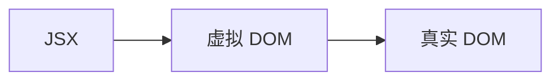
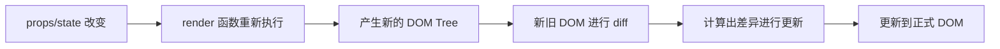

# 一、React 渲染流程



# 二、React 更新流程



# 三、React 组件更新优化

React 在组件中的 `props` 或 `state` 发生改变时，会调用 组件的 `render` 方法，创建一颗不同的 DOM 树。

React 需要基于这两颗不同的 DOM 树之间的差别来判断如何有效的更新 UI：

## 1.diff 方案设计

如果一棵树参考另外一棵树进行**完全比较更新**，那么即使是最先进的算法，该算法的复杂程度也为 `O(n²）`，其中 `n` 是树中元素的数量；

- 如果在 React 中使用了该算法，那么展示 1000 个元素所需要执行的计算量将在十亿的量级范围；
- 这个开销太过昂贵了，React 的更新性能会变得非常低效；

于是，React 对这个算法进行了优化，将其优化成了 `O(n)`，如何优化的呢？

- 同层节点之间相互比较，不会跨节点比较；
- 不同类型的节点，产生不同的树结构；
- 开发中，可以通过 `key` 来指定哪些节点在不同的渲染下保持稳定（与 Vue 中的 diff 算法原理类似）；

## 2.列表渲染 Key 优化

在遍历列表时，总是会提示一个警告，需要加入一个 `key` 属性。

### 1.key 何时有效

什么情况下，`key` 属性起到了性能优化的作用？

情况一：更新列表时，在最后位置插入数据：这种情况，有无 `key` 意义并不大。

情况二：更新列表时，在列表**非末尾**的地方插入数据。假设列表中的元素是 `<li>`，在没有 `key` 的情况下，插入到 `<li>` 后面的所有元素都需要进行修改；

### 2.key 如何优化

React 是如何使用 `key` 进行优化的？

当子元素（这里的 `<li>`）拥有 `key` 时，React 使用 `key` 来匹配原有树上的子元素以及最新树上的子元素：

匹配到的子元素只需进行位移，不需要进行任何的修改；

没匹配到的元素在相应的位置插入即可。

### 3.key 的特点

`key` 应该是唯一的；

- 所以 `key` 不要使用随机数（随机数在下一次 `render` 时，会重新生成一个数字）；

`key` 应该是与元素绑定的。

- 所以使用 `index` 作为 `key`，对性能是没有优化的；

# 四、render 函数性能优化

## 1.性能优化原因

普通的组件（`React.component`），在执行 `setState` 操作时，

- 会执行组件本身的 `render` 方法
- 会执行所有子组件中的 `render` 方法，
- 进行 diff 算法以及页面的刷新；

如果给组件 `state` 中的状态，`setState` 一个**相同的值**，同样也会进行上述操作，这无疑是多余的。

- 会执行组件本身的 `render` 方法
- 会执行所有子组件中的 `render` 方法，
- 进行 diff 算法；

如果给组件 `state` 中部分状态 `setState` 一个新值，而某些子组件**不依赖这部分状态**，同样也会进行上述操作，这无疑是多余的。

- 会执行组件本身的 `render` 方法
- 会执行所有子组件中的 `render` 方法，
- 进行 diff 算法；

03-learn-component\src\12-render 函数的优化\App.jsx

```jsx
import React, { Component } from 'react'
import Home from './Home'

export class App extends Component {
  constructor() {
    super()
    this.state = {
      msg: 'Hello World',
      counter: 0 // 子组件 Home 对该状态没有依赖。
    }
  }

  render() {
    console.log('App render') // 点击任意按钮，都会执行一次
    const { msg, counter } = this.state
    return (
      <div>
        <h2>
          App: {msg}-{counter}
        </h2>
        <button onClick={e => this.changetext()}>修改文本</button>
        <button onClick={e => this.changenumber()}>counter+1</button>
        <Home />
      </div>
    )
  }

  changetext() {
    this.setState({ msg: 'Hello World' }) // 设置一个相同的值
  }

  changenumber() {
    this.setState({ counter: this.state.counter + 1 })
  }
}

export default App
```

03-learn-component\src\12-render 函数的优化\Home.jsx

```jsx
import React, { Component } from 'react'

export class Home extends Component {
  render() {
    console.log('Home render') // 点击 App 中的任意按钮，都会执行一次
    const { msg } = this.props
    return (
      <div>
        <h2>Home：{msg}</h2>
      </div>
    )
  }
}

export default Home
```

## 2.SCU 优化

React 提供了一个生命周期方法 `shouldComponentUpdate`（简称为 _SCU_）：

该方法有两个参数：

- 参数一：`nextProps` - 修改之后，最新的 `props` 属性。
- 参数二：`nextState` - 修改之后，最新的 `state` 属性。

该方法返回值是一个 `boolean` 类型：

- 返回值为 `true`，会调用 `render` 方法；
- 返回值为 `false`，不会调用 `render` 方法；

默认返回的是 `true`，也就是说，只要 `state` 发生改变，就会调用 `render` 方法，

为了避免这种情况，我们在 _SCU_ 中对依赖的 `state` 进行优化：

03-learn-component\src\12-render 函数的优化\App.jsx

```jsx
import React, { Component } from 'react'
import Home from './Home'

export class App extends Component {
  constructor() {
    super()
    this.state = {
      msg: 'Hello World',
      counter: 0
    }
  }

  shouldComponentUpdate(newProps, newState) {
    return this.state.msg !== newState.msg || this.state.counter !== newState.counter
  }

  render() {
    console.log('App render')
    const { msg, counter } = this.state
    return (
      <div>
        <h2>
          App: {msg}-{counter}
        </h2>
        <button onClick={e => this.changetext()}>修改文本</button>
        <button onClick={e => this.changeCouter()}>counter+1</button>
        <Home />
      </div>
    )
  }

  changetext() {
    this.setState({ msg: 'Hello World' })
  }
  changeCouter() {
    this.setState({ counter: this.state.counter + 1 })
  }
}

export default App
```

03-learn-component\src\12-render 函数的优化\Home.jsx

```jsx
import React, { Component } from 'react'

export class Home extends Component {
  shouldComponentUpdate(newProps, newState) {
    return this.props.msg !== newProps.msg
  }

  render() {
    console.log('Home render')
    const { msg } = this.props

    return (
      <div>
        <h2>Home：{msg}</h2>
      </div>
    )
  }
}

export default Home
```

## 2.PureComponent

如果所有的类，我们都需要手动来实现 SCU 优化，那么会给我们开发者增加非常多的工作量。

`shouldComponentUpdate` 中本质上在判断 `props` 或者 `state` 中的数据是否发生了改变，来决定返回 `true` 或者 `false`；

从而决定是否调用 `render` 方法进行页面更新的效果。

事实上 React 已经考虑到了这一点，将类组件继承自 `PureComponent`，就能实现这样的效果。

03-learn-component\src\12-render 函数的优化\App.jsx

```jsx
import React, { PureComponent } from 'react'
import Home from './Home'

export class App extends PureComponent {
  constructor() {
    super()
    this.state = {
      msg: 'Hello World',
      counter: 0
    }
  }

  render() {
    console.log('App render')
    const { msg, counter } = this.state

    return (
      <div>
        <h2>
          App: {msg}-{counter}
        </h2>
        <button onClick={e => this.changetext()}>修改文本</button>
        <button onClick={e => this.changeCouter()}>counter+1</button>
        <Home />
      </div>
    )
  }

  changetext() {
    this.setState({ msg: 'Hello World' })
  }
  changeCouter() {
    this.setState({ counter: this.state.counter + 1 })
  }
}

export default App
```

03-learn-component\src\12-render 函数的优化\Home.jsx

```jsx
import React, { PureComponent } from 'react'

export class Home extends PureComponent {
  render() {
    console.log('Home render')
    const { msg } = this.props
    return (
      <div>
        <h2>Home：{msg}</h2>
      </div>
    )
  }
}

export default Home
```

`PureComponent` 会在 `shouldComponentUpdate` 生命周期中，使用 `ShallowEqual` 方法进行浅层比较。

```js
!shallowEqual(oldProps, newProps) || !shallowEqual(oldState, newState)
```

> `PureComponent` 源码位置：packages\react\src\ReactBaseClasses.js
>
> `shallowEqual` 源码位置：packages\shared\shallowEqual.js

## 3.高阶组件 memo

函数式组件不是类，不能继承 `PureComponent`，也没有生命周期函数，如何实现类似于 SCU 优化？

我们需要使用一个高阶组件 `memo`

03-learn-component\src\12-render 函数的优化\Profile.jsx

```jsx
import React, { memo } from 'react'

const Profile = memo(props => {
  console.log('profile render')

  return <h2>Profile： {props.msg}</h2>
})

export default Profile
```

# 五、不可变数据的力量（state）

给 `state` 中属性对应的引用类型（如对象）中的属性赋值，而**不修改引用地址**；讨论两种情况：

情况一：在普通的 `Component` 中：

- 界面会正常更新。因为只要执行了 `setState` 函数，就会调用 `render` 方法。

情况二：在 `PureComponent` 中：

- 在渲染时会使用 `shallowEqual` 方法进行浅层比较，当发现 `state` 中属性的引用地址没有改变，则不会调用 `render` 方法，页面也就不会刷新。
- 所以在 `PureComponent` 中，修改 `state` 中引用类型数据中的深层引用值时，要使用类似于浅拷贝的方式修改，目的是改变 `state` 属性的引用地址。

03-learn-component\src\13-数不可变的力量\App.jsx

```jsx
import React, { PureComponent } from 'react'

export class App extends PureComponent {
  constructor() {
    super()
    this.state = {
      books: [
        { name: '你不知道的JavaScript', price: 99, count: 1 },
        { name: 'JavaScript高级程序设计', price: 88, count: 2 },
        { name: 'React高级设计', price: 78, count: 2 },
        { name: 'Vue高级设计', price: 99, count: 3 }
      ]
    }
  }

  render() {
    const { books } = this.state
    return (
      <div>
        <h2>数据列表</h2>
        <ul>
          {books.map((item, index) => (
            <li key={index}>
              <span>
                name: {item.name}-price: {item.price}-count: {item.count}
              </span>
              <button onClick={e => this.addBookCount(index)}>+1</button>
            </li>
          ))}
        </ul>
        <button onClick={e => this.addNewBook()}>添加新书籍</button>
      </div>
    )
  }

  addBookCount(index) {
    const books = [...this.state.books] // 浅拷贝
    books[index].count++
    this.setState({ books: books })
  }

  addNewBook() {
    const newBook = { name: 'Angular高级设计', price: 88, count: 1 }
    /**
     * 方式一：直接修改原有的 state，重新设值一遍，错误的做法。
     * 	这种方式在 PureComponent 中不能引起页面的渲染（即调用 render 函数）
     * 	原因是 this.state.books 的引用地址没有改变。
     */
    this.state.books.push(newBook)
    this.setState({ books: this.state.books })

    /**
     * 方式二：复制一份 books，在新的 books 中修改，设值新的 books
     */
    //const books = [...this.state.books]
    //books.push(newBook)
    const books = this.state.books.concat([newBook])
    this.setState({ books })
  }
}

export default App
```

# 六、DOM 元素对象获取

## 1.ref 创建

在 React 的开发模式中，通常情况下不需要、也不建议直接操作 DOM 原生对象，但是某些特殊的情况，确实需要获取到 DOM 进行某些操作，比如：

- 管理焦点，文本选择或媒体播放；
- 触发强制动画；
- 集成第三方 DOM 库；

可以通过 `ref` 获取 DOM；创建 `ref` 有三种方式：

方式一：传入字符串（不推荐）

- 使用时通过 `this.refs.[传入的字符串]`，获取对应的 DOM 元素；

方式二：传入对象（官方推荐）

- 对象是通过 `React.createRef()` 创建的；
- 使用时通过对象中的 `current` 属性获取 DOM 元素；

方式三：传入一个函数

- 该函数会在 DOM 被挂载时进行回调，这个函数会传入 DOM 元素对象。

03-learn-component\src\14-ref 获取 DOM 和组件\01_ref 获取 DOM.jsx

```jsx
import React, { PureComponent } from 'react'
import { createRef } from 'react'

export class App extends PureComponent {
  constructor() {
    super()
    this.titleRef = createRef()
    this.titleEl = null
  }

  render() {
    return (
      <div>
        {/* 方式一：在 React 元素上绑定一个 ref 字符串 */}
        <h2 ref="zzt">Hello World</h2>

        {/* 方式二：提前创建好 ref 对象,使用 createRef() API，将创建出来的对象绑定到元素 */}
        <h2 ref={this.titleRef}>你好啊，李银河</h2>

        {/* 方式三：传入一个回调函数。在对应的元素被渲染之后，回调函数被执行，并且将元素传入 */}
        <h2 ref={el => (this.titleEl = el)}>你好啊，师姐</h2>

        <button onClick={e => this.getNativeDOM()}>获取DOM</button>
      </div>
    )
  }

  getNativeDOM() {
    console.log(this.refs.zzt)
    console.log(this.titleRef.current)
    console.log(this.titleEl)
  }
}

export default App
```

## 2.ref 的类型

`ref` 的值根据节点的类型而有所不同：

- 当 `ref` 属性用于 HTML 元素时，构造函数中使用 `React.createRef()` 创建的 `ref` 接收**底层 DOM 元素**作为其 `current` 属性；
- 当 `ref` 属性用于自定义类组件时，`ref` 对象接收**组件的挂载实例**作为其 `current` 属性；

# 七、组件实例获取

## 1.类组件实例

```jsx
import React, { PureComponent } from 'react'
import { createRef } from 'react'

export class App extends PureComponent {
  constructor() {
    super()
    this.hwRef = createRef()
    this.hwEl = null
  }
  render() {
    return (
      <div>
        <HelloWorld ref={this.hwRef} />
        <HelloWorld ref={el => (this.hwEl = el)} />
        <button onClick={e => this.getComponent()}>获取组件实例</button>
      </div>
    )
  }

  getComponent() {
    console.log(this.hwRef.current)
    this.hwRef.current.test()
  }
}

export default App

export class HelloWorld extends PureComponent {
  test() {
    console.log('test------')
  }
  render() {
    return <div>HelloWorld</div>
  }
}
```

## 2.函数组件中的 DOM 元素

函数式组件是没有实例的，所以无法通过 `ref` 获取他们的实例：

- 但是某些时候，我们可能想要获取函数式组件中的某个 DOM 元素；
- 这个时候我们可以通过 `React.forwardRef ` 对 `ref` 进行转发（后面会介绍 hooks 中使用 ref）。

03-learn-component\src\14-ref 获取 DOM 和组件\03-ref 获取函数组件的 DOM.jsx

```jsx
import React, { PureComponent } from 'react'
import { forwardRef } from 'react'
import { createRef } from 'react'

export class App extends PureComponent {
  constructor() {
    super()
    this.hwRef = createRef()
  }
  render() {
    return (
      <div>
        <HelloWorld ref={this.hwRef} />
        <button onClick={e => this.getComponent()}>获取组件实例</button>
      </div>
    )
  }

  getComponent() {
    console.log(this.hwRef.current)
  }
}

export default App

export const HelloWorld = forwardRef((props, ref) => (
  <div>
    <h1 ref={ref}>Hello World</h1>
    <p>呵呵呵</p>
  </div>
))
```

# 八、React 受控组件

默认浏览器有帮助维护表单元素中的值，比如当我们在 `<input>` 元素中输入时，可以从 `value` 属性中获取到。

- 如果想要使用 react 中的 `state` 来进行维护，就需要进行绑定，将组件变为**受控组件**。

比如一个 `<input>` 元素，一旦绑定了 `value` 属性的值到 `state` 中，那么就成为了受控组件。否则就是非受控组件。

## 1.基本使用；

03-learn-component\src\15-受控和非受控组件\01-受控组件基本使用.jsx

```jsx
import React, { PureComponent } from 'react'

export class App extends PureComponent {
  constructor() {
    super()
    this.state = {
      username: 'zzt'
    }
  }

  render() {
    const { username } = this.state

    return (
      <div>
        {/* React 中没有双向绑定，受控组件必须绑定事件处理函数，将 value 更新到 state，否则在浏览器中的设值无效 */}
        <input type="text" value={username} onInput={e => this.onInputChange(e)} />

        {/* 非受控组件 */}
        <input type="text" />

        <h2>username: {username}</h2>
      </div>
    )
  }

  onInputChange(e) {
    console.log('input value:', e.target.value)
    this.setState({ username: e.target.value })
  }
}

export default App
```

## 2.结合表单

> 使用表单时，默认提交（submit）功能，是早期使用的方式：
>
> - 这种方式向 `action` 中的地址发送网络请求改变 `url`，并会**造成浏览器页面刷新**。
> - 现在已很少使用表单提交与服务器沟通，通常是监听提交按钮的点击，再以 `ajax` 网络请求的方式向服务器发送数据。

03-learn-component\src\15-受控和非受控组件\02-自己提交 form 的表单.jsx

```jsx
import React, { PureComponent } from 'react'

export class App extends PureComponent {
  constructor() {
    super()
    this.state = {
      username: ''
    }
  }

  render() {
    const { username } = this.state

    return (
      <div>
        <form onSubmit={e => this.onSubmitClick(e)}>
          {/* 1.用户名 */}
          <label htmlFor="username">
            <input
              id="username"
              type="text"
              name="username"
              value={username}
              onInput={e => this.onUsernameInput(e)}
            />
          </label>
          <button type="submit">注册</button>
        </form>
      </div>
    )
  }

  onSubmitClick(e) {
    // 1.阻止默认的行为
    e.preventDefault()
    // 2.获取到所有的表单数据，对数据进行组织
    console.log('username:', this.state.username)
    // 3.使用 ajax 发送网络请求，将数据传送给服务器
    // ...
  }
  onUsernameInput(e) {
    this.setState({ username: e.target.value })
  }
}

export default App
```

## 3.表单中多个元素处理

将表单中多个元素的 `value` 使用同一个事件做处理。

03-learn-component\src\15-受控和非受控组件\03-多个表单元素使用同一个处理函数.jsx

```jsx
import React, { PureComponent } from 'react'

export class App extends PureComponent {
  constructor() {
    super()
    this.state = {
      username: '',
      password: （
    }
  }
  render() {
    const { username, password } = this.state
    return (
      <div>
        <form onSubmit={e => this.onSubmitClick(e)}>
          {/* 1.用户名 */}
          <label htmlFor="username">
            <input
              id="username"
              type="text"
              name="username"
              value={username}
              onInput={e => this.onInputChange(e)}
            />
          </label>
          <label htmlFor="password">
            <input
              id="username"
              type="password"
              name="password"
              value={password}
              onChange={e => this.onInputChange(e)}
            />
          </label>
          <button type="submit">注册</button>
        </form>
      </div>
    )
  }

  onSubmitClick(e) {
    // 1.组织默认的行为。
    e.preventDefault()
    // 2.获取到所有的表单数据，对数据进行组织。
    console.log('username:', this.state.username, 'password:', this.state.password)
    // 3.以网络请求 ajax 的方式，将数据传递给服务器。
  }
  onInputChange(e) {
    // ES6 中对象的增强写法 ，计算属性名
    this.setState({ [e.target.name]: e.target.value })
  }
}

export default App
```

## 4.其它演练

input；

checkbox 单选，多选。

```jsx
import React, { PureComponent } from 'react'

export class App extends PureComponent {
  constructor() {
    super()
    this.state = {
      isAgree: false,
      hobbies: [
        { value: 'sing', text: '唱', isChecked: false },
        { value: 'dance', text: '跳', isChecked: false },
        { value: 'rap', text: 'rap', isChecked: false }
      ]
    }
  }
  render() {
    const { isAgree, hobbies } = this.state
    return (
      <div>
        {/* checkbox 单选 */}
        <label htmlFor="agree">
          <input
            type="checkbox"
            id="agree"
            checked={isAgree}
            onChange={e => this.onAgreeChange(e)}
          />
          同意协议
        </label>

        {/* checkbox 多选 */}
        <div>
          您的爱好：
          {hobbies.map((item, index) => (
            <label htmlFor={item.value} key={item.value}>
              <input
                type="checkbox"
                id={item.value}
                checked={item.isChecked}
                onChange={e => this.onHobbiesChange(e, index)}
              />
              <span>{item.text}</span>
            </label>
          ))}
        </div>
      </div>
    )
  }
  onAgreeChange(e) {
    // checkbox 单选，取 checked 属性
    this.setState({ isAgree: e.target.checked })
  }
  onHobbiesChange(e, index) {
    const hobbies = [...this.state.hobbies]
    hobbies[index].isChecked = e.target.checked
    this.setState({ hobbies })
  }
}

export default App
```

select 单选，多选。

```jsx
import React, { PureComponent } from 'react'

export class App extends PureComponent {
  constructor() {
    super()
    this.state = {
      gender: '',
      fruits: ['orange']
    }
  }
  render() {
    const { fruits, gender } = this.state
    return (
      <div>
        {/* select 单选处理 */}
        <select value={gender} onChange={e => this.onGenderChange(e)}>
          <option value="male">男</option>
          <option value="female">女</option>
        </select>

        {/* select 多选处理 */}
        <select value={fruits} onChange={e => this.onFruitChange(e)} multiple>
          <option value="apple">苹果</option>
          <option value="banana">香蕉</option>
          <option value="orange">橘子</option>
        </select>
      </div>
    )
  }

  onGenderChange(e) {
    this.setState({ gender: e.target.value })
  }

  onFruitChange(e) {
    // Array.from(iterable, mapHandler)
    const fruits = Array.from(e.target.selectedOptions, item => item.value)
    this.setState({ fruits })
  }
}

export default App
```

# 九、React 非受控组件

React 推荐大多数情况下使用受控组件来处理表单数据：一个受控组件中，表单数据是由 React 组件来管理的；

另一种替代方案是使用非受控组件，这时表单数据将交由 DOM 节点来处理；

如果要使用非受控组件中的数据，那么我们需要使用 `ref` 来从 DOM 节点中获取表单数据。

在非受控组件中，通常使用 `defaultValue` 来设置默认值；

- `<input>`、`<select>` 和 `<textarea>` 使用的是 `defaultValue`。

- `<input type="checkbox">` 和 `<input type="radio">` 使用的是 `defaultChecked`

03-learn-component\src\15-受控和非受控组件\06-非受控组件的使用.jsx

```jsx
import React, { PureComponent } from 'react'
import { createRef } from 'react'

export class App extends PureComponent {
  constructor() {
    super()
    this.state = {
      intro: '哈哈哈'
    }
    this.introRef = createRef()
  }

  componentDidMount() {
    this.introRef.current.addEventListener('input', e => {
      console.log('intro value:', e.currentTarget.value)
    })
  }

  render() {
    const { intro } = this.state

    return (
      <div>
        <form onSubmit={e => this.onSubmitChange(e)}>
          <label htmlFor="intro">
            <input type="text" id="intro" defaultValue={intro} ref={this.introRef} />
            介绍
          </label>
          <button type="submit">注册</button>
        </form>
      </div>
    )
  }

  onSubmitChange(e) {
    // 1.组织默认的行为
    e.preventDefault()
    // 2.获取到到所有表单数据，对数据进行组织。
    console.log('intro value:', this.introRef.current.value)
    // 3.发送 ajax 网络请求，将数据传递给服务器
  }
}

export default App
```
