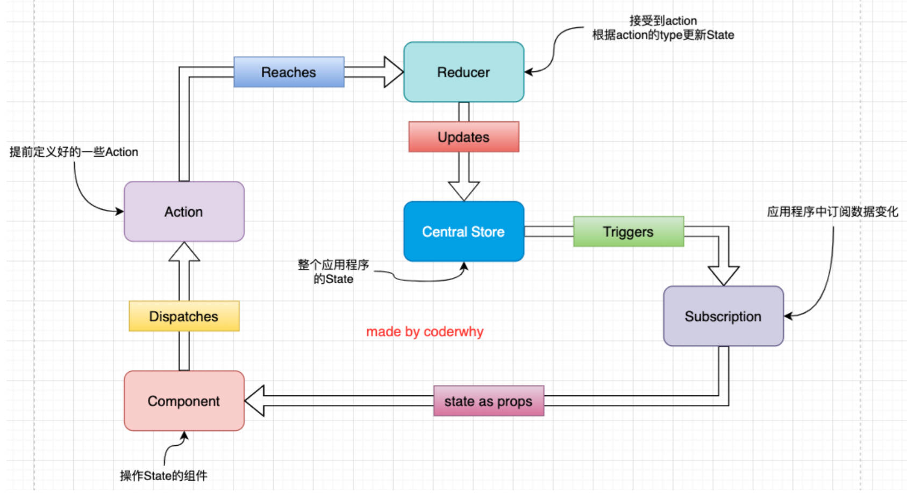
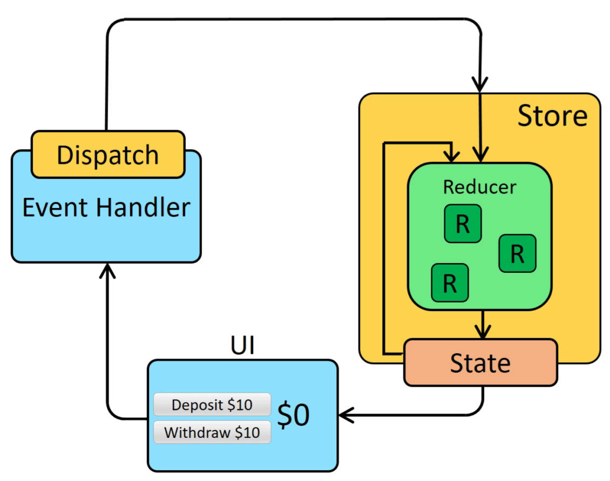

bug 复现，函数不能写在逻辑运算符两侧。

```js
const obj = {
	name: props => props.name || 'abc' // 定义了一个函数，在逻辑与运算符中一定为 true
}
```

# styled 高级特性-实现继承

04-learn-react-css\src\05-CSS-IN-JS\Home\style.js

```jsx
import styled from 'styled-components';

const ZTButton = styled.button`
	border: 1px solid red;
	border-radius: 5px;
`

// 集成 ZTButton 的2个样式
export const ZTButtonWrapper = styled(ZTButton)`
	background-color: #0f0;
	color: #fff;
`
```

04-learn-react-css\src\05-CSS-IN-JS\Home\index.jsx

```jsx
import React, { PureComponent } from 'react'
import { ZTButtonWrapper } from './style'

export class Home extends PureComponent {
	render() {
		return (
			<ZTButtonWrapper>哈哈哈</ZTButtonWrapper>
		)
	}
}

export default Home
```


# vue 中添加 class 的方式，

vue 中添加 class 是一件非常简单的事情：

- 可以传入一个对象：

  ```vue
  <div class="static" v-bind:class="{active: isActive, 'text-danger': hasError}"></div>
  ```

- 你也可以传入一个数组：

  ```vue
	<div class="static" v-bind:class="['active', 'text-danger']"></div>
  ```

- 甚至是对象和数组混合使用：

  ```vue
  <div class="static" v-bind:class="[{active: isActive}, 'text-danger']"></div>
  ```


# React 中添加 class 的方式。

React 在 JSX 给了我们开发者足够多的灵活性，可以像编写 JavaScript 代码一样，通过一些逻辑来动态添加某些 class：

```jsx
<div>
	<h2 className={"title " + (isActive ? "active" : "")}></h2>
  <h2 className={["title", (isActive ? "active" : "")].join(" ")}></h2>
</div>
```

## 使用 classnames 库

也可以借助于一个第三方的库：classnames；来动态添加样式

1. 安装 classnames；

   ```shell
   npm i classnames
   ```

2. 使用 classnames

   ```jsx
   import React, { PureComponent } from 'react'
   import classnames from 'classnames';

   export class App extends PureComponent {
   	constructor() {
   		super()
   		this.state = {
   			isbbb: true,
   			isccc: true
   		}
   	}
   	render() {
   		const { isbbb, isccc } = this.state
   		return (
   			<div>
   				<h2 className={classnames('aaa', {bbb: isbbb, ccc: isccc})}>哈哈哈</h2>
   				<h2 className={classnames(['aaa', {bbb: isbbb, ccc: isccc}])}>嘻嘻嘻</h2>
   			</div>
   		)
   	}
   }

   export default App
   ```

# 回顾 JS 中的纯函数

在程序设计中，若一个函数符合以下条件，那么这个函数被称为纯函数： 


- 确定的输入，一定会产生确定的输出； 
- 函数在执行过程中，不能产生副作用；诸如触发事件，使输出设备输出，或更改输出值以外的值。

# React 中纯函数概念的应用

- 在 react 开发中纯函数是被多次提及的，比如 react 中组件就被要求像是一个纯函数（为什么是像，因为还有 class 组件），
- redux 中有一个 reducer 的概念，也是要求必须是一个纯函数；

所以掌握纯函数对于理解很多框架的设计是非常有帮助的；

- React 中就要求我们无论是函数还是 class 声明一个组件，这个组件都必须像纯函数一样，保护它们的 props 不被修改： 
- 在 redux 中，reducer 被要求是一个纯函数。

# 为什么需要使用 Redux

- JavaScript 开发的应用程序，已经变得越来越复杂了： 
  - JavaScript 需要管理的状态越来越多，越来越复杂； 
  - 这些状态包括服务器返回的数据、缓存数据、用户操作产生的数据等等，也包括一些 UI 的状态，比如某些元素是否被选中，是否显示加载动效，当前分页；
- 管理不断变化的 state 是非常困难的： 
  - 状态之间相互会存在依赖，一个状态的变化会引起另一个状态的变化，View 页面也有可能会引起状态的变化； 
  - 当应用程序复杂时，state 在什么时候，因为什么原因而发生了变化，发生了怎么样的变化，会变得非常难以控制和追踪；
- React 是在视图层帮助我们解决了 DOM 的渲染过程，但是 State 依然是留给我们自己来管理： 
  - 无论是组件定义自己的 state，还是组件之间的通信通过 props 进行传递；也包括通过 Context 进行数据之间的共享； 
  - React 主要负责帮助我们管理视图，state 如何维护最终还是我们自己来决定；
- Redux 就是一个帮助我们管理 State 的容器：Redux 是 JavaScript 的状态容器，提供了可预测的状态管理；
- Redux 除了和 React 一起使用之外，它也可以和其他界面库一起来使用（比如 Vue），并且它非常小（包括依赖在内，只有2kb）

# Redux 的核心理念 store。


- Redux 的核心理念非常简单。 
- 比如我们有一个朋友列表需要管理： 
  - 如果我们没有定义统一的规范来操作这段数据，那么整个数据的变化就是无法跟踪的； 
  - 比如页面的某处通过 `products.push` 的方式增加了一条数据； 
  - 比如另一个页面通过 `products[0].age = 25` 修改了一条数据；
- 整个应用程序错综复杂，当出现 bug 时，很难跟踪到底哪里发生的变化；

```js
const initialState = {
  friends: [
    { name: 'zzt', age: 18 },
    { name: 'kobe', age: 40 },
    { name: 'lilei', age: 30 }
  ]
}
```

# Redux 的核心理念 action

- Redux 要求我们通过 action 来更新数据： 
  - 所有数据的变化，必须通过派发（dispatch）action 来更新； 
  - action 是一个普通的 JavaScript 对象，用来描述这次更新的 type 和 content；
- 比如下面就是几个更新 friends 的 action： 
  - 强制使用 action 的好处是可以清晰的知道数据到底发生了什么样的变化，所有的数据变化都是可跟追、可预测的； 
  - 当然，目前我们的 action 是固定的对象；
  - 真实应用中，我们会通过函数来定义，返回一个action；

```js
const action1 = { type: 'ADD_FRIEND', info: {name: 'curry', age: 39 } }
const action2 = { type: 'INC_AGE', index: 1 }
const action3 = { type: 'CHANGE_NAME', payload: {newName: 'ZeT1an', index: 0} }
```

# Redux 的核心理念 reducer

- reducer 将 state 和 action 联系在一起。
  - reducer 是一个纯函数；
  - reducer 做的事情就是将传入的 state 和 action 结合起来生成一个新的 state；

# Redux 的使用初体验.

安装 redux

```shell
npm i redux
```

基本使用

## 获取 store 中的数据

05-learn-redux\src\store\index.js

```js
// 在 Node 环境下使用 CommonJS 规范练习
// createStore 函数在新版本中已不推荐使用，而是推荐使用 @react/toolkit，但先使用 createStore 学习基本原理。
const { createStore } = require('redux')

// 初始化的数据
const initialState = {
	name: 'zzt',
	age: 18
}

// 定义 reducer 函数，要求是一个纯函数
function reducer(params) {
	return initialState
}

// 创建 store，传入 reducer，自动调用 reducer，拿到 initialState
const store = createStore(reducer)

module.exports = store
```

05-learn-redux\src\01-使用store中的数据.js

```js
const store = require('./store')

// 获取 store 中的数据，得到一个对象
console.log(store.getState()); // { name: 'zzt', age: 18 }
```

## 修改 store 中的数据

05-learn-redux\src\store\index.js

```js
const { createStore } = require('redux')

// 初始化的 state，只会在 reducer 中使用一次。
const initialState = {
	name: 'zzt',
	level: 99
}

/**
 * reducer 有两个参数：
 *   state - store 中目前暴露的 state
 * 	 action - store 派发的 action
 * 返回值，会作为 store 中存储的 state
 */
function reducer(state = initialState, action) {
	console.log(state, action);
	/**
	 * 当没有给 state 设置默认值时，
	 * 第一次打印：undefined { type: '@@redux/INIT0.7.y.e.0.b' }
	 * 第二次打印：{name: 'zzt', level: 99 } { type: 'change_name', name: 'kobe' }
	 */

	// 有新数据进行更新时，返回一个新 state
	if (action.type === 'change_name') {
		return { ...state, name: action.name }
	} else if (action.type === 'add_level') {
		return { ...state, level: state.level + action.count }
	}

	// 没有新数据更新时，默认返回当前的 state
	return state
}

const store = createStore(reducer)

module.exports = store
```

05-learn-redux\src\02-修改store中的数据.js

```js
const store = require('./store')

const nameAction = { type: 'change_name', name: 'kobe' }
// 一但使用 store 派发 action，reducer 将会重新执行
store.dispatch(nameAction)

console.log(store.getState()); // { name: 'kobe', level: 99 }

const levelAction = { type: 'add_level', count: 10 }
store.dispatch(levelAction)

console.log(store.getState());
```

## 订阅 store 中的数据

05-learn-redux\src\store\index.js

```js
const { createStore } = require('redux')

const initialState = {
	name: 'zzt',
	level: 99
}

function reducer(state = initialState, action) {
	switch (action.type) {
		case 'change_name':
			return { ...state, name: action.name } 
		case 'add_level':
			return { ...state, level: state.level + action.count }
		default:
			return state
	}
}

const store = createStore(reducer)

module.exports = store
```

05-learn-redux\src\03-订阅store中的数据.js

```js
const store = require('./store')

// react-redux 帮助我们实现了 store.subcribe，后面再详细分析
const unSubscribe = store.subscribe(() => {
	console.log('监听到数据的变化：', store.getState());
	/**
	 * 监听到数据的变化： { name: 'kobe', level: 99 }
	 * 监听到数据的变化： { name: 'kobe', level: 109 }
	 */
})

store.dispatch({ type: 'change_name', name: 'kobe' })
store.dispatch({ type: 'add_level', count: 10 })

unSubscribe() // 取消订阅
```

## 动态生成 actions

05-learn-redux\src\04-动态生成actions.js

```js
const store = require('./store')

const unSubscribe = store.subscribe(() => {
	console.log('监听到数据的变化：', store.getState());
})

const changeNameAction = name => ({
	type: 'change_name',
	name
})
const changeLevelAction = count => ({
	type: 'add_level',
	count
})

store.dispatch(changeNameAction('kobe'))
store.dispatch(changeLevelAction(10))

unSubscribe() // 取消订阅
```

## 规范目录结构

### 抽取常量（constancs.js）

05-learn-redux\src\store\constans.js

```js
const CHANGE_NAME = 'change_name'
const ADD_LEVEL = 'add_level'

module.exports = {
	CHANGE_NAME,
	ADD_LEVEL
}
```

### 抽取 actions 构造器（actionCreators.js）

05-learn-redux\src\store\actionCreators.js

```js
const { CHANGE_NAME, ADD_LEVEL } = require('./constans')

const changeNameAction = name => ({
	type: CHANGE_NAME,
	name
})
const changeLevelAction = count => ({
	type: ADD_LEVEL,
	count
})

module.exports = {
	changeNameAction,
	changeLevelAction
}
```

### 抽取 reducer（reducer.js）

避免 reducer 中的逻辑越来越多，造成代码混乱

05-learn-redux\src\store\reducer.js

```js
const { CHANGE_NAME, ADD_LEVEL } = require('./constans')

const initialState = {
	name: 'zzt',
	level: 99
}

function reducer(state = initialState, action) {
	switch (action.type) {
		case CHANGE_NAME:
			return { ...state, name: action.name } 
		case ADD_LEVEL:
			return { ...state, level: state.level + action.count }
		default:
			return state
	}
}

module.exports = reducer
```

### 创建 store，并导出（index.js）

05-learn-redux\src\store\index.js

```js
const { createStore } = require('redux')
const reducer = require('./reducer')

const store = createStore(reducer)

module.exports = store
```

### 使用 store

05-learn-redux\src\04-动态生成actions.js

```js
const store = require('./store')
const { changeNameAction, changeNameAction } = require('./store/actionCreators')

const unSubscribe = store.subscribe(() => {
	console.log('监听到数据的变化：', store.getState());
})

store.dispatch(changeNameAction('kobe'))
store.dispatch(changeLevelAction(10))

unSubscribe() // 取消订阅
```

## 规范目录优化总结

1. actionCreators 和 reducer 函数中使用字符串常量是一致的, 所以将常量抽取到一个独立 constants 的文件中。
2. 将派发的 action 生成过程放到一个 actionCreators 函数中。
3. 将定义的所有 actionCreators 的函数, 放到一个独立的文件中: actionCreators.js。
4. 将 reducer 和默认值 (initialState) 放到一个独立的 reducer.js 文件中, 而不是在 index.js

# 理解 Redux 的使用流程图解。

Redux 使用流程



Redux 使用流程官方图解




# 总结 Redux 的三大原则

- 单一数据源 
  - 整个应用程序的 state 被存储在一颗 object tree 中，并且这个 object tree 只存储在一个 store 中：
  - Redux 并没有强制让我们不能创建多个 Store，但是那样做并不利于数据的维护； 
  - 单一的数据源可以让整个应用程序的 state 变得方便维护、追踪、修改（概念类似于 Vuex，与 Pinia 不同）；
- State 是只读的 
  - 唯一修改 State 的方法一定是触发 action。
  
  - 这样就确保了 View 或网络请求都不能直接修改 state，它们只能通过 action 来描述自己想要如何修改 state； 
  
  - 这样可以保证所有的修改都被集中化处理，并且按照严格的顺序来执行，所以不需要担心 race condition（竟态）的问题；
  
    > 竟态：操作系统中的概念：两个进程操作同一块内存，如果不能确定先后顺序，那么会使得最终的结果不确定。
    >
    > 经过 reducer 进行 state 修改，能够明确调用顺序，不会造成竟态。
  
- 使用纯函数来执行修改 
  - 通过 reducer 将旧 state 和 actions 联系在一起，并且返回一个新的 State： 
  - 随着应用程序的复杂度增加，我们可以将 reducer 拆分成多个小的 reducers，分别操作不同 state tree 的一部分；

  - 但是所有的 reducer 都应该是纯函数，不能产生任何的副作用；

# node 中对 ES6 模块的支持。


- 从 node v13.2.0开始，node 才对 ES6 模块化提供了支持： 
- node v13.2.0 之前，需要进行如下操作： 
  - 在 package.json 中添加属性：`"type": "module"`； 
  - 在执行命令中添加如下选项：`node --experimental-modules src/index.js`;

- node v13.2.0 之后，只需要进行如下操作： 
  - 在 package.json 中添加属性： `"type": "module"`；

> 注意：在 node 中使用 ESMoudule，导入文件时，需要跟上 `.js` 后缀名；


# Redux 结合 React 初体验

06-react-redux\src\store\constancs.js

```js
export const ADD_NUMBER = 'add_number'
export const SUB_NUMBER = 'sub_number'
```

06-react-redux\src\store\actionCreators.js

```js
import * as actionType from "./constancs";

export const addAction = count => ({
	type: actionType.ADD_NUMBER,
	count
})
export const subAction = count => ({
	type: actionType.SUB_NUMBER,
	count
})
```

06-react-redux\src\store\reducer.js

```js
import * as actionType from "./constancs";

const initialState = {
	counter: 100
}

function reducer(state = initialState, action) {
	switch (action.type) {
		case actionType.ADD_NUMBER:
			return { ...state, counter: state.counter + action.count }
		case actionType.SUB_NUMBER:
			return { ...state, counter: state.counter + action.count}
		default:
			return state;
	}
}

export default reducer
```

06-react-redux\src\store\index.js

```js
import { createStore } from 'redux';
import reducer from './reducer';

const store = createStore(reducer)
export default store
```

06-react-redux\src\App.jsx

```jsx
import React, { PureComponent } from 'react'
import Home from './page/Home'
import Profile from './page/Profile'
import './App.css'
import store from './store'

export class App extends PureComponent {
  constructor() {
    super()
    this.state = {
      counter: store.getState().counter
    }
  }

  componentDidMount() {
    store.subscribe(() => {
      const state = store.getState()
      this.setState({ counter: state.counter })
    })
  }

  render() {
    const { counter } = this.state
    return (
      <div>
        <h2>APP Counter: {counter}</h2>
        <div className="pages">
          <Home />
          <Profile />
        </div>
      </div>
    )
  }
}

export default App
```

06-react-redux\src\page\Home.jsx

```jsx
import React, { PureComponent } from 'react'
import store from '../store'
import { addAction } from '../store/actionCreators'

export class Home extends PureComponent {
	constructor() {
    super()
    this.state = {
      counter: store.getState().counter
    }
  }

  componentDidMount() {
    store.subscribe(() => {
      const state = store.getState()
      this.setState({ counter: state.counter })
    })
  }
	render() {
    const { counter } = this.state
		return (
			<div>
				<h2>Home Counter: {counter}</h2>
				<button onClick={e => this.onBtnClick(1)}>+1</button>
				<button onClick={e => this.onBtnClick(5)}>+5</button>
				<button onClick={e => this.onBtnClick(8)}>+8</button>
			</div>
		)
	}

	onBtnClick(count) {
		store.dispatch(addAction(count))
	}
}

export default Home
```
