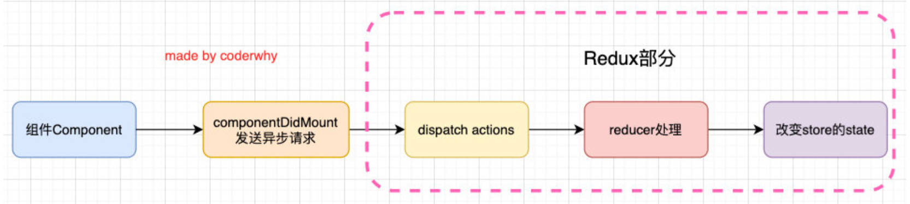

# react-redux 库的使用

## 案例一

重构上节中 Redux 与 React 中的代码，去除重复代码。

1. 安装 react-redux 库。

   ```shell
   npm i react-redux
   ```

2. 使用 react-redux 库中的 Provider 组件，为 <App /> 提供 store。

3. 在需要使用 store 的组件中，使用 `connect` 函数返回一个高阶组件。再将原组件传入高阶组件中，并对 state 和 dispatch 进行解耦。


总结：connect 是高阶函数，返回一个高阶组件。

06-react-redux\src\index.js

```jsx
import React from 'react';
import ReactDOM from 'react-dom/client';
import App from './App';
import { Provider } from 'react-redux'
import store from './store'

const root = ReactDOM.createRoot(document.getElementById('root'));
root.render(
  <React.StrictMode>
    <Provider store={store}>
      <App />
    </Provider>
  </React.StrictMode>
);
```

06-react-redux\src\page\About.jsx

```jsx
import React, { PureComponent } from 'react'
import { connect } from 'react-redux';
import { addAction, subAction } from '../store/actionCreators';

export class About extends PureComponent {
	render() {
		const { counter } = this.props
		return (
			<div>
				<h2>About Page: {counter}</h2>
				<button onClick={e => this.calcNumber(6, true)}>+6</button>
				<button onClick={e => this.calcNumber(8, false)}>-8</button>
			</div>
		)
	}

	calcNumber(num, isAdd) {
		if (isAdd) {
			console.log('加', num)
			this.props.addNumber(num)
		} else {
			console.log('减', num)
			this.props.subNumber(num)
		}
	}
}

const mapStateToProps = state => ({
	counter: state.counter
})
const mapDispatchToProps = dispatch => ({
	addNumber(num) {
		dispatch(addAction(num))
	},
	subNumber(num) {
		dispatch(subAction(num))
	}
})

// connect 返回值是一个高阶组件
export default connect(mapStateToProps, mapDispatchToProps)(About)
```

总结 react-redux 的使用：

- 需要强调的是，redux 和 react 没有直接的关系，你完全可以在 React, Angular, Ember, jQuery, 或者 vanilla JavaScript 中使用 Redux。
- 尽管这样说，redux 依然是和 React 库结合的更好，因为他们是通过 state 函数来描述界面的状态，Redux 可以发射状态的更新，让他们作出响应。
- redux 官方帮助我们提供了 react-redux 的库，可以直接在项目中使用，来帮助我们省去 redux 与 react 的结合使用，主要提供了2个 API，如 `connect` 和 `Provier`。和几个 Hook，如 `useSelector`、`useDispatch` 和 `useStore`（后续介绍）并且实现的逻辑会更加的严谨和高效。

# 组件中的异步操作

在之前简单的案例中，redux 中保存的 counter 是一个本地定义的数据。
- 我们可以直接通过同步的操作来 dispatch action，state 就会被立即更新。
- 但是真实开发中，redux 中保存的很多数据可能来自服务器，我们需要进行异步的请求，再将数据保存到 redux 中。

在之前学习网络请求的时候我们讲过，网络请求可以在 class 组件的 `componentDidMount` 中发送，所以我们可以有这样的结构：



现在完成如下案例操作：
- 在 Category 组件中请求 banners 和 recommends 的数据；
- 在 About 组件中展示 banners 和 recommends 的数据；

## 案例一

在 Category 中请求数据，通过 Redux，共享给 About。发送网络请求的代码先在 Category 中编写。

06-react-redux\src\store\constancs.js

```jsx
export const CHANGE_BANNERS = 'change_banners'
export const CHANGE_RECOMMENDS = 'change_recomends'
```

06-react-redux\src\store\actionCreators.js

```jsx
import * as actionType from "./constancs";

export const changeBannersAction = banners => ({
	type: actionType.CHANGE_BANNERS,
	banners
})

export const chnageRecommendsAction = recommends => ({
	type: actionType.CHANGE_RECOMMENDS,
	recommends
})
```

06-react-redux\src\store\reducer.js

```jsx
import * as actionType from "./constancs";

const initialState = {
	banners: [],
	recommends: []
}

function reducer(state = initialState, action) {
	switch (action.type) {
		case actionType.CHANGE_BANNERS:
			return { ...state, banners: action.banners }
		case actionType.CHANGE_RECOMMENDS:
			return { ...state, recommends: action.recommends }
		default:
			return state;
	}
}

export default reducer
```

06-react-redux\src\page\Category.jsx

```jsx
import React, { PureComponent } from 'react'
import { connect } from 'react-redux'
import axios from 'axios';
import { changeBannersAction, chnageRecommendsAction } from '../store/actionCreators';

export class Category extends PureComponent {

	componentDidMount() {
		axios.get('http://123.207.32.32:8000/home/multidata').then(res => {
			const banners = res.data.data.banner.list
			const recommends = res.data.data.recommend.list

			this.props.changeBanners(banners)
			this.props.chnageRecommends(recommends)
		})
	}

	render() {
		return (
			<div>
				<h2>Category Page: {this.props.counter}</h2>
			</div>
		)
	}
}

const mapStateToProps = state => ({
	counter: state.counter,
})
const mapDispatchToProps = dispatch => ({
	changeBanners(banners) {
		dispatch(changeBannersAction(banners))
	},
	chnageRecommends(recommends) {
		dispatch(chnageRecommendsAction(recommends))
	}
})

export default connect(mapStateToProps, mapDispatchToProps)(Category)
```

06-react-redux\src\page\About.jsx

```jsx
import React, { PureComponent } from 'react'
import { connect } from 'react-redux';

export class About extends PureComponent {
	render() {
		return (
			<div>
				<h2>banners</h2>
				<ul>
					{
						this.props.banners.map((item, index) => (
							<li key={index}>{item.title}</li>
						))
					}
				</ul>
				<h2>recommends</h2>
				<ul>
					{
						this.props.recommends.map((item, index) => (
							<li key={index}>{item.title}</li>
						))
					}
				</ul>
			</div>
		)
	}
}

const mapStateToProps = state => ({
	// 获取 category 中共享的状态
	banners: state.banners,
	recommends: state.recommends
})

export default connect(mapStateToProps)(About)
```

# Redux 中的异步操作

上面的代码有一个缺陷：
- 我们必须将网络请求的异步代码放到组件的生命周期中来完成；
- 事实上，网络请求到的数据也属于我们状态管理的一部分，更好的一种方式应该是将其也交给 redux 来管理；


但是在 redux 中如何可以进行异步的操作呢？
- 答案就是使用中间件（Middleware）；
- 学习过 Express 或 Koa 框架的开发者对中间件的概念一定不陌生；
- 在这类框架中，Middleware 可以帮助我们在请求和响应之间嵌入一些操作的代码，比如 cookie 解析、日志记录、文件压缩等操作。

## 案例一

将发送网络请求，获取数据的代码，抽取到 Redux 中的 actionCreator 中。

正常境况下，dispatch 只能派发一个对象作为 action，如果需要派发一个函数，必须要对 store 进行增强，比如使用中间件 `redux-thunk`。

使用中间件增强后，派发一个函数作为 action，在这个函数中发送网络请求。最终还是要在作为函数的 action 中派发一个对象 action。

06-react-redux\src\store\actionCreators.js

```js
import * as actionType from "./constancs";
import axios from 'axios';

export const changeBannersAction = banners => ({
	type: actionType.CHANGE_BANNERS,
	banners
})

export const chnageRecommendsAction = recommends => ({
	type: actionType.CHANGE_RECOMMENDS,
	recommends
})

export const fetchHomeMultidataAction = () => {
	/**
	 * 如果是一个普通的 action，需要在此处返回一个 action 对象。
	 * 但是，对象中不能执行逻辑代码，如发送网络请求，拿到从服务器请求的异步数据。
	 */

	// 如果返回一个函数，那么 redux 是不支持的，需要使用中间件。在中间件的加持下，dispatch 该函数后，该函数会自动执行。
	return function (dispatch, getState) {
		// 实现异步操作，网络请求。
		axios.get("http://123.207.32.32:8000/home/multidata").then(res => {
			const banners = res.data.data.banner.list
      const recommends = res.data.data.recommend.list

			dispatch(changeBannersAction(banners))
			dispatch(chnageRecommendsAction(recommends))
		})
	}
}
```

06-react-redux\src\store\index.js

```js
import { createStore, applyMiddleware } from 'redux';
import reducer from './reducer';
import thunk from 'redux-thunk';

const enhancer = applyMiddleware(thunk)
const store = createStore(reducer, enhancer)
export default store
```

06-react-redux\src\page\Category.jsx

```jsx
import React, { PureComponent } from 'react'
import { connect } from 'react-redux'
import { fetchHomeMultidataAction } from '../store/actionCreators';

export class Category extends PureComponent {

	componentDidMount() {
		this.props.fetchHomeMultidata()
	}

	render() {
		return (
			<div>
				<h2>Category Page: {this.props.counter}</h2>
			</div>
		)
	}
}

const mapStateToProps = state => ({
	counter: state.counter,
})
const mapDispatchToProps = dispatch => ({
	fetchHomeMultidata() {
		dispatch(fetchHomeMultidataAction())
	}
})

export default connect(mapStateToProps, mapDispatchToProps)(Category)
```


## 什么是中间件？

redux 引入了中间件（Middleware）的概念：
- 这个中间件的目的是在 dispatch 的 action 和最终达到的 reducer 之间，扩展一些自己的代码；
- 比如日志记录、调用异步接口、添加代码调试功能等等；

我们现在要做的事情就是发送异步的网络请求，所以我们可以添加对应的中间件：

- 官方推荐使用 `redux-thunk`；

redux-thunk 是如何做到让我们可以发送异步的请求呢？
- 我们知道，默认情况下的 dispatch，action 需要是一个 JavaScript 的对象；
- redux-thunk 可以让 store 派发一个函数类型的 action。
- 该函数会被调用，并且会传给这个函数两个参数，分别是： `dispatch` 函数和，`getState` 函数；
	- `dispatch` 函数用于我们之后再次派发对象类型的 action；
	- `getState` 函数考虑到我们之后的一些操作需要依赖原来的状态，用于让我们可以获取之前的一些状态；


## 总结如何使用 redux-thunk

1. 安装 redux-thunk

   ```shell
   npm i redux-thunk
   ```

2. 在创建 store 时传入应用了 middleware 的 enhance 函数：
	- 通过 `applyMiddleware` 来结合多个 Middleware, 返回一个 enhancer；
	- 将 enhancer 作为第二个参数传入到 createStore 中；

	```js
	import { createStore, applyMiddleware } from 'redux';
	import reducer from './reducer';
	import thunk from 'redux-thunk';

	const enhancer = applyMiddleware(thunk)
	const store = createStore(reducer, enhancer)
	export default store
	```

3. 定义返回一个函数的 action：

   - 注意：这里不是返回一个对象了，而是一个函数；
   - 该函数在 dispatch 之后会被立即执行；

   ```jsx
   export const fetchHomeMultidataAction = () => {
     /**
      * 如果是一个普通的 action，需要在此处返回一个 action 对象
      * 但是，对象中不能直接拿到从服务器请求的异步数据
      */
     // 如果返回一个函数，那么 redux 是不支持的，需要使用中间件。在中间件的加持下，dispatch 该函数后，该函数会自动执行。
     return function (dispatch, getState) {
       // 实现异步操作，网络请求。
       axios.get("http://123.207.32.32:8000/home/multidata").then(res => {
         const banners = res.data.data.banner.list
         const recommends = res.data.data.recommend.list
   
         dispatch(changeBannersAction(banners))
         dispatch(chnageRecommendsAction(recommends))
       })
     }
   }
   ```
# React Developer Tools 和 Redux DevTools

安装2个工具（浏览器插件） `React Developer Tools` 和 `Redux DevTools`

- 使用代码开启 Redux DevTools，
- 仅在开发环境中开启，生产环境需要关闭。

```js
import { createStore, applyMiddleware, compose } from 'redux';
import reducer from './reducer';
import thunk from 'redux-thunk';

const composeEnhancers = window.__REDUX_DEVTOOLS_EXTENSION_COMPOSE__({trace: true}) || compose; // 开发环境
// const composeEnhancers = compose; // 生产环境

const enhancer = applyMiddleware(thunk)
const store = createStore(reducer, composeEnhancers(enhancer))
export default store
```

# reducer 拆分

为什么要拆分 reducer：
- 当前这个 reducer 既有处理 counter 的代码，又有处理 home 页面的数据；
- 后续 counter 相关的状态或 home 相关的状态会进一步变得更加复杂；
- 我们也会继续添加其他的相关状态，比如购物车、分类、歌单等等；
- 如果将所有的状态都放到一个 reducer 中进行管理，随着项目的日趋庞大，必然会造成代码臃肿、难以维护。

因此，我们需要对 reducer 进行拆分：
- 我们先抽取一个对 counter 处理的 reducer；
- 再抽取一个对 home 处理的 reducer；

最后将它们合并起来；拆分后的目录结构如下：


## 将 reducer 进行拆分

home 模块

06-react-redux\src\store\home\constancs.js

```jsx
export const CHANGE_BANNERS = 'change_banners'
export const CHANGE_RECOMMENDS = 'change_recomends'
```

06-react-redux\src\store\home\actionCreators.js

```jsx
import * as actionTypes from './constancs';
import axios from 'axios';

export const changeBannersAction = banners => ({
	type: actionTypes.CHANGE_BANNERS,
	banners
})

export const chnageRecommendsAction = recommends => ({
	type: actionTypes.CHANGE_RECOMMENDS,
	recommends
})

export const fetchHomeMultidataAction = () => {
	/**
	 * 如果是一个普通的 action，需要在此处返回一个 action 对象
	 * 但是，对象中不能直接拿到从服务器请求的异步数据
	 */

	// 如果返回一个函数，那么 redux 是不支持的，需要使用中间件。在中间件的加持下，dispatch 该函数后，该函数会自动执行。
	return function (dispatch, getState) {
		// 实现异步操作，网络请求。
		axios.get("http://123.207.32.32:8000/home/multidata").then(res => {
			const banners = res.data.data.banner.list
      const recommends = res.data.data.recommend.list

			dispatch(changeBannersAction(banners))
			dispatch(chnageRecommendsAction(recommends))
		})
	}
}
```

06-react-redux\src\store\home\reducer.js

```jsx
import * as actionTypes from "./constancs";

const initialState = {
	banners: [],
	recommends: []
}

function reducer(state = initialState, action) {
	switch (action.type) {
		case actionTypes.CHANGE_BANNERS:
			return { ...state, banners: action.banners }
		case actionTypes.CHANGE_RECOMMENDS:
			return { ...state, recommends: action.recommends }
		default:
			return state;
	}
}

export default reducer
```

06-react-redux\src\store\home\index.js

```jsx
import reducer from './reducer';

export default reducer
export * from './actionCreators'
```

合并 home 模块 和 conuter 模块

06-react-redux\src\store\index.js

```jsx
import { createStore, applyMiddleware, combineReducers, compose } from 'redux'
import counterReducer from './counter';
import homeReducer from './home';
import thunk from 'redux-thunk';

// 将两个 reducer 合并在一起
const reducer = combineReducers({
	counter: counterReducer,
	home: homeReducer
})

// combineReducers 实现原理（了解）
/* function reducer(state = {}, action) {
	// 返回一个对象，store 的 state
	return {
		couter: counterReducer(state.counter, action),
		home: homeReducer(state.home, action),
	}
} */

const composeEnhancers = window.__REDUX_DEVTOOLS_EXTENSION_COMPOSE__({trace: true}) || compose; // 开发环境
// const composeEnhancers = compose; // 生产环境

const enhancer = applyMiddleware(thunk)
const store = createStore(reducer, composeEnhancers(enhancer))
export default store
```

## 获取 state 数据时，需要加入模块名

06-react-redux\src\App.jsx

```jsx
import React, { PureComponent } from 'react'
import Home from './page/Home'
import Profile from './page/Profile'
import './App.css'
import store from './store'
import About from './page/About'
import Category from './page/Category'

export class App extends PureComponent {
  constructor() {
    super()
    this.state = {
      // 获取 state 时，要指明哪个模块
      counter: store.getState().counter.counter
    }
  }

  componentDidMount() {
    store.subscribe(() => {
      // 获取 state 时，要指明哪个模块
      const counterState = store.getState().counter
      this.setState({ counter: counterState.counter })
    })
  }

  render() {
    const { counter } = this.state
    return (
      <div>
        <h2>APP Counter: {counter}</h2>
        <div className="pages">
          <Home />
          <Profile />
          <About />
          <Category />
        </div>
      </div>
    )
  }
}

export default App
```

06-react-redux\src\page\About.jsx

```jsx
import React, { PureComponent } from 'react'
import { connect } from 'react-redux';
import { addAction, subAction } from '../store/counter';

export class About extends PureComponent {
	render() {
		const { counter } = this.props
		return (
			<div>
				<h2>About Page: {counter}</h2>
				<button onClick={e => this.calcNumber(6, true)}>+6</button>
				<button onClick={e => this.calcNumber(8, false)}>-8</button>
				<h2>banners</h2>
				<ul>
					{
						this.props.banners.map((item, index) => (
							<li key={index}>{item.title}</li>
						))
					}
				</ul>
				<h2>recommends</h2>
				<ul>
					{
						this.props.recommends.map((item, index) => (
							<li key={index}>{item.title}</li>
						))
					}
				</ul>
			</div>
		)
	}

	calcNumber(num, isAdd) {
		if (isAdd) {
			console.log('加', num)
			this.props.addNumber(num)
		} else {
			console.log('减', num)
			this.props.subNumber(num)
		}
	}
}

const mapStateToProps = state => ({
  // 获取 state 时，要指明哪个模块
	counter: state.counter.counter,
	banners: state.home.banners,
	recommends: state.home.recommends
})
const mapDispatchToProps = dispatch => ({
	addNumber(num) {
		dispatch(addAction(num))
	},
	subNumber(num) {
		dispatch(subAction(num))
	}
})

export default connect(mapStateToProps, mapDispatchToProps)(About)
```

# combineReducers 函数

事实上，redux 给我们提供了一个 `combineReducers` 函数可以方便的让我们对多个 reducer 进行合并： 

那么 combineReducers 是如何实现的呢？ 
- 事实上，它也是将我们传入的 reducers 合并到一个对象中，最终返回一个 combination 的函数（相当于我们之前的 reducer 函数了）；
- 在执行 combination 函数的过程中，它会通过判断前后返回的数据是否相同来决定返回之前的 state 还是新的 state；
- 新的 state 会触发订阅者（subscribe）发生对应的刷新，而旧的 state 可以有效的阻止订阅者发生刷新；

