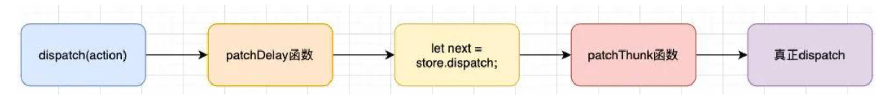

# 自定义中间件

经过前面的学习，我们知道，使用中间件的目的是在 redux 中插入一些自己的操作。

自定义中间件，理解中间件的原理

## 案例一：打印日志

编写中间件，实现 dispatch action 前后打印日志的需求。

06-react-redux\src\store\middleware\log.js

```js
function log(store) {

	const next = store.dispatch

	function logAndDispatch(action) {
		console.log('当前派发的 action：', action)
		// 真正派发的代码：使用之前的 dispatch 进行派发
		next(action)
		console.log('派发之后的结果：', store.getState())
	}

	// monkey patch: 猴补丁 => 篡改现有的代码，对整体的执行逻辑进行修改
	store.dispatch = logAndDispatch
}

export default log
```

## 案例二：实现 react-thunk 的功能

编写中间件，实现 react-thunk 的功能。

06-react-redux\src\store\middleware\thunk.js

```js
function thunk(store) {
	const next = store.dispatch

	function disptachThunk(action) {
		if (typeof action === 'function') {
			action(store.dispatch, store.getState)
		} else {
			next(action)
		}
	}

	store.dispatch = disptachThunk
}

export default thunk
```

## 合并中间件

单个调用某个函数来合并中间件并不是特别的方便，我们可以封装一个函数来实现所有的中间件合并；

实现 applyMiddleware 函数，整理目录结构，合并中间件。

06-react-redux\src\store\middleware\applyMiddleware.js

```js
function applyMiddleware(store, ...fns) {
	fns.forEach(fn => fn(store))
}

export default applyMiddleware
```

06-react-redux\src\store\middleware\index.js

```js
import log from './log';
import thunk from './thunk';
import applyMiddleware from './applyMiddleware';

export {
	log,
	thunk,
	applyMiddleware
}
```

## 使用自定义中间件

在代码中使用自己编写的中间件

06-react-redux\src\store\index.js

```js
// import { createStore, applyMiddleware, combineReducers, compose } from 'redux'
import { createStore, combineReducers, compose } from 'redux'
import { log, thunk, applyMiddleware } from './middleware'
import counterReducer from './counter';
import homeReducer from './home';
// import thunk from 'redux-thunk';

// 将两个 reducer 合并在一起
const reducer = combineReducers({
	counter: counterReducer,
	home: homeReducer
})

// combineReducers 实现原理（了解）
/* function reducer(state = {}, action) {
	// 返回一个对象，store 的 state
	return {
		couter: counterReducer(state.counter, action),
		home: homeReducer(state.home, action),
	}
} */

const composeEnhancers = window.__REDUX_DEVTOOLS_EXTENSION_COMPOSE__({trace: true}) || compose; // 开发环境
// const composeEnhancers = compose; // 生产环境

// const enhancer = applyMiddleware(thunk)
// const store = createStore(reducer, composeEnhancers(enhancer))

const store = createStore(reducer)

applyMiddleware(store, log, thunk)

export default store
```

## 总结

理解上述操作的流程：



真实的中间件实现起来更加复杂，需要考虑更多的边界情况。

# React 状态管理方式总结

React 中有哪些状态管理方式？如何选择？

目前，在 React 中，我们主要有三种状态管理方式：

- 方式一：组件中自己的 state 管理；
- 方式二：Context 数据的共享状态；
- 方式三：Redux 管理应用状态；

在开发中如何选择呢？

- 首先，没有一个标准的答案；
- 有些开发者，选择将所有的状态放到 redux 中进行管理，因为这样方便追踪和共享；
- 有些开发者，选择将某些组件自己的状态放到组件内部进行管理；
- 有些开发者，将类似于主题、用户信息等数据放到 Context 中进行共享和管理；
- 做为一个开发者，到底选择怎样的状态管理方式，是你的工作之一，选择一个你认为最好的平衡方式即可（Find a balance that works for you, and go with it.）；

我采用的状态管理方案：

- UI 相关的组件内部可以维护的状态，在组件内部自己来维护；
- 大部分需要共享的状态，都交给 redux 来管理和维护；包括从服务器请求的数据（以及请求的操作），都交给 redux 来维护；

更多的情况，需要我们根据实际业务判断，取舍。

# 回顾路由的发展历史

发展历史

- 后端路由（后端渲染模式）
- 前后端分离（后端渲染模式）
- 前端路由：单页面富应用-SPA（前端渲染模式）

实现 url 改变，页面不刷新的2中方式：

- URL hash；
- HTML5 的 history。


# React Router

目前前端流行的三大框架, 都有自己的路由实现:

- Angular 的 ngRouter
- React 的 react-router
- Vue 的 vue-router

React router 是由社区维护的库，而非官方，但被官方所承认。

React Router 在最近两年版本更新的较快，并且在最新的 React Router 6.x 版本中发生了较大的变化。

目前 React Router 6.x 已经非常稳定，我们可以放心的使用；

## 安装 react-router

- 安装时，我们选择 `react-router-dom`；
- react-router 会包含一些 react-native 的内容，web 开发并不需要；

```shell
npm install react-router-dom
```

## 基本使用

Router 中包含了对路径改变的监听，并且会将相应的路径传递给子组件；

react-router 最主要的 API 是给我们提供的一些组件：

`BrowserRouter` 或 `HashRouter`

- `BrowserRouter` 使用 history 模式；
- `HashRouter` 使用 hash 模式；

08-learn-reactrouter\src\index.js

```jsx
import React from 'react';
import ReactDOM from 'react-dom/client';
import './index.css';
import App from './App';
import { BrowserRouter, HashRouter } from 'react-router-dom';

const root = ReactDOM.createRoot(document.getElementById('root'));
root.render(
  <React.StrictMode>
    <HashRouter>
      <App />
    </HashRouter>
  </React.StrictMode>
);
```


## 配置路由的映射

使用 `Routes` 组件：包裹所有的 `Route` 组件，在其中匹配一个路由（Router 5.x 使用的是 `Switch` 组件，且允许 Route 单独存在，现在 6.x 必须放入 `Routes` 里）

Route：用于路径的匹配；

- `path` 属性：用于设置匹配到的路径；
- `element` 属性：设置匹配到路径后，渲染的组件（Router 5.x 使用的是 `component` 属性）；
- `exact` 精准匹配，只有精准匹配到完全一致的路径，才会渲染对应的组件（Router 6.x 不再支持该属性）；

08-learn-reactrouter\src\App.jsx

```jsx
import React, { PureComponent } from 'react'
import { Routes, Route } from 'react-router-dom';
import Home from './pages/Home';
import About from './pages/About'

export class App extends PureComponent {
  render() {
    return (
      <div>
        <div className="header">
          header
          <hr />
        </div>
        <div className="content">
          {/* 映射关系，path => component */}
          <Routes>
            <Route path='/' element={<Home />} />
            <Route path='/home' element={<Home />} />
            <Route path='/about' element={<About />} />
          </Routes>
        </div>
        <div className="footer">
          <hr />
          footer
        </div>
      </div>
    )
  }
}

export default App
```


## 配置路由的跳转

`Link` 组件的使用：

- 通常路径的跳转是使用 `Link` 组件，它最终会被渲染成 a 元素；
- `to` 属性：Link 组件中最重要的属性，用于设置跳转到的路径；
- `replace` 属性：Boolean 类型，设置为 true，跳转后不能返回。
- `state` 属性：history 模式跳转时传入的 state，很少用。
- `reloadDocument` 属性，Boolean 类型，跳转后是否重新加载文档，很少用。

08-learn-reactrouter\src\App.jsx

```jsx
import React, { PureComponent } from 'react'
import { Routes, Route, Link } from 'react-router-dom';
import Home from './pages/Home';
import About from './pages/About'

export class App extends PureComponent {
  render() {
    return (
      <div>
        <div className="header">
          <span>header</span>
          <div className="nav">
            <Link to='/home'>首页</Link>
            <Link to='/about'>关于</Link>
          </div>
          header
          <hr />
        </div>
        <div className="content">
          {/* 映射关系，path => component */}
          <Routes>
            <Route path='/' element={<Home />} />
            <Route path='/home' element={<Home />} />
            <Route path='/about' element={<About />} />
          </Routes>
        </div>
        <div className="footer">
          <hr />
          footer
        </div>
      </div>
    )
  }
}

export default App
```

`NavLink` 组件的使用：

- NavLink 组件是在 Link 组件基础之上增加了一些样式属性；

默认的 “active” class name：

- 事实上在默认匹配成功时，NavLink 就会添加上一个动态的 "active" class；

当然，如果你担心这个 “active” class 在其他地方被使用了，出现样式的层叠，也可以自定义 class。

需求：路径选中时，对应的 a 元素变为红色，这个时候，我们要使用 NavLink 组件来替代 Link 组件：

- `style` 属性：传入函数，函数接受一个对象，包含 `isActive` 属性。
- `className` 属性：传入函数，函数接受一个对象，包含 `isActive` 属性。

08-learn-reactrouter\src\App.jsx

```jsx
import React, { PureComponent } from 'react'
import { Routes, Route, NavLink } from 'react-router-dom';
import Home from './pages/Home';
import About from './pages/About'

export class App extends PureComponent {
  render() {
    return (
      <div>
        <div className="header">
          <span>header</span>
          <div className="nav">
            {/* 这么写，渲染出的 a 标签上永远都会有 color: red 这样的样式 */}
            <NavLink to='/home' style={() => ({color: 'red'})}>首页</NavLink>
            {/* 正确写法，引用的函数不需要绑定 this，因为没有使用 this */}
            <NavLink to='/about' style={this.getStyle}>关于</NavLink>

            <NavLink to='/home' className={this.getClassName1}>首页</NavLink>
            <NavLink to='/about' className={this.getClassName2}>关于</NavLink>
          </div>
          header
          <hr />
        </div>
        <div className="content">
          {/* 映射关系，path => component */}
          <Routes>
            <Route path='/' element={<Home />} />
            <Route path='/home' element={<Home />} />
            <Route path='/about' element={<About />} />
          </Routes>
        </div>
        <div className="footer">
          <hr />
          footer
        </div>
      </div>
    )
  }

  getStyle({ isActive }) {
    return {color: isActive ? 'red' : ''}
  }
  getClassName1({ isActive }) {
    return isActive ? 'line-active' : ''
  }
  getClassName2({ isActive }) {
    return isActive ? 'abc-active': ''
  }
}

export default App
```

实际开发中很少用，设置过于麻烦。

## 路由重定向

`Navigate` 组件用于路由的重定向，当这个组件出现时，就会执行跳转到对应的 to 路径中（5.x 用的是 `Redirect` 组件）：

需求：Login 页面有一个 isLogin 状态，当为 false 时，显示登录按钮；当为 true 时，重定向到 Home 页面。

08-learn-reactrouter\src\pages\Login.jsx

```jsx
import React, { PureComponent } from 'react'
import { Navigate } from 'react-router-dom'

export class Login extends PureComponent {
	constructor() {
		super()
		this.state = {
			isLogin: false
		}
	}

	render() {
		const { isLogin } = this.state
		return (
			<div>
				<h2>Login Page</h2>
				{!isLogin ? <button onClick={e => this.login()}>登录</button> : <Navigate to='/home' />}
			</div>
		)
	}

	login() {
		this.setState({ isLogin: true })
	}
}

export default Login
```

08-learn-reactrouter\src\App.jsx

```jsx
import React, { PureComponent } from 'react'
import { Routes, Route, Link } from 'react-router-dom';
import Home from './pages/Home';
import Login from './pages/Login';

export class App extends PureComponent {
  render() {
    return (
      <div>
        <div className="header">
          <span>header</span>
          <div className="nav">
            <Link to='/login'>登录</Link>
          </div>
          header
          <hr />
        </div>
        <div className="content">
          <Routes>
            <Route path='/login' element={<Login />} />
            <Route path='/home' element={<Home />} />
          </Routes>
        </div>
        <div className="footer">
          <hr />
          footer
        </div>
      </div>
    )
  }
}

export default App
```

需求：url 重定向到 Home 页面

08-learn-reactrouter\src\App.jsx

```jsx
import React, { PureComponent } from 'react'
import { Routes, Route, Navigate } from 'react-router-dom';
import Home from './pages/Home';

export class App extends PureComponent {
  render() {
    return (
      <div>
        <div className="header">
          <span>header</span>
          header
          <hr />
        </div>
        <div className="content">
          <Routes>
            <Route path='/' element={<Navigate to='/home' />} />
            <Route path='/home' element={<Home />} />
          </Routes>
        </div>
        <div className="footer">
          <hr />
          footer
        </div>
      </div>
    )
  }
}

export default App
```

## NotFound 页面配置

需求：如果用户随意输入一个地址，该地址无法匹配，这种情况下，让用户看到一个 NotFound 的页面。

- 开发一个 NotFound 页面；
- 配置对应的 Route，并且设置 path 为 * 即可；

08-learn-reactrouter\src\pages\NotFound.jsx

```jsx
import React, { PureComponent } from 'react'

export class NotFound extends PureComponent {
	render() {
		return (
			<div>
				<h1>NotFound Page</h1>
				<p>您进入的路径不存在，请检查之后再操作或联系开发人员</p>
			</div>
		)
	}
}

export default NotFound
```

08-learn-reactrouter\src\App.jsx

```jsx
import React, { PureComponent } from 'react'
import { Routes, Route, Navigate } from 'react-router-dom';
import Home from './pages/Home';
import NotFound from './pages/NotFound';

export class App extends PureComponent {
  render() {
    return (
      <div>
        <div className="header">
          <span>header</span>
          header
          <hr />
        </div>
        <div className="content">
          <Routes>
            <Route path='/' element={<Navigate to='/home' />} />
            <Route path='/home' element={<Home />} />
            <Route path='*' element={<NotFound />} />
          </Routes>
        </div>
        <div className="footer">
          <hr />
          footer
        </div>
      </div>
    )
  }
}

export default App
```

## 路由的嵌套

在开发中，路由之间是存在嵌套关系的。

需求：Home 页面中有两个页面内容：

- 推荐列表和排行榜列表；
- 点击不同的链接可以跳转到不同的地方，显示不同的内容；

`<Outlet>` 组件用于在父路由元素中作为子路由的占位元素（相当于 vue-router 中的 `<router-view />`）。

08-learn-reactrouter\src\pages\HomeRecommend.jsx

```jsx
import React, { PureComponent } from 'react'

export class HomeRecommend extends PureComponent {
	render() {
		return (
			<div>
				<h2>Banner</h2>
				<h2>推荐列表</h2>
				<ul>
					<li>歌单数据01</li>
					<li>歌单数据02</li>
					<li>歌单数据03</li>
					<li>歌单数据04</li>
				</ul>
			</div>
		)
	}
}

export default HomeRecommend
```

08-learn-reactrouter\src\pages\HomeRanking.jsx

```jsx
import React, { PureComponent } from 'react'

export class HomeRanking extends PureComponent {
	render() {
		return (
			<div>
				<h2>Ranking Nav</h2>
				<h2>榜单数据</h2>
				<ul>
					<li>歌曲数据1</li>
					<li>歌曲数据2</li>
					<li>歌曲数据3</li>
					<li>歌曲数据4</li>
					<li>歌曲数据5</li>
				</ul>
			</div>
		)
	}
}

export default HomeRanking
```

08-learn-reactrouter\src\App.jsx

```jsx
import React, { PureComponent } from 'react'
import { Routes, Route, Navigate } from 'react-router-dom';
import Home from './pages/Home';
import HomeRanking from './pages/HomeRanking';
import HomeRecommend from './pages/HomeRecommend';
import NotFound from './pages/NotFound';

export class App extends PureComponent {
  render() {
    return (
      <div>
        <div className="header">
          <span>header</span>
          header
          <hr />
        </div>
        <div className="content">
          <Routes>
            <Route path='/' element={<Navigate to='/home' />} />
            <Route path='/home' element={<Home />}>
              {/* 5.x 路由的嵌套，需要在每个页面中进行配置。会造成路由配置太分散的问题。 */}
              {/* 6.x 路由的嵌套，可在一级路由中集中配置 */}
              {/* 设置二级路由的重定向 */}
              <Route path='/home' element={<Navigate to='/home/recommend' />} />
              <Route path='/home/recommend' element={<HomeRecommend />} />
              <Route path='/home/ranking' element={<HomeRanking />} />
            </Route>
            <Route path='*' element={<NotFound />} />
          </Routes>
        </div>
        <div className="footer">
          <hr />
          footer
        </div>
      </div>
    )
  }
}

export default App
```

## 代码实现路由跳转

既然使用了 react-router 库，就不要用原生的 DOM 操作实现路由的跳转。

在 Router 6.x 版本之后，代码类的 API 都迁移到了 hooks 的写法：

- 如果我们希望进行代码跳转，需要通过 `useNavigate` 的 Hook 获取到 navigate 对象进行操作；
- 在函数式组件中，可以直接调用 `useNavigate`，且只能在顶层使用。
- 类组件不能使用 `useNavigate`。如果一定要在类组件中使用，需要使用高阶组件进行增强。

在函数式组件中，使用代码实现路由跳转

08-learn-reactrouter\src\App.jsx

```jsx
import React from 'react'
import { Routes, Route, useNavigate } from 'react-router-dom';
import Category from './pages/Category';
import Order from './pages/Order';

export function App() {

  // 只能在顶层使用 useNavigate API
  const navigate = useNavigate()

  function navigateTo(path) {
    navigate(path)
  }

  return (
    <div>
      <div className="header">
        header
        <div className="nav">
          <button onClick={e => navigateTo('/category')}>分类</button>
          <span onClick={e => navigateTo('/order')}>订单</span>
        </div>
        <hr />
      </div>
      <div className="content">
        <Routes>
          <Route path='/category' element={<Category />} />
          <Route path='/order' element={<Order />} />
        </Routes>
      </div>
      <div className="footer">
        <hr />
        footer
      </div>
    </div>
  )
}

export default App
```
