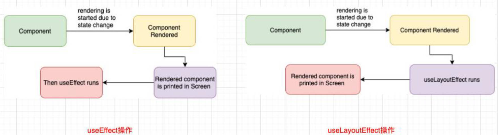

# 一、useMemo Hook

`useMemo` 实际的目的也是为了进行性能优化。

`useMemo` 返回的也是一个 memorized（记忆的）值；这个 memorized 针对的是回调函数的返回值。

在依赖不变的情况下，多次定义的时候，返回的值是相同的；

09-learn-reacthooks\src\08-useMemo的使用\App.jsx

```jsx
import React, { memo, useState, useMemo, useCallback } from 'react'

function calcNumTotal(num) {
	let total = 0
	for (let i = 0; i <= num; i++) {
		total += i
	}
	return total
}

const HelloWorld = memo((props) => {
	console.log('HellowWorld 被渲染了');
	return <h2>Hello World</h2>
})

const App = memo(() => {
	const [count, setCount] = useState(0)

	/**
	 * 基本数据类型，不能体现 useMemo 的优化效果
	 */
	const res1 = useMemo(() => calcNumTotal(50)) // 1.不依赖任何值
	const res2 = useMemo(() => calcNumTotal(count), [count]) // 2.依赖 count

	/**
	 * 使用 useMemo 对传入子组件的引用类型值做优化，
	 * 	不依赖任何状态，每次组件更新，info 引用地址不变；
	 * 	使子组件不会频繁渲染更新，
	 */
	// const info = { name: 'zzt', age: 18 } // 每次组件重新渲染，info 引用地址改变。
	const info = useMemo(() => ({ name: 'zzt', age: 18 }), [])

	/**
	 * useMemo 与 useCallback 的对比。
	 */
	function fn() { }
	const fn1 = useMemo(() => fn, [])
	const fn2 = useCallback(fn, [])
	console.log('fn1 === fn2', fn1 === fn2); // true

	return (
		<div>
			<h2>计数结果1：{res1}</h2>
			<h2>计数结果2：{res2}</h2>
			<button onClick={e => setCount(count + 1)}>+1</button>
			<HelloWorld info={info} />
		</div>
	)
})

export default App
```

# 二、useRef Hook

`useRef` 返回一个 ref 对象，该对象在组件的整个生命周期保持不变。

最常用的 ref 是两种用法：

- 用法一：引用 DOM（或者类组件）元素（类组件中使用 `createRef` API 来完成）；
- 用法二：保存一个数据；

## 1.引用 DOM

09-learn-reacthooks\src\09-useRef的使用\App.jsx

```jsx
import React, { memo, useRef } from 'react'

const App = memo(() => {
	const titleRef = useRef()
	const inputRef = useRef()

	function showTitleDOM() {
		console.log(titleRef.current)
		inputRef.current.focus()
	}

	return (
		<div>
			<h2 ref={titleRef}>Hello World</h2>
			<input type="text" ref={inputRef} />
			<button onClick={showTitleDOM}>查看 title 的 dom</button>
		</div>
	)
})

export default App
```

## 2.保存数据

[回顾 useCallback 优化案例](./14-Reacthooks（二）.md/#5性能优化（useRef Hook）)，解除闭包陷阱。

09-learn-reacthooks\src\09-useRef的使用\App.jsx

```jsx
import React, { memo, useState, useRef, useCallback } from 'react'

let obj = null

const App = memo(() => {
	const [count, setCount] = useState(0)

	// 验证 useRef 每次返回的是同一个对象。
	const nameRef = useRef()
	console.log('obj === nameRef', obj === nameRef); // 第一次点击按钮为 false，之后点击按钮为 true
	obj = nameRef

	// 通过 useRef 解决闭包陷阱
	const countRef = useRef()
	countRef.current = count
	const increment = useCallback(() => {
		setCount(countRef.current + 1)
	}, [])

	return (
		<div>
			<h2>Hello World：{count}</h2>
			<button onClick={e => setCount(count + 1)}>+1</button>
			<button onClick={increment}>+1</button>
		</div>
	)
})

export default App
```

# 三、useImperativeHandle Hook

`useImperativeHandle` 有什么用？我们先来回顾一下 `ref` 和 `forwardRef` 结合使用：

- 通过 `forwardRef` 可以将 `ref` 转发到函数式子组件；
- 子组件拿到父组件中创建的 `ref`，绑定到自己的某一个元素中；

`forwardRef` 的做法本身没有什么问题，但是将子组件的 DOM 直接暴露给了父组件，可能存在以下问题：

- 权限的不可控；父组件可以拿到 DOM 后进行任意的操作；

如果希望在父组件中，拿到子组件中的 `<input>` 元素，只对它进行 `focus` 操作，除此之外不希望父组件有其它的操作权限呢？

通过 `useImperativeHandle` 可以只暴露固定的操作：
- 通过 `useImperativeHandle`，将传入的 `ref` 和 `useImperativeHandle` 第二个参数返回的对象绑定到了一起；
- 所以在父组件中，使用 `inputRef.current` 时，实际上使用的是上述返回的对象；
- 比如下方案例，在父组件中只能进行 `focus` 操作和 `setValue` 操作；

09-learn-reacthooks\src\10-useImperativeHandle的使用\App.jsx

```jsx
import React, { forwardRef, memo, useRef, useImperativeHandle } from 'react'

// memo 要在外层，不然会报错
const HelloWorld = memo(forwardRef((props, ref) => {
	const inputRef = useRef()

	// 子组件对父组件传入的 ref 进行处理
	useImperativeHandle(ref, () => ({
		focus() {
			console.log('foucs');
			inputRef.current.focus()
		},
		setValue(value) {
			inputRef.current.value = value
		}
	}))

	return(
		<div>
			<input type="text" ref={inputRef} />
		</div>
	)
}))

const App = memo(() => {
	const titleRef = useRef()
	const inputRef = useRef()

	function handleDOM() {
		inputRef.current.focus()
		inputRef.current.setValue('哈哈哈')
	}

	return (
		<div>
			<h2 ref={titleRef}>哈哈哈</h2>
			<HelloWorld ref={inputRef} />
			<button onClick={handleDOM}>DOM 操作</button>
		</div>
	)
})

export default App
```

开发中很少用，常使用于第三方库中用于限制用户的操作权限。

# 四、useLayoutEffect Hook

`useLayoutEffect` 看起来和 `useEffect` 非常的相似，事实上他们也只有一点区别而已： 

`useEffect` 会在渲染的内容更新到 DOM 上后执行，不会阻塞 DOM 的更新；

`useLayoutEffect` 会在渲染的内容更新到 DOM 上之前执行，会阻塞 DOM 的更新；



[官方文档](https://zh-hans.reactjs.org/docs/hooks-reference.html#uselayouteffect)更推荐使用 `useEffect`，如果我们希望在某些操作发生之后再更新 DOM，那么再将这个操作放到 `useLayoutEffect`。

执行时机对比

09-learn-reacthooks\src\11-useLayoutEffect\App.jsx

```jsx
import { memo, useState, useLayoutEffect, useEffect } from 'react'

const App = memo(() => {
	const [count, setCount] = useState(0)

	useLayoutEffect(() => {
		console.log('useLayoutEffect') // 第二个打印
	})

	useEffect(() => {
		console.log('useEffect'); // 第三个打印
	})

	console.log('App render') // 第一个打印

	return (
		<div>
			<h2>count: {count}</h2>
			<button onClick={e => setCount(count + 1)}>+1</button>
		</div>
	)
})

export default App
```

切换数字案例

09-learn-reacthooks\src\11-useLayoutEffect\App.jsx

```jsx
import React, { memo, useState } from 'react'
import { useEffect } from 'react'

const App = memo(() => {
	const [count, setCount] = useState(100)

  // 使用该代码块，点击按钮后，会出现数字闪烁的情况，由 0 闪烁切换为一个随机的数字。
	/* useEffect(() => {
		console.log('useEffect');
		if (count === 0) {
			setCount(Math.random() + 99)
		}
	}) */

	useLayoutEffect(() => {
		console.log('useLayoutEffect');
		if (count === 0) {
			setCount(Math.random() + 99)
		}
	})

	console.log('App render')

	return (
		<div>
			<h2>count: {count}</h2>
			<button onClick={e => setCount(0)}>设置为 0</button>
		</div>
	)
})

export default App
```

# 五、自定义 Hook

自定义 Hook 本质上只是一种函数代码逻辑的抽取，严格意义上来说，它本身并不算 React 的特性。

自定义 Hook 名命的规范：必须以“`use`”开头。否则在其中不能使用 React Hook。

## 1.组件渲染打印日志

实现组件渲染，打印日志的案例。

09-learn-reacthooks\src\12-自定义Hook\01-打印生命周期.jsx

```jsx
import React, { memo } from 'react'
import { useEffect } from 'react'
import { useState } from 'react'

function useLogLife(cname) {
	useEffect(() => {
		console.log(cname + '组件被创建');
		return () => {
			console.log(cname + '组件被销毁')
		}
	}, [cname])
}

const Home = memo(() => {
	useLogLife('home')
	return <h1>Home Page</h1>
})

const About = memo(() => {
	useLogLife('about')
	return <h1>About Page</h1>
})

const App = memo(() => {
	const [isShow, setIsShow] = useState(true)

	return (
		<div>
			<h1>App Root Component</h1>
			<button onClick={e => setIsShow(!isShow)}>切换</button>
			{isShow && <Home />}
			{isShow && <About />}
		</div>
	)
})

export default App
```

## 2.封装 useContext

创建 Context

09-learn-reacthooks\src\12-自定义Hook\context\index.js

```js
import { createContext } from 'react'

const UserContext = createContext()
const TokenContext = createContext()

export {
	UserContext,
	TokenContext
}
```

提供 Context

09-learn-reacthooks\src\index.js

```jsx
import React from 'react'
import ReactDOM from 'react-dom/client'
import App from './12-自定义Hook/02-context获取数据'
import { UserContext, TokenContext } from './12-自定义Hook/context'

const root = ReactDOM.createRoot(document.getElementById('root'))
root.render(
	// <React.StrictMode>
	<UserContext.Provider value={{ name: 'zzt', level: 99 }}>
		<TokenContext.Provider value={'ZeT1an'}>
			<App />
		</TokenContext.Provider>
	</UserContext.Provider>
	// </React.StrictMode>
)
```

封装 Context

09-learn-reacthooks\src\12-自定义Hook\hooks\useUserToken.js

```js
import { useContext } from "react";
import { TokenContext, UserContext } from "../context";

function useUserToken() {
	const user = useContext(UserContext)
	const token = useContext(TokenContext)

	return [user, token]
}

export default useUserToken
```

使用 Context

09-learn-reacthooks\src\12-自定义Hook\02-context获取数据.jsx

```jsx
import React, { memo } from 'react'
import { useUserToken } from './hooks';

const Home = memo(() => {
	const [user, token] = useUserToken()
	return (
		<h1>Home Page：{user.name}-{token}</h1>
	)
})

const About = memo(()=> {
	const [user, token] = useUserToken()
	return (
		<h1>About Page: {user.name}-{token}</h1>
	)
})

const App = memo(() => {
	return (
		<div>
			<h1>App Root Component</h1>
			<Home />
			<About />
		</div>
	)
})

export default App
```

## 3.获取滚动位置

封装 Hook

09-learn-reacthooks\src\12-自定义Hook\hooks\useScrollPosition.js

```js
import { useState, useEffect } from 'react';

function useScrollPosition() {
	const [scrollX, setScrollX] = useState(0)
	const [scrollY, setScrollY] = useState(0)

	useEffect(() => {
		function handleScroll() {
			setScrollX(window.scrollX)
			setScrollY(window.scrollY)
		}

		// window 和 document 都可以进行监听，window 监听会把事件传递给 document。
		window.addEventListener('scroll', handleScroll)
		return () => {
			window.removeEventListener('scroll', handleScroll)
		}
	}, [])

	return [scrollX, scrollY]
}

export default useScrollPosition
```

使用 Hook

09-learn-reacthooks\src\12-自定义Hook\03-获取窗口的滚动位置.jsx

```jsx
import React, { memo } from 'react'
import { useScrollPosition } from './hooks'
import './css/index.css'

const Home = memo(() => {
	const [scrollX, scrollY] = useScrollPosition()
	return <h1>Home Page: {scrollX}-{scrollY}</h1>
})

const About = memo(() => {
	const [scrollX, scrollY] = useScrollPosition()
	return <h1>About Page: {scrollX}-{scrollY}</h1>
})

const App = memo(() => {
	return (
		<div className='app'>
			<h1>App Root Component</h1>
			<Home />
			<About />
		</div>
	)
})

export default App
```

## 4.LocalStorage 数据存储

封装 Hook

09-learn-reacthooks\src\12-自定义Hook\hooks\useLocalStorage.js

```js
import { useState, useEffect } from 'react';

function useLocalStorage(key) {
	// 1. 从 localStprage 中获取数据
	// useState 第一个参数，可以传入一个函数，该函数会被立即执行，返回值作为状态管理的初始值。
	const [data, setData] = useState(() => {
		const item = localStorage.getItem(key)
		return item ? JSON.parse(item) : ''
	})

	// 2. 监听 data 改变，缓存 data 最新值
	useEffect(() => {
		localStorage.setItem(key, JSON.stringify(data))
	}, [data, key])

	return [data, setData]
}

export default useLocalStorage
```

使用 Hook

09-learn-reacthooks\src\12-自定义Hook\04-封装localStorage.jsx

```jsx
import React, { memo } from 'react'
import { useLocalStorage } from './hooks'

const App = memo(() => {
	const [token, setToken] = useLocalStorage('token')
	function handleSetToken() {
		setToken('james')
	}

	const [avatarUrl, setAvatarUrl] = useLocalStorage('avatarUrl')
	function handleSetAvatar() {
		setAvatarUrl('http://www.zzt.com/cba.png')
	}

	return (
		<div className='app'>
			<h1>App Root Component：{token}</h1>
			<button onClick={handleSetToken}>设置 token</button>
			<h1>avatarUrl: {avatarUrl}</h1>
			<button onClick={handleSetAvatar}>设置新头像地址</button>
		</div>
	)
})

export default App
```


