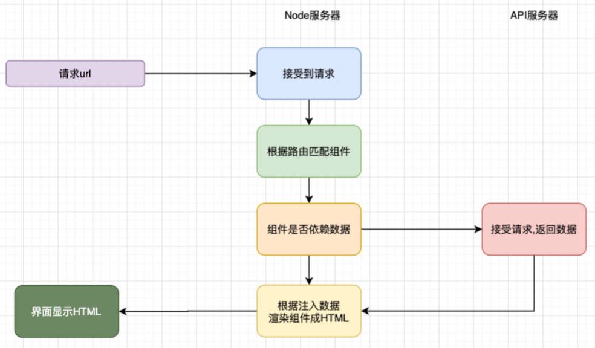
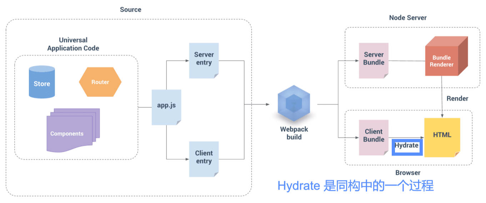
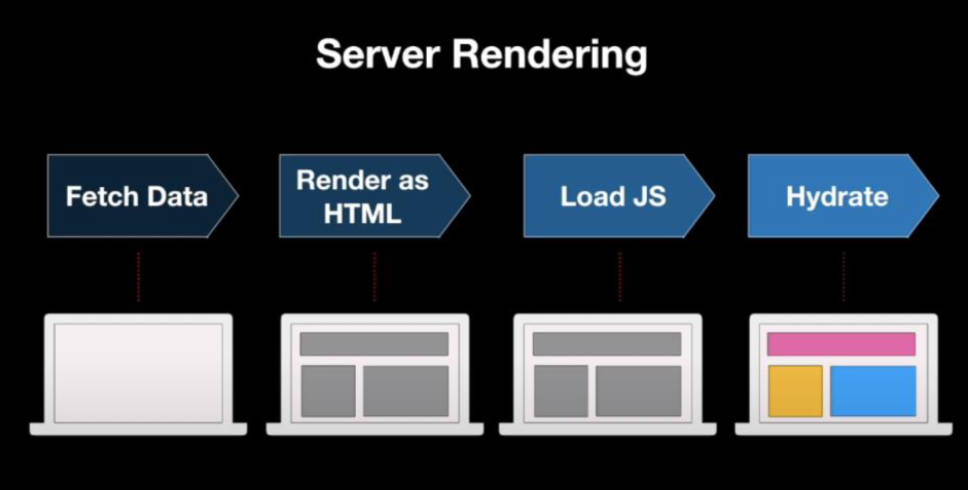

# Redux Hook

## 回顾 react-redux 的普通用法

在之前的 redux 开发中，为了让 react 和 redux 结合起来，我们使用了 react-redux 中的 `connect`：
- 但是这种方式必须使用高阶函数返回的高阶组件；
- 并且必须编写：mapStateToProps 和 mapDispatchToProps 映射的函数；


创建 actions 和 reducer

09-learn-reacthooks\src\13-redux中的hooks\store\features\counter.js

```jsx
import { createSlice } from '@reduxjs/toolkit'

const counterSlice = createSlice({
	name: 'counter',
	initialState: {
		count: 99,
		msg: 'Hello World'
	},
	reducers: {
		addNumberAction(state, { payload }) {
			state.count = state.count + payload
		},
		subNumberAction(state, { payload }) {
			state.count = state.count - payload
		},
		changeMsgAction(state, { payload }) {
			console.log(payload)
			state.msg = payload
		}
	}
})

export const { addNumberAction, subNumberAction, changeMsgAction } = counterSlice.actions
export default counterSlice.reducer
```

创建 store

09-learn-reacthooks\src\13-redux中的hooks\store\index.js

```jsx
import { configureStore } from '@reduxjs/toolkit';
import counterReducer from './features/counter'

const store = configureStore({
	reducer: {
		counter: counterReducer
	}
})

export default store
```

提供 store

```jsx
import React from 'react'
import ReactDOM from 'react-dom/client'
import App from './13-redux中的hooks/App'
import store from './13-redux中的hooks/store'
import { Provider } from 'react-redux'

const root = ReactDOM.createRoot(document.getElementById('root'))
root.render(
	// <React.StrictMode>
		<Provider store={store}>
			<App />
		</Provider>
	// </React.StrictMode>
)
```

使用 store

09-learn-reacthooks\src\13-redux中的hooks\App.jsx

```jsx
import React, { memo } from 'react'
import { connect } from 'react-redux'
import { addNumberAction, subNumberAction } from './store/features/counter'

const App = memo((props) => {
	const { count, addNumber, subNumber } = props;

	function changeNumberHandle(num, isAdd = true) {
		if (isAdd)
			addNumber(num)
		else
			subNumber(num)
	}

	return (
		<div>
			<h2>当前计数：{count}</h2>
			<button onClick={e => changeNumberHandle(1)}>+1</button>
			<button onClick={e => changeNumberHandle(6)}>+6</button>
			<button onClick={e => changeNumberHandle(6, false)}>-6</button>
		</div>
	)
})

const mapStateToProps = state => ({
	count: state.counter.count
})
const mapDispatchToProps = dispatch => ({
	addNumber(num) {
		dispatch(addNumberAction(num))
	},
	subNumber(num) {
		dispatch(subNumberAction(num))
	}
})

export default connect(mapStateToProps, mapDispatchToProps)(App)
```

## react-redux 的 Hook 的使用

在 Redux7.1 开始，提供了 Hook 的方式，我们再也不需要编写 connect 以及对应的映射函数了。

其中包括了 `useSelector`、`useDispatch` 和 `useStore` 3个 Hook。

`useSelector` 的作用是将 state 映射到组件中：

- 参数一：传入一个函数，将 state 映射到组件中；
- 参数二：传入一个浅层比较函数，来决定组件是否需要重新渲染；

`useDispatch` 非常简单，就是直接获取 dispatch 函数，之后在组件中直接使用即可；

我们还可以通过 `useStore` 来获取当前的 store 对象（很少用，不推荐这么做）；

09-learn-reacthooks\src\13-redux中的hooks\App-hooks.jsx

```jsx
import React, { memo } from 'react'
import { useDispatch, useSelector } from 'react-redux'
import { addNumberAction, subNumberAction } from './store/features/counter'

const App = memo((props) => {
	// 1.使用 useSelector 将 redux 中的 store 的数据映射到组件内
	const { count } = useSelector(state => ({
		count: state.counter.count
	}))

	// 2.使用 dispatch 直接派发 action
	const dispatch = useDispatch()

	function changeNumberHandle(num, isAdd = true) {
		if (isAdd)
			dispatch(addNumberAction(num))
		else
			dispatch(subNumberAction(num))
	}

	return (
		<div>
			<h2>当前计数：{count}</h2>
			<button onClick={e => changeNumberHandle(1)}>+1</button>
			<button onClick={e => changeNumberHandle(6)}>+6</button>
			<button onClick={e => changeNumberHandle(6, false)}>-6</button>
		</div>
	)
})

export default App
```

### useSelector 性能优化

`useSelector` 默认会比较我们返回的两个对象是否相等；

- 如何比较呢？ const refEquality = (a, b) => a === b；
- 也就是我们必须返回两个完全相等的对象才可以不引起重新渲染；

我们需要让 useSelector 返回的值进行浅层比较，这么做，与组件无关的状态被改变，就不会引起组件的重新渲染；

在 useSelector 传入第二个参数，进行性能优化。

09-learn-reacthooks\src\13-redux中的hooks\App.jsx

```jsx
import React, { memo } from 'react'
import { shallowEqual, useDispatch, useSelector } from 'react-redux'
import { addNumberAction, changeMsgAction, subNumberAction } from './store/features/counter'

// memo 高阶组件包裹起来的组件的特点：只有 props 发生改变时，才会重新渲染。
const Home = memo(props => {
	const { msg } = useSelector(state => ({
		msg: state.counter.msg
	}), shallowEqual)

	const dispatch = useDispatch()

	function changeMsgHandle() {
		dispatch(changeMsgAction('你好啊，师姐！'))
	}

  /**
   * Home 组件与 msg 状态关联，与 count 状态无关
   * useSelector 中如果不传入 shallowEqual， 当 store 中的 count 改变时，会打印。意味着与组件不相关的状态改变，组件也重新渲染了。
   */
	console.log('Home render')

	return (
		<div>
			<h2>Home: {msg}</h2>
			<button onClick={e => changeMsgHandle()}>修改 msg</button>
		</div>
	)
})

const App = memo((props) => {
	// 1.使用 useSelector 将 redux 中的 store 的数据映射到组件内
	const { count } = useSelector(state => ({
		count: state.counter.count
	}), shallowEqual)

	// 2.使用 dispatch 直接派发 action
	const dispatch = useDispatch()

	function changeNumberHandle(num, isAdd = true) {
		if (isAdd)
			dispatch(addNumberAction(num))
		else
			dispatch(subNumberAction(num))
	}

  /**
   * App 组件与 count 状态关联，与 msg 状态无关
   * useSelector 中如果不传入 shallowEqual， 当 store 中的 msg 改变时，会打印。意味着与组件不相关的状态改变，组件也重新渲染了。
   */
	console.log('App render');

	return (
		<div>
			<h2>当前计数：{count}</h2>
			<button onClick={e => changeNumberHandle(1)}>+1</button>
			<button onClick={e => changeNumberHandle(6)}>+6</button>
			<button onClick={e => changeNumberHandle(6, false)}>-6</button>
			<Home />
		</div>
	)
})

export default App
```

# 了解服务端渲染的概念

## 单页面富应用（SPA）的2个缺陷

单页面富应用存在的2个缺陷（反之是 SSR 的2个优势）：

因为浏览器渲染页面的流程是：域名 -> dns服务器 -> ip地址 -> 访问服务器获取静态资源 `index.html`；

然而，SPA 项目中的 index.html，通常没有实质的内容。这样造成了2个缺陷：

- 缺陷一：首屏加载速度慢（首屏加载过程中，阻塞操作过多）。

	- 加载 index.html 文件之后，还需要下载打包后的 js 文件（如 bundle.js），
	- 再执行 JS 文件中的代码，发送网络请求，获取页面相关数据，
	- 再重新渲染，

- 缺陷二：不利于 SEO 优化。

	- 搜索引擎的爬虫，通常只爬取一个网站的 index.html 中的内容，存入到数据库中。
	- 而 SPA 项目的 index.html 通常没有实质内容，
	- 造成搜索引擎排名靠后。

## 什么是 SSR

- SSR（Server Side Rendering，服务端渲染），指的是页面在服务器端已经生成了完整的 HTML 页面结构，不需要浏览器执行 JS 代码来创建页面结构了；
- 对应的是 CSR（Client Side Rendering，客户端渲染），我们开发的 SPA 页面通常依赖的就是客户端渲染；

## 如何实现 SSR

- 早期的服务端渲染包括 PHP、JSP、ASP 等方式，但是在目前前后端分离的开发模式下，前端开发人员不太可能再去学习 PHP、JSP 等技术来开发网页；
- 不过我们可以借助于 Node 来帮助我们执行 JavaScript 代码，提前完成页面的渲染；
- 目前服务于主流框架的服务端渲染框架有
	- `Nuxt` - Vue 的服务端渲染框架。
	- `Nest` - React 的服务端渲染框架。



## 什么是 SSR 同构应用？

什么是同构？ (概念最早由 Angular 2.X 中提出。)
- 一套代码既可以在服务端运行又可以在客户端运行，这就是同构应用。

同构是一种 SSR 的形态，是现代 SSR 的一种表现形式。
- 当用户发出请求时，先在服务器通过 SSR 渲染出首页的内容。
- 但是对应的代码同样可以在客户端被执行。

在客户端也需要执行 JS 的目的是实现用户在客户端的交互，包括事件绑定等等 DOM 操作的逻辑。以及实现其他页面切换时也可以在客户端被渲染；





## 什么是 Hydration？

[vite-plugin-ssr 插件的官方文档](https://vite-plugin-ssr.com/hydration#page-content)解释的很好：

1. 在进行 SSR 时，我们的页面会呈现为 HTML。
2. 但仅 HTML 不足以使页面具有交互性。
	- 例如，没有 JavaScript 的页面，也就没有事件处理程序来响应用户操作，比如点击按钮。
3. 除了在 Node.js 中生成 HTML 结构之外，为了使我们的页面具有交互性，我们的 UI 框架（Vue/React/...）还在浏览器中加载 JS 和呈现页面。
	- 它创建页面的内部表示，然后将内部表示映射到我们在 Node.js 中呈现的 HTML 的 DOM 元素中。
4. 这个过程称为 hydration。

# React18 Hook

## useId Hook

useId 是一个用于生成横跨服务端和客户端的稳定的唯一 ID 的同时避免 hydration 不匹配的 hook。

- useId 是用于 react 的同构应用开发的，前端的 SPA 页面并不需要使用它；
- useId 可以保证应用程序在客户端和服务器端生成唯一的 ID，这样可以有效的避免通过一些手段生成的 id 不一致，造成 hydration mismatch；

09-learn-reacthooks\src\14-useId的使用\App.jsx

```jsx
import React, { memo, useId, useState } from 'react'

const App = memo(() => {
	const [count, setCount] = useState(0)

	const id = useId()
	console.log('id:', id) // 点击下方按钮，每次渲染的 id 都相同。

	return (
		<div>
			<button onClick={e => setCount(count + 1)}>count+1-{count}</button>
			<label htmlFor={id}>
				用户名：<input id={id} type="text" />
			</label>
		</div>
	)
})

export default App
```

## useTransition 的使用。

官方解释：返回一个状态值表示过渡任务的等待状态，以及一个启动该过渡任务的函数。

直白的说，useTransition 其实在告诉 react 对于某部分任务的更新优先级较低，可以稍后进行更新。

09-learn-reacthooks\src\15-useTransition和useDeferredValue\namesArray.js

```js
// 使用 faker 伪造数据。
import { faker } from '@faker-js/faker'

const names = Array.from({ length: 10000 }).map(() => faker.name.fullName())
export default names
```

09-learn-reacthooks\src\15-useTransition和useDeferredValue\01-useTransition的使用.jsx

```jsx
import React, { memo, useState, useTransition } from 'react'
import namesArr from './namesArray';

const App = memo(() => {
	const [names, setShowNames] = useState(namesArr)
	const [pending, startTransition] = useTransition()

	function onInputChange(event) {
		// 将耗时操作延后，使得页面能够先进性刷新，用户的键入操作能够及时在页面上反馈。
		startTransition(() => {
			const keyword = event.target.value
			const filterShowNames = namesArr.filter(item => item.includes(keyword))
			setShowNames(filterShowNames)
		})
	}

	return (
		<div>
			<input type="text" onInput={onInputChange} />
			{/* 执行耗时操作时，告知用户 */}
			<h2>用户名列表：{pending && <span>Loading...</span>}</h2>
			<ul>
				{
					names.map((item, index) => <li key={index}>{item}</li>)
				}
			</ul>
		</div>
	)
})

export default App
```

## useDeferredValue 的使用。

官方解释：`useDeferredValue` 接收一个值，并返回该值的新副本，该副本将推迟到更紧急地更新之后。

在明白了 useTransition 之后，我们就会发现 useDeferredValue 的作用是一样的效果，可以让我们的更新延迟。

09-learn-reacthooks\src\15-useTransition和useDeferredValue\02-useDeferredValue的使用.jsx

```jsx
import React, { memo, useDeferredValue, useState } from 'react'
import nameArr from './namesArray'

const App = memo(() => {
	const [names, setNames] = useState(nameArr)
	const deferredNames = useDeferredValue(names)

	function handleInputChange(event) {
		const keyword = event.target.value
		const filterNames = nameArr.filter(item => item.includes(keyword))
		setNames(filterNames)
	}
	return (
		<div>
			<input type="text" onInput={handleInputChange} />
			<h2>用户列表：</h2>
			<ul>
				{/* defeeredNames 相关的运算，会被延迟进行 */}
				{
					deferredNames.map((item, index) => <li key={index}>{item}</li>)
				}
			</ul>
		</div>
	)
})

export default App
```